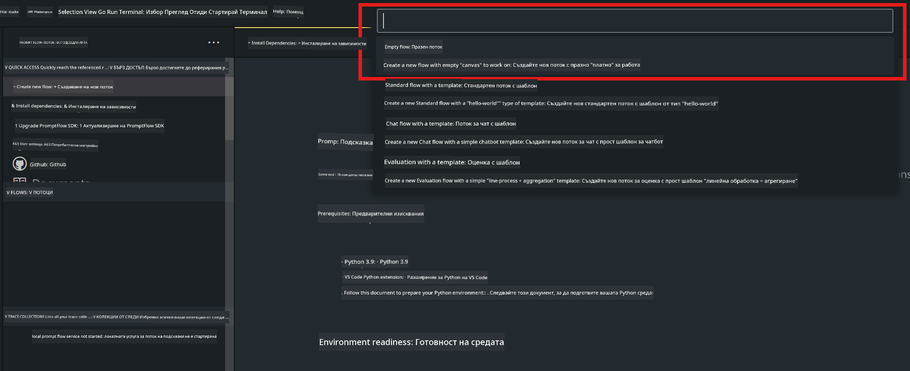
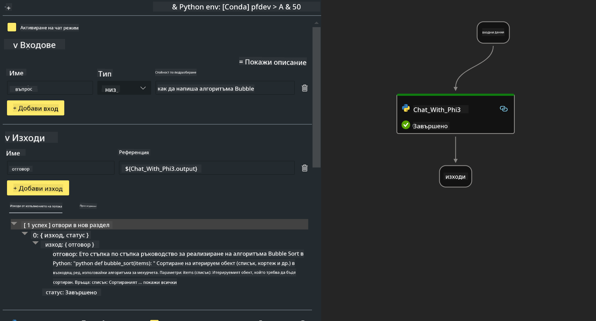

<!--
CO_OP_TRANSLATOR_METADATA:
{
  "original_hash": "bc29f7fe7fc16bed6932733eac8c81b8",
  "translation_date": "2025-07-17T04:02:00+00:00",
  "source_file": "md/02.Application/02.Code/Phi3/VSCodeExt/HOL/AIPC/02.PromptflowWithNPU.md",
  "language_code": "bg"
}
-->
# **Лаборатория 2 - Стартиране на Prompt flow с Phi-3-mini в AIPC**

## **Какво е Prompt flow**

Prompt flow е набор от инструменти за разработка, създадени да улеснят целия цикъл на разработка на AI приложения, базирани на големи езикови модели (LLM) – от идеен замисъл, прототипиране, тестване, оценка до внедряване в продукция и мониторинг. Той прави инженерството на prompt-ове много по-лесно и ви позволява да създавате LLM приложения с качество за продукция.

С prompt flow ще можете да:

- Създавате потоци, които свързват LLM, prompt-ове, Python код и други инструменти в изпълним работен процес.

- Отстранявате грешки и итеративно подобрявате потоците си, особено взаимодействието с LLM, лесно и бързо.

- Оценявате потоците си, изчислявате метрики за качество и производителност с по-големи набори от данни.

- Интегрирате тестването и оценката в CI/CD системата си, за да гарантирате качеството на потока.

- Внедрявате потоците си на избраната от вас платформа за обслужване или ги интегрирате лесно в кода на вашето приложение.

- (По избор, но силно препоръчително) Сътрудничите с екипа си, използвайки облачната версия на Prompt flow в Azure AI.

## **Какво е AIPC**

AI PC има CPU, GPU и NPU, всеки със специфични възможности за ускорение на AI задачи. NPU, или невронен процесорен блок, е специализиран ускорител, който обработва задачи свързани с изкуствен интелект (AI) и машинно обучение (ML) директно на вашия компютър, без да изпраща данните за обработка в облака. GPU и CPU също могат да обработват тези задачи, но NPU е особено ефективен при нискоенергийни AI изчисления. AI PC представлява фундаментална промяна в начина, по който работят компютрите ни. Това не е решение на проблем, който преди не е съществувал, а обещава значително подобрение за ежедневната употреба на компютъра.

Как работи? В сравнение с генеративния AI и огромните големи езикови модели (LLM), обучени върху огромни публични данни, AI, който ще се изпълнява на вашия компютър, е по-достъпен на почти всяко ниво. Концепцията е по-лесна за разбиране, а тъй като е обучена върху вашите данни, без нужда от достъп до облака, ползите са по-непосредствено привлекателни за по-широка аудитория.

В близко бъдеще светът на AI PC включва лични асистенти и по-малки AI модели, работещи директно на вашия компютър, използвайки вашите данни, за да предложат лични, частни и по-сигурни AI подобрения за нещата, които вече правите всеки ден – водене на протоколи от срещи, организиране на фентъзи футболна лига, автоматизиране на подобрения при редактиране на снимки и видео или съставяне на перфектния маршрут за семейна среща, базиран на пристиганията и заминаванията на всички.

## **Създаване на генеративни кодови потоци в AIPC**

***Забележка*** ：Ако не сте завършили инсталацията на средата, моля посетете [Lab 0 -Installations](./01.Installations.md)

1. Отворете разширението Prompt flow във Visual Studio Code и създайте празен проект за поток



2. Добавете входни и изходни параметри и добавете Python код като нов поток



Можете да се ориентирате по тази структура (flow.dag.yaml), за да изградите своя поток

```yaml

inputs:
  question:
    type: string
    default: how to write Bubble Algorithm
outputs:
  answer:
    type: string
    reference: ${Chat_With_Phi3.output}
nodes:
- name: Chat_With_Phi3
  type: python
  source:
    type: code
    path: Chat_With_Phi3.py
  inputs:
    question: ${inputs.question}


```

3. Добавете код в ***Chat_With_Phi3.py***

```python


from promptflow.core import tool

# import torch
from transformers import AutoTokenizer, pipeline,TextStreamer
import intel_npu_acceleration_library as npu_lib

import warnings

import asyncio
import platform

class Phi3CodeAgent:
    
    model = None
    tokenizer = None
    text_streamer = None
    
    model_id = "microsoft/Phi-3-mini-4k-instruct"

    @staticmethod
    def init_phi3():
        
        if Phi3CodeAgent.model is None or Phi3CodeAgent.tokenizer is None or Phi3CodeAgent.text_streamer is None:
            Phi3CodeAgent.model = npu_lib.NPUModelForCausalLM.from_pretrained(
                                    Phi3CodeAgent.model_id,
                                    torch_dtype="auto",
                                    dtype=npu_lib.int4,
                                    trust_remote_code=True
                                )
            Phi3CodeAgent.tokenizer = AutoTokenizer.from_pretrained(Phi3CodeAgent.model_id)
            Phi3CodeAgent.text_streamer = TextStreamer(Phi3CodeAgent.tokenizer, skip_prompt=True)

    

    @staticmethod
    def chat_with_phi3(prompt):
        
        Phi3CodeAgent.init_phi3()

        messages = "<|system|>You are a AI Python coding assistant. Please help me to generate code in Python.The answer only genertated Python code, but any comments and instructions do not need to be generated<|end|><|user|>" + prompt +"<|end|><|assistant|>"


        generation_args = {
            "max_new_tokens": 1024,
            "return_full_text": False,
            "temperature": 0.3,
            "do_sample": False,
            "streamer": Phi3CodeAgent.text_streamer,
        }

        pipe = pipeline(
            "text-generation",
            model=Phi3CodeAgent.model,
            tokenizer=Phi3CodeAgent.tokenizer,
            # **generation_args
        )

        result = ''

        with warnings.catch_warnings():
            warnings.simplefilter("ignore")
            response = pipe(messages, **generation_args)
            result =response[0]['generated_text']
            return result


@tool
def my_python_tool(question: str) -> str:
    if platform.system() == 'Windows':
        asyncio.set_event_loop_policy(asyncio.WindowsSelectorEventLoopPolicy())
    return Phi3CodeAgent.chat_with_phi3(question)


```

4. Можете да тествате потока чрез Debug или Run, за да проверите дали генерирането на кода работи правилно


5. Стартирайте потока като development API в терминала

```

pf flow serve --source ./ --port 8080 --host localhost   

```

Можете да го тествате в Postman / Thunder Client

### **Забележка**

1. Първото стартиране отнема доста време. Препоръчително е да изтеглите модела phi-3 от Hugging face CLI.

2. Поради ограничената изчислителна мощ на Intel NPU, препоръчително е да използвате Phi-3-mini-4k-instruct.

3. Използваме Intel NPU ускорение за квантоване с INT4 конверсия, но ако рестартирате услугата, трябва да изтриете кеша и папките nc_workshop.

## **Ресурси**

1. Научете Promptflow [https://microsoft.github.io/promptflow/](https://microsoft.github.io/promptflow/)

2. Научете Intel NPU Acceleration [https://github.com/intel/intel-npu-acceleration-library](https://github.com/intel/intel-npu-acceleration-library)

3. Примерен код, изтеглете [Local NPU Agent Sample Code](../../../../../../../../../code/07.Lab/01/AIPC)

**Отказ от отговорност**:  
Този документ е преведен с помощта на AI преводаческа услуга [Co-op Translator](https://github.com/Azure/co-op-translator). Въпреки че се стремим към точност, моля, имайте предвид, че автоматизираните преводи могат да съдържат грешки или неточности. Оригиналният документ на неговия роден език трябва да се счита за авторитетен източник. За критична информация се препоръчва професионален човешки превод. Ние не носим отговорност за каквито и да е недоразумения или неправилни тълкувания, произтичащи от използването на този превод.