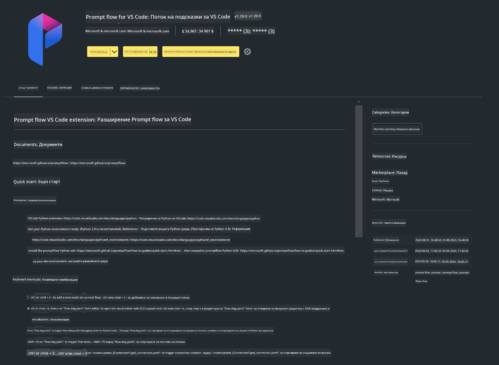

<!--
CO_OP_TRANSLATOR_METADATA:
{
  "original_hash": "4b16264917d9b93169745d92b8ce8c65",
  "translation_date": "2025-07-17T04:21:11+00:00",
  "source_file": "md/02.Application/02.Code/Phi3/VSCodeExt/HOL/Apple/01.Installations.md",
  "language_code": "bg"
}
-->
# **Лаборатория 0 - Инсталация**

Когато влезем в лабораторията, трябва да конфигурираме съответната среда:


### **1. Python 3.11+**

Препоръчително е да използвате miniforge за настройка на Python средата си

За да конфигурирате miniforge, моля, вижте [https://github.com/conda-forge/miniforge](https://github.com/conda-forge/miniforge)

След като конфигурирате miniforge, изпълнете следната команда в Power Shell

```bash

conda create -n pyenv python==3.11.8 -y

conda activate pyenv

```


### **2. Инсталиране на Prompt flow SDK**

В Лаборатория 1 използваме Prompt flow, затова трябва да конфигурирате Prompt flow SDK.

```bash

pip install promptflow --upgrade

```

Можете да проверите promptflow sdk с тази команда


```bash

pf --version

```

### **3. Инсталиране на Visual Studio Code разширение за Prompt flow**



### **4. Apple MLX Framework**

MLX е рамка за масиви, предназначена за изследвания в областта на машинното обучение на Apple silicon, предоставена от Apple machine learning research. Можете да използвате **Apple MLX framework**, за да ускорите LLM / SLM с Apple Silicon. Ако искате да научите повече, можете да прочетете [https://github.com/microsoft/PhiCookBook/blob/main/md/01.Introduction/03/MLX_Inference.md](https://github.com/microsoft/PhiCookBook/blob/main/md/01.Introduction/03/MLX_Inference.md).

Инсталирайте MLX framework библиотеката в bash


```bash

pip install mlx-lm

```


### **5. Други Python библиотеки**


създайте requirements.txt и добавете това съдържание

```txt

notebook
numpy 
scipy 
scikit-learn 
matplotlib 
pandas 
pillow 
graphviz

```


### **6. Инсталиране на NVM**

инсталирайте nvm в Powershell 


```bash

brew install nvm

```

инсталирайте nodejs 18.20


```bash

nvm install 18.20.0

nvm use 18.20.0

```

### **7. Инсталиране на Visual Studio Code Development Support**


```bash

npm install --global yo generator-code

```

Поздравления! Успешно конфигурирахте SDK. Следва да преминете към практическите стъпки.

**Отказ от отговорност**:  
Този документ е преведен с помощта на AI преводаческа услуга [Co-op Translator](https://github.com/Azure/co-op-translator). Въпреки че се стремим към точност, моля, имайте предвид, че автоматизираните преводи могат да съдържат грешки или неточности. Оригиналният документ на неговия роден език трябва да се счита за авторитетен източник. За критична информация се препоръчва професионален човешки превод. Ние не носим отговорност за каквито и да е недоразумения или неправилни тълкувания, произтичащи от използването на този превод.