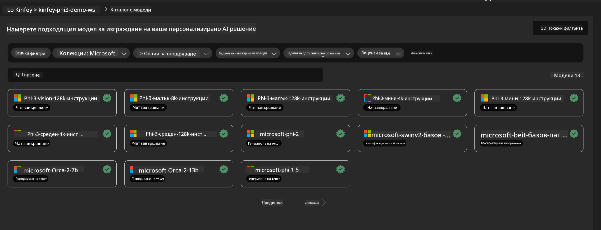
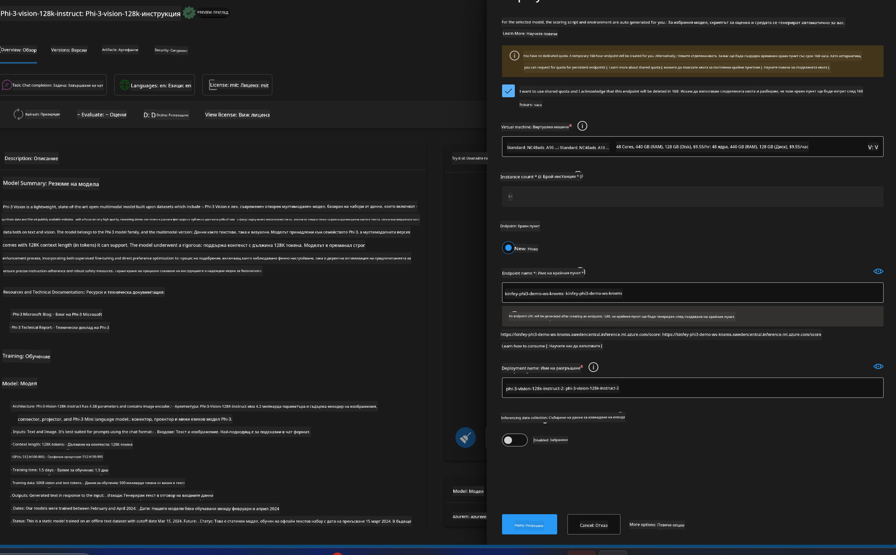
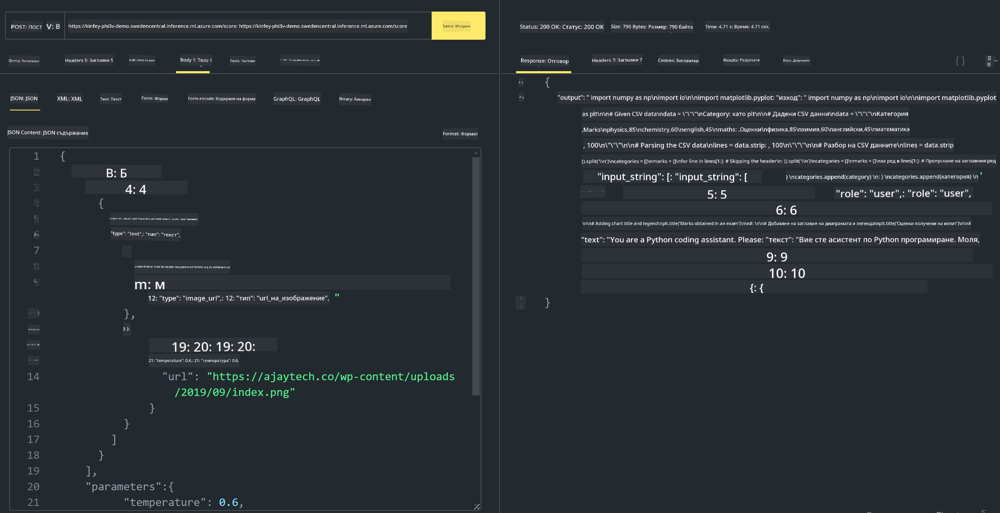

<!--
CO_OP_TRANSLATOR_METADATA:
{
  "original_hash": "20cb4e6ac1686248e8be913ccf6c2bc2",
  "translation_date": "2025-05-09T19:45:22+00:00",
  "source_file": "md/02.Application/02.Code/Phi3/VSCodeExt/HOL/Apple/03.DeployPhi3VisionOnAzure.md",
  "language_code": "bg"
}
-->
# **Лаборатория 3 - Разгръщане на Phi-3-vision в Azure Machine Learning Service**

Използваме NPU, за да завършим производственото разгръщане на локалния код, след което искаме да въведем възможността да използваме PHI-3-VISION чрез него, за да превръщаме изображения в генериран код.

В това въведение бързо можем да създадем услуга Model As Service Phi-3 Vision в Azure Machine Learning Service.

***Note***： Phi-3 Vision изисква изчислителна мощност, за да генерира съдържание по-бързо. Имаме нужда от облачна изчислителна мощ, за да ни помогне да постигнем това.


### **1. Създаване на Azure Machine Learning Service**

Трябва да създадем Azure Machine Learning Service в Azure портала. Ако искате да научите как, моля посетете този линк [https://learn.microsoft.com/azure/machine-learning/quickstart-create-resources?view=azureml-api-2](https://learn.microsoft.com/azure/machine-learning/quickstart-create-resources?view=azureml-api-2)


### **2. Избор на Phi-3 Vision в Azure Machine Learning Service**




### **3. Разгръщане на Phi-3-Vision в Azure**





### **4. Тестване на Endpoint в Postman**





***Note***

1. Параметрите, които се изпращат, трябва да включват Authorization, azureml-model-deployment и Content-Type. Трябва да проверите информацията за разгръщането, за да ги получите.

2. За да се изпратят параметри, Phi-3-Vision изисква изпращане на линк към изображение. Моля, вижте метода на GPT-4-Vision за изпращане на параметри, например

```json

{
  "input_data":{
    "input_string":[
      {
        "role":"user",
        "content":[ 
          {
            "type": "text",
            "text": "You are a Python coding assistant.Please create Python code for image "
          },
          {
              "type": "image_url",
              "image_url": {
                "url": "https://ajaytech.co/wp-content/uploads/2019/09/index.png"
              }
          }
        ]
      }
    ],
    "parameters":{
          "temperature": 0.6,
          "top_p": 0.9,
          "do_sample": false,
          "max_new_tokens": 2048
    }
  }
}

```

3. Извикайте **/score** с Post метода

**Поздравления**! Вече сте завършили бързото разгръщане на PHI-3-VISION и сте изпробвали как да генерирате код от изображения. Следващата стъпка е да изградим приложения, комбинирайки NPU и облака.

**Отказ от отговорност**:  
Този документ е преведен с помощта на AI преводаческа услуга [Co-op Translator](https://github.com/Azure/co-op-translator). Въпреки че се стремим към точност, моля, имайте предвид, че автоматичните преводи могат да съдържат грешки или неточности. Оригиналният документ на неговия роден език трябва да се счита за авторитетен източник. За критична информация се препоръчва професионален човешки превод. Ние не носим отговорност за никакви недоразумения или неправилни тълкувания, произтичащи от използването на този превод.