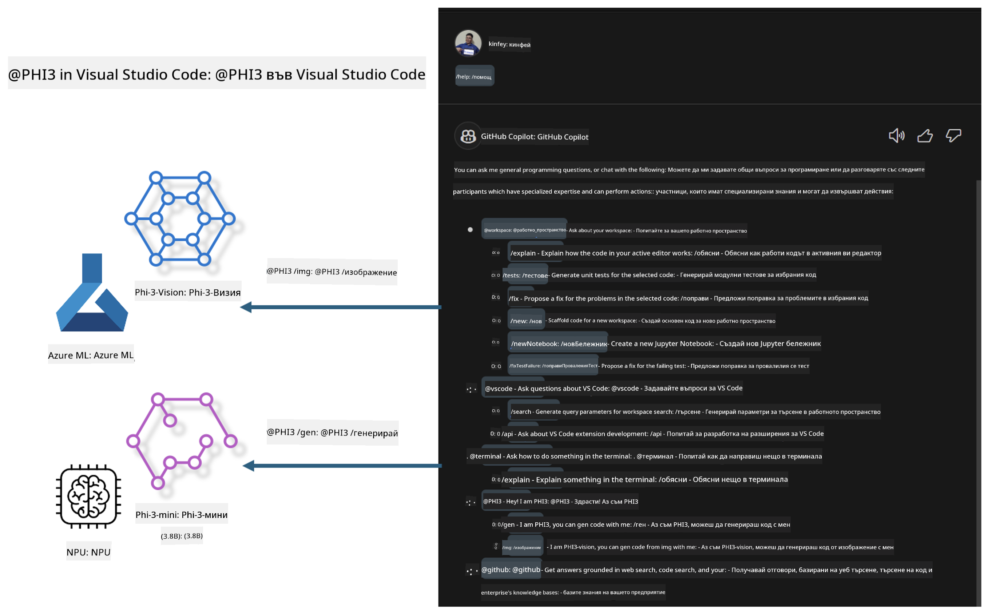

<!--
CO_OP_TRANSLATOR_METADATA:
{
  "original_hash": "00b7a699de8ac405fa821f4c0f7fc0ab",
  "translation_date": "2025-07-17T03:45:08+00:00",
  "source_file": "md/02.Application/02.Code/Phi3/VSCodeExt/README.md",
  "language_code": "bg"
}
-->
# **Създайте свой собствен Visual Studio Code GitHub Copilot Chat с Microsoft Phi-3 Family**

Използвали ли сте workspace агента в GitHub Copilot Chat? Искате ли да създадете собствен агент за кодиране за вашия екип? Тази практическа лаборатория цели да комбинира отворения модел, за да изгради бизнес агент за кодиране на корпоративно ниво.

## **Основи**

### **Защо да изберете Microsoft Phi-3**

Phi-3 е серия от модели, включваща phi-3-mini, phi-3-small и phi-3-medium, базирани на различни параметри за обучение за генериране на текст, завършване на диалог и генериране на код. Съществува и phi-3-vision, базиран на Vision. Той е подходящ за предприятия или различни екипи, които искат да създадат офлайн генеративни AI решения.

Препоръчително е да прочетете този линк [https://github.com/microsoft/PhiCookBook/blob/main/md/01.Introduction/01/01.PhiFamily.md](https://github.com/microsoft/PhiCookBook/blob/main/md/01.Introduction/01/01.PhiFamily.md)

### **Microsoft GitHub Copilot Chat**

Разширението GitHub Copilot Chat ви предоставя чат интерфейс, който ви позволява да взаимодействате с GitHub Copilot и да получавате отговори на въпроси, свързани с програмирането, директно във VS Code, без да се налага да търсите в документация или онлайн форуми.

Copilot Chat може да използва синтактично оцветяване, отстъпи и други форматиращи функции, за да направи отговора по-ясен. В зависимост от типа на въпроса, резултатът може да съдържа връзки към контекста, който Copilot е използвал за генериране на отговора, като файлове с изходен код или документация, или бутони за достъп до функционалности на VS Code.

- Copilot Chat се интегрира във вашия работен процес и ви помага там, където имате нужда:

- Започнете чат разговор директно от редактора или терминала, за да получите помощ докато кодирате

- Използвайте Chat изгледа, за да имате AI асистент на разположение по всяко време

- Стартирайте Quick Chat, за да зададете бърз въпрос и да се върнете към работата си

Можете да използвате GitHub Copilot Chat в различни ситуации, като:

- Отговаряне на въпроси за кодиране и най-добрите решения на проблеми

- Обясняване на чужд код и предлагане на подобрения

- Предлагане на поправки в кода

- Генериране на unit тестове

- Генериране на документация за кода

Препоръчително е да прочетете този линк [https://code.visualstudio.com/docs/copilot/copilot-chat](https://code.visualstudio.com/docs/copilot/copilot-chat?WT.mc_id=aiml-137032-kinfeylo)

###  **Microsoft GitHub Copilot Chat @workspace**

Използването на **@workspace** в Copilot Chat ви позволява да задавате въпроси за целия си кодов проект. Въз основа на въпроса, Copilot интелигентно извлича релевантни файлове и символи, които след това използва в отговора си като връзки и примери с код.

За да отговори на вашия въпрос, **@workspace** търси в същите източници, които разработчик би използвал при навигация в кодовата база във VS Code:

- Всички файлове в работното пространство, с изключение на тези, които са игнорирани от .gitignore файл

- Структурата на директориите с вложени папки и имена на файлове

- Индекса за търсене на код в GitHub, ако работното пространство е GitHub репозитория и е индексирано от code search

- Символи и дефиниции в работното пространство

- Текущо избрания текст или видимия текст в активния редактор

Забележка: .gitignore се игнорира, ако имате отворен файл или избран текст в игнориран файл.

Препоръчително е да прочетете този линк [[https://code.visualstudio.com/docs/copilot/copilot-chat](https://code.visualstudio.com/docs/copilot/workspace-context?WT.mc_id=aiml-137032-kinfeylo)]

## **Научете повече за тази лаборатория**

GitHub Copilot значително подобри ефективността на програмиране в предприятията, като всяко предприятие иска да персонализира съответните функции на GitHub Copilot. Много предприятия са създали персонализирани разширения, подобни на GitHub Copilot, базирани на техните бизнес сценарии и отворени модели. За предприятията персонализираните разширения са по-лесни за контрол, но това може да повлияе на потребителското изживяване. Все пак GitHub Copilot има по-силни възможности за работа с общи сценарии и професионализъм. Ако изживяването може да се запази последователно, персонализирането на собствено разширение за предприятието е по-добър вариант. GitHub Copilot Chat предоставя съответните API-та за предприятията, за да разширят чат изживяването. Поддържането на последователно изживяване с персонализирани функции осигурява по-добро потребителско изживяване.

Тази лаборатория основно използва модела Phi-3 в комбинация с локален NPU и хибрид Azure, за да създаде персонализиран агент в GitHub Copilot Chat ***@PHI3***, който помага на корпоративните разработчици да завършат генерирането на код ***(@PHI3 /gen)*** и генерирането на код на базата на изображения ***(@PHI3 /img)***.

### ***Забележка:*** 

Тази лаборатория в момента е реализирана в AIPC на Intel CPU и Apple Silicon. Ще продължим да обновяваме версията за Qualcomm NPU.

## **Лаборатория**

| Име | Описание | AIPC | Apple |
| ------------ | ----------- | -------- |-------- |
| Lab0 - Инсталации(✅) | Конфигуриране и инсталиране на свързани среди и инструменти | [Go](./HOL/AIPC/01.Installations.md) |[Go](./HOL/Apple/01.Installations.md) |
| Lab1 - Стартиране на Prompt flow с Phi-3-mini (✅) | В комбинация с AIPC / Apple Silicon, използване на локален NPU за създаване на генериране на код чрез Phi-3-mini | [Go](./HOL/AIPC/02.PromptflowWithNPU.md) |  [Go](./HOL/Apple/02.PromptflowWithMLX.md) |
| Lab2 - Деплой на Phi-3-vision в Azure Machine Learning Service(✅) | Генериране на код чрез деплой на Model Catalog на Azure Machine Learning Service - Phi-3-vision image | [Go](./HOL/AIPC/03.DeployPhi3VisionOnAzure.md) |[Go](./HOL/Apple/03.DeployPhi3VisionOnAzure.md) |
| Lab3 - Създаване на @phi-3 агент в GitHub Copilot Chat(✅)  | Създаване на персонализиран Phi-3 агент в GitHub Copilot Chat за завършване на генериране на код, генериране на графики, RAG и др. | [Go](./HOL/AIPC/04.CreatePhi3AgentInVSCode.md) | [Go](./HOL/Apple/04.CreatePhi3AgentInVSCode.md) |
| Примерен код (✅)  | Изтегляне на примерен код | [Go](../../../../../../../code/07.Lab/01/AIPC) | [Go](../../../../../../../code/07.Lab/01/Apple) |

## **Ресурси**

1. Phi-3 Cookbook [https://github.com/microsoft/Phi-3CookBook](https://github.com/microsoft/Phi-3CookBook)

2. Научете повече за GitHub Copilot [https://learn.microsoft.com/training/paths/copilot/](https://learn.microsoft.com/training/paths/copilot/?WT.mc_id=aiml-137032-kinfeylo)

3. Научете повече за GitHub Copilot Chat [https://learn.microsoft.com/training/paths/accelerate-app-development-using-github-copilot/](https://learn.microsoft.com/training/paths/accelerate-app-development-using-github-copilot/?WT.mc_id=aiml-137032-kinfeylo)

4. Научете повече за GitHub Copilot Chat API [https://code.visualstudio.com/api/extension-guides/chat](https://code.visualstudio.com/api/extension-guides/chat?WT.mc_id=aiml-137032-kinfeylo)

5. Научете повече за Azure AI Foundry [https://learn.microsoft.com/training/paths/create-custom-copilots-ai-studio/](https://learn.microsoft.com/training/paths/create-custom-copilots-ai-studio/?WT.mc_id=aiml-137032-kinfeylo)

6. Научете повече за Model Catalog на Azure AI Foundry [https://learn.microsoft.com/azure/ai-studio/how-to/model-catalog-overview](https://learn.microsoft.com/azure/ai-studio/how-to/model-catalog-overview)

**Отказ от отговорност**:  
Този документ е преведен с помощта на AI преводаческа услуга [Co-op Translator](https://github.com/Azure/co-op-translator). Въпреки че се стремим към точност, моля, имайте предвид, че автоматизираните преводи могат да съдържат грешки или неточности. Оригиналният документ на неговия роден език трябва да се счита за авторитетен източник. За критична информация се препоръчва професионален човешки превод. Ние не носим отговорност за каквито и да е недоразумения или неправилни тълкувания, произтичащи от използването на този превод.