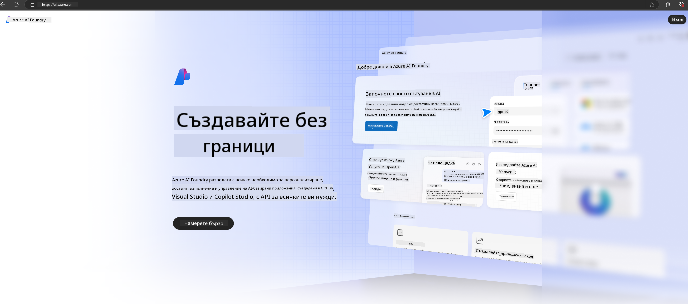

<!--
CO_OP_TRANSLATOR_METADATA:
{
  "original_hash": "3a1e48b628022485aac989c9f733e792",
  "translation_date": "2025-05-09T20:15:04+00:00",
  "source_file": "md/02.QuickStart/AzureAIFoundry_QuickStart.md",
  "language_code": "bg"
}
-->
# **Използване на Phi-3 в Azure AI Foundry**

С развитието на Генеративния AI, се надяваме да използваме единна платформа за управление на различни LLM и SLM, интеграция на корпоративни данни, операции по фино настройване/RAG и оценка на различни бизнеси след интегриране на LLM и SLM, и т.н., така че генеративният AI да може по-добре да се прилага в интелигентни приложения. [Azure AI Foundry](https://ai.azure.com) е корпоративна платформа за приложения с генеративен AI.

С Azure AI Foundry можете да оценявате отговорите на големи езикови модели (LLM) и да оркестрирате компоненти на приложения с prompt flow за по-добра производителност. Платформата улеснява мащабирането, като превръща прототипите в пълноценни продукционни решения с лекота. Непрекъснатото наблюдение и усъвършенстване подпомагат дългосрочния успех.

Можем бързо да разположим модела Phi-3 в Azure AI Foundry чрез няколко прости стъпки и след това да използваме Azure AI Foundry за завършване на свързани с Phi-3 Playground/Chat, фино настройване, оценка и други задачи.

## **1. Подготовка**

Ако вече имате инсталиран [Azure Developer CLI](https://learn.microsoft.com/azure/developer/azure-developer-cli/overview?WT.mc_id=aiml-138114-kinfeylo) на вашия компютър, използването на този шаблон е толкова просто, колкото да изпълните тази команда в нова директория.

## Ръчно създаване

Създаването на проект и hub в Microsoft Azure AI Foundry е чудесен начин да организирате и управлявате своята AI работа. Ето стъпка по стъпка ръководство, за да започнете:

### Създаване на проект в Azure AI Foundry

1. **Отидете в Azure AI Foundry**: Влезте в портала на Azure AI Foundry.
2. **Създайте проект**:
   - Ако вече сте в проект, изберете "Azure AI Foundry" в горния ляв ъгъл, за да отидете на началната страница.
   - Изберете "+ Create project".
   - Въведете име на проекта.
   - Ако имате hub, той ще бъде избран по подразбиране. Ако имате достъп до повече от един hub, можете да изберете друг от падащото меню. Ако искате да създадете нов hub, изберете "Create new hub" и въведете име.
   - Изберете "Create".

### Създаване на hub в Azure AI Foundry

1. **Отидете в Azure AI Foundry**: Влезте с вашия Azure акаунт.
2. **Създайте hub**:
   - Изберете Management center от лявото меню.
   - Изберете "All resources", след това стрелката надолу до "+ New project" и изберете "+ New hub".
   - В диалоговия прозорец "Create a new hub" въведете име на вашия hub (например contoso-hub) и променете другите полета по желание.
   - Изберете "Next", прегледайте информацията и след това изберете "Create".

За по-подробни инструкции можете да се обърнете към официалната [документация на Microsoft](https://learn.microsoft.com/azure/ai-studio/how-to/create-projects).

След успешно създаване, можете да достъпите създаденото студио чрез [ai.azure.com](https://ai.azure.com/)

В един AI Foundry могат да съществуват няколко проекта. Създайте проект в AI Foundry за подготовка.

Създайте Azure AI Foundry [QuickStarts](https://learn.microsoft.com/azure/ai-studio/quickstarts/get-started-code)

## **2. Разполагане на Phi модел в Azure AI Foundry**

Кликнете върху опцията Explore на проекта, за да влезете в Model Catalog и изберете Phi-3

Изберете Phi-3-mini-4k-instruct

Кликнете 'Deploy', за да разположите модела Phi-3-mini-4k-instruct

> [!NOTE]
>
> Можете да изберете изчислителна мощност при разполагането

## **3. Playground Chat Phi в Azure AI Foundry**

Отидете на страницата за разполагане, изберете Playground и чатете с Phi-3 в Azure AI Foundry

## **4. Разполагане на модела от Azure AI Foundry**

За да разположите модел от Azure Model Catalog, следвайте тези стъпки:

- Влезте в Azure AI Foundry.
- Изберете модела, който искате да разположите от каталога с модели на Azure AI Foundry.
- В страницата с детайли на модела изберете Deploy, след което изберете Serverless API с Azure AI Content Safety.
- Изберете проекта, в който искате да разположите моделите си. За да използвате Serverless API, вашето работно пространство трябва да се намира в региона East US 2 или Sweden Central. Можете да персонализирате името на разполагането.
- В съветника за разполагане изберете Pricing and terms, за да се запознаете с цените и условията за ползване.
- Изберете Deploy. Изчакайте разполагането да е готово и да бъдете пренасочени към страницата с разполагания.
- Изберете Open in playground, за да започнете взаимодействие с модела.
- Можете да се върнете на страницата с разполагания, да изберете разполагането и да отбележите Target URL и Secret Key, които да използвате за извикване на разполагането и генериране на отговори.
- Винаги можете да намерите детайлите на крайния адрес, URL и ключове за достъп като отидете в раздела Build и изберете Deployments от секцията Components.

> [!NOTE]
> Моля, имайте предвид, че вашият акаунт трябва да има роли на Azure AI Developer в Resource Group, за да изпълните тези стъпки.

## **5. Използване на Phi API в Azure AI Foundry**

Можете да достъпите https://{Your project name}.region.inference.ml.azure.com/swagger.json чрез Postman с GET и да го комбинирате с Key, за да разгледате предоставените интерфейси

Много лесно можете да получите параметрите за заявка, както и параметрите на отговора.

**Отказ от отговорност**:  
Този документ е преведен с помощта на AI преводаческа услуга [Co-op Translator](https://github.com/Azure/co-op-translator). Въпреки че се стремим към точност, моля, имайте предвид, че автоматизираните преводи могат да съдържат грешки или неточности. Оригиналният документ на неговия оригинален език трябва да се счита за авторитетен източник. За критична информация се препоръчва професионален човешки превод. Ние не носим отговорност за каквито и да е недоразумения или неправилни тълкувания, произтичащи от използването на този превод.