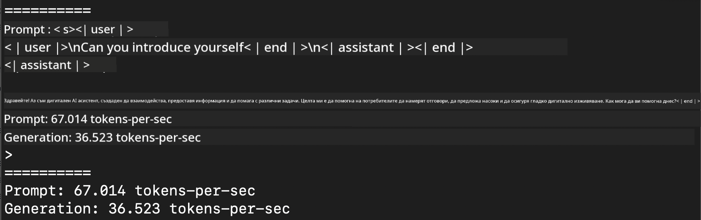
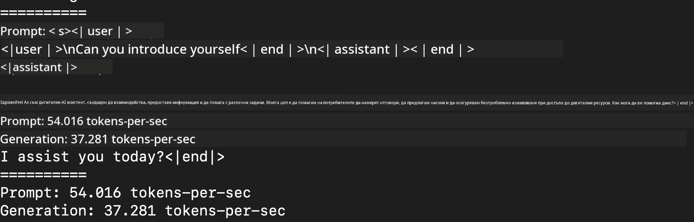
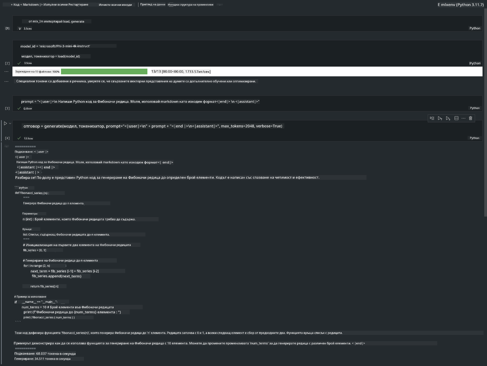

<!--
CO_OP_TRANSLATOR_METADATA:
{
  "original_hash": "dcb656f3d206fc4968e236deec5d4384",
  "translation_date": "2025-05-09T22:33:45+00:00",
  "source_file": "md/03.FineTuning/03.Inference/MLX_Inference.md",
  "language_code": "bg"
}
-->
# **Инференция Phi-3 с Apple MLX Framework**

## **Какво е MLX Framework**

MLX е рамка за масиви, предназначена за изследвания в областта на машинното обучение на Apple silicon, разработена от екипа за изследвания в машинното обучение на Apple.

MLX е създадена от изследователи в машинното обучение за изследователи в машинното обучение. Рамката е проектирана да бъде лесна за ползване, но същевременно ефективна за обучение и внедряване на модели. Самият дизайн на рамката е концептуално прост. Целим да улесним изследователите в разширяването и подобряването на MLX, за да могат бързо да изследват нови идеи.

Големите езикови модели (LLMs) могат да се ускорят на устройства с Apple Silicon чрез MLX, а моделите могат да се изпълняват локално много удобно.

## **Използване на MLX за инференция на Phi-3-mini**

### **1. Настройване на MLX средата**

1. Python 3.11.x  
2. Инсталиране на MLX библиотеката

```bash

pip install mlx-lm

```

### **2. Стартиране на Phi-3-mini в терминала с MLX**

```bash

python -m mlx_lm.generate --model microsoft/Phi-3-mini-4k-instruct --max-token 2048 --prompt  "<|user|>\nCan you introduce yourself<|end|>\n<|assistant|>"

```

Резултатът (моят хардуер е Apple M1 Max, 64GB) е



### **3. Квантизиране на Phi-3-mini с MLX в терминала**

```bash

python -m mlx_lm.convert --hf-path microsoft/Phi-3-mini-4k-instruct

```

***Note：*** Моделът може да бъде квантизиран чрез mlx_lm.convert, като по подразбиране квантизацията е INT4. Този пример показва квантизиране на Phi-3-mini до INT4.

Моделът може да бъде квантизиран чрез mlx_lm.convert, като по подразбиране квантизацията е INT4. В този пример Phi-3-mini се квантизира до INT4. След квантизацията моделът се съхранява в стандартната директория ./mlx_model

Можем да тестваме квантизирания с MLX модел от терминала

```bash

python -m mlx_lm.generate --model ./mlx_model/ --max-token 2048 --prompt  "<|user|>\nCan you introduce yourself<|end|>\n<|assistant|>"

```

Резултатът е



### **4. Стартиране на Phi-3-mini с MLX в Jupyter Notebook**



***Note:*** Моля, разгледайте този пример [click this link](../../../../../code/03.Inference/MLX/MLX_DEMO.ipynb)

## **Ресурси**

1. Научете повече за Apple MLX Framework [https://ml-explore.github.io](https://ml-explore.github.io/mlx/build/html/index.html)

2. Apple MLX GitHub Repo [https://github.com/ml-explore](https://github.com/ml-explore)

**Отказ от отговорност**:  
Този документ е преведен с помощта на AI преводаческа услуга [Co-op Translator](https://github.com/Azure/co-op-translator). Въпреки че се стремим към точност, моля, имайте предвид, че автоматичните преводи могат да съдържат грешки или неточности. Оригиналният документ на неговия роден език трябва да се счита за авторитетен източник. За критична информация се препоръчва професионален човешки превод. Ние не носим отговорност за каквито и да е недоразумения или погрешни тълкувания, произтичащи от използването на този превод.