<!--
CO_OP_TRANSLATOR_METADATA:
{
  "original_hash": "c1559c5af6caccf6f623fd43a6b3a9a3",
  "translation_date": "2025-05-09T20:37:39+00:00",
  "source_file": "md/03.FineTuning/FineTuning_AIFoundry.md",
  "language_code": "bg"
}
-->
# Финна настройка на Phi-3 с Azure AI Foundry

Нека разгледаме как да финна настроим езиковия модел Phi-3 Mini на Microsoft с помощта на Azure AI Foundry. Финната настройка ви позволява да адаптирате Phi-3 Mini за конкретни задачи, правейки го по-мощен и по-добре осъзнат в контекста.

## Съображения

- **Възможности:** Кои модели могат да бъдат финно настроени? Какво може да се постигне с базовия модел чрез финна настройка?
- **Цена:** Какъв е ценовият модел за финна настройка?
- **Персонализация:** Колко и по какъв начин мога да модифицирам базовия модел?
- **Удобство:** Как всъщност протича финната настройка – трябва ли да пиша собствен код? Трябва ли да осигуря собствена изчислителна мощ?
- **Безопасност:** Финно настроените модели могат да крият рискове за безопасността – има ли предпазни мерки срещу нежелани последици?

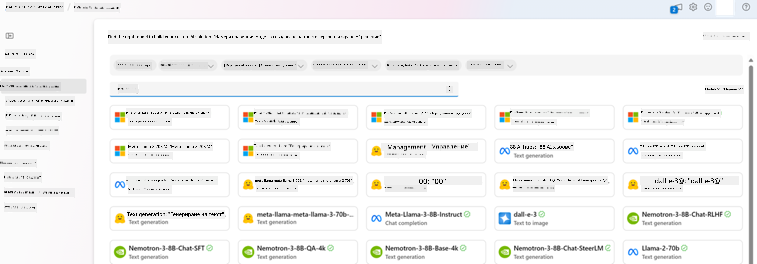

## Подготовка за финна настройка

### Предварителни условия

> [!NOTE]
> За моделите от семейството Phi-3, предлагането на финна настройка по модел „плащаш според използването“ е достъпно само за хъбове, създадени в регион **East US 2**.

- Абонамент за Azure. Ако нямате такъв, създайте [платен Azure акаунт](https://azure.microsoft.com/pricing/purchase-options/pay-as-you-go), за да започнете.

- [Проект в AI Foundry](https://ai.azure.com?WT.mc_id=aiml-138114-kinfeylo).
- Ролевите базирани контроли за достъп в Azure (Azure RBAC) се използват за предоставяне на достъп до операциите в Azure AI Foundry. За да изпълните стъпките в тази статия, вашият потребителски акаунт трябва да има назначена __роля Azure AI Developer__ върху ресурсната група.

### Регистрация на доставчик на абонамент

Проверете дали абонаментът е регистриран за `Microsoft.Network` доставчик на ресурси.

1. Влезте в [Azure портала](https://portal.azure.com).
1. Изберете **Subscriptions** от лявото меню.
1. Изберете абонамента, който искате да използвате.
1. Изберете **AI project settings** > **Resource providers** от лявото меню.
1. Потвърдете, че **Microsoft.Network** е в списъка с доставчици на ресурси. Ако не е, добавете го.

### Подготовка на данни

Подгответе вашите тренировъчни и валидиращи данни за финна настройка на модела. Тренировъчните и валидиращите набори трябва да съдържат входни и изходни примери, показващи как искате моделът да се държи.

Уверете се, че всички тренировъчни примери са във формата, очакван за инференция. За ефективна финна настройка осигурете балансиран и разнообразен набор от данни.

Това включва поддържане на баланс в данните, включване на различни сценарии и периодично усъвършенстване на тренировъчния набор, за да съответства на реалните очаквания, което води до по-точни и балансирани отговори на модела.

Различните типове модели изискват различен формат на тренировъчните данни.

### Chat Completion

Тренировъчните и валидиращите данни, които използвате, **трябва** да са форматирани като JSON Lines (JSONL) документ. За `Phi-3-mini-128k-instruct` наборът за финна настройка трябва да бъде във формат за разговор, използван от Chat completions API.

### Примерен формат на файла

```json
    {"messages": [{"role": "system", "content": "You are an Xbox customer support agent whose primary goal is to help users with issues they are experiencing with their Xbox devices. You are friendly and concise. You only provide factual answers to queries, and do not provide answers that are not related to Xbox."}, {"role": "user", "content": "Is Xbox better than PlayStation?"}, {"role": "assistant", "content": "I apologize, but I cannot provide personal opinions. My primary job is to assist you with any issues related to your Xbox device. Do you have any Xbox-related issues that need addressing?"}]}
    {"messages": [{"role": "system", "content": "You are an Xbox customer support agent whose primary goal is to help users with issues they are experiencing with their Xbox devices. You are friendly and concise. You only provide factual answers to queries, and do not provide answers that are not related to Xbox."}, {"role": "user", "content": "Can I play PC games on my Xbox?"}, {"role": "assistant", "content": "While Xbox consoles don't natively support PC games, they can play an array of Xbox games, many of which are also available on PC. Can I assist you with finding games compatible with your Xbox device?"}]}
    {"messages": [{"role": "system", "content": "You are an Xbox customer support agent whose primary goal is to help users with issues they are experiencing with their Xbox devices. You are friendly and concise. You only provide factual answers to queries, and do not provide answers that are not related to Xbox."}, {"role": "user", "content": "I'm having trouble connecting my Xbox to the Wi-Fi."}, {"role": "assistant", "content": "No worries, let's go through the network settings on your Xbox. Can you please tell me what happens when you try to connect it to the Wi-Fi?"}]}
```

Поддържаният тип файл е JSON Lines. Файловете се качват в стандартното хранилище и стават достъпни в проекта ви.

## Финна настройка на Phi-3 с Azure AI Foundry

Azure AI Foundry ви позволява да персонализирате големи езикови модели спрямо вашите собствени набори от данни чрез процес, наречен финна настройка. Този процес носи значителна стойност, като позволява персонализация и оптимизация за конкретни задачи и приложения. Това води до подобрена производителност, ефективност на разходите, намалена латентност и персонализирани резултати.

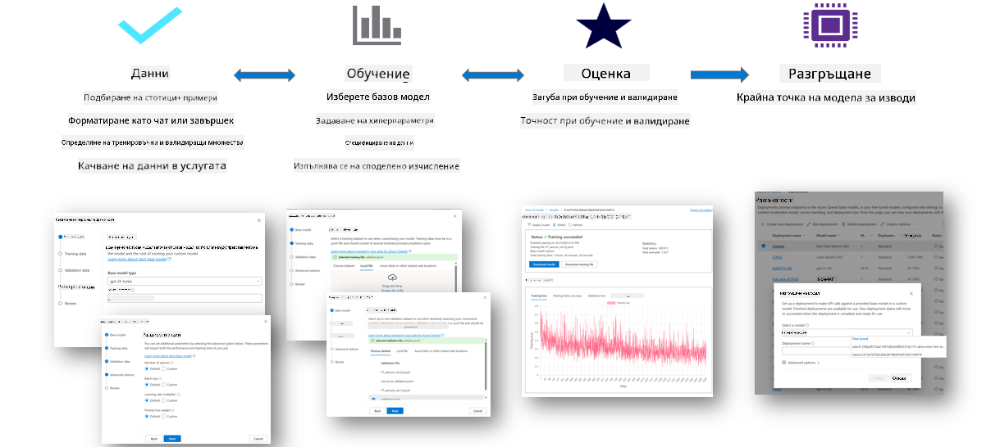

### Създаване на нов проект

1. Влезте в [Azure AI Foundry](https://ai.azure.com).

1. Изберете **+New project**, за да създадете нов проект в Azure AI Foundry.

    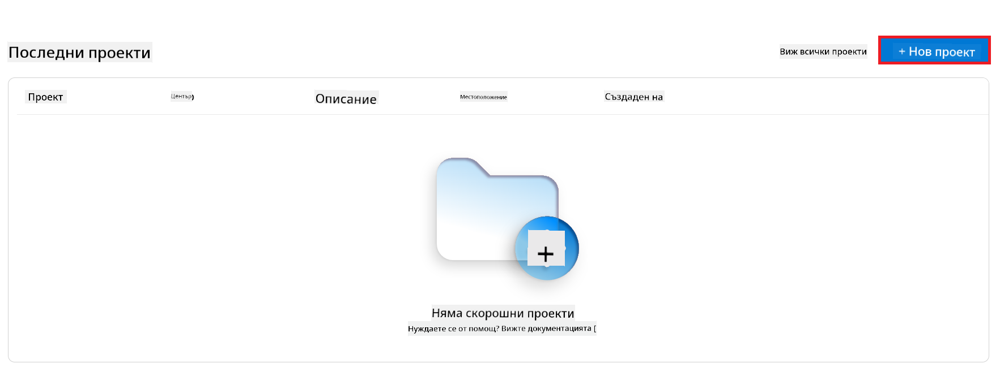

1. Изпълнете следните задачи:

    - Въведете уникално име за проекта в полето **Hub name**.
    - Изберете **Hub**, който да използвате (създайте нов, ако е необходимо).

    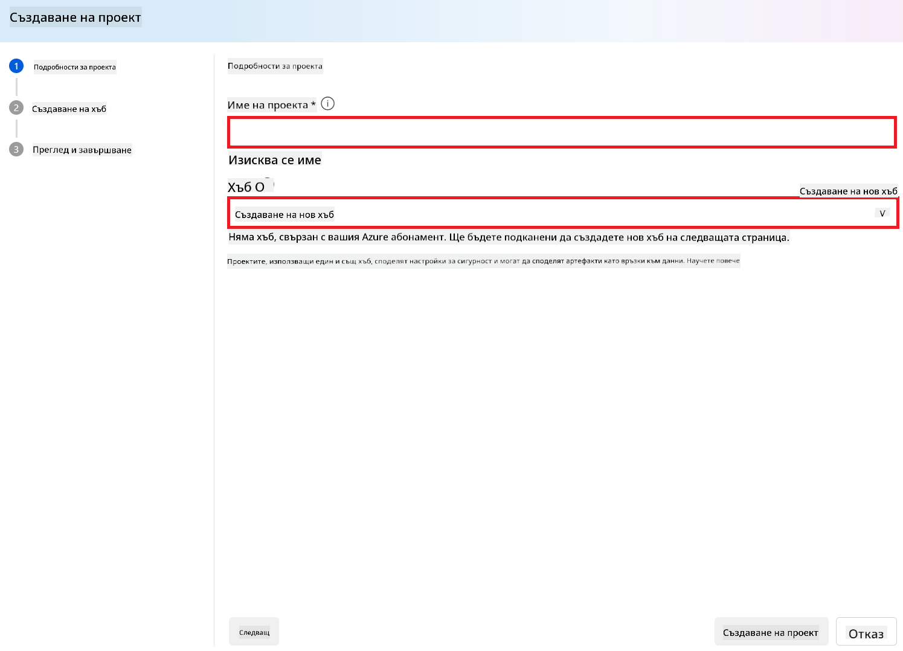

1. Изпълнете следните стъпки за създаване на нов хъб:

    - Въведете уникално име в полето **Hub name**.
    - Изберете вашия Azure **Subscription**.
    - Изберете **Resource group** (създайте нова, ако е необходимо).
    - Изберете **Location**, който желаете да използвате.
    - Изберете **Connect Azure AI Services** (създайте нов, ако е необходимо).
    - Изберете **Connect Azure AI Search** и изберете **Skip connecting**.

    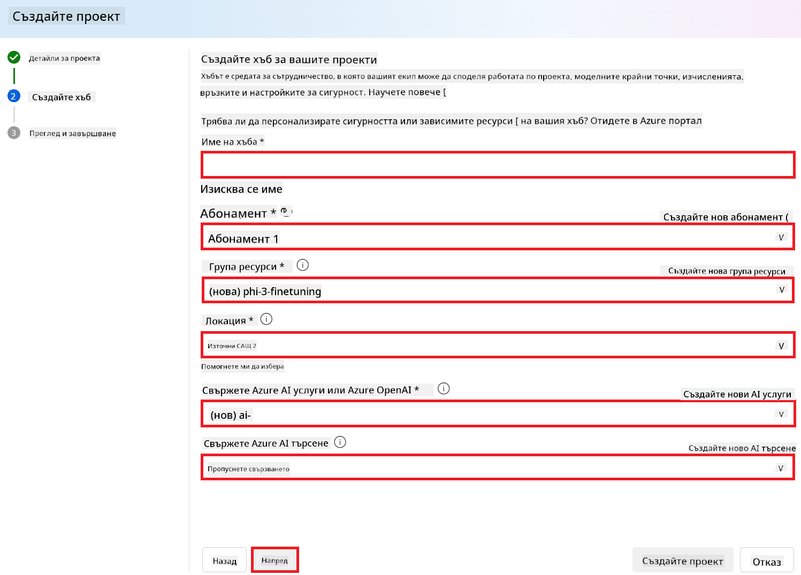

1. Изберете **Next**.
1. Изберете **Create a project**.

### Подготовка на данните

Преди финната настройка съберете или създайте набор от данни, релевантен за вашата задача, като инструкции за чат, двойки въпрос-отговор или други подходящи текстови данни. Почистете и предварително обработете данните, като премахнете шум, обработите липсващи стойности и направите токенизация на текста.

### Финна настройка на Phi-3 модели в Azure AI Foundry

> [!NOTE]
> Финната настройка на Phi-3 модели в момента се поддържа само в проекти, разположени в East US 2.

1. Изберете **Model catalog** от лявата странична лента.

1. Въведете *phi-3* в **търсачката** и изберете желания модел phi-3.

    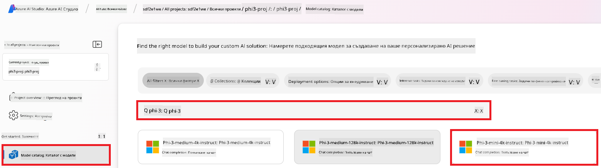

1. Изберете **Fine-tune**.

    

1. Въведете име за **Fine-tuned model**.

    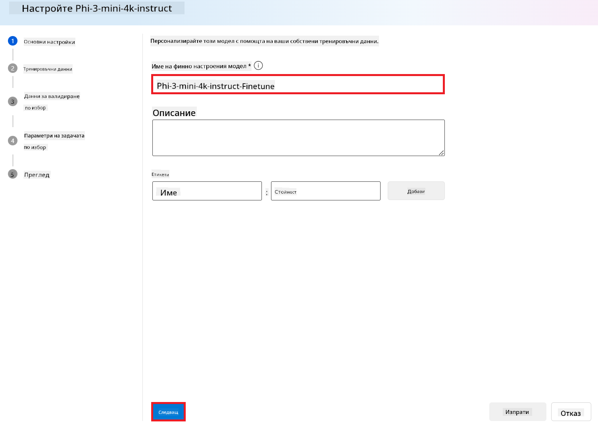

1. Изберете **Next**.

1. Изпълнете следните задачи:

    - Изберете тип задача **Chat completion**.
    - Изберете тренировъчните данни, които искате да използвате. Можете да ги качите чрез Azure AI Foundry или от локалната си среда.

    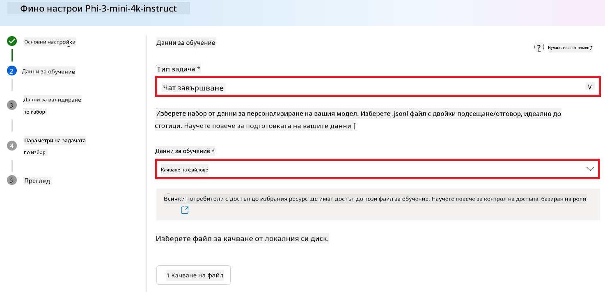

1. Изберете **Next**.

1. Качете валидиращите данни, които искате да използвате, или изберете **Automatic split of training data**.

    

1. Изберете **Next**.

1. Изпълнете следните задачи:

    - Изберете желаната стойност за **Batch size multiplier**.
    - Изберете желаната стойност за **Learning rate**.
    - Изберете броя на **Epochs**.

    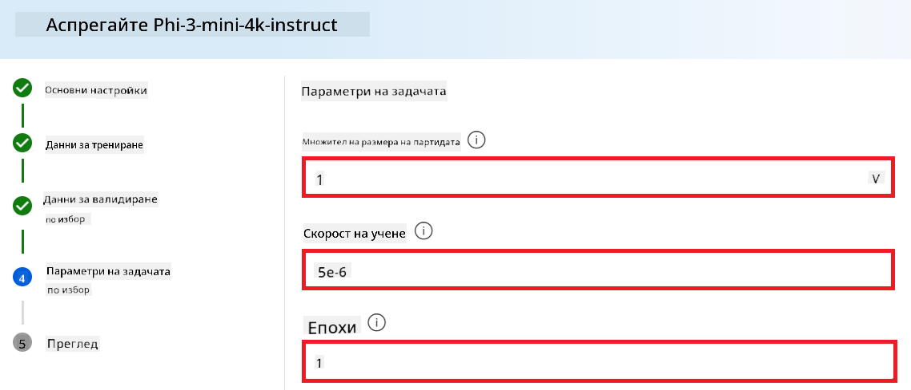

1. Изберете **Submit**, за да стартирате процеса на финна настройка.

    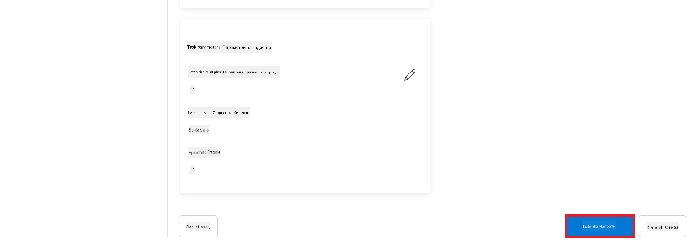

1. След като моделът ви е финно настроен, статусът ще се покаже като **Completed**, както е на изображението по-долу. Сега можете да го разположите и използвате във вашето приложение, в playground или в prompt flow. За повече информация вижте [Как да разположите Phi-3 семейство малки езикови модели с Azure AI Foundry](https://learn.microsoft.com/azure/ai-studio/how-to/deploy-models-phi-3?tabs=phi-3-5&pivots=programming-language-python).

    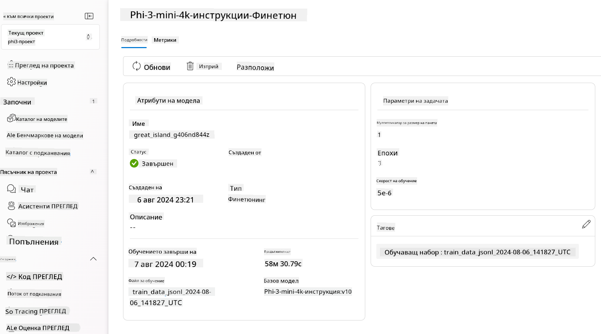

> [!NOTE]
> За по-подробна информация относно финната настройка на Phi-3, посетете [Fine-tune Phi-3 models in Azure AI Foundry](https://learn.microsoft.com/azure/ai-studio/how-to/fine-tune-phi-3?tabs=phi-3-mini).

## Почистване на финно настроените модели

Можете да изтриете финно настроен модел от списъка с модели за финна настройка в [Azure AI Foundry](https://ai.azure.com) или от страницата с детайли за модела. Изберете финно настроения модел, който искате да изтриете от страницата за финна настройка, след което натиснете бутона Delete, за да го премахнете.

> [!NOTE]
> Не можете да изтриете персонализиран модел, ако има съществуващо разполагане. Първо трябва да изтриете разполагането на модела, преди да изтриете самия модел.

## Разходи и квоти

### Съображения за разходи и квоти при Phi-3 модели, финно настроени като услуга

Phi моделите, финно настроени като услуга, се предлагат от Microsoft и са интегрирани с Azure AI Foundry за използване. Цените можете да намерите при [разполагане](https://learn.microsoft.com/azure/ai-studio/how-to/deploy-models-phi-3?tabs=phi-3-5&pivots=programming-language-python) или финна настройка на моделите в раздел Pricing and terms в съветника за разполагане.

## Филтриране на съдържание

Моделите, разположени като услуга с плащане според използването, са защитени от Azure AI Content Safety. При разполагане на реални крайни точки можете да изключите тази функция. С включена Azure AI Content Safety, както подканата, така и отговорът преминават през ансамбъл от модели за класификация, насочени към откриване и предотвратяване на изход с вредно съдържание. Системата за филтриране на съдържание открива и предприема действия спрямо определени категории потенциално вредно съдържание както във входящите подканящи текстове, така и в изходните отговори. Научете повече за [Azure AI Content Safety](https://learn.microsoft.com/azure/ai-studio/concepts/content-filtering).

**Конфигурация на финната настройка**

Хиперпараметри: Определете хиперпараметри като скорост на учене, размер на партида и брой епохи за обучение.

**Функция на загуба**

Изберете подходяща функция на загуба за вашата задача (например крос-ентропия).

**Оптимизатор**

Изберете оптимизатор (например Adam) за обновяване на градиенти по време на обучение.

**Процес на финна настройка**

- Зареждане на предварително обучен модел: Заредете контролно-пропускащия файл (checkpoint) на Phi-3 Mini.
- Добавяне на потребителски слоеве: Добавете специфични за задачата слоеве (например глава за класификация при инструкции за чат).

**Обучение на модела**  
Финно настройте модела с подготвения набор от данни. Следете прогреса на обучението и настройвайте хиперпараметрите при нужда.

**Оценка и валидиране**

Валидиращ набор: Разделете данните си на тренировъчен и валидиращ набор.

**Оценка на представянето**

Използвайте метрики като точност, F1-скор или perplexity, за да оцените представянето на модела.

## Запазване на финно настроения модел

**Контролна точка**  
Запазете контролно-пропускащия файл на финно настроения модел за бъдеща употреба.

## Разполагане

- Разположете като уеб услуга: Разположете финно настроения модел като уеб услуга в Azure AI Foundry.
- Тествайте крайна точка: Изпратете тестови заявки към разположената крайна точка, за да проверите функционалността ѝ.

## Итерация и подобрение

Итерация: Ако представянето не е задоволително, направете итерации чрез настройка на хиперпараметри, добавяне на повече данни или финна настройка за допълнителни епохи.

## Мониторинг и усъвършенстване

Непрекъснато наблюдавайте поведението на модела и го усъвършенствайте при нужда.

## Персонализиране и разширяване

Персонализирани задачи: Phi-3 Mini може да бъде финно настроен за различни задачи, извън инструкциите за чат. Разгледайте други възможни приложения!  
Експериментирайте: Опитайте различни архитектури, комбинации от слоеве и техники за подобряване на представянето.

> [!NOTE]
> Финната настройка е итеративен процес. Експериментирайте, учете се и адаптирайте модела си, за да постигнете най-добрите резултати за вашата конкретна задача!

**Отказ от отговорност**:  
Този документ е преведен с помощта на AI преводаческа услуга [Co-op Translator](https://github.com/Azure/co-op-translator). Въпреки че се стремим към точност, моля, имайте предвид, че автоматизираните преводи могат да съдържат грешки или неточности. Оригиналният документ на неговия роден език трябва да се счита за авторитетен източник. За критична информация се препоръчва професионален човешки превод. Ние не носим отговорност за каквито и да е недоразумения или погрешни тълкувания, произтичащи от използването на този превод.