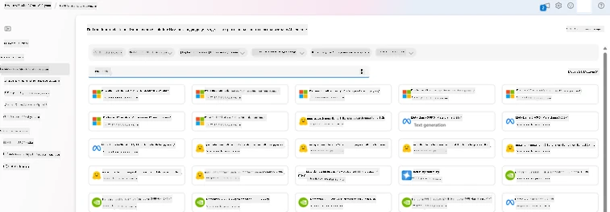
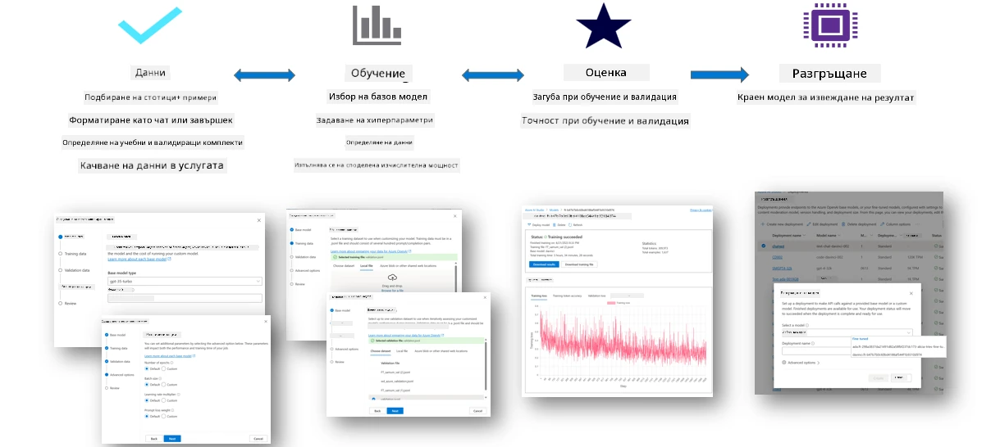
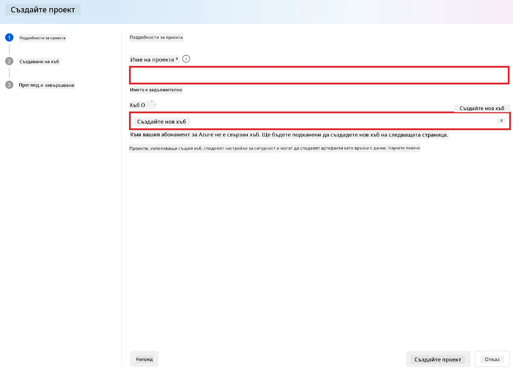
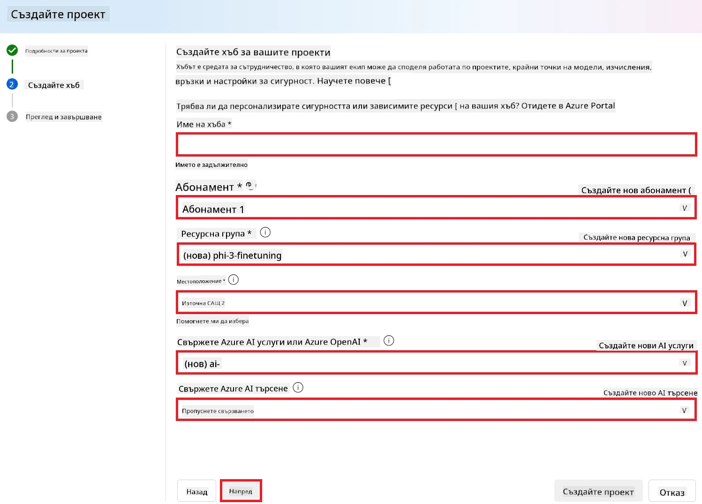
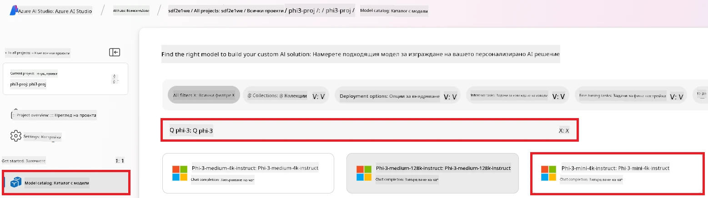
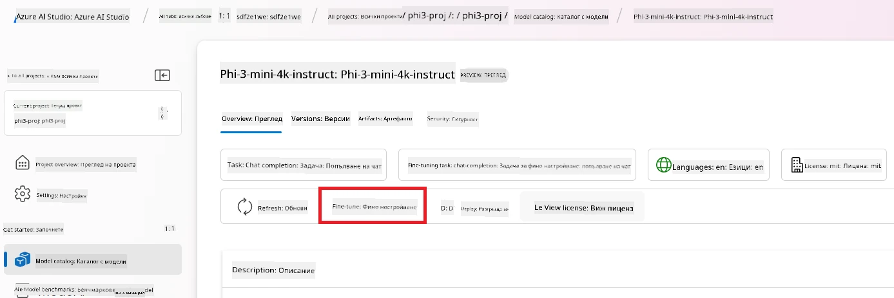
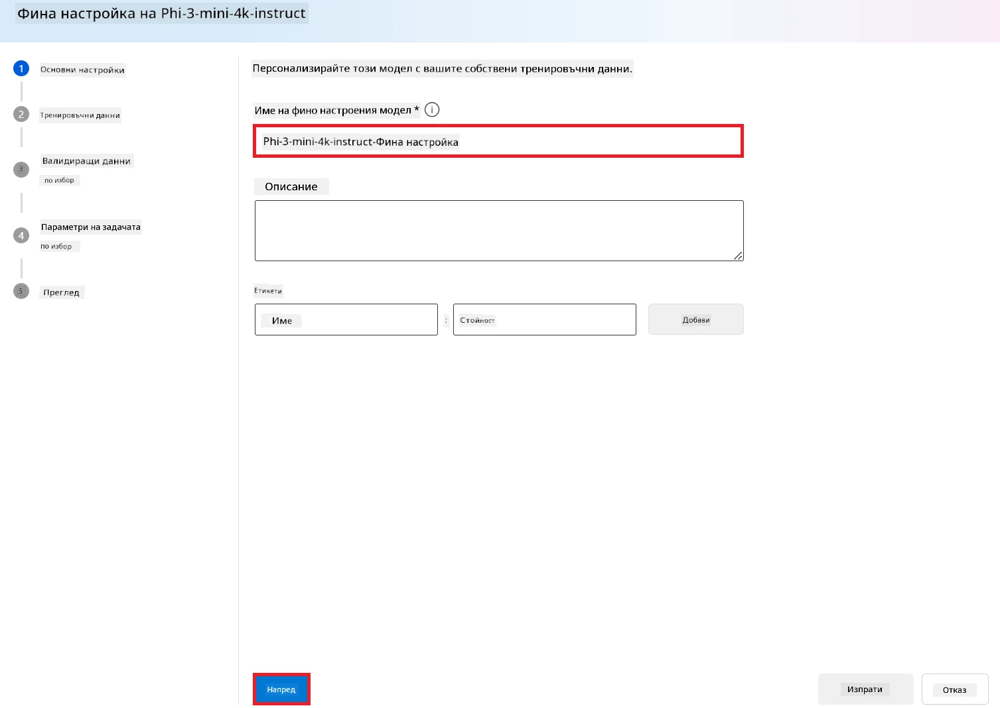
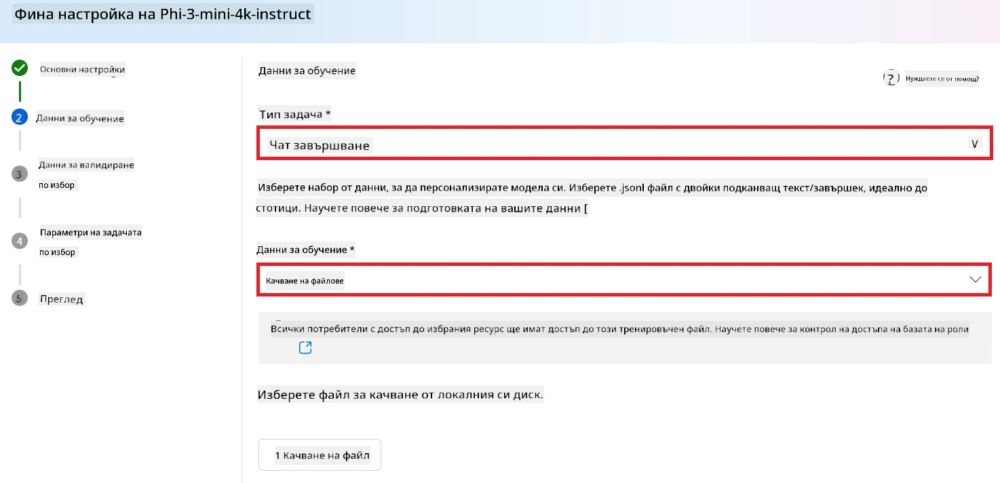
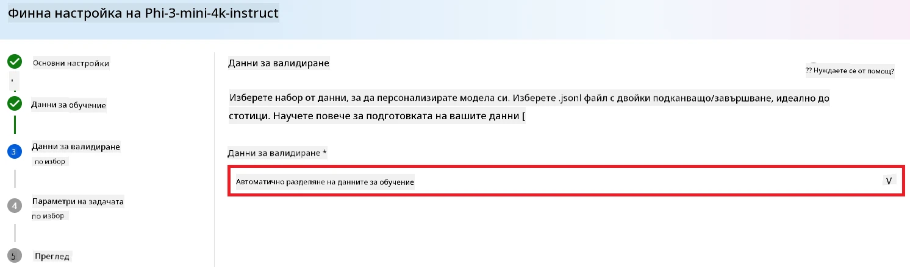
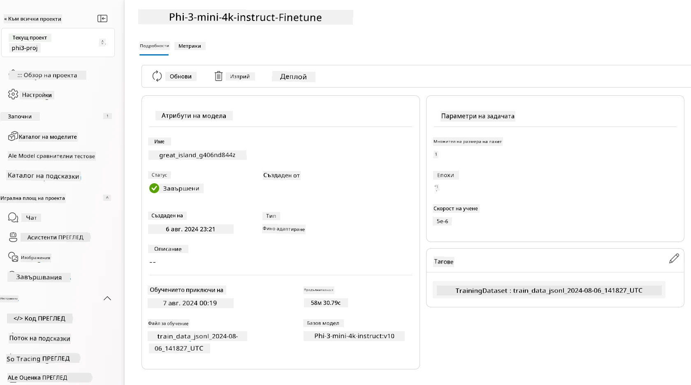

# Финна настройка на Phi-3 с Azure AI Foundry

Нека разгледаме как да направим финна настройка на езиковия модел Phi-3 Mini на Microsoft с помощта на Azure AI Foundry. Финната настройка ви позволява да адаптирате Phi-3 Mini към конкретни задачи, правейки го още по-мощен и контекстно осъзнат.

## Съображения

- **Възможности:** Кои модели могат да бъдат финно настроени? Какво може да се постигне с базовия модел чрез финна настройка?
- **Цена:** Какъв е ценовият модел за финна настройка?
- **Персонализация:** Колко може да се модифицира базовият модел – и по какъв начин?
- **Удобство:** Как всъщност се извършва финната настройка – трябва ли да пиша собствен код? Трябва ли да осигуря собствен изчислителен ресурс?
- **Безопасност:** Финно настроените модели могат да имат рискове за безопасността – има ли предпазни мерки, които да предотвратят нежелани вреди?



## Подготовка за финна настройка

### Предварителни изисквания

> [!NOTE]
> За моделите от фамилията Phi-3, офертата за финна настройка с плащане според използването е налична само за хъбове, създадени в регионите **East US 2**.

- Абонамент за Azure. Ако нямате такъв, създайте [платен Azure акаунт](https://azure.microsoft.com/pricing/purchase-options/pay-as-you-go), за да започнете.

- [AI Foundry проект](https://ai.azure.com?WT.mc_id=aiml-138114-kinfeylo).
- За достъп до операциите в Azure AI Foundry се използват ролеви базирани контроли за достъп (Azure RBAC). За да изпълните стъпките в тази статия, вашият потребителски акаунт трябва да има назначена __роля Azure AI Developer__ върху ресурсната група.

### Регистрация на доставчик на абонамент

Проверете дали абонаментът е регистриран към доставчика на ресурси `Microsoft.Network`.

1. Влезте в [Azure портала](https://portal.azure.com).
1. Изберете **Subscriptions** от лявото меню.
1. Изберете абонамента, който искате да използвате.
1. Изберете **AI project settings** > **Resource providers** от лявото меню.
1. Потвърдете, че **Microsoft.Network** е в списъка с доставчици на ресурси. Ако не е, добавете го.

### Подготовка на данни

Подгответе вашите тренировъчни и валидационни данни за финна настройка на модела. Вашите тренировъчни и валидационни набори трябва да съдържат входни и изходни примери, показващи как искате моделът да се държи.

Уверете се, че всички тренировъчни примери следват очаквания формат за инференция. За ефективна финна настройка е важно да имате балансиран и разнообразен набор от данни.

Това включва поддържане на баланс в данните, включване на различни сценарии и периодично прецизиране на тренировъчните данни, за да съответстват на реалните очаквания, което води до по-точни и балансирани отговори на модела.

Различните типове модели изискват различен формат на тренировъчните данни.

### Chat Completion

Тренировъчните и валидационните данни, които използвате, **трябва** да са форматирани като JSON Lines (JSONL) документ. За `Phi-3-mini-128k-instruct` наборът за финна настройка трябва да е във формат на разговор, използван от Chat completions API.

### Примерен формат на файл

```json
    {"messages": [{"role": "system", "content": "You are an Xbox customer support agent whose primary goal is to help users with issues they are experiencing with their Xbox devices. You are friendly and concise. You only provide factual answers to queries, and do not provide answers that are not related to Xbox."}, {"role": "user", "content": "Is Xbox better than PlayStation?"}, {"role": "assistant", "content": "I apologize, but I cannot provide personal opinions. My primary job is to assist you with any issues related to your Xbox device. Do you have any Xbox-related issues that need addressing?"}]}
    {"messages": [{"role": "system", "content": "You are an Xbox customer support agent whose primary goal is to help users with issues they are experiencing with their Xbox devices. You are friendly and concise. You only provide factual answers to queries, and do not provide answers that are not related to Xbox."}, {"role": "user", "content": "Can I play PC games on my Xbox?"}, {"role": "assistant", "content": "While Xbox consoles don't natively support PC games, they can play an array of Xbox games, many of which are also available on PC. Can I assist you with finding games compatible with your Xbox device?"}]}
    {"messages": [{"role": "system", "content": "You are an Xbox customer support agent whose primary goal is to help users with issues they are experiencing with their Xbox devices. You are friendly and concise. You only provide factual answers to queries, and do not provide answers that are not related to Xbox."}, {"role": "user", "content": "I'm having trouble connecting my Xbox to the Wi-Fi."}, {"role": "assistant", "content": "No worries, let's go through the network settings on your Xbox. Can you please tell me what happens when you try to connect it to the Wi-Fi?"}]}
```

Поддържаният тип файл е JSON Lines. Файловете се качват в подразбиращото се хранилище и стават достъпни в проекта ви.

## Финна настройка на Phi-3 с Azure AI Foundry

Azure AI Foundry ви позволява да персонализирате големи езикови модели спрямо вашите собствени данни чрез процес, наречен финна настройка. Финната настройка носи значителна стойност, като позволява персонализация и оптимизация за конкретни задачи и приложения. Това води до подобрена производителност, по-ниски разходи, намалена латентност и персонализирани резултати.



### Създаване на нов проект

1. Влезте в [Azure AI Foundry](https://ai.azure.com).

1. Изберете **+New project**, за да създадете нов проект в Azure AI Foundry.

    

1. Изпълнете следните задачи:

    - Име на проектния **Hub**. Трябва да е уникално.
    - Изберете **Hub**, който да използвате (създайте нов, ако е необходимо).

    

1. Изпълнете следните стъпки за създаване на нов хъб:

    - Въведете **Hub name**. Трябва да е уникално.
    - Изберете вашия Azure **Subscription**.
    - Изберете **Resource group** за използване (създайте нова, ако е необходимо).
    - Изберете **Location**, който искате да използвате.
    - Изберете **Connect Azure AI Services** за използване (създайте нов, ако е необходимо).
    - Изберете **Connect Azure AI Search** и изберете **Skip connecting**.

    

1. Изберете **Next**.
1. Изберете **Create a project**.

### Подготовка на данни

Преди финната настройка съберете или създайте набор от данни, релевантен за вашата задача, като инструкции за чат, въпроси и отговори или друг подходящ текст. Почистете и предварително обработете данните, като премахнете шум, обработите липсващи стойности и токенизирате текста.

### Финна настройка на Phi-3 модели в Azure AI Foundry

> [!NOTE]
> Финната настройка на Phi-3 модели в момента се поддържа само за проекти, разположени в East US 2.

1. Изберете **Model catalog** от лявата странична лента.

1. Въведете *phi-3* в **търсачката** и изберете желания phi-3 модел.

    

1. Изберете **Fine-tune**.

    

1. Въведете името на **Fine-tuned model**.

    

1. Изберете **Next**.

1. Изпълнете следните задачи:

    - Изберете **task type** като **Chat completion**.
    - Изберете **Training data**, която искате да използвате. Можете да я качите чрез данните на Azure AI Foundry или от локалната си среда.

    

1. Изберете **Next**.

1. Качете **Validation data**, която искате да използвате, или изберете **Automatic split of training data**.

    

1. Изберете **Next**.

1. Изпълнете следните задачи:

    - Изберете **Batch size multiplier**, който искате да използвате.
    - Изберете **Learning rate**, който искате да използвате.
    - Изберете **Epochs**, които искате да използвате.

    

1. Изберете **Submit**, за да стартирате процеса на финна настройка.

    

1. След като моделът ви е финно настроен, статусът ще се покаже като **Completed**, както е показано на изображението по-долу. Сега можете да разположите модела и да го използвате във вашето приложение, в playground или в prompt flow. За повече информация вижте [How to deploy Phi-3 family of small language models with Azure AI Foundry](https://learn.microsoft.com/azure/ai-studio/how-to/deploy-models-phi-3?tabs=phi-3-5&pivots=programming-language-python).

    

> [!NOTE]
> За по-подробна информация относно финната настройка на Phi-3, посетете [Fine-tune Phi-3 models in Azure AI Foundry](https://learn.microsoft.com/azure/ai-studio/how-to/fine-tune-phi-3?tabs=phi-3-mini).

## Почистване на финно настроените модели

Можете да изтриете финно настроен модел от списъка с модели за финна настройка в [Azure AI Foundry](https://ai.azure.com) или от страницата с детайли на модела. Изберете модела, който искате да изтриете от страницата за финна настройка, и след това натиснете бутона Delete, за да го премахнете.

> [!NOTE]
> Не можете да изтриете персонализиран модел, ако има съществуващо разполагане. Първо трябва да изтриете разполагането на модела, преди да изтриете персонализирания модел.

## Разходи и квоти

### Съображения за разходи и квоти при финна настройка на Phi-3 модели като услуга

Phi моделите, финно настроени като услуга, се предлагат от Microsoft и са интегрирани с Azure AI Foundry за използване. Цените можете да намерите при [разполагане](https://learn.microsoft.com/azure/ai-studio/how-to/deploy-models-phi-3?tabs=phi-3-5&pivots=programming-language-python) или финна настройка на моделите в раздела Pricing and terms в съветника за разполагане.

## Филтриране на съдържание

Моделите, разположени като услуга с плащане според използването, са защитени от Azure AI Content Safety. При разполагане на реално време можете да изключите тази функция. С активирана Azure AI Content Safety както подканата, така и отговорът преминават през ансамбъл от модели за класификация, насочени към откриване и предотвратяване на изход с вредно съдържание. Системата за филтриране на съдържание открива и предприема действия срещу определени категории потенциално вредно съдържание както в подканите, така и в отговорите. Научете повече за [Azure AI Content Safety](https://learn.microsoft.com/azure/ai-studio/concepts/content-filtering).

**Конфигурация на финна настройка**

Хиперпараметри: Определете хиперпараметри като скорост на учене, размер на партидата и брой епохи на обучение.

**Функция на загуба**

Изберете подходяща функция на загуба за вашата задача (например cross-entropy).

**Оптимизатор**

Изберете оптимизатор (например Adam) за актуализации на градиента по време на обучението.

**Процес на финна настройка**

- Зареждане на предварително обучен модел: Заредете контролна точка на Phi-3 Mini.
- Добавяне на персонализирани слоеве: Добавете слоеве, специфични за задачата (например класификационна глава за чат инструкции).

**Обучение на модела**  
Финно настройте модела с подготвения набор от данни. Следете напредъка на обучението и коригирайте хиперпараметрите при нужда.

**Оценка и валидация**

Валидационен набор: Разделете данните си на тренировъчен и валидационен набор.

**Оценка на представянето**

Използвайте метрики като точност, F1-скор или perplexity, за да оцените представянето на модела.

## Запазване на финно настроения модел

**Контролна точка**  
Запазете контролна точка на финно настроения модел за бъдеща употреба.

## Разполагане

- Разполагане като уеб услуга: Разположете финно настроения модел като уеб услуга в Azure AI Foundry.
- Тест на крайна точка: Изпратете тестови заявки към разположената крайна точка, за да проверите функционалността ѝ.

## Итерации и подобрения

Итерации: Ако представянето не е задоволително, направете итерации, като коригирате хиперпараметрите, добавите повече данни или финно настроите за допълнителни епохи.

## Наблюдение и усъвършенстване

Постоянно наблюдавайте поведението на модела и го усъвършенствайте при нужда.

## Персонализиране и разширяване

Персонализирани задачи: Phi-3 Mini може да бъде финно настроен за различни задачи извън чат инструкциите. Изследвайте други възможни приложения!  
Експериментирайте: Опитайте различни архитектури, комбинации от слоеве и техники за подобряване на представянето.

> [!NOTE]
> Финната настройка е итеративен процес. Експериментирайте, учете се и адаптирайте модела, за да постигнете най-добри резултати за вашата конкретна задача!

**Отказ от отговорност**:  
Този документ е преведен с помощта на AI преводаческа услуга [Co-op Translator](https://github.com/Azure/co-op-translator). Въпреки че се стремим към точност, моля, имайте предвид, че автоматизираните преводи могат да съдържат грешки или неточности. Оригиналният документ на неговия първичен език трябва да се счита за авторитетен източник. За критична информация се препоръчва професионален човешки превод. Ние не носим отговорност за каквито и да е недоразумения или неправилни тълкувания, произтичащи от използването на този превод.