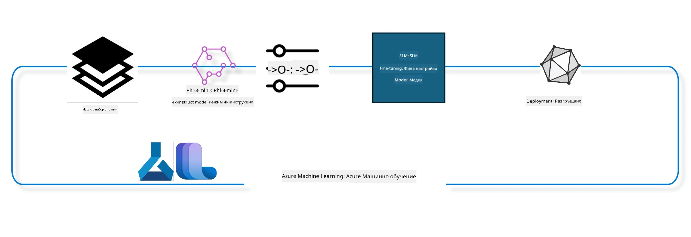

<!--
CO_OP_TRANSLATOR_METADATA:
{
  "original_hash": "944949f040e61b2ea25b3460f7394fd4",
  "translation_date": "2025-07-17T07:45:59+00:00",
  "source_file": "md/03.FineTuning/FineTuning_MLSDK.md",
  "language_code": "bg"
}
-->
## Как да използваме компоненти за чат-завършване от системния регистър на Azure ML за фино настройване на модел

В този пример ще извършим фино настройване на модела Phi-3-mini-4k-instruct, за да завърши разговор между двама души, използвайки набора от данни ultrachat_200k.



Примерът ще ви покаже как да извършите фино настройване с помощта на Azure ML SDK и Python, а след това как да разположите фино настроения модел на онлайн крайна точка за реално време на извеждане.

### Данни за обучение

Ще използваме набора от данни ultrachat_200k. Това е силно филтрирана версия на UltraChat набора от данни и е използвана за обучение на Zephyr-7B-β, модерен чат модел с 7 милиарда параметри.

### Модел

Ще използваме модела Phi-3-mini-4k-instruct, за да покажем как потребителят може да фино настрои модел за задача чат-завършване. Ако сте отворили този ноутбук от конкретна карта на модел, не забравяйте да замените името на модела.

### Задачи

- Изберете модел за фино настройване.
- Изберете и разгледайте данните за обучение.
- Конфигурирайте задачата за фино настройване.
- Стартирайте задачата за фино настройване.
- Прегледайте метриките за обучение и оценка.
- Регистрирайте фино настроения модел.
- Разположете фино настроения модел за извеждане в реално време.
- Почистете ресурсите.

## 1. Настройка на предварителни изисквания

- Инсталирайте зависимости
- Свържете се с AzureML Workspace. Научете повече за настройка на удостоверяване на SDK. Заменете <WORKSPACE_NAME>, <RESOURCE_GROUP> и <SUBSCRIPTION_ID> по-долу.
- Свържете се със системния регистър на azureml
- Задайте опционално име на експеримент
- Проверете или създайте изчислителен ресурс.

> [!NOTE]
> Изискванията са: един GPU възел може да има няколко GPU карти. Например, в един възел Standard_NC24rs_v3 има 4 NVIDIA V100 GPU-та, докато в Standard_NC12s_v3 има 2 NVIDIA V100 GPU-та. Вижте документацията за тази информация. Броят на GPU картите на възел се задава в параметъра gpus_per_node по-долу. Правилното задаване на тази стойност ще осигури използването на всички GPU-та във възела. Препоръчителните GPU изчислителни SKU-та могат да бъдат намерени тук и тук.

### Python библиотеки

Инсталирайте зависимостите, като стартирате клетката по-долу. Това не е опционална стъпка, ако работите в нова среда.

```bash
pip install azure-ai-ml
pip install azure-identity
pip install datasets==2.9.0
pip install mlflow
pip install azureml-mlflow
```

### Взаимодействие с Azure ML

1. Този Python скрипт се използва за взаимодействие със службата Azure Machine Learning (Azure ML). Ето какво прави:

    - Импортира необходимите модули от пакетите azure.ai.ml, azure.identity и azure.ai.ml.entities. Също така импортира модула time.

    - Опитва се да се удостоверява с DefaultAzureCredential(), който осигурява опростено удостоверяване за бързо започване на разработка на приложения, работещи в Azure облака. Ако това не успее, преминава към InteractiveBrowserCredential(), който предоставя интерактивен прозорец за вход.

    - След това се опитва да създаде инстанция на MLClient чрез метода from_config, който чете конфигурацията от стандартния конфигурационен файл (config.json). Ако това не успее, създава MLClient, като ръчно подава subscription_id, resource_group_name и workspace_name.

    - Създава още една инстанция на MLClient, този път за Azure ML регистъра с име "azureml". Този регистър съхранява модели, фино настройващи пайплайни и среди.

    - Задава името на експеримента на "chat_completion_Phi-3-mini-4k-instruct".

    - Генерира уникален времеви печат, като конвертира текущото време (в секунди от епохата, като число с плаваща запетая) в цяло число и след това в низ. Този времеви печат може да се използва за създаване на уникални имена и версии.

    ```python
    # Import necessary modules from Azure ML and Azure Identity
    from azure.ai.ml import MLClient
    from azure.identity import (
        DefaultAzureCredential,
        InteractiveBrowserCredential,
    )
    from azure.ai.ml.entities import AmlCompute
    import time  # Import time module
    
    # Try to authenticate using DefaultAzureCredential
    try:
        credential = DefaultAzureCredential()
        credential.get_token("https://management.azure.com/.default")
    except Exception as ex:  # If DefaultAzureCredential fails, use InteractiveBrowserCredential
        credential = InteractiveBrowserCredential()
    
    # Try to create an MLClient instance using the default config file
    try:
        workspace_ml_client = MLClient.from_config(credential=credential)
    except:  # If that fails, create an MLClient instance by manually providing the details
        workspace_ml_client = MLClient(
            credential,
            subscription_id="<SUBSCRIPTION_ID>",
            resource_group_name="<RESOURCE_GROUP>",
            workspace_name="<WORKSPACE_NAME>",
        )
    
    # Create another MLClient instance for the Azure ML registry named "azureml"
    # This registry is where models, fine-tuning pipelines, and environments are stored
    registry_ml_client = MLClient(credential, registry_name="azureml")
    
    # Set the experiment name
    experiment_name = "chat_completion_Phi-3-mini-4k-instruct"
    
    # Generate a unique timestamp that can be used for names and versions that need to be unique
    timestamp = str(int(time.time()))
    ```

## 2. Изберете основен модел за фино настройване

1. Phi-3-mini-4k-instruct е лек модел с 3.8 милиарда параметри, съвременен и отворен, базиран на набори от данни, използвани за Phi-2. Моделът принадлежи към семейството Phi-3, а Mini версията идва в два варианта – 4K и 128K, което е дължината на контекста (в токени), която може да поддържа. Трябва да фино настроим модела за нашата конкретна цел, за да го използваме. Можете да разгледате тези модели в Каталога на модели в AzureML Studio, филтрирайки по задача чат-завършване. В този пример използваме модела Phi-3-mini-4k-instruct. Ако сте отворили този ноутбук за друг модел, заменете името и версията на модела съответно.

    > [!NOTE]
    > свойството model id на модела. Това ще бъде подадено като вход към задачата за фино настройване. Също така е налично като поле Asset ID в страницата с детайли за модела в Каталога на модели в AzureML Studio.

2. Този Python скрипт взаимодейства със службата Azure Machine Learning (Azure ML). Ето какво прави:

    - Задава model_name на "Phi-3-mini-4k-instruct".

    - Използва метода get на свойството models на обекта registry_ml_client, за да извлече най-новата версия на модела с посоченото име от Azure ML регистъра. Методът get се извиква с два аргумента: името на модела и етикет, указващ, че трябва да се вземе най-новата версия.

    - Извежда съобщение в конзолата, което показва името, версията и id-то на модела, който ще се използва за фино настройване. Методът format на низа се използва, за да вмъкне името, версията и id-то на модела в съобщението. Името, версията и id-то на модела се достъпват като свойства на обекта foundation_model.

    ```python
    # Set the model name
    model_name = "Phi-3-mini-4k-instruct"
    
    # Get the latest version of the model from the Azure ML registry
    foundation_model = registry_ml_client.models.get(model_name, label="latest")
    
    # Print the model name, version, and id
    # This information is useful for tracking and debugging
    print(
        "\n\nUsing model name: {0}, version: {1}, id: {2} for fine tuning".format(
            foundation_model.name, foundation_model.version, foundation_model.id
        )
    )
    ```

## 3. Създайте изчислителен ресурс за използване с задачата

Задачата за фино настройване работи САМО с GPU изчисления. Размерът на изчислителния ресурс зависи от големината на модела и в повечето случаи е трудно да се определи правилният ресурс за задачата. В тази клетка насочваме потребителя как да избере подходящия изчислителен ресурс.

> [!NOTE]
> Изброените по-долу изчислителни ресурси работят с най-оптимизираната конфигурация. Всяка промяна в конфигурацията може да доведе до грешка Cuda Out Of Memory. В такива случаи опитайте да надстроите изчислителния ресурс до по-голям.

> [!NOTE]
> При избора на compute_cluster_size по-долу, уверете се, че изчислителният ресурс е наличен във вашата ресурсна група. Ако даден ресурс не е наличен, можете да подадете заявка за достъп до изчислителните ресурси.

### Проверка на модела за поддръжка на фино настройване

1. Този Python скрипт взаимодейства с модел в Azure Machine Learning (Azure ML). Ето какво прави:

    - Импортира модула ast, който предоставя функции за обработка на дървета на абстрактния синтаксис на Python.

    - Проверява дали обектът foundation_model (който представлява модел в Azure ML) има таг с име finetune_compute_allow_list. Таговете в Azure ML са ключ-стойност двойки, които можете да създавате и използвате за филтриране и сортиране на модели.

    - Ако тагът finetune_compute_allow_list присъства, използва функцията ast.literal_eval, за да парсне безопасно стойността на тага (низ) в Python списък. Този списък се присвоява на променливата computes_allow_list. След това извежда съобщение, че трябва да се създаде изчислителен ресурс от този списък.

    - Ако тагът finetune_compute_allow_list не е наличен, задава computes_allow_list на None и извежда съобщение, че този таг не е част от таговете на модела.

    - Обобщено, този скрипт проверява за конкретен таг в метаданните на модела, конвертира стойността му в списък, ако съществува, и дава обратна връзка на потребителя.

    ```python
    # Import the ast module, which provides functions to process trees of the Python abstract syntax grammar
    import ast
    
    # Check if the 'finetune_compute_allow_list' tag is present in the model's tags
    if "finetune_compute_allow_list" in foundation_model.tags:
        # If the tag is present, use ast.literal_eval to safely parse the tag's value (a string) into a Python list
        computes_allow_list = ast.literal_eval(
            foundation_model.tags["finetune_compute_allow_list"]
        )  # convert string to python list
        # Print a message indicating that a compute should be created from the list
        print(f"Please create a compute from the above list - {computes_allow_list}")
    else:
        # If the tag is not present, set computes_allow_list to None
        computes_allow_list = None
        # Print a message indicating that the 'finetune_compute_allow_list' tag is not part of the model's tags
        print("`finetune_compute_allow_list` is not part of model tags")
    ```

### Проверка на изчислителен инстанс

1. Този Python скрипт взаимодейства със службата Azure Machine Learning (Azure ML) и извършва няколко проверки на изчислителен инстанс. Ето какво прави:

    - Опитва се да извлече изчислителния инстанс с името, съхранено в compute_cluster, от Azure ML workspace. Ако състоянието на инстанса е "failed", вдига ValueError.

    - Проверява дали computes_allow_list не е None. Ако не е, преобразува всички размери на изчислителни ресурси в списъка в малки букви и проверява дали размерът на текущия изчислителен инстанс е в списъка. Ако не е, вдига ValueError.

    - Ако computes_allow_list е None, проверява дали размерът на изчислителния инстанс е в списък с неподдържани GPU VM размери. Ако е, вдига ValueError.

    - Извлича списък с всички налични размери на изчислителни ресурси в workspace-а. След това обхожда този списък и за всеки размер проверява дали името му съвпада с размера на текущия изчислителен инстанс. Ако съвпада, извлича броя на GPU-тата за този размер и задава gpu_count_found на True.

    - Ако gpu_count_found е True, извежда броя на GPU-тата в изчислителния инстанс. Ако е False, вдига ValueError.

    - Обобщено, този скрипт извършва няколко проверки на изчислителен инстанс в Azure ML workspace, включително състоянието му, размера спрямо списък с разрешени или забранени размери и броя на GPU-тата.

    ```python
    # Print the exception message
    print(e)
    # Raise a ValueError if the compute size is not available in the workspace
    raise ValueError(
        f"WARNING! Compute size {compute_cluster_size} not available in workspace"
    )
    
    # Retrieve the compute instance from the Azure ML workspace
    compute = workspace_ml_client.compute.get(compute_cluster)
    # Check if the provisioning state of the compute instance is "failed"
    if compute.provisioning_state.lower() == "failed":
        # Raise a ValueError if the provisioning state is "failed"
        raise ValueError(
            f"Provisioning failed, Compute '{compute_cluster}' is in failed state. "
            f"please try creating a different compute"
        )
    
    # Check if computes_allow_list is not None
    if computes_allow_list is not None:
        # Convert all compute sizes in computes_allow_list to lowercase
        computes_allow_list_lower_case = [x.lower() for x in computes_allow_list]
        # Check if the size of the compute instance is in computes_allow_list_lower_case
        if compute.size.lower() not in computes_allow_list_lower_case:
            # Raise a ValueError if the size of the compute instance is not in computes_allow_list_lower_case
            raise ValueError(
                f"VM size {compute.size} is not in the allow-listed computes for finetuning"
            )
    else:
        # Define a list of unsupported GPU VM sizes
        unsupported_gpu_vm_list = [
            "standard_nc6",
            "standard_nc12",
            "standard_nc24",
            "standard_nc24r",
        ]
        # Check if the size of the compute instance is in unsupported_gpu_vm_list
        if compute.size.lower() in unsupported_gpu_vm_list:
            # Raise a ValueError if the size of the compute instance is in unsupported_gpu_vm_list
            raise ValueError(
                f"VM size {compute.size} is currently not supported for finetuning"
            )
    
    # Initialize a flag to check if the number of GPUs in the compute instance has been found
    gpu_count_found = False
    # Retrieve a list of all available compute sizes in the workspace
    workspace_compute_sku_list = workspace_ml_client.compute.list_sizes()
    available_sku_sizes = []
    # Iterate over the list of available compute sizes
    for compute_sku in workspace_compute_sku_list:
        available_sku_sizes.append(compute_sku.name)
        # Check if the name of the compute size matches the size of the compute instance
        if compute_sku.name.lower() == compute.size.lower():
            # If it does, retrieve the number of GPUs for that compute size and set gpu_count_found to True
            gpus_per_node = compute_sku.gpus
            gpu_count_found = True
    # If gpu_count_found is True, print the number of GPUs in the compute instance
    if gpu_count_found:
        print(f"Number of GPU's in compute {compute.size}: {gpus_per_node}")
    else:
        # If gpu_count_found is False, raise a ValueError
        raise ValueError(
            f"Number of GPU's in compute {compute.size} not found. Available skus are: {available_sku_sizes}."
            f"This should not happen. Please check the selected compute cluster: {compute_cluster} and try again."
        )
    ```

## 4. Изберете набора от данни за фино настройване на модела

1. Използваме набора от данни ultrachat_200k. Наборът е разделен на четири части, подходящи за Supervised fine-tuning (sft).
Generation ranking (gen). Броят на примерите във всяка част е както следва:

    ```bash
    train_sft test_sft  train_gen  test_gen
    207865  23110  256032  28304
    ```

1. Следващите няколко клетки показват основна подготовка на данните за фино настройване:

### Визуализиране на няколко реда от данните

Искаме този пример да се изпълни бързо, затова запазваме файловете train_sft и test_sft, съдържащи 5% от вече изчистените редове. Това означава, че фино настроеният модел ще има по-ниска точност и затова не трябва да се използва в реални условия.
download-dataset.py се използва за изтегляне на набора от данни ultrachat_200k и трансформиране на набора в подходящ формат за компонентите на фино настройващия пайплайн. Тъй като наборът е голям, тук имаме само част от него.

1. Стартирането на скрипта по-долу изтегля само 5% от данните. Това може да се увеличи, като се промени параметърът dataset_split_pc на желан процент.

    > [!NOTE]
    > Някои езикови модели имат различни езикови кодове и затова имената на колоните в набора от данни трябва да отразяват това.

1. Ето пример как трябва да изглеждат данните
Наборът за чат-завършване е съхранен във формат parquet, като всяка запис използва следната схема:

    - Това е JSON (JavaScript Object Notation) документ, който е популярен формат за обмен на данни. Не е изпълним код, а начин за съхранение и пренос на данни. Ето структурата му:

    - "prompt": Този ключ съдържа низ, който представлява задача или въпрос, зададен на AI асистент.

    - "messages": Този ключ съдържа масив от обекти. Всеки обект представлява съобщение в разговор между потребител и AI асистент. Всеки обект съобщение има два ключа:

    - "content": Този ключ съдържа низ, който представлява съдържанието на съобщението.
    - "role": Този ключ съдържа низ, който показва ролята на изпращача на съобщението. Може да бъде "user" или "assistant".
    - "prompt_id": Този ключ съдържа низ, който представлява уникален идентификатор на подадената заявка.

1. В този конкретен JSON документ е представен разговор, в който потребителят иска от AI асистента да създаде главен герой за дистопична история. Асистентът отговаря, а потребителят иска повече подробности. Асистентът се съгласява да предостави повече детайли. Целият разговор е свързан с конкретен prompt_id.

    ```python
    {
        // The task or question posed to an AI assistant
        "prompt": "Create a fully-developed protagonist who is challenged to survive within a dystopian society under the rule of a tyrant. ...",
        
        // An array of objects, each representing a message in a conversation between a user and an AI assistant
        "messages":[
            {
                // The content of the user's message
                "content": "Create a fully-developed protagonist who is challenged to survive within a dystopian society under the rule of a tyrant. ...",
                // The role of the entity that sent the message
                "role": "user"
            },
            {
                // The content of the assistant's message
                "content": "Name: Ava\n\n Ava was just 16 years old when the world as she knew it came crashing down. The government had collapsed, leaving behind a chaotic and lawless society. ...",
                // The role of the entity that sent the message
                "role": "assistant"
            },
            {
                // The content of the user's message
                "content": "Wow, Ava's story is so intense and inspiring! Can you provide me with more details.  ...",
                // The role of the entity that sent the message
                "role": "user"
            }, 
            {
                // The content of the assistant's message
                "content": "Certainly! ....",
                // The role of the entity that sent the message
                "role": "assistant"
            }
        ],
        
        // A unique identifier for the prompt
        "prompt_id": "d938b65dfe31f05f80eb8572964c6673eddbd68eff3db6bd234d7f1e3b86c2af"
    }
    ```

### Изтегляне на данни

1. Този Python скрипт се използва за изтегляне на набор от данни чрез помощен скрипт на име download-dataset.py. Ето какво прави:

    - Импортира модула os, който предоставя преносим начин за използване на функционалности, зависещи от операционната система.

    - Използва функцията os.system, за да стартира скрипта download-dataset.py в шел с конкретни аргументи на командния ред. Аргументите указват кой набор от данни да се изтегли (HuggingFaceH4/ultrachat_200k), директорията за изтегляне (ultrachat_200k_dataset) и процента на разделяне на набора (5). Функцията os.system връща статус на изхода на командата, който се съхранява в променливата exit_status.

    - Проверява дали exit_status не е 0. В Unix-подобни системи статус 0 означава успешно изпълнение, а всяко друго число – грешка. Ако exit_status не е 0, вдига Exception с съобщение за грешка при изтегляне на набора.

    - Обобщено, този скрипт стартира команда за изтегляне на набор от данни чрез помощен скрипт и вдига изключение при неуспех.

    ```python
    # Import the os module, which provides a way of using operating system dependent functionality
    import os
    
    # Use the os.system function to run the download-dataset.py script in the shell with specific command-line arguments
    # The arguments specify the dataset to download (HuggingFaceH4/ultrachat_200k), the directory to download it to (ultrachat_200k_dataset), and the percentage of the dataset to split (5)
    # The os.system function returns the exit status of the command it executed; this status is stored in the exit_status variable
    exit_status = os.system(
        "python ./download-dataset.py --dataset HuggingFaceH4/ultrachat_200k --download_dir ultrachat_200k_dataset --dataset_split_pc 5"
    )
    
    # Check if exit_status is not 0
    # In Unix-like operating systems, an exit status of 0 usually indicates that a command has succeeded, while any other number indicates an error
    # If exit_status is not 0, raise an Exception with a message indicating that there was an error downloading the dataset
    if exit_status != 0:
        raise Exception("Error downloading dataset")
    ```

### Зареждане на данни в DataFrame

1. Този Python скрипт зарежда JSON Lines файл в pandas DataFrame и показва първите 5 реда. Ето какво прави:

    - Импортира библиотеката pandas, която е мощен инструмент за манипулация и анализ на данни.

    - Задава максималната ширина на колоните в pandas display опции на 0. Това означава, че пълният текст на всяка колона ще се показва без съкращаване при отпечатване на DataFrame.

    - Използва функцията pd.read_json, за да зареди файла train_sft.jsonl от директорията ultrachat_200k_dataset в DataFrame. Аргументът lines=True указва, че файлът е в JSON Lines формат, където всеки ред е отделен JSON обект.
- Използва метода head, за да покаже първите 5 реда от DataFrame. Ако DataFrame съдържа по-малко от 5 реда, ще покаже всички тях.

- В обобщение, този скрипт зарежда JSON Lines файл в DataFrame и показва първите 5 реда с пълен текст на колоните.

```python
    # Import the pandas library, which is a powerful data manipulation and analysis library
    import pandas as pd
    
    # Set the maximum column width for pandas' display options to 0
    # This means that the full text of each column will be displayed without truncation when the DataFrame is printed
    pd.set_option("display.max_colwidth", 0)
    
    # Use the pd.read_json function to load the train_sft.jsonl file from the ultrachat_200k_dataset directory into a DataFrame
    # The lines=True argument indicates that the file is in JSON Lines format, where each line is a separate JSON object
    df = pd.read_json("./ultrachat_200k_dataset/train_sft.jsonl", lines=True)
    
    # Use the head method to display the first 5 rows of the DataFrame
    # If the DataFrame has less than 5 rows, it will display all of them
    df.head()
    ```

## 5. Подайте задачата за фино настройване, използвайки модела и данните като входни параметри

Създайте задача, която използва компонента chat-completion pipeline. Научете повече за всички параметри, поддържани за фино настройване.

### Дефиниране на параметрите за фино настройване

1. Параметрите за фино настройване могат да се групират в 2 категории - параметри за обучение и параметри за оптимизация.

1. Параметрите за обучение определят аспектите на обучението, като например -

    - Оптимизатора, scheduler-а, който ще се използва
    - Метриката, която да се оптимизира при финото настройване
    - Брой стъпки за обучение, размер на партидата и други
    - Параметрите за оптимизация помагат за оптимизиране на GPU паметта и ефективното използване на изчислителните ресурси.

1. По-долу са някои от параметрите, които спадат към тази категория. Параметрите за оптимизация се различават за всеки модел и са пакетирани с модела, за да се справят с тези вариации.

    - Активиране на deepspeed и LoRA
    - Активиране на обучение с миксована прецизност
    - Активиране на обучение с множество възли

> [!NOTE]
> Надзорното фино настройване може да доведе до загуба на съгласуваност или катастрофална забрава. Препоръчваме да проверите за този проблем и да изпълните етап на съгласуване след финото настройване.

### Параметри за фино настройване

1. Този Python скрипт настройва параметрите за фино настройване на модел за машинно обучение. Ето какво прави:

    - Задава стандартни параметри за обучение като брой епохи, размери на партидите за обучение и оценка, скорост на учене и тип на scheduler-а за скорост на учене.

    - Задава стандартни параметри за оптимизация като дали да се приложи Layer-wise Relevance Propagation (LoRa) и DeepSpeed, както и етапа на DeepSpeed.

    - Комбинира параметрите за обучение и оптимизация в един речник, наречен finetune_parameters.

    - Проверява дали foundation_model има някакви специфични за модела стандартни параметри. Ако има, отпечатва предупреждение и обновява речника finetune_parameters с тези специфични параметри. Функцията ast.literal_eval се използва за преобразуване на тези параметри от низ в Python речник.

    - Отпечатва крайния набор от параметри за фино настройване, които ще се използват при изпълнението.

    - В обобщение, този скрипт настройва и показва параметрите за фино настройване на модел за машинно обучение, с възможност за презаписване на стандартните параметри със специфични за модела.

```python
    # Set up default training parameters such as the number of training epochs, batch sizes for training and evaluation, learning rate, and learning rate scheduler type
    training_parameters = dict(
        num_train_epochs=3,
        per_device_train_batch_size=1,
        per_device_eval_batch_size=1,
        learning_rate=5e-6,
        lr_scheduler_type="cosine",
    )
    
    # Set up default optimization parameters such as whether to apply Layer-wise Relevance Propagation (LoRa) and DeepSpeed, and the DeepSpeed stage
    optimization_parameters = dict(
        apply_lora="true",
        apply_deepspeed="true",
        deepspeed_stage=2,
    )
    
    # Combine the training and optimization parameters into a single dictionary called finetune_parameters
    finetune_parameters = {**training_parameters, **optimization_parameters}
    
    # Check if the foundation_model has any model-specific default parameters
    # If it does, print a warning message and update the finetune_parameters dictionary with these model-specific defaults
    # The ast.literal_eval function is used to convert the model-specific defaults from a string to a Python dictionary
    if "model_specific_defaults" in foundation_model.tags:
        print("Warning! Model specific defaults exist. The defaults could be overridden.")
        finetune_parameters.update(
            ast.literal_eval(  # convert string to python dict
                foundation_model.tags["model_specific_defaults"]
            )
        )
    
    # Print the final set of fine-tuning parameters that will be used for the run
    print(
        f"The following finetune parameters are going to be set for the run: {finetune_parameters}"
    )
    ```

### Обучителен Pipeline

1. Този Python скрипт дефинира функция за генериране на показвано име за обучителен pipeline за машинно обучение и след това извиква тази функция, за да генерира и отпечата името. Ето какво прави:

1. Дефинирана е функцията get_pipeline_display_name. Тази функция генерира показвано име на база различни параметри, свързани с обучителния pipeline.

1. Вътре във функцията се изчислява общият размер на партидата, като се умножават размерът на партидата на устройство, броят на стъпките за акумулиране на градиенти, броят на GPU-та на възел и броят на възлите, използвани за фино настройване.

1. Извличат се различни други параметри като тип на scheduler-а за скорост на учене, дали се използва DeepSpeed, етапът на DeepSpeed, дали се използва Layer-wise Relevance Propagation (LoRa), лимитът за броя на запазените контролни точки на модела и максималната дължина на последователността.

1. Създава се низ, който включва всички тези параметри, разделени с тирета. Ако DeepSpeed или LoRa са активирани, низът включва "ds" последвано от етапа на DeepSpeed, или "lora" съответно. Ако не са активирани, включва "nods" или "nolora".

1. Функцията връща този низ, който служи като показвано име на обучителния pipeline.

1. След дефинирането на функцията, тя се извиква, за да се генерира показваното име, което след това се отпечатва.

1. В обобщение, този скрипт генерира показвано име за обучителен pipeline за машинно обучение на база различни параметри и го отпечатва.

```python
    # Define a function to generate a display name for the training pipeline
    def get_pipeline_display_name():
        # Calculate the total batch size by multiplying the per-device batch size, the number of gradient accumulation steps, the number of GPUs per node, and the number of nodes used for fine-tuning
        batch_size = (
            int(finetune_parameters.get("per_device_train_batch_size", 1))
            * int(finetune_parameters.get("gradient_accumulation_steps", 1))
            * int(gpus_per_node)
            * int(finetune_parameters.get("num_nodes_finetune", 1))
        )
        # Retrieve the learning rate scheduler type
        scheduler = finetune_parameters.get("lr_scheduler_type", "linear")
        # Retrieve whether DeepSpeed is applied
        deepspeed = finetune_parameters.get("apply_deepspeed", "false")
        # Retrieve the DeepSpeed stage
        ds_stage = finetune_parameters.get("deepspeed_stage", "2")
        # If DeepSpeed is applied, include "ds" followed by the DeepSpeed stage in the display name; if not, include "nods"
        if deepspeed == "true":
            ds_string = f"ds{ds_stage}"
        else:
            ds_string = "nods"
        # Retrieve whether Layer-wise Relevance Propagation (LoRa) is applied
        lora = finetune_parameters.get("apply_lora", "false")
        # If LoRa is applied, include "lora" in the display name; if not, include "nolora"
        if lora == "true":
            lora_string = "lora"
        else:
            lora_string = "nolora"
        # Retrieve the limit on the number of model checkpoints to keep
        save_limit = finetune_parameters.get("save_total_limit", -1)
        # Retrieve the maximum sequence length
        seq_len = finetune_parameters.get("max_seq_length", -1)
        # Construct the display name by concatenating all these parameters, separated by hyphens
        return (
            model_name
            + "-"
            + "ultrachat"
            + "-"
            + f"bs{batch_size}"
            + "-"
            + f"{scheduler}"
            + "-"
            + ds_string
            + "-"
            + lora_string
            + f"-save_limit{save_limit}"
            + f"-seqlen{seq_len}"
        )
    
    # Call the function to generate the display name
    pipeline_display_name = get_pipeline_display_name()
    # Print the display name
    print(f"Display name used for the run: {pipeline_display_name}")
    ```

### Конфигуриране на Pipeline

Този Python скрипт дефинира и конфигурира pipeline за машинно обучение, използвайки Azure Machine Learning SDK. Ето какво прави:

1. Импортира необходимите модули от Azure AI ML SDK.

1. Извлича компонент на pipeline с име "chat_completion_pipeline" от регистъра.

1. Дефинира pipeline задача, използвайки декоратора `@pipeline` и функцията `create_pipeline`. Името на pipeline е зададено като `pipeline_display_name`.

1. Вътре във функцията `create_pipeline` инициализира извлечения компонент на pipeline с различни параметри, включително пътя към модела, изчислителните клъстери за различни етапи, разделенията на набора от данни за обучение и тестване, броя на GPU-тата за фино настройване и други параметри за фино настройване.

1. Свързва изхода на задачата за фино настройване с изхода на pipeline задачата. Това се прави, за да може фино настроеният модел лесно да бъде регистриран, което е необходимо за разгръщане на модела в онлайн или пакетен крайна точка.

1. Създава инстанция на pipeline, като извиква функцията `create_pipeline`.

1. Задава настройката `force_rerun` на pipeline на `True`, което означава, че кешираните резултати от предишни задачи няма да се използват.

1. Задава настройката `continue_on_step_failure` на pipeline на `False`, което означава, че pipeline ще спре, ако някоя стъпка се провали.

1. В обобщение, този скрипт дефинира и конфигурира pipeline за машинно обучение за задача за чат завършване, използвайки Azure Machine Learning SDK.

```python
    # Import necessary modules from the Azure AI ML SDK
    from azure.ai.ml.dsl import pipeline
    from azure.ai.ml import Input
    
    # Fetch the pipeline component named "chat_completion_pipeline" from the registry
    pipeline_component_func = registry_ml_client.components.get(
        name="chat_completion_pipeline", label="latest"
    )
    
    # Define the pipeline job using the @pipeline decorator and the function create_pipeline
    # The name of the pipeline is set to pipeline_display_name
    @pipeline(name=pipeline_display_name)
    def create_pipeline():
        # Initialize the fetched pipeline component with various parameters
        # These include the model path, compute clusters for different stages, dataset splits for training and testing, the number of GPUs to use for fine-tuning, and other fine-tuning parameters
        chat_completion_pipeline = pipeline_component_func(
            mlflow_model_path=foundation_model.id,
            compute_model_import=compute_cluster,
            compute_preprocess=compute_cluster,
            compute_finetune=compute_cluster,
            compute_model_evaluation=compute_cluster,
            # Map the dataset splits to parameters
            train_file_path=Input(
                type="uri_file", path="./ultrachat_200k_dataset/train_sft.jsonl"
            ),
            test_file_path=Input(
                type="uri_file", path="./ultrachat_200k_dataset/test_sft.jsonl"
            ),
            # Training settings
            number_of_gpu_to_use_finetuning=gpus_per_node,  # Set to the number of GPUs available in the compute
            **finetune_parameters
        )
        return {
            # Map the output of the fine tuning job to the output of pipeline job
            # This is done so that we can easily register the fine tuned model
            # Registering the model is required to deploy the model to an online or batch endpoint
            "trained_model": chat_completion_pipeline.outputs.mlflow_model_folder
        }
    
    # Create an instance of the pipeline by calling the create_pipeline function
    pipeline_object = create_pipeline()
    
    # Don't use cached results from previous jobs
    pipeline_object.settings.force_rerun = True
    
    # Set continue on step failure to False
    # This means that the pipeline will stop if any step fails
    pipeline_object.settings.continue_on_step_failure = False
    ```

### Подаване на задачата

1. Този Python скрипт подава задача за pipeline за машинно обучение към Azure Machine Learning workspace и след това изчаква задачата да завърши. Ето какво прави:

    - Извиква метода create_or_update на обекта jobs в workspace_ml_client, за да подаде pipeline задачата. Pipeline, който ще се изпълни, е зададен чрез pipeline_object, а експериментът, под който се изпълнява задачата, е зададен чрез experiment_name.

    - След това извиква метода stream на обекта jobs в workspace_ml_client, за да изчака pipeline задачата да завърши. Задачата, за която се изчаква, е зададена чрез атрибута name на pipeline_job обекта.

    - В обобщение, този скрипт подава задача за pipeline за машинно обучение към Azure Machine Learning workspace и след това изчаква задачата да завърши.

```python
    # Submit the pipeline job to the Azure Machine Learning workspace
    # The pipeline to be run is specified by pipeline_object
    # The experiment under which the job is run is specified by experiment_name
    pipeline_job = workspace_ml_client.jobs.create_or_update(
        pipeline_object, experiment_name=experiment_name
    )
    
    # Wait for the pipeline job to complete
    # The job to wait for is specified by the name attribute of the pipeline_job object
    workspace_ml_client.jobs.stream(pipeline_job.name)
    ```

## 6. Регистриране на фино настроения модел в workspace

Ще регистрираме модела от изхода на задачата за фино настройване. Това ще проследи връзката между фино настроения модел и задачата за фино настройване. Задачата за фино настройване, от своя страна, проследява връзката с основния модел, данните и кода за обучение.

### Регистриране на ML модела

1. Този Python скрипт регистрира модел за машинно обучение, който е бил обучен в pipeline на Azure Machine Learning. Ето какво прави:

    - Импортира необходимите модули от Azure AI ML SDK.

    - Проверява дали изходът trained_model е наличен от pipeline задачата, като извиква метода get на обекта jobs в workspace_ml_client и достъпва атрибута outputs.

    - Създава път към обучен модел, форматирайки низ с името на pipeline задачата и името на изхода ("trained_model").

    - Дефинира име за фино настроения модел, като добавя "-ultrachat-200k" към оригиналното име на модела и заменя всички наклонени черти с тирета.

    - Подготвя се за регистриране на модела, като създава обект Model с различни параметри, включително пътя към модела, типа на модела (MLflow модел), името и версията на модела, както и описание на модела.

    - Регистрира модела, като извиква метода create_or_update на обекта models в workspace_ml_client с обекта Model като аргумент.

    - Отпечатва регистрирания модел.

1. В обобщение, този скрипт регистрира модел за машинно обучение, който е бил обучен в pipeline на Azure Machine Learning.

```python
    # Import necessary modules from the Azure AI ML SDK
    from azure.ai.ml.entities import Model
    from azure.ai.ml.constants import AssetTypes
    
    # Check if the `trained_model` output is available from the pipeline job
    print("pipeline job outputs: ", workspace_ml_client.jobs.get(pipeline_job.name).outputs)
    
    # Construct a path to the trained model by formatting a string with the name of the pipeline job and the name of the output ("trained_model")
    model_path_from_job = "azureml://jobs/{0}/outputs/{1}".format(
        pipeline_job.name, "trained_model"
    )
    
    # Define a name for the fine-tuned model by appending "-ultrachat-200k" to the original model name and replacing any slashes with hyphens
    finetuned_model_name = model_name + "-ultrachat-200k"
    finetuned_model_name = finetuned_model_name.replace("/", "-")
    
    print("path to register model: ", model_path_from_job)
    
    # Prepare to register the model by creating a Model object with various parameters
    # These include the path to the model, the type of the model (MLflow model), the name and version of the model, and a description of the model
    prepare_to_register_model = Model(
        path=model_path_from_job,
        type=AssetTypes.MLFLOW_MODEL,
        name=finetuned_model_name,
        version=timestamp,  # Use timestamp as version to avoid version conflict
        description=model_name + " fine tuned model for ultrachat 200k chat-completion",
    )
    
    print("prepare to register model: \n", prepare_to_register_model)
    
    # Register the model by calling the create_or_update method of the models object in the workspace_ml_client with the Model object as the argument
    registered_model = workspace_ml_client.models.create_or_update(
        prepare_to_register_model
    )
    
    # Print the registered model
    print("registered model: \n", registered_model)
    ```

## 7. Разгръщане на фино настроения модел в онлайн крайна точка

Онлайн крайните точки предоставят устойчива REST API, която може да се използва за интеграция с приложения, които трябва да използват модела.

### Управление на крайна точка

1. Този Python скрипт създава управлявана онлайн крайна точка в Azure Machine Learning за регистриран модел. Ето какво прави:

    - Импортира необходимите модули от Azure AI ML SDK.

    - Дефинира уникално име за онлайн крайната точка, като добавя времеви печат към низа "ultrachat-completion-".

    - Подготвя се за създаване на онлайн крайната точка, като създава обект ManagedOnlineEndpoint с различни параметри, включително името на крайната точка, описание и режим на удостоверяване ("key").

    - Създава онлайн крайната точка, като извиква метода begin_create_or_update на workspace_ml_client с обекта ManagedOnlineEndpoint като аргумент. След това изчаква операцията по създаване да завърши чрез извикване на метода wait.

1. В обобщение, този скрипт създава управлявана онлайн крайна точка в Azure Machine Learning за регистриран модел.

```python
    # Import necessary modules from the Azure AI ML SDK
    from azure.ai.ml.entities import (
        ManagedOnlineEndpoint,
        ManagedOnlineDeployment,
        ProbeSettings,
        OnlineRequestSettings,
    )
    
    # Define a unique name for the online endpoint by appending a timestamp to the string "ultrachat-completion-"
    online_endpoint_name = "ultrachat-completion-" + timestamp
    
    # Prepare to create the online endpoint by creating a ManagedOnlineEndpoint object with various parameters
    # These include the name of the endpoint, a description of the endpoint, and the authentication mode ("key")
    endpoint = ManagedOnlineEndpoint(
        name=online_endpoint_name,
        description="Online endpoint for "
        + registered_model.name
        + ", fine tuned model for ultrachat-200k-chat-completion",
        auth_mode="key",
    )
    
    # Create the online endpoint by calling the begin_create_or_update method of the workspace_ml_client with the ManagedOnlineEndpoint object as the argument
    # Then wait for the creation operation to complete by calling the wait method
    workspace_ml_client.begin_create_or_update(endpoint).wait()
    ```

> [!NOTE]
> Тук можете да намерите списък с поддържаните SKU за разгръщане - [Managed online endpoints SKU list](https://learn.microsoft.com/azure/machine-learning/reference-managed-online-endpoints-vm-sku-list)

### Разгръщане на ML модел

1. Този Python скрипт разгръща регистриран модел за машинно обучение в управлявана онлайн крайна точка в Azure Machine Learning. Ето какво прави:

    - Импортира модула ast, който предоставя функции за обработка на дървета от абстрактния синтаксис на Python.

    - Задава типа на инстанцията за разгръщане на "Standard_NC6s_v3".

    - Проверява дали тагът inference_compute_allow_list присъства в foundation model. Ако е така, преобразува стойността на тага от низ в Python списък и го присвоява на inference_computes_allow_list. Ако не, задава inference_computes_allow_list на None.

    - Проверява дали зададеният тип инстанция е в списъка с разрешени. Ако не е, отпечатва съобщение, което приканва потребителя да избере тип инстанция от разрешения списък.

    - Подготвя се за създаване на разгръщането, като създава обект ManagedOnlineDeployment с различни параметри, включително името на разгръщането, името на крайната точка, ID на модела, типа и броя на инстанциите, настройките за проверка на живост и настройките за заявки.

    - Създава разгръщането, като извиква метода begin_create_or_update на workspace_ml_client с обекта ManagedOnlineDeployment като аргумент. След това изчаква операцията по създаване да завърши чрез извикване на метода wait.

    - Задава трафика на крайната точка да насочва 100% от трафика към разгръщането "demo".

    - Актуализира крайната точка, като извиква метода begin_create_or_update на workspace_ml_client с обекта endpoint като аргумент. След това изчаква операцията по актуализация да завърши чрез извикване на метода result.

1. В обобщение, този скрипт разгръща регистриран модел за машинно обучение в управлявана онлайн крайна точка в Azure Machine Learning.

```python
    # Import the ast module, which provides functions to process trees of the Python abstract syntax grammar
    import ast
    
    # Set the instance type for the deployment
    instance_type = "Standard_NC6s_v3"
    
    # Check if the `inference_compute_allow_list` tag is present in the foundation model
    if "inference_compute_allow_list" in foundation_model.tags:
        # If it is, convert the tag value from a string to a Python list and assign it to `inference_computes_allow_list`
        inference_computes_allow_list = ast.literal_eval(
            foundation_model.tags["inference_compute_allow_list"]
        )
        print(f"Please create a compute from the above list - {computes_allow_list}")
    else:
        # If it's not, set `inference_computes_allow_list` to `None`
        inference_computes_allow_list = None
        print("`inference_compute_allow_list` is not part of model tags")
    
    # Check if the specified instance type is in the allow list
    if (
        inference_computes_allow_list is not None
        and instance_type not in inference_computes_allow_list
    ):
        print(
            f"`instance_type` is not in the allow listed compute. Please select a value from {inference_computes_allow_list}"
        )
    
    # Prepare to create the deployment by creating a `ManagedOnlineDeployment` object with various parameters
    demo_deployment = ManagedOnlineDeployment(
        name="demo",
        endpoint_name=online_endpoint_name,
        model=registered_model.id,
        instance_type=instance_type,
        instance_count=1,
        liveness_probe=ProbeSettings(initial_delay=600),
        request_settings=OnlineRequestSettings(request_timeout_ms=90000),
    )
    
    # Create the deployment by calling the `begin_create_or_update` method of the `workspace_ml_client` with the `ManagedOnlineDeployment` object as the argument
    # Then wait for the creation operation to complete by calling the `wait` method
    workspace_ml_client.online_deployments.begin_create_or_update(demo_deployment).wait()
    
    # Set the traffic of the endpoint to direct 100% of the traffic to the "demo" deployment
    endpoint.traffic = {"demo": 100}
    
    # Update the endpoint by calling the `begin_create_or_update` method of the `workspace_ml_client` with the `endpoint` object as the argument
    # Then wait for the update operation to complete by calling the `result` method
    workspace_ml_client.begin_create_or_update(endpoint).result()
    ```

## 8. Тествайте крайната точка с примерни данни

Ще вземем някои примерни данни от тестовия набор и ще ги подадем към онлайн крайната точка за извеждане. След това ще покажем оценените етикети заедно с истинските етикети.

### Четене на резултатите

1. Този Python скрипт чете JSON Lines файл в pandas DataFrame, взема случаен пример и нулира индекса. Ето какво прави:

    - Чете файла ./ultrachat_200k_dataset/test_gen.jsonl в pandas DataFrame. Функцията read_json се използва с аргумента lines=True, защото файлът е във формат JSON Lines, където всеки ред е отделен JSON обект.

    - Взема случаен пример от 1 ред от DataFrame. Функцията sample се използва с аргумента n=1, за да се определи броят на случайно избраните редове.

    - Нулира индекса на DataFrame. Функцията reset_index се използва с аргумента drop=True, за да се премахне оригиналният индекс и да се замени с нов индекс с цели числа по подразбиране.

    - Показва първите 2 реда на DataFrame, използвайки функцията head с аргумент 2. Въпреки това, тъй като DataFrame съдържа само един ред след вземането на пробата, ще се покаже само този един ред.

1. В обобщение, този скрипт чете JSON Lines файл в pandas DataFrame, взема случаен пример от 1 ред, нулира индекса и показва първия ред.

```python
    # Import pandas library
    import pandas as pd
    
    # Read the JSON Lines file './ultrachat_200k_dataset/test_gen.jsonl' into a pandas DataFrame
    # The 'lines=True' argument indicates that the file is in JSON Lines format, where each line is a separate JSON object
    test_df = pd.read_json("./ultrachat_200k_dataset/test_gen.jsonl", lines=True)
    
    # Take a random sample of 1 row from the DataFrame
    # The 'n=1' argument specifies the number of random rows to select
    test_df = test_df.sample(n=1)
    
    # Reset the index of the DataFrame
    # The 'drop=True' argument indicates that the original index should be dropped and replaced with a new index of default integer values
    # The 'inplace=True' argument indicates that the DataFrame should be modified in place (without creating a new object)
    test_df.reset_index(drop=True, inplace=True)
    
    # Display the first 2 rows of the DataFrame
    # However, since the DataFrame only contains one row after the sampling, this will only display that one row
    test_df.head(2)
    ```

### Създаване на JSON обект

1. Този Python скрипт създава JSON обект с конкретни параметри и го записва във файл. Ето какво прави:

    - Импортира модула json, който предоставя функции за работа с JSON данни.

    - Създава речник parameters с ключове и стойности, които представляват параметри за модел за машинно обучение. Ключовете са "temperature", "top_p", "do_sample" и "max_new_tokens", а съответните им стойности са 0.6, 0.9, True и 200.

    - Създава друг речник test_json с два ключа: "input_data" и "params". Стойността на "input_data" е друг речник с ключове "input_string" и "parameters". Стойността на "input_string" е списък, съдържащ първото съобщение от test_df DataFrame. Стойността на "parameters" е речникът parameters, създаден по-рано. Стойността на "params" е празен речник.
- Отваря файл с име sample_score.json

```python
    # Import the json module, which provides functions to work with JSON data
    import json
    
    # Create a dictionary `parameters` with keys and values that represent parameters for a machine learning model
    # The keys are "temperature", "top_p", "do_sample", and "max_new_tokens", and their corresponding values are 0.6, 0.9, True, and 200 respectively
    parameters = {
        "temperature": 0.6,
        "top_p": 0.9,
        "do_sample": True,
        "max_new_tokens": 200,
    }
    
    # Create another dictionary `test_json` with two keys: "input_data" and "params"
    # The value of "input_data" is another dictionary with keys "input_string" and "parameters"
    # The value of "input_string" is a list containing the first message from the `test_df` DataFrame
    # The value of "parameters" is the `parameters` dictionary created earlier
    # The value of "params" is an empty dictionary
    test_json = {
        "input_data": {
            "input_string": [test_df["messages"][0]],
            "parameters": parameters,
        },
        "params": {},
    }
    
    # Open a file named `sample_score.json` in the `./ultrachat_200k_dataset` directory in write mode
    with open("./ultrachat_200k_dataset/sample_score.json", "w") as f:
        # Write the `test_json` dictionary to the file in JSON format using the `json.dump` function
        json.dump(test_json, f)
    ```

### Извикване на Endpoint

1. Този Python скрипт извиква онлайн endpoint в Azure Machine Learning, за да оцени JSON файл. Ето какво прави:

    - Извиква метода invoke на свойството online_endpoints на обекта workspace_ml_client. Този метод се използва за изпращане на заявка към онлайн endpoint и получаване на отговор.

    - Посочва името на endpoint-а и разгръщането чрез аргументите endpoint_name и deployment_name. В този случай името на endpoint-а е съхранено в променливата online_endpoint_name, а името на разгръщането е "demo".

    - Посочва пътя до JSON файла, който ще бъде оценен, чрез аргумента request_file. В този случай файлът е ./ultrachat_200k_dataset/sample_score.json.

    - Записва отговора от endpoint-а в променливата response.

    - Извежда суровия отговор.

1. Обобщено, този скрипт извиква онлайн endpoint в Azure Machine Learning, за да оцени JSON файл и отпечатва получения отговор.

```python
    # Invoke the online endpoint in Azure Machine Learning to score the `sample_score.json` file
    # The `invoke` method of the `online_endpoints` property of the `workspace_ml_client` object is used to send a request to an online endpoint and get a response
    # The `endpoint_name` argument specifies the name of the endpoint, which is stored in the `online_endpoint_name` variable
    # The `deployment_name` argument specifies the name of the deployment, which is "demo"
    # The `request_file` argument specifies the path to the JSON file to be scored, which is `./ultrachat_200k_dataset/sample_score.json`
    response = workspace_ml_client.online_endpoints.invoke(
        endpoint_name=online_endpoint_name,
        deployment_name="demo",
        request_file="./ultrachat_200k_dataset/sample_score.json",
    )
    
    # Print the raw response from the endpoint
    print("raw response: \n", response, "\n")
    ```

## 9. Изтриване на онлайн endpoint

1. Не забравяйте да изтриете онлайн endpoint-а, в противен случай ще продължите да плащате за използваните ресурси. Този ред Python код изтрива онлайн endpoint в Azure Machine Learning. Ето какво прави:

    - Извиква метода begin_delete на свойството online_endpoints на обекта workspace_ml_client. Този метод стартира изтриването на онлайн endpoint.

    - Посочва името на endpoint-а, който ще бъде изтрит, чрез аргумента name. В този случай името на endpoint-а е съхранено в променливата online_endpoint_name.

    - Извиква метода wait, за да изчака завършването на операцията по изтриване. Това е блокираща операция, което означава, че скриптът няма да продължи, докато изтриването не приключи.

    - Обобщено, този ред код стартира изтриването на онлайн endpoint в Azure Machine Learning и изчаква операцията да завърши.

```python
    # Delete the online endpoint in Azure Machine Learning
    # The `begin_delete` method of the `online_endpoints` property of the `workspace_ml_client` object is used to start the deletion of an online endpoint
    # The `name` argument specifies the name of the endpoint to be deleted, which is stored in the `online_endpoint_name` variable
    # The `wait` method is called to wait for the deletion operation to complete. This is a blocking operation, meaning that it will prevent the script from continuing until the deletion is finished
    workspace_ml_client.online_endpoints.begin_delete(name=online_endpoint_name).wait()
    ```

**Отказ от отговорност**:  
Този документ е преведен с помощта на AI преводаческа услуга [Co-op Translator](https://github.com/Azure/co-op-translator). Въпреки че се стремим към точност, моля, имайте предвид, че автоматизираните преводи могат да съдържат грешки или неточности. Оригиналният документ на неговия първичен език трябва да се счита за авторитетен източник. За критична информация се препоръчва професионален човешки превод. Ние не носим отговорност за каквито и да е недоразумения или неправилни тълкувания, произтичащи от използването на този превод.