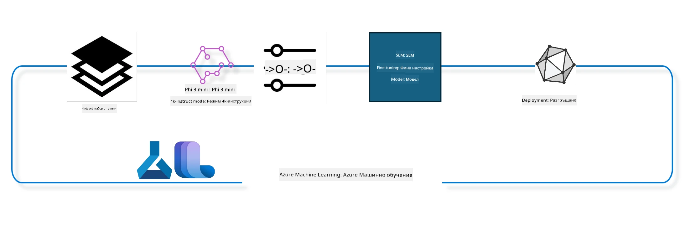

## Как да използваме компоненти за завършване на чат от регистъра на системата Azure ML за донастройка на модел

В този пример ще извършим донастройка на модела Phi-3-mini-4k-instruct за завършване на разговор между 2 души, използвайки набора от данни ultrachat_200k.



Примерът ще ви покаже как да извършите донастройка с помощта на Azure ML SDK и Python и след това да внедрите донастроения модел в онлайн крайна точка за извличане на резултати в реално време.

### Данни за обучение

Ще използваме набора от данни ultrachat_200k. Това е силно филтрирана версия на UltraChat набора от данни и е използвана за обучение на Zephyr-7B-β, модерен чат модел с размер 7b.

### Модел

Ще използваме модела Phi-3-mini-4k-instruct, за да покажем как потребителят може да донастрои модел за задача за завършване на чат. Ако сте отворили този ноутбук от конкретна карта на модел, не забравяйте да замените конкретното име на модела.

### Задачи

- Изберете модел за донастройка.
- Изберете и разгледайте данните за обучение.
- Конфигурирайте задачата за донастройка.
- Стартирайте задачата за донастройка.
- Прегледайте метрики за обучение и оценка.
- Регистрирайте донастроения модел.
- Внедрете донастроения модел за извличане на резултати в реално време.
- Почистете ресурсите.

## 1. Настройка на предварителни изисквания

- Инсталирайте зависимости
- Свържете се с AzureML Workspace. Научете повече в настройка на удостоверяване с SDK. Заменете <WORKSPACE_NAME>, <RESOURCE_GROUP> и <SUBSCRIPTION_ID> по-долу.
- Свържете се с регистъра на системата azureml
- Задайте опционално име на експеримент
- Проверете или създайте изчислителен ресурс.

> [!NOTE]
> Изискванията за единичен GPU възел могат да имат няколко GPU карти. Например, в един възел на Standard_NC24rs_v3 има 4 NVIDIA V100 GPU-та, докато в Standard_NC12s_v3 има 2 NVIDIA V100 GPU-та. Вижте документацията за тази информация. Броят GPU карти на възел се задава с параметъра gpus_per_node по-долу. Правилното задаване на тази стойност ще осигури използване на всички GPU-та в възела. Препоръчителните SKUs за GPU изчисления могат да бъдат намерени тук и тук.

### Python библиотеки

Инсталирайте зависимости чрез стартиране на клетката по-долу. Това не е опционална стъпка, ако работите в нова среда.

```bash
pip install azure-ai-ml
pip install azure-identity
pip install datasets==2.9.0
pip install mlflow
pip install azureml-mlflow
```

### Взаимодействие с Azure ML

1. Този Python скрипт се използва за взаимодействие с услугата Azure Machine Learning (Azure ML). Ето какво прави:

    - Импортира необходими модули от azure.ai.ml, azure.identity и azure.ai.ml.entities пакетите. Също така импортира модула time.

    - Опитва се да се удостоверява с DefaultAzureCredential(), който предоставя опростено удостоверяване за бърз старт на разработка на приложения, работещи в Azure облака. Ако това не успее, използва InteractiveBrowserCredential(), който предоставя интерактивен вход.

    - След това се опитва да създаде екземпляр на MLClient чрез метода from_config, който чете конфигурация от стандартния конфигурационен файл (config.json). Ако това не успее, създава MLClient като ръчно подава subscription_id, resource_group_name и workspace_name.

    - Създава друг MLClient екземпляр, този път за Azure ML регистър със името "azureml". Този регистър съдържа модели, pipeline-и за донастройка и среди.

    - Задава името на експеримента на "chat_completion_Phi-3-mini-4k-instruct".

    - Генерира уникален времеви маркер като конвертира текущото време (в секунди от епохата, като дробно число) в цяло число и след това в низ. Този времеви маркер може да се използва за създаване на уникални имена и версии.

    ```python
    # Импортирайте необходимите модули от Azure ML и Azure Identity
    from azure.ai.ml import MLClient
    from azure.identity import (
        DefaultAzureCredential,
        InteractiveBrowserCredential,
    )
    from azure.ai.ml.entities import AmlCompute
    import time  # Импортирайте модула time
    
    # Опитайте да се удостоверите, използвайки DefaultAzureCredential
    try:
        credential = DefaultAzureCredential()
        credential.get_token("https://management.azure.com/.default")
    except Exception as ex:  # Ако DefaultAzureCredential не успее, използвайте InteractiveBrowserCredential
        credential = InteractiveBrowserCredential()
    
    # Опитайте да създадете екземпляр MLClient, използвайки стандартния конфигурационен файл
    try:
        workspace_ml_client = MLClient.from_config(credential=credential)
    except:  # Ако това не успее, създайте екземпляр MLClient, като ръчно предоставите детайлите
        workspace_ml_client = MLClient(
            credential,
            subscription_id="<SUBSCRIPTION_ID>",
            resource_group_name="<RESOURCE_GROUP>",
            workspace_name="<WORKSPACE_NAME>",
        )
    
    # Създайте друг екземпляр MLClient за регистъра на Azure ML с име "azureml"
    # Този регистър е мястото, където се съхраняват модели, фина настройка на пайплайни и среди
    registry_ml_client = MLClient(credential, registry_name="azureml")
    
    # Задайте името на експеримента
    experiment_name = "chat_completion_Phi-3-mini-4k-instruct"
    
    # Генерирайте уникален времеви печат, който може да се използва за имена и версии, които трябва да са уникални
    timestamp = str(int(time.time()))
    ```

## 2. Изберете основен модел за донастройка

1. Phi-3-mini-4k-instruct е модел с 3.8 милиарда параметри, лек, модерен отворен модел, базиран на наборите от данни, използвани за Phi-2. Моделът принадлежи към фамилията Phi-3 модели, а мини версията идва в два варианта 4K и 128K, което е дължината на контекста (в токени), който може да поддържа. Нужно е да донастроим модела за нашата конкретна цел, за да го използваме. Можете да разглеждате тези модели в Каталога на Моделите в AzureML Studio, филтрирайки ги по задачата за завършване на чат. В този пример използваме модела Phi-3-mini-4k-instruct. Ако сте отворили този ноутбук за друг модел, заменете името и версията на модела съответно.

> [!NOTE]
> свойството model id на модела. То ще бъде подадено като вход към задачата за донастройка. Това също е налично като поле Asset ID в страницата с подробности за модела в AzureML Studio Model Catalog.

2. Този Python скрипт взаимодейства с услугата Azure Machine Learning (Azure ML). Ето какво прави:

    - Задава model_name на "Phi-3-mini-4k-instruct".

    - Използва метода get от свойството models на обекта registry_ml_client, за да извлече последната версия на модела с указаното име от Azure ML регистъра. Методът get се извиква с два аргумента: името на модела и етикет, указващ, че трябва да се получи последната версия на модела.

    - Извежда съобщение в конзолата, което указва името, версията и id на модела, който ще бъде използван за донастройка. Методът format на низа се използва за вмъкване на името, версията и id в съобщението. Името, версията и id се достъпват като свойства на обекта foundation_model.

    ```python
    # Задайте името на модела
    model_name = "Phi-3-mini-4k-instruct"
    
    # Вземете най-новата версия на модела от регистъра на Azure ML
    foundation_model = registry_ml_client.models.get(model_name, label="latest")
    
    # Отпечатайте името, версията и идентификатора на модела
    # Тази информация е полезна за проследяване и отстраняване на грешки
    print(
        "\n\nUsing model name: {0}, version: {1}, id: {2} for fine tuning".format(
            foundation_model.name, foundation_model.version, foundation_model.id
        )
    )
    ```

## 3. Създайте изчислителен ресурс за използване с задачата

Задачата за донастройка работи САМО с GPU изчисления. Размерът на изчислението зависи от големината на модела и в повечето случаи става трудно да се определи правилния изчислителен ресурс за задачата. В тази клетка насочваме потребителя как да избере подходящото изчисление.

> [!NOTE]
> Изчислителните ресурси, изброени по-долу, работят с най-оптималната конфигурация. Всякакви промени в конфигурацията могат да доведат до грешка Cuda Out Of Memory. В такива случаи опитайте да надградите изчислението до по-голям размер.

> [!NOTE]
> При избор на compute_cluster_size по-долу, уверете се, че изчислението е налично във вашата ресурсна група. Ако определено изчисление не е налично, можете да поискате достъп до него.

### Проверка дали моделът поддържа донастройка

1. Този Python скрипт взаимодейства с модел от Azure Machine Learning (Azure ML). Ето какво прави:

    - Импортира модула ast, който предоставя функции за обработка на дървета на Python абстрактна синтактична граматика.

    - Проверява дали обектът foundation_model (който представлява модел в Azure ML) има таг с име finetune_compute_allow_list. Таговете в Azure ML са ключ-стойност двойки, които можете да създавате и използвате за филтриране и сортиране на модели.

    - Ако тагът finetune_compute_allow_list присъства, използва функцията ast.literal_eval, за да анализира безопасно стойността на тага (низ) в Python списък. Този списък се присвоява на променливата computes_allow_list. След това извежда съобщение, че е необходимо да се създаде изчисление от този списък.

    - Ако тагът finetune_compute_allow_list липсва, задава computes_allow_list на None и извежда съобщение, че този таг не е част от таговете на модела.

    - В обобщение, скриптът проверява за конкретен таг в метаданните на модела, конвертира стойността на тага в списък, ако съществува, и предоставя обратна връзка на потребителя.

    ```python
    # Импортирайте модула ast, който предоставя функции за обработка на дървета от абстрактната синтактична граматика на Python
    import ast
    
    # Проверете дали тагът 'finetune_compute_allow_list' е присъстващ в таговете на модела
    if "finetune_compute_allow_list" in foundation_model.tags:
        # Ако тагът е присъстващ, използвайте ast.literal_eval за безопасно парсване на стойността на тага (низ) в Python списък
        computes_allow_list = ast.literal_eval(
            foundation_model.tags["finetune_compute_allow_list"]
        )  # преобразува низ в python списък
        # Отпечатайте съобщение, което указва, че изчисление трябва да бъде създадено от списъка
        print(f"Please create a compute from the above list - {computes_allow_list}")
    else:
        # Ако тагът не е присъстващ, задайте computes_allow_list на None
        computes_allow_list = None
        # Отпечатайте съобщение, което указва, че тагът 'finetune_compute_allow_list' не е част от таговете на модела
        print("`finetune_compute_allow_list` is not part of model tags")
    ```

### Проверка на изчислителен инстанс

1. Този Python скрипт взаимодейства с услугата Azure Machine Learning (Azure ML) и извършва няколко проверки върху изчислителен инстанс. Ето какво прави:

    - Опитва се да извлече изчислителния инстанс с името, съхранено в compute_cluster, от работната област на Azure ML. Ако състоянието на предоставяне на изчислителния инстанс е "failed", вдига ValueError.

    - Проверява дали computes_allow_list не е None. Ако не е, преобразува всички размери на изчисленията в списъка на малки букви и проверява дали размерът на текущия изчислителен инстанс е в списъка. Ако не, вдига ValueError.

    - Ако computes_allow_list е None, проверява дали размерът на изчислителния инстанс е в списък с неподдържани GPU VM размери. Ако е, вдига ValueError.

    - Извлича списък с всички налични размери на изчисления в работната област. След това обхожда този списък и за всеки размер проверява дали името му съвпада с размера на текущия изчислителен инстанс. Ако да, извлича броя на GPU за този размер и задава gpu_count_found на True.

    - Ако gpu_count_found е True, извежда в конзолата броя на GPU в изчислителния инстанс. Ако е False, вдига ValueError.

    - Обобщено, скриптът извършва няколко проверки върху изчислителен инстанс в Azure ML работна област, включително състоянието му, размера спрямо списък за разрешаване или отказ, и броя на GPU.

    ```python
    # Отпечатайте съобщението за изключение
    print(e)
    # Вдигнете ValueError, ако размерът на изчислението не е наличен в работното пространство
    raise ValueError(
        f"WARNING! Compute size {compute_cluster_size} not available in workspace"
    )
    
    # Вземете екземпляра за изчисление от работното пространство на Azure ML
    compute = workspace_ml_client.compute.get(compute_cluster)
    # Проверете дали състоянието на предоставяне на екземпляра за изчисление е "failed"
    if compute.provisioning_state.lower() == "failed":
        # Вдигнете ValueError, ако състоянието на предоставяне е "failed"
        raise ValueError(
            f"Provisioning failed, Compute '{compute_cluster}' is in failed state. "
            f"please try creating a different compute"
        )
    
    # Проверете дали computes_allow_list не е None
    if computes_allow_list is not None:
        # Преобразувайте всички размери на изчисления в computes_allow_list в малки букви
        computes_allow_list_lower_case = [x.lower() for x in computes_allow_list]
        # Проверете дали размерът на екземпляра за изчисление е в computes_allow_list_lower_case
        if compute.size.lower() not in computes_allow_list_lower_case:
            # Вдигнете ValueError, ако размерът на екземпляра за изчисление не е в computes_allow_list_lower_case
            raise ValueError(
                f"VM size {compute.size} is not in the allow-listed computes for finetuning"
            )
    else:
        # Дефинирайте списък с неподдържани GPU VM размери
        unsupported_gpu_vm_list = [
            "standard_nc6",
            "standard_nc12",
            "standard_nc24",
            "standard_nc24r",
        ]
        # Проверете дали размерът на екземпляра за изчисление е в unsupported_gpu_vm_list
        if compute.size.lower() in unsupported_gpu_vm_list:
            # Вдигнете ValueError, ако размерът на екземпляра за изчисление е в unsupported_gpu_vm_list
            raise ValueError(
                f"VM size {compute.size} is currently not supported for finetuning"
            )
    
    # Инициализирайте флаг за проверка дали броят на GPU на екземпляра за изчисление е бил намерен
    gpu_count_found = False
    # Вземете списък с всички налични размери за изчисление в работното пространство
    workspace_compute_sku_list = workspace_ml_client.compute.list_sizes()
    available_sku_sizes = []
    # Итерайте през списъка с налични размери за изчисление
    for compute_sku in workspace_compute_sku_list:
        available_sku_sizes.append(compute_sku.name)
        # Проверете дали името на размера за изчисление съвпада с размера на екземпляра за изчисление
        if compute_sku.name.lower() == compute.size.lower():
            # Ако съвпада, вземете броя на GPU за този размер и задайте gpu_count_found на True
            gpus_per_node = compute_sku.gpus
            gpu_count_found = True
    # Ако gpu_count_found е True, отпечатайте броя на GPU на екземпляра за изчисление
    if gpu_count_found:
        print(f"Number of GPU's in compute {compute.size}: {gpus_per_node}")
    else:
        # Ако gpu_count_found е False, вдигнете ValueError
        raise ValueError(
            f"Number of GPU's in compute {compute.size} not found. Available skus are: {available_sku_sizes}."
            f"This should not happen. Please check the selected compute cluster: {compute_cluster} and try again."
        )
    ```

## 4. Изберете набор от данни за донастройка на модела

1. Използваме набора от данни ultrachat_200k. Наборът има четири разделения, подходящи за ръководено донастройване (sft).
Ранжиране на генерация (gen). Броят на примерите за всяко разделение е както следва:

    ```bash
    train_sft test_sft  train_gen  test_gen
    207865  23110  256032  28304
    ```

1. Следващите няколко клетки показват основната подготовка на данните за донастройване:

### Визуализирайте няколко реда с данни

Искаме този пример да се изпълни бързо, затова запазваме train_sft, test_sft файлове, съдържащи 5% от вече подбрани редове. Това означава, че донастроеният модел ще има по-ниска точност, следователно не трябва да се използва в реален сценарий.
download-dataset.py се използва за сваляне на набора ultrachat_200k и трансформиране на набора в подходящ формат за компонент на pipeline за донастройка. Тъй като наборът е голям, тук имаме само част от него.

1. Стартирането на скрипта по-долу сваля само 5% от данните. Може да увеличите това, като промените параметъра dataset_split_pc на желаното процентажно число.

> [!NOTE]
> Някои езикови модели имат различни езикови кодове и затова имената на колоните в набора от данни трябва да го отразяват.

1. Ето пример как трябва да изглеждат данните
Наборът за завършване на чат се съхранява във формат parquet с всяка записана единица, използвайки следната схема:

    - Това е JSON (JavaScript Object Notation) документ, който е популярен формат за обмен на данни. Не е изпълним код, а средство за съхранение и пренасяне на данни. Ето разбор на структурата му:

    - "prompt": Този ключ съдържа низ, който представлява задача или въпрос, зададен на AI асистент.

    - "messages": Този ключ съдържа масив от обекти. Всеки обект представлява съобщение в разговор между потребител и AI асистент. Всеки обект съобщение има два ключа:

    - "content": Този ключ съдържа низ, който представлява съдържанието на съобщението.
    - "role": Този ключ съдържа низ, който указва ролята на изпращащия съобщението – "user" или "assistant".
    - "prompt_id": Този ключ съдържа низ, който е уникален идентификатор на подсказката.

1. В този конкретен JSON документ е представен разговор, където потребител иска от AI асистента да създаде протагонист за дистопична история. Асистентът отговаря, а потребителят пита за повече подробности. Асистентът се съгласява да предостави повече детайли. Целият разговор е свързан с конкретен prompt id.

    ```python
    {
        // The task or question posed to an AI assistant
        "prompt": "Create a fully-developed protagonist who is challenged to survive within a dystopian society under the rule of a tyrant. ...",
        
        // An array of objects, each representing a message in a conversation between a user and an AI assistant
        "messages":[
            {
                // The content of the user's message
                "content": "Create a fully-developed protagonist who is challenged to survive within a dystopian society under the rule of a tyrant. ...",
                // The role of the entity that sent the message
                "role": "user"
            },
            {
                // The content of the assistant's message
                "content": "Name: Ava\n\n Ava was just 16 years old when the world as she knew it came crashing down. The government had collapsed, leaving behind a chaotic and lawless society. ...",
                // The role of the entity that sent the message
                "role": "assistant"
            },
            {
                // The content of the user's message
                "content": "Wow, Ava's story is so intense and inspiring! Can you provide me with more details.  ...",
                // The role of the entity that sent the message
                "role": "user"
            }, 
            {
                // The content of the assistant's message
                "content": "Certainly! ....",
                // The role of the entity that sent the message
                "role": "assistant"
            }
        ],
        
        // A unique identifier for the prompt
        "prompt_id": "d938b65dfe31f05f80eb8572964c6673eddbd68eff3db6bd234d7f1e3b86c2af"
    }
    ```

### Сваляне на данни

1. Този Python скрипт се използва за сваляне на набор от данни с помощта на помощен скрипт на име download-dataset.py. Ето какво прави:

    - Импортира модула os, който предоставя преносим начин за използване на функционалности, зависими от операционната система.

    - Използва функцията os.system, за да стартира скрипта download-dataset.py в шел с конкретни командни аргументи. Аргументите указват набора за сваляне (HuggingFaceH4/ultrachat_200k), директорията за сваляне (ultrachat_200k_dataset) и процента на разделяне на набора (5). Функцията os.system връща статус на изхода на командата; този статус се съхранява в променливата exit_status.

    - Проверява дали exit_status не е 0. В Unix-подобни операционни системи статус 0 обикновено показва успешна команда, а всяко друго число грешка. Ако exit_status не е 0, вдига Exception с съобщение за грешка при свалянето на набора.

    - В обобщение, този скрипт стартира команда за сваляне на набор от данни чрез помощен скрипт и вдига изключение при неуспех.

    ```python
    # Импортирайте модула os, който предоставя начин за използване на функционалности, зависещи от операционната система
    import os
    
    # Използвайте функцията os.system, за да стартирате скрипта download-dataset.py в shell със специфични аргументи на командния ред
    # Аргументите указват набора от данни за изтегляне (HuggingFaceH4/ultrachat_200k), директорията за изтегляне (ultrachat_200k_dataset) и процента от набора от данни за разделяне (5)
    # Функцията os.system връща статус на изхода на изпълнената команда; този статус се съхранява в променливата exit_status
    exit_status = os.system(
        "python ./download-dataset.py --dataset HuggingFaceH4/ultrachat_200k --download_dir ultrachat_200k_dataset --dataset_split_pc 5"
    )
    
    # Проверете дали exit_status не е 0
    # В операционни системи, подобни на Unix, статус на изхода 0 обикновено означава, че командата е била успешна, докато всяко друго число индикира грешка
    # Ако exit_status не е 0, вдигнете изключение с съобщение, указващо, че е възникнала грешка при изтеглянето на набора от данни
    if exit_status != 0:
        raise Exception("Error downloading dataset")
    ```

### Зареждане на данни в DataFrame
1. Този Python скрипт зарежда JSON Lines файл в pandas DataFrame и показва първите 5 реда. Ето разбивка на това, което прави:

    - Импортира библиотеката pandas, която е мощна библиотека за манипулация и анализ на данни.

    - Задава максималната ширина на колоните за опциите на pandas за показване на 0. Това означава, че пълният текст на всяка колона ще се показва без съкращаване, когато DataFrame се отпечата.

    - Използва функцията pd.read_json, за да зареди файла train_sft.jsonl от директорията ultrachat_200k_dataset в DataFrame. Аргументът lines=True показва, че файлът е във формат JSON Lines, където всеки ред е отделен JSON обект.

    - Използва метода head, за да покаже първите 5 реда от DataFrame. Ако DataFrame има по-малко от 5 реда, ще покаже всички тях.

    - В обобщение, този скрипт зарежда JSON Lines файл в DataFrame и показва първите 5 реда с пълен текст на колоните.
    
    ```python
    # Импортиране на библиотеката pandas, която е мощна библиотека за манипулация и анализ на данни
    import pandas as pd
    
    # Задаване на максималната ширина на колоната за опциите за показване на pandas на 0
    # Това означава, че пълният текст на всяка колона ще се показва без съкращение при отпечатване на DataFrame
    pd.set_option("display.max_colwidth", 0)
    
    # Използване на функцията pd.read_json за зареждане на файла train_sft.jsonl от директорията ultrachat_200k_dataset в DataFrame
    # Аргументът lines=True указва, че файлът е в JSON Lines формат, където всеки ред е отделен JSON обект
    df = pd.read_json("./ultrachat_200k_dataset/train_sft.jsonl", lines=True)
    
    # Използване на метода head за показване на първите 5 реда от DataFrame
    # Ако DataFrame има по-малко от 5 реда, ще се покажат всички тях
    df.head()
    ```

## 5. Изпратете задачата за фина настройка, като използвате модела и данните като входни данни

Създайте задачата, която използва компонент на pipeline за чат-завършване. Научете повече за всички параметри, поддържани за фина настройка.

### Дефиниране на параметрите за фина настройка

1. Параметрите за фина настройка могат да се групират в 2 категории - параметри за обучение, параметри за оптимизация

1. Параметрите за обучение определят аспектите на обучението като -

    - Оптимизатора, графика за обучение, който да се използва
    - Метриката, която да се оптимизира при фина настройка
    - Броя на тренировъчните стъпки и размера на пакетите и др.
    - Параметрите за оптимизация помагат за оптимизирането на GPU паметта и ефективното използване на изчислителните ресурси. 

1. По-долу са някои от параметрите, които принадлежат към тази категория. Параметрите за оптимизация се различават за всеки модел и са пакетирани с модела, за да се справят с тези вариации.

    - Активиране на deepspeed и LoRA
    - Активиране на обучение с разредена точност (mixed precision)
    - Активиране на обучение с множество възли

> [!NOTE]
> Надзираваната фина настройка може да доведе до загуба на съгласуваност или катастрофална загуба на знание. Препоръчваме да проверите този проблем и да изпълните етап на съгласуваност след фина настройка.

### Параметри за фина настройка

1. Този Python скрипт задава параметри за фина настройка на модел за машинно обучение. Ето разбивка на това, което прави:

    - Задава стандартни параметри за обучение като брой епохи, размери на пакетите за обучение и оценка, скорост на обучение и тип график за скоростта на обучение.

    - Задава стандартни параметри за оптимизация като дали да се приложи LoRa и DeepSpeed и етапа на DeepSpeed.

    - Комбинира параметрите за обучение и оптимизация в един речник, наречен finetune_parameters.

    - Проверява дали foundation_model има модели-специфични стандартни параметри. Ако има, отпечатва предупредително съобщение и актуализира речника finetune_parameters с тези модели-специфични стойности. Функцията ast.literal_eval се използва за конвертиране на модели-специфичните стойности от низ в речник на Python.

    - Отпечатва окончателния набор от параметри за фина настройка, които ще се използват при изпълнението.

    - В обобщение, този скрипт задава и показва параметрите за фина настройка на модел за машинно обучение, с възможност да се презапишат стандартните параметри с модели-специфични.

    ```python
    # Настройте стандартните параметри за обучение като брой епохи на обучение, размери на пакетите за обучение и оценка, скорост на обучение и тип на планировчика на скоростта на обучение
    training_parameters = dict(
        num_train_epochs=3,
        per_device_train_batch_size=1,
        per_device_eval_batch_size=1,
        learning_rate=5e-6,
        lr_scheduler_type="cosine",
    )
    
    # Настройте стандартните параметри за оптимизация като дали да се приложи слойно разпределяне на релевантност (LoRa) и DeepSpeed, както и етапа на DeepSpeed
    optimization_parameters = dict(
        apply_lora="true",
        apply_deepspeed="true",
        deepspeed_stage=2,
    )
    
    # Обединете параметрите за обучение и оптимизация в единен речник, наречен finetune_parameters
    finetune_parameters = {**training_parameters, **optimization_parameters}
    
    # Проверете дали foundation_model има някакви специфични за модела стандартни параметри
    # Ако има, отпечатайте предупреждение и актуализирайте речника finetune_parameters с тези специфични за модела стойности по подразбиране
    # Функцията ast.literal_eval се използва за преобразуване на специфичните за модела стойности по подразбиране от низ в Python речник
    if "model_specific_defaults" in foundation_model.tags:
        print("Warning! Model specific defaults exist. The defaults could be overridden.")
        finetune_parameters.update(
            ast.literal_eval(  # превръщане на низ в python речник
                foundation_model.tags["model_specific_defaults"]
            )
        )
    
    # Отпечатайте окончателния набор от параметри за финно настройване, които ще се използват за стартирането
    print(
        f"The following finetune parameters are going to be set for the run: {finetune_parameters}"
    )
    ```

### Pipeline за обучение

1. Този Python скрипт дефинира функция за генериране на име за показване на pipeline за обучение на машина модел, след което извиква тази функция, за да генерира и отпечата името за показване. Ето разбивка на това, което прави:

1. Функцията get_pipeline_display_name е дефинирана. Тази функция генерира име за показване на база различни параметри, свързани с pipeline за обучение.

1. Вътре във функцията се изчислява общия размер на пакета, като се умножава размерът на пакета на устройство, броят стъпки за акумулиране на градиенти, броят GPU на възел и броят възли използвани за фина настройка.

1. Взима се и други параметри като тип график за скорост на обучение, дали е приложен DeepSpeed, етапа на DeepSpeed, дали е приложен LoRa, лимит на броя запазени контролни точки на модела и максимална дължина на последователност.

1. Конструира се низ, който включва всички тези параметри, разделени с тирета. Ако DeepSpeed или LoRa са приложени, низът включва "ds" последвано от етапа на DeepSpeed, или "lora", съответно. Ако не, включва "nods" или "nolora", съответно.

1. Функцията връща този низ, който служи като име за показване на pipeline за обучение.

1. След дефинирането на функцията, тя се извиква за генериране на името за показване, което след това се отпечатва.

1. В обобщение, този скрипт генерира име за показване за pipeline за обучение на машина модел на база различни параметри и след това отпечатва това име.

    ```python
    # Определете функция за генериране на име за показване на тренировъчния pipeline
    def get_pipeline_display_name():
        # Изчислете общия размер на пакета, като умножите размера на пакета на устройство, броя на стъпките за акумулиране на градиенти, броя на GPU-та на възел и броя на възлите, използвани за фина настройка
        batch_size = (
            int(finetune_parameters.get("per_device_train_batch_size", 1))
            * int(finetune_parameters.get("gradient_accumulation_steps", 1))
            * int(gpus_per_node)
            * int(finetune_parameters.get("num_nodes_finetune", 1))
        )
        # Вземете типа на планировчика на скоростта на учене
        scheduler = finetune_parameters.get("lr_scheduler_type", "linear")
        # Проверете дали се използва DeepSpeed
        deepspeed = finetune_parameters.get("apply_deepspeed", "false")
        # Вземете етапа на DeepSpeed
        ds_stage = finetune_parameters.get("deepspeed_stage", "2")
        # Ако се използва DeepSpeed, включете "ds", последвано от етапа на DeepSpeed в името за показване; ако не, включете "nods"
        if deepspeed == "true":
            ds_string = f"ds{ds_stage}"
        else:
            ds_string = "nods"
        # Проверете дали се използва Layer-wise Relevance Propagation (LoRa)
        lora = finetune_parameters.get("apply_lora", "false")
        # Ако се използва LoRa, включете "lora" в името за показване; ако не, включете "nolora"
        if lora == "true":
            lora_string = "lora"
        else:
            lora_string = "nolora"
        # Вземете ограничението за броя на запазените контролни точки на модела
        save_limit = finetune_parameters.get("save_total_limit", -1)
        # Вземете максималната дължина на последователността
        seq_len = finetune_parameters.get("max_seq_length", -1)
        # Конструирайте името за показване, като свържете всички тези параметри, разделени с тирета
        return (
            model_name
            + "-"
            + "ultrachat"
            + "-"
            + f"bs{batch_size}"
            + "-"
            + f"{scheduler}"
            + "-"
            + ds_string
            + "-"
            + lora_string
            + f"-save_limit{save_limit}"
            + f"-seqlen{seq_len}"
        )
    
    # Извикайте функцията за генериране на името за показване
    pipeline_display_name = get_pipeline_display_name()
    # Отпечатайте името за показване
    print(f"Display name used for the run: {pipeline_display_name}")
    ```

### Конфигуриране на Pipeline

Този Python скрипт дефинира и конфигурира pipeline за машинно обучение чрез Azure Machine Learning SDK. Ето разбивка на това, което прави:

1. Импортира необходимите модули от Azure AI ML SDK.

1. Извлича pipeline компонент с името "chat_completion_pipeline" от регистъра.

1. Дефинира pipeline задача с декоратор `@pipeline` и функцията `create_pipeline`. Името на pipeline се задава като `pipeline_display_name`.

1. Във функцията `create_pipeline` инициализира извлечения pipeline компонент с различни параметри, включително пътя към модела, изчислителните клъстери за различни етапи, разделения на датасета за обучение и тестване, броя GPU за фина настройка и други параметри за фина настройка.

1. Свързва изхода на задачата за фина настройка с изхода на pipeline задачата. Това се прави, за да може фино настроеният модел да се регистрира лесно, което е необходимо за разгръщане на модела в онлайн или пакетен краен пункт.

1. Създава екземпляр на pipeline, като извиква функцията `create_pipeline`.

1. Задава настройката `force_rerun` на pipeline на `True`, което означава, че кешираните резултати от предишни задачи няма да се използват.

1. Задава настройката `continue_on_step_failure` на pipeline на `False`, което означава, че pipeline ще спре, ако някоя стъпка се провали.

1. В обобщение, този скрипт дефинира и конфигурира pipeline за машинно обучение за задача за чат-завършване с помощта на Azure Machine Learning SDK.

    ```python
    # Импортиране на необходимите модули от Azure AI ML SDK
    from azure.ai.ml.dsl import pipeline
    from azure.ai.ml import Input
    
    # Извличане на компонент на pipeline с име "chat_completion_pipeline" от регистъра
    pipeline_component_func = registry_ml_client.components.get(
        name="chat_completion_pipeline", label="latest"
    )
    
    # Дефинирайте pipeline job, използвайки декоратора @pipeline и функцията create_pipeline
    # Името на pipeline-a е зададено на pipeline_display_name
    @pipeline(name=pipeline_display_name)
    def create_pipeline():
        # Инициализирайте извлечения компонент на pipeline с различни параметри
        # Те включват пътя до модела, изчислителните клъстери за различни етапи, разделяне на набори от данни за обучение и тестване, броя GPU-та за фино настройване и други параметри за финото настройване
        chat_completion_pipeline = pipeline_component_func(
            mlflow_model_path=foundation_model.id,
            compute_model_import=compute_cluster,
            compute_preprocess=compute_cluster,
            compute_finetune=compute_cluster,
            compute_model_evaluation=compute_cluster,
            # Свържете разделите на набора от данни с параметрите
            train_file_path=Input(
                type="uri_file", path="./ultrachat_200k_dataset/train_sft.jsonl"
            ),
            test_file_path=Input(
                type="uri_file", path="./ultrachat_200k_dataset/test_sft.jsonl"
            ),
            # Настройки за обучение
            number_of_gpu_to_use_finetuning=gpus_per_node,  # Задава се на броя на наличните GPU-та в изчислителната среда
            **finetune_parameters
        )
        return {
            # Свържете изхода от фино настройващата задача с изхода на pipeline задачата
            # Това се прави, за да можем лесно да регистрираме финно настроения модел
            # Регистрирането на модела е необходимо за разполагане на модела на онлайн или партиден ендпойнт
            "trained_model": chat_completion_pipeline.outputs.mlflow_model_folder
        }
    
    # Създайте инстанция на pipeline, като извикате функцията create_pipeline
    pipeline_object = create_pipeline()
    
    # Не използвайте кеширани резултати от предишни задачи
    pipeline_object.settings.force_rerun = True
    
    # Задайте continue on step failure на False
    # Това означава, че pipeline ще спре, ако някой етап се провали
    pipeline_object.settings.continue_on_step_failure = False
    ```

### Изпращане на задачата

1. Този Python скрипт изпраща задача за pipeline за машинно обучение до работно пространство в Azure Machine Learning и след това изчаква задачата да завърши. Ето разбивка на това, което прави:

    - Извиква метода create_or_update на обекта jobs в workspace_ml_client, за да изпрати pipeline задачата. Pipeline, който ще се изпълни е указан чрез pipeline_object, а експериментът, под който се изпълнява задачата, е указан чрез experiment_name.

    - След това извиква метода stream на обекта jobs в workspace_ml_client, за да изчака pipeline задачата да завърши. Задачата, за която се изчаква, е посочена чрез атрибута name на pipeline_job обекта.

    - В обобщение, този скрипт изпраща задача за pipeline за машинно обучение в Azure Machine Learning workspace и изчаква задачата да завърши.

    ```python
    # Изпратете конвейерната задача към работното пространство на Azure Machine Learning
    # Конвейерът, който ще се изпълни, се задава от pipeline_object
    # Експериментът, под който се изпълнява задачата, се задава от experiment_name
    pipeline_job = workspace_ml_client.jobs.create_or_update(
        pipeline_object, experiment_name=experiment_name
    )
    
    # Изчакайте задачата на конвейера да завърши
    # Задачата, която да се изчака, се задава от атрибута name на обекта pipeline_job
    workspace_ml_client.jobs.stream(pipeline_job.name)
    ```

## 6. Регистрирайте фино настроения модел в работното пространство

Ще регистрираме модела от изхода на задачата за фина настройка. Това ще проследи генеалогията между фино настроения модел и задачата за фина настройка. Задачата за фина настройка, от своя страна, проследява генеалогия до основния модел, данните и кода за обучение.

### Регистрация на ML модела

1. Този Python скрипт регистрира модел за машинно обучение, който е бил обучен в pipeline на Azure Machine Learning. Ето разбивка на това, което прави:

    - Импортира необходимите модули от Azure AI ML SDK.

    - Проверява дали изходът trained_model е наличен от pipeline задачата, като извиква метода get на обекта jobs в workspace_ml_client и достъпва атрибута outputs.

    - Конструира път към обучния модел чрез форматиране на низ с името на pipeline задачата и името на изхода ("trained_model").

    - Дефинира име за фино настроения модел, като добавя "-ultrachat-200k" към оригиналното име на модела и замества всички наклонени черти с тирета.

    - Подготвя се за регистрация на модела, като създава обект Model с различни параметри, включително пътя към модела, типа на модела (MLflow модел), името и версията на модела и описание на модела.

    - Регистрира модела, като извиква метода create_or_update на обекта models в workspace_ml_client с обекта Model като аргумент.

    - Отпечатва регистрирания модел.

1. В обобщение, този скрипт регистрира модел за машинно обучение, който е бил обучен в pipeline на Azure Machine Learning.
    
    ```python
    # Импортиране на необходими модули от Azure AI ML SDK
    from azure.ai.ml.entities import Model
    from azure.ai.ml.constants import AssetTypes
    
    # Проверка дали изходът `trained_model` е наличен от pipeline job
    print("pipeline job outputs: ", workspace_ml_client.jobs.get(pipeline_job.name).outputs)
    
    # Създаване на път към тренирания модел чрез форматиране на низ с името на pipeline job и името на изхода ("trained_model")
    model_path_from_job = "azureml://jobs/{0}/outputs/{1}".format(
        pipeline_job.name, "trained_model"
    )
    
    # Дефиниране на име за фино настроения модел чрез добавяне на "-ultrachat-200k" към оригиналното име на модела и замяна на наклонените черти с тирета
    finetuned_model_name = model_name + "-ultrachat-200k"
    finetuned_model_name = finetuned_model_name.replace("/", "-")
    
    print("path to register model: ", model_path_from_job)
    
    # Подготовка за регистрация на модела чрез създаване на обект Model с различни параметри
    # Те включват пътя към модела, типа на модела (MLflow модел), името и версията на модела и описание на модела
    prepare_to_register_model = Model(
        path=model_path_from_job,
        type=AssetTypes.MLFLOW_MODEL,
        name=finetuned_model_name,
        version=timestamp,  # Използване на времева маркировка като версия, за да се избегне конфликт на версии
        description=model_name + " fine tuned model for ultrachat 200k chat-completion",
    )
    
    print("prepare to register model: \n", prepare_to_register_model)
    
    # Регистриране на модела чрез извикване на метода create_or_update на обекта models в workspace_ml_client с обекта Model като аргумент
    registered_model = workspace_ml_client.models.create_or_update(
        prepare_to_register_model
    )
    
    # Отпечатване на регистрирания модел
    print("registered model: \n", registered_model)
    ```

## 7. Разгърнете фино настроения модел в онлайн краен пункт

Онлайн крайните точки предоставят устойчив REST API, който може да се използва за интеграция с приложения, които се нуждаят от модела.

### Управление на крайна точка

1. Този Python скрипт създава управлявана онлайн крайна точка в Azure Machine Learning за регистриран модел. Ето разбивка на това, което прави:

    - Импортира необходимите модули от Azure AI ML SDK.

    - Дефинира уникално име за онлайн крайната точка, като добавя времеви отпечатък към стринга "ultrachat-completion-".

    - Подготвя се да създаде онлайн крайната точка, като създава обект ManagedOnlineEndpoint с различни параметри, включително името на крайната точка, описание и режим на автентикация ("key").

    - Създава онлайн крайната точка, като извиква метода begin_create_or_update на workspace_ml_client с обекта ManagedOnlineEndpoint като аргумент. След това изчаква операции за създаване да приключат чрез метода wait.

1. В обобщение, този скрипт създава управлявана онлайн крайна точка в Azure Machine Learning за регистриран модел.

    ```python
    # Импортирайте необходимите модули от Azure AI ML SDK
    from azure.ai.ml.entities import (
        ManagedOnlineEndpoint,
        ManagedOnlineDeployment,
        ProbeSettings,
        OnlineRequestSettings,
    )
    
    # Дефинирайте уникално име за онлайн крайна точка, като добавите времева марка към низа "ultrachat-completion-"
    online_endpoint_name = "ultrachat-completion-" + timestamp
    
    # Подгответе се за създаване на онлайн крайна точка, като създадете обект ManagedOnlineEndpoint с различни параметри
    # Тези включват името на крайната точка, описание на крайната точка и режим на удостоверяване ("key")
    endpoint = ManagedOnlineEndpoint(
        name=online_endpoint_name,
        description="Online endpoint for "
        + registered_model.name
        + ", fine tuned model for ultrachat-200k-chat-completion",
        auth_mode="key",
    )
    
    # Създайте онлайн крайната точка, като извикате метода begin_create_or_update на workspace_ml_client с обекта ManagedOnlineEndpoint като аргумент
    # След това изчакайте създаването да завърши, като извикате метода wait
    workspace_ml_client.begin_create_or_update(endpoint).wait()
    ```

> [!NOTE]
> Тук можете да намерите списък със SKU-тата, поддържани за разгръщане - [Managed online endpoints SKU list](https://learn.microsoft.com/azure/machine-learning/reference-managed-online-endpoints-vm-sku-list)

### Разгръщане на ML модел

1. Този Python скрипт разгръща регистриран модел за машинно обучение в управлявана онлайн крайна точка в Azure Machine Learning. Ето разбивка на това, което прави:

    - Импортира модула ast, който предоставя функции за обработка на дървета на абстрактния синтактичен речник на Python.

    - Задава типа на инстанцията за разгръщане на "Standard_NC6s_v3".

    - Проверява дали в foundation model присъства тагът inference_compute_allow_list. Ако е така, конвертира стойността на тага от низ в списък на Python и я присвоява на inference_computes_allow_list. Ако не присъства, задава inference_computes_allow_list на None.

    - Проверява дали посоченият тип инстанция е в списъка за допускане. Ако не е, отпечатва съобщение, което моли потребителя да избере вид инстанция от списъка за допускане.

    - Подготвя се да създаде разгръщането, като създава обект ManagedOnlineDeployment с различни параметри, включително името на разгръщането, името на крайната точка, ID на модела, тип и брой инстанции, настройките за живост и настройките за заявки.

    - Създава разгръщането, като извиква метода begin_create_or_update на workspace_ml_client с обекта ManagedOnlineDeployment като аргумент. След това изчаква операцията да приключи чрез метода wait.

    - Задава трафика на крайната точка да насочва 100% от трафика към разгръщане "demo".

    - Актуализира крайната точка, като извиква метода begin_create_or_update на workspace_ml_client с обекта endpoint като аргумент. След това изчаква операцията да приключи чрез метода result.

1. В обобщение, този скрипт разгръща регистриран модел за машинно обучение в управлявана онлайн крайна точка в Azure Machine Learning.

    ```python
    # Импортирайте модула ast, който предоставя функции за обработка на дървета от абстрактната синтактична граматика на Python
    import ast
    
    # Задайте типа на инстанцията за разгръщането
    instance_type = "Standard_NC6s_v3"
    
    # Проверете дали тагът `inference_compute_allow_list` присъства във фондационния модел
    if "inference_compute_allow_list" in foundation_model.tags:
        # Ако присъства, преобразувайте стойността на тага от низ в Python списък и го присвоете на `inference_computes_allow_list`
        inference_computes_allow_list = ast.literal_eval(
            foundation_model.tags["inference_compute_allow_list"]
        )
        print(f"Please create a compute from the above list - {computes_allow_list}")
    else:
        # Ако не присъства, задайте `inference_computes_allow_list` на `None`
        inference_computes_allow_list = None
        print("`inference_compute_allow_list` is not part of model tags")
    
    # Проверете дали зададеният тип инстанция е в списъка с разрешени
    if (
        inference_computes_allow_list is not None
        and instance_type not in inference_computes_allow_list
    ):
        print(
            f"`instance_type` is not in the allow listed compute. Please select a value from {inference_computes_allow_list}"
        )
    
    # Подгответе се за създаване на разгръщането, като създадете обект `ManagedOnlineDeployment` с различни параметри
    demo_deployment = ManagedOnlineDeployment(
        name="demo",
        endpoint_name=online_endpoint_name,
        model=registered_model.id,
        instance_type=instance_type,
        instance_count=1,
        liveness_probe=ProbeSettings(initial_delay=600),
        request_settings=OnlineRequestSettings(request_timeout_ms=90000),
    )
    
    # Създайте разгръщането, като извикате метода `begin_create_or_update` на `workspace_ml_client` с обекта `ManagedOnlineDeployment` като аргумент
    # След това изчакайте операцията по създаване да завърши, като извикате метода `wait`
    workspace_ml_client.online_deployments.begin_create_or_update(demo_deployment).wait()
    
    # Настройте трафика на крайната точка да насочва 100% от трафика към разгръщането "demo"
    endpoint.traffic = {"demo": 100}
    
    # Актуализирайте крайната точка, като извикате метода `begin_create_or_update` на `workspace_ml_client` с обекта `endpoint` като аргумент
    # След това изчакайте операцията по актуализиране да завърши, като извикате метода `result`
    workspace_ml_client.begin_create_or_update(endpoint).result()
    ```

## 8. Тествайте крайната точка със примерни данни

Ще вземем някои примерни данни от тестовия набор и ще ги изпратим към онлайн края за извличане на изводи. След това ще покажем оценените етикети заедно с истинските етикети.

### Четене на резултатите

1. Този Python скрипт чете JSON Lines файл в pandas DataFrame, взема случаен пример и нулира индекса. Ето разбивка на това, което прави:

    - Чете файла ./ultrachat_200k_dataset/test_gen.jsonl в pandas DataFrame. Функцията read_json се използва с аргумента lines=True, тъй като файлът е във формат JSON Lines, където всеки ред е отделен JSON обект.

    - Взема случаен пример от 1 ред от DataFrame. Функцията sample се използва с аргумента n=1, за да се определи броя на случаен избрани редове.

    - Нулира индекса на DataFrame. Функцията reset_index се използва с аргумента drop=True, за да премахне оригиналния индекс и да замени с нов индекс с цели числа по подразбиране.

    - Показва първите 2 реда на DataFrame чрез функцията head с аргумента 2. Въпреки това, тъй като DataFrame съдържа само един ред след взимане на пробата, това ще покаже само този ред.

1. В обобщение, този скрипт чете JSON Lines файл в pandas DataFrame, взема случаен пример от 1 ред, нулира индекса и показва първия ред.
    
    ```python
    # Импортиране на библиотеката pandas
    import pandas as pd
    
    # Четене на JSON Lines файла './ultrachat_200k_dataset/test_gen.jsonl' в pandas DataFrame
    # Аргументът 'lines=True' указва, че файлът е във формат JSON Lines, където всеки ред е отделен JSON обект
    test_df = pd.read_json("./ultrachat_200k_dataset/test_gen.jsonl", lines=True)
    
    # Вземане на случаен пример от 1 ред от DataFrame-а
    # Аргументът 'n=1' определя броя на случайните редове за избиране
    test_df = test_df.sample(n=1)
    
    # Нулиране на индекса на DataFrame-а
    # Аргументът 'drop=True' указва, че оригиналният индекс трябва да бъде премахнат и заменен с нов индекс от стандартни цели числа
    # Аргументът 'inplace=True' указва, че DataFrame трябва да бъде модифициран на място (без създаване на нов обект)
    test_df.reset_index(drop=True, inplace=True)
    
    # Показване на първите 2 реда от DataFrame-а
    # Въпреки това, тъй като DataFrame съдържа само един ред след извадката, ще бъде показан само този един ред
    test_df.head(2)
    ```

### Създаване на JSON обект
1. Този Python скрипт създава JSON обект със специфични параметри и го запазва във файл. Ето какво прави той стъпка по стъпка:

    - Импортира модула json, който предоставя функции за работа с JSON данни.

    - Създава речник parameters с ключове и стойности, които представляват параметри за модел за машинно обучение. Ключовете са "temperature", "top_p", "do_sample" и "max_new_tokens", а съответните им стойности са 0.6, 0.9, True и 200.

    - Създава друг речник test_json с два ключа: "input_data" и "params". Стойността на "input_data" е друг речник с ключове "input_string" и "parameters". Стойността на "input_string" е списък, съдържащ първото съобщение от DataFrame-а test_df. Стойността на "parameters" е речникът parameters, създаден по-рано. Стойността на "params" е празен речник.

    - Отваря файл с име sample_score.json
    
    ```python
    # Импортирайте модула json, който предоставя функции за работа с JSON данни
    import json
    
    # Създайте речник `parameters` с ключове и стойности, които представляват параметри за модел за машинно обучение
    # Ключовете са "temperature", "top_p", "do_sample" и "max_new_tokens", а техните съответни стойности са съответно 0.6, 0.9, True и 200
    parameters = {
        "temperature": 0.6,
        "top_p": 0.9,
        "do_sample": True,
        "max_new_tokens": 200,
    }
    
    # Създайте друг речник `test_json` с два ключа: "input_data" и "params"
    # Стойността на "input_data" е друг речник с ключове "input_string" и "parameters"
    # Стойността на "input_string" е списък, съдържащ първото съобщение от DataFrame `test_df`
    # Стойността на "parameters" е речникът `parameters`, създаден по-рано
    # Стойността на "params" е празен речник
    test_json = {
        "input_data": {
            "input_string": [test_df["messages"][0]],
            "parameters": parameters,
        },
        "params": {},
    }
    
    # Отворете файл с име `sample_score.json` в директорията `./ultrachat_200k_dataset` в режим на писане
    with open("./ultrachat_200k_dataset/sample_score.json", "w") as f:
        # Запишете речника `test_json` във файла във формат JSON, използвайки функцията `json.dump`
        json.dump(test_json, f)
    ```

### Извикване на Endpoint

1. Този Python скрипт извиква онлайн endpoint в Azure Machine Learning, за да оцени JSON файл. Ето какво прави той стъпка по стъпка:

    - Използва метода invoke на свойството online_endpoints на обекта workspace_ml_client. Този метод се използва за изпращане на заявка към онлайн endpoint и получаване на отговор.

    - Посочва името на endpoint-а и deployment-а чрез аргументите endpoint_name и deployment_name. В този случай името на endpoint-а е запазено в променливата online_endpoint_name, а името на deployment-а е "demo".

    - Посочва пътя към JSON файла, който ще бъде оценен, чрез аргумента request_file. В този случай файлът е ./ultrachat_200k_dataset/sample_score.json.

    - Запазва отговора от endpoint-а в променливата response.

    - Извежда суровия отговор.

1. В обобщение, този скрипт извиква онлайн endpoint в Azure Machine Learning, за да оцени JSON файл и извежда отговора му.

    ```python
    # Извикайте онлайн крайна точка в Azure Machine Learning, за да оцените файла `sample_score.json`
    # Методът `invoke` на свойството `online_endpoints` на обекта `workspace_ml_client` се използва за изпращане на заявка към онлайн крайна точка и получаване на отговор
    # Аргументът `endpoint_name` специфицира името на крайната точка, което е съхранено в променливата `online_endpoint_name`
    # Аргументът `deployment_name` специфицира името на разполагането, което е "demo"
    # Аргументът `request_file` специфицира пътя до JSON файла за оценка, който е `./ultrachat_200k_dataset/sample_score.json`
    response = workspace_ml_client.online_endpoints.invoke(
        endpoint_name=online_endpoint_name,
        deployment_name="demo",
        request_file="./ultrachat_200k_dataset/sample_score.json",
    )
    
    # Отпечатайте суровия отговор от крайната точка
    print("raw response: \n", response, "\n")
    ```

## 9. Изтриване на онлайн endpoint

1. Не забравяйте да изтриете онлайн endpoint-а, в противен случай ще оставите да се начислява такса за използвания изчислителен ресурс. Този ред Python код изтрива онлайн endpoint в Azure Machine Learning. Ето какво прави той:

    - Извиква метода begin_delete на свойството online_endpoints на обекта workspace_ml_client. Този метод се използва за започване на изтриване на онлайн endpoint.

    - Посочва името на endpoint-а, който ще бъде изтрит, чрез аргумента name. В този случай името на endpoint-а е запазено в променливата online_endpoint_name.

    - Извиква метода wait, за да изчака изтриването да завърши. Това е блокираща операция, което означава, че ще предотврати продължаването на скрипта, докато изтриването не приключи.

    - В обобщение, този ред код стартира изтриването на онлайн endpoint в Azure Machine Learning и изчаква операцията да завърши.

    ```python
    # Изтрийте онлайн крайна точка в Azure Machine Learning
    # Методът `begin_delete` на собствеността `online_endpoints` на обекта `workspace_ml_client` се използва за започване на изтриването на онлайн крайна точка
    # Аргументът `name` уточнява името на крайна точка, която ще бъде изтрита, което е съхранено в променливата `online_endpoint_name`
    # Извиква се методът `wait`, за да се изчака завършването на операцията по изтриване. Това е блокираща операция, което означава, че скриптът няма да продължи, докато изтриването не приключи
    workspace_ml_client.online_endpoints.begin_delete(name=online_endpoint_name).wait()
    ```

---

<!-- CO-OP TRANSLATOR DISCLAIMER START -->
**Отказ от отговорност**:
Този документ е преведен с помощта на AI преводна услуга [Co-op Translator](https://github.com/Azure/co-op-translator). Въпреки че се стремим към точност, моля, имайте предвид, че автоматизираните преводи могат да съдържат грешки или неточности. Оригиналният документ на неговия роден език трябва да се счита за авторитетен източник. За критична информация се препоръчва професионален човешки превод. Ние не носим отговорност за никакви недоразумения или неправилни тълкувания, произтичащи от използването на този превод.
<!-- CO-OP TRANSLATOR DISCLAIMER END -->