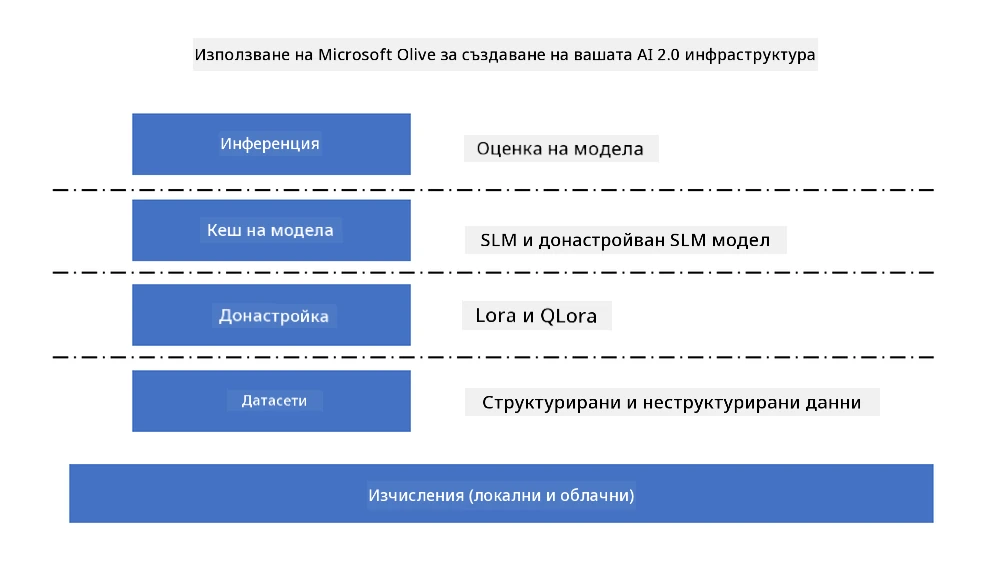
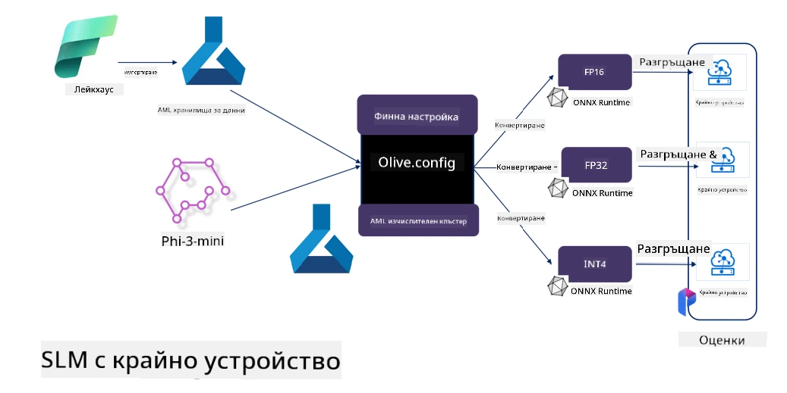

# **Фина настройка на Phi-3 с Microsoft Olive**

[Olive](https://github.com/microsoft/OLive?WT.mc_id=aiml-138114-kinfeylo) е лесен за използване инструмент за оптимизация на модели, който е съобразен с хардуера и обединява водещи в индустрията техники за компресиране, оптимизация и компилация на модели.

Той е създаден, за да улесни процеса на оптимизиране на машинно обучени модели, като гарантира максимално ефективно използване на конкретни хардуерни архитектури.

Независимо дали работите с облачни приложения или устройства на ръба, Olive ви позволява да оптимизирате моделите си лесно и ефективно.

## Основни характеристики:
- Olive събира и автоматизира техники за оптимизация за желаните хардуерни цели.
- Няма една единствена техника за оптимизация, която да пасва на всички случаи, затова Olive позволява разширяемост, като дава възможност на експерти от индустрията да добавят свои иновации в оптимизацията.

## Намаляване на инженерните усилия:
- Разработчиците често трябва да научат и използват множество специфични за хардуер доставчици инструменти, за да подготвят и оптимизират обучени модели за внедряване.
- Olive опростява този процес чрез автоматизиране на техниките за оптимизация за желания хардуер.

## Готово за използване решение за крайна оптимизация:

Чрез комбиниране и настройка на интегрирани техники, Olive предлага унифицирано решение за крайна оптимизация.
Той взема предвид ограничения като точност и латентност при оптимизацията на моделите.

## Използване на Microsoft Olive за фина настройка

Microsoft Olive е много лесен за използване инструмент с отворен код за оптимизация на модели, който покрива както фина настройка, така и референции в областта на генеративния изкуствен интелект. Изисква само проста конфигурация, комбинирана с използването на малки езикови модели с отворен код и съответните среди за изпълнение (AzureML / локален GPU, CPU, DirectML), чрез които можете да завършите фината настройка или референция на модела чрез автоматична оптимизация и да намерите най-добрия модел за внедряване в облака или на устройства на ръба. Позволява на предприятията да изграждат собствени вертикални модели за индустрията както на място, така и в облака.



## Фина настройка на Phi-3 с Microsoft Olive



## Примерен код и пример за Phi-3 Olive
В този пример ще използвате Olive, за да:

- Фино настроите LoRA адаптер за класифициране на фрази в категории Тъга, Радост, Страх, Изненада.
- Обедините теглата на адаптера с базовия модел.
- Оптимизирате и квантизирате модела в int4.

[Примерен код](../../code/03.Finetuning/olive-ort-example/README.md)

### Инсталиране на Microsoft Olive

Инсталирането на Microsoft Olive е много просто и може да се инсталира за CPU, GPU, DirectML и Azure ML

```bash
pip install olive-ai
```

Ако искате да стартирате ONNX модел с CPU, можете да използвате

```bash
pip install olive-ai[cpu]
```

Ако искате да стартирате ONNX модел с GPU, можете да използвате

```python
pip install olive-ai[gpu]
```

Ако искате да използвате Azure ML, използвайте

```python
pip install git+https://github.com/microsoft/Olive#egg=olive-ai[azureml]
```

**Забележка**  
Изискване за ОС: Ubuntu 20.04 / 22.04

### **Config.json на Microsoft Olive**

След инсталацията можете да конфигурирате различни настройки, специфични за модела, чрез Config файла, включително данни, изчисления, обучение, внедряване и генериране на модел.

**1. Данни**

Microsoft Olive поддържа обучение както с локални, така и с облачни данни, които могат да се конфигурират в настройките.

*Настройки за локални данни*

Можете просто да зададете набора от данни, който трябва да се използва за фина настройка, обикновено във формат json, и да го адаптирате с шаблона за данни. Това трябва да се коригира според изискванията на модела (например, адаптиране към формата, изискван от Microsoft Phi-3-mini. Ако имате други модели, моля, вижте изискванията за фина настройка на другите модели).

```json

    "data_configs": [
        {
            "name": "dataset_default_train",
            "type": "HuggingfaceContainer",
            "load_dataset_config": {
                "params": {
                    "data_name": "json", 
                    "data_files":"dataset/dataset-classification.json",
                    "split": "train"
                }
            },
            "pre_process_data_config": {
                "params": {
                    "dataset_type": "corpus",
                    "text_cols": [
                            "phrase",
                            "tone"
                    ],
                    "text_template": "### Text: {phrase}\n### The tone is:\n{tone}",
                    "corpus_strategy": "join",
                    "source_max_len": 2048,
                    "pad_to_max_len": false,
                    "use_attention_mask": false
                }
            }
        }
    ],
```

**Настройки за облачни източници на данни**

Чрез свързване на хранилището на Azure AI Studio/Azure Machine Learning Service за достъп до данни в облака, можете да изберете да въведете различни източници на данни в Azure AI Studio/Azure Machine Learning Service чрез Microsoft Fabric и Azure Data като поддръжка за фина настройка на данните.

```json

    "data_configs": [
        {
            "name": "dataset_default_train",
            "type": "HuggingfaceContainer",
            "load_dataset_config": {
                "params": {
                    "data_name": "json", 
                    "data_files": {
                        "type": "azureml_datastore",
                        "config": {
                            "azureml_client": {
                                "subscription_id": "Your Azure Subscrition ID",
                                "resource_group": "Your Azure Resource Group",
                                "workspace_name": "Your Azure ML Workspaces name"
                            },
                            "datastore_name": "workspaceblobstore",
                            "relative_path": "Your train_data.json Azure ML Location"
                        }
                    },
                    "split": "train"
                }
            },
            "pre_process_data_config": {
                "params": {
                    "dataset_type": "corpus",
                    "text_cols": [
                            "Question",
                            "Best Answer"
                    ],
                    "text_template": "<|user|>\n{Question}<|end|>\n<|assistant|>\n{Best Answer}\n<|end|>",
                    "corpus_strategy": "join",
                    "source_max_len": 2048,
                    "pad_to_max_len": false,
                    "use_attention_mask": false
                }
            }
        }
    ],
    
```

**2. Конфигурация на изчисленията**

Ако искате да използвате локално, можете директно да използвате локални ресурси за данни. Ако искате да използвате ресурси на Azure AI Studio / Azure Machine Learning Service, трябва да конфигурирате съответните Azure параметри, име на изчислителна мощност и др.

```json

    "systems": {
        "aml": {
            "type": "AzureML",
            "config": {
                "accelerators": ["gpu"],
                "hf_token": true,
                "aml_compute": "Your Azure AI Studio / Azure Machine Learning Service Compute Name",
                "aml_docker_config": {
                    "base_image": "Your Azure AI Studio / Azure Machine Learning Service docker",
                    "conda_file_path": "conda.yaml"
                }
            }
        },
        "azure_arc": {
            "type": "AzureML",
            "config": {
                "accelerators": ["gpu"],
                "aml_compute": "Your Azure AI Studio / Azure Machine Learning Service Compute Name",
                "aml_docker_config": {
                    "base_image": "Your Azure AI Studio / Azure Machine Learning Service docker",
                    "conda_file_path": "conda.yaml"
                }
            }
        }
    },
```

***Забележка***

Тъй като се изпълнява чрез контейнер в Azure AI Studio/Azure Machine Learning Service, е необходимо да се конфигурира изискваната среда. Това се прави в conda.yaml средата.

```yaml

name: project_environment
channels:
  - defaults
dependencies:
  - python=3.8.13
  - pip=22.3.1
  - pip:
      - einops
      - accelerate
      - azure-keyvault-secrets
      - azure-identity
      - bitsandbytes
      - datasets
      - huggingface_hub
      - peft
      - scipy
      - sentencepiece
      - torch>=2.2.0
      - transformers
      - git+https://github.com/microsoft/Olive@jiapli/mlflow_loading_fix#egg=olive-ai[gpu]
      - --extra-index-url https://aiinfra.pkgs.visualstudio.com/PublicPackages/_packaging/ORT-Nightly/pypi/simple/ 
      - ort-nightly-gpu==1.18.0.dev20240307004
      - --extra-index-url https://aiinfra.pkgs.visualstudio.com/PublicPackages/_packaging/onnxruntime-genai/pypi/simple/
      - onnxruntime-genai-cuda

    

```

**3. Избор на SLM**

Можете да използвате модел директно от Hugging face или да го комбинирате с Model Catalog на Azure AI Studio / Azure Machine Learning, за да изберете модела за използване. В примера по-долу ще използваме Microsoft Phi-3-mini.

Ако имате модела локално, можете да използвате този метод

```json

    "input_model":{
        "type": "PyTorchModel",
        "config": {
            "hf_config": {
                "model_name": "model-cache/microsoft/phi-3-mini",
                "task": "text-generation",
                "model_loading_args": {
                    "trust_remote_code": true
                }
            }
        }
    },
```

Ако искате да използвате модел от Azure AI Studio / Azure Machine Learning Service, можете да използвате този метод

```json

    "input_model":{
        "type": "PyTorchModel",
        "config": {
            "model_path": {
                "type": "azureml_registry_model",
                "config": {
                    "name": "microsoft/Phi-3-mini-4k-instruct",
                    "registry_name": "azureml-msr",
                    "version": "11"
                }
            },
             "model_file_format": "PyTorch.MLflow",
             "hf_config": {
                "model_name": "microsoft/Phi-3-mini-4k-instruct",
                "task": "text-generation",
                "from_pretrained_args": {
                    "trust_remote_code": true
                }
            }
        }
    },
```

**Забележка:**  
Трябва да се интегрирате с Azure AI Studio / Azure Machine Learning Service, затова при настройка на модела, моля, обърнете внимание на версията и свързаните имена.

Всички модели в Azure трябва да бъдат настроени на PyTorch.MLflow

Трябва да имате акаунт в Hugging face и да свържете ключа с Key стойността на Azure AI Studio / Azure Machine Learning

**4. Алгоритъм**

Microsoft Olive много добре обвива алгоритмите за фина настройка Lora и QLora. Всичко, което трябва да конфигурирате, са някои свързани параметри. Тук давам пример с QLora.

```json
        "lora": {
            "type": "LoRA",
            "config": {
                "target_modules": [
                    "o_proj",
                    "qkv_proj"
                ],
                "double_quant": true,
                "lora_r": 64,
                "lora_alpha": 64,
                "lora_dropout": 0.1,
                "train_data_config": "dataset_default_train",
                "eval_dataset_size": 0.3,
                "training_args": {
                    "seed": 0,
                    "data_seed": 42,
                    "per_device_train_batch_size": 1,
                    "per_device_eval_batch_size": 1,
                    "gradient_accumulation_steps": 4,
                    "gradient_checkpointing": false,
                    "learning_rate": 0.0001,
                    "num_train_epochs": 3,
                    "max_steps": 10,
                    "logging_steps": 10,
                    "evaluation_strategy": "steps",
                    "eval_steps": 187,
                    "group_by_length": true,
                    "adam_beta2": 0.999,
                    "max_grad_norm": 0.3
                }
            }
        },
```

Ако искате квантизационна конверсия, основният клон на Microsoft Olive вече поддържа метода onnxruntime-genai. Можете да го настроите според нуждите си:

1. обединяване на теглата на адаптера с базовия модел  
2. конвертиране на модела в onnx модел с необходимата точност чрез ModelBuilder

например конвертиране в квантизиран INT4

```json

        "merge_adapter_weights": {
            "type": "MergeAdapterWeights"
        },
        "builder": {
            "type": "ModelBuilder",
            "config": {
                "precision": "int4"
            }
        }
```

**Забележка**  
- Ако използвате QLoRA, квантизационната конверсия на ONNXRuntime-genai все още не се поддържа.  
- Тук трябва да се отбележи, че можете да настроите горните стъпки според собствените си нужди. Не е задължително да конфигурирате всички тези стъпки изцяло. В зависимост от нуждите си можете директно да използвате стъпките на алгоритъма без фина настройка. Накрая трябва да конфигурирате съответните двигатели.

```json

    "engine": {
        "log_severity_level": 0,
        "host": "aml",
        "target": "aml",
        "search_strategy": false,
        "execution_providers": ["CUDAExecutionProvider"],
        "cache_dir": "../model-cache/models/phi3-finetuned/cache",
        "output_dir" : "../model-cache/models/phi3-finetuned"
    }
```

**5. Финализиране на фина настройка**

В командния ред изпълнете в директорията на olive-config.json

```bash
olive run --config olive-config.json  
```

**Отказ от отговорност**:  
Този документ е преведен с помощта на AI преводаческа услуга [Co-op Translator](https://github.com/Azure/co-op-translator). Въпреки че се стремим към точност, моля, имайте предвид, че автоматизираните преводи могат да съдържат грешки или неточности. Оригиналният документ на неговия роден език трябва да се счита за авторитетен източник. За критична информация се препоръчва професионален човешки превод. Ние не носим отговорност за каквито и да е недоразумения или неправилни тълкувания, произтичащи от използването на този превод.