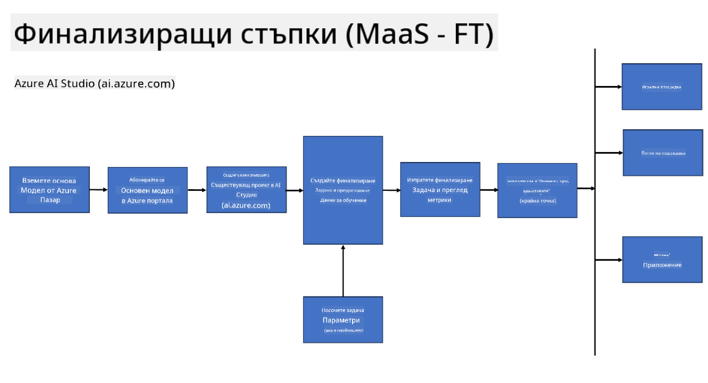

<!--
CO_OP_TRANSLATOR_METADATA:
{
  "original_hash": "cb5648935f63edc17e95ce38f23adc32",
  "translation_date": "2025-07-17T08:30:33+00:00",
  "source_file": "md/03.FineTuning/FineTuning_Scenarios.md",
  "language_code": "bg"
}
-->
## Сценарии за фино настройване

**Платформа** Това включва различни технологии като Azure AI Foundry, Azure Machine Learning, AI Tools, Kaito и ONNX Runtime.

**Инфраструктура** Това включва CPU и FPGA, които са от съществено значение за процеса на фино настройване. Нека ви покажа иконите за всяка от тези технологии.

**Инструменти и рамки** Това включва ONNX Runtime и ONNX Runtime. Нека ви покажа иконите за всяка от тези технологии.  
[Вмъкнете икони за ONNX Runtime и ONNX Runtime]

Процесът на фино настройване с технологиите на Microsoft включва различни компоненти и инструменти. Като разберем и използваме тези технологии, можем ефективно да фино настроим нашите приложения и да създадем по-добри решения.

## Модел като услуга

Фино настройване на модела чрез хоствано фино настройване, без необходимост от създаване и управление на изчислителни ресурси.

Безсървърното фино настройване е налично за моделите Phi-3-mini и Phi-3-medium, което позволява на разработчиците бързо и лесно да персонализират моделите за облачни и крайни сценарии, без да се налага да осигуряват изчислителни ресурси. Също така обявихме, че Phi-3-small вече е достъпен чрез нашето предложение Models-as-a-Service, така че разработчиците могат бързо и лесно да започнат с AI разработка, без да се налага да управляват основната инфраструктура.

## Модел като платформа

Потребителите управляват собствените си изчислителни ресурси, за да фино настроят своите модели.

[Пример за фино настройване](https://github.com/Azure/azureml-examples/blob/main/sdk/python/foundation-models/system/finetune/chat-completion/chat-completion.ipynb)

## Сценарии за фино настройване

| | | | | | | |
|-|-|-|-|-|-|-|
|Сценарий|LoRA|QLoRA|PEFT|DeepSpeed|ZeRO|DORA|
|Адаптиране на предварително обучени LLM към конкретни задачи или области|Да|Да|Да|Да|Да|Да|
|Фино настройване за NLP задачи като класификация на текст, разпознаване на именовани обекти и машинен превод|Да|Да|Да|Да|Да|Да|
|Фино настройване за задачи по въпроси и отговори|Да|Да|Да|Да|Да|Да|
|Фино настройване за генериране на човешкоподобни отговори в чатботове|Да|Да|Да|Да|Да|Да|
|Фино настройване за генериране на музика, изкуство или други форми на творчество|Да|Да|Да|Да|Да|Да|
|Намаляване на изчислителните и финансови разходи|Да|Да|Не|Да|Да|Не|
|Намаляване на използването на памет|Не|Да|Не|Да|Да|Да|
|Използване на по-малко параметри за ефективно фино настройване|Не|Да|Да|Не|Не|Да|
|Паметно ефективна форма на паралелизъм на данни, която дава достъп до общата GPU памет на всички налични GPU устройства|Не|Не|Не|Да|Да|Да|

## Примери за производителност при фино настройване

**Отказ от отговорност**:  
Този документ е преведен с помощта на AI преводаческа услуга [Co-op Translator](https://github.com/Azure/co-op-translator). Въпреки че се стремим към точност, моля, имайте предвид, че автоматизираните преводи могат да съдържат грешки или неточности. Оригиналният документ на неговия език трябва да се счита за авторитетен източник. За критична информация се препоръчва професионален човешки превод. Ние не носим отговорност за каквито и да е недоразумения или неправилни тълкувания, произтичащи от използването на този превод.