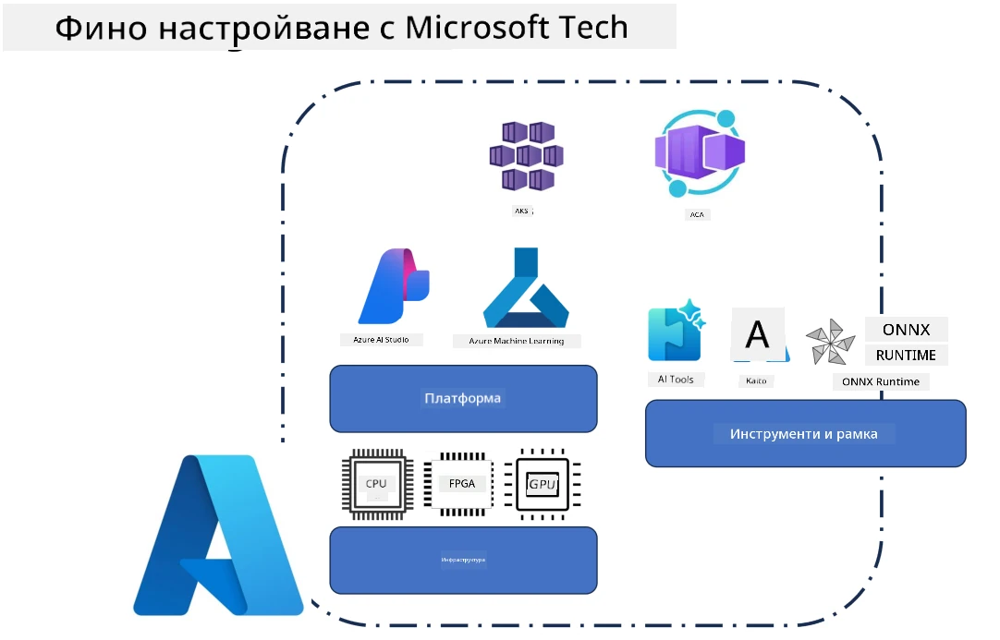
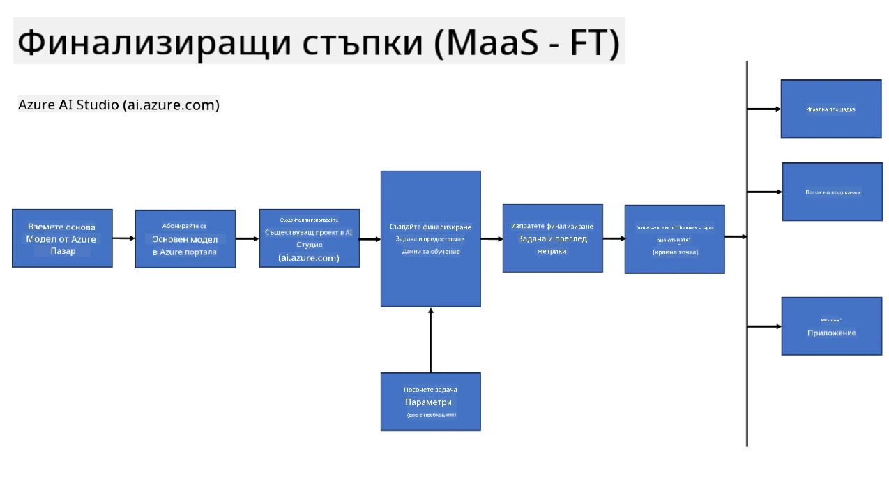
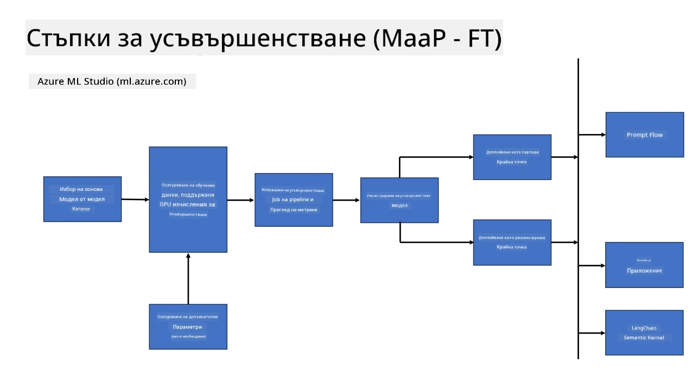
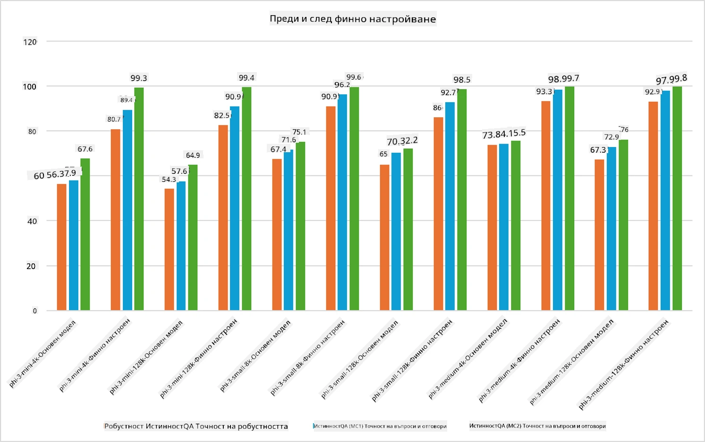

## Сценарии за фино настройване

Този раздел предоставя преглед на сценарии за фино настройване в средите Microsoft Foundry и Azure, включително модели на разгръщане, инфраструктурни слоеве и често използвани техники за оптимизация.

**Платформа**  
Това включва управлявани услуги като Microsoft Foundry (преди Azure AI Foundry) и Azure Machine Learning, които предоставят управление на модели, оркестрация, проследяване на експерименти и работни потоци за разгръщане.

**Инфраструктура**  
Финото настройване изисква мащабируеми изчислителни ресурси. В Azure средите това обикновено включва виртуални машини с GPU и CPU ресурси за лекотоварни натоварвания, както и мащабируема памет за набори от данни и контролни точки.

**Инструменти и рамка**  
Работните потоци за фино настройване обикновено разчитат на рамки и оптимизационни библиотеки като Hugging Face Transformers, DeepSpeed и PEFT (ефикасно фино настройване с параметри).

Процесът на фино настройване с технологиите на Microsoft обхваща платформени услуги, изчислителна инфраструктура и тренировъчни рамки. Чрез разбирането на взаимодействието между тези компоненти разработчиците могат ефективно да адаптират основните модели за специфични задачи и производствени сценарии.

## Модел като услуга

Фино настройте модела, използвайки хоствано фино настройване, без нужда от създаване и управление на изчисление.

Безсървърното фино настройване вече е налично за семействата модели Phi-3, Phi-3.5 и Phi-4, което позволява на разработчиците бързо и лесно да персонализират моделите за облачни и крайни сценарии без да се налага да организират изчислителни ресурси.

## Модел като платформа

Потребителите управляват собственото си изчисление, за да фино настройват своите модели.

[Fine Tuning Sample](https://github.com/Azure/azureml-examples/blob/main/sdk/python/foundation-models/system/finetune/chat-completion/chat-completion.ipynb)

## Сравнение на техники за фино настройване

|Сценарий|LoRA|QLoRA|PEFT|DeepSpeed|ZeRO|DoRA|
|---|---|---|---|---|---|---|
|Адаптиране на предварително обучени LLM към специфични задачи или домейни|Да|Да|Да|Да|Да|Да|
|Фино настройване за NLP задачи като класификация на текст, разпознаване на именовани обекти и машинен превод|Да|Да|Да|Да|Да|Да|
|Фино настройване за задачи по въпроси и отговори|Да|Да|Да|Да|Да|Да|
|Фино настройване за генериране на човешкоподобни отговори в чатботове|Да|Да|Да|Да|Да|Да|
|Фино настройване за генериране на музика, изкуство или други форми на творчество|Да|Да|Да|Да|Да|Да|
|Намаляване на изчислителните и финансови разходи|Да|Да|Да|Да|Да|Да|
|Намаляване на използването на памет|Да|Да|Да|Да|Да|Да|
|Използване на по-малко параметри за ефективно фино настройване|Да|Да|Да|Не|Не|Да|
|Паметно ефективна форма на паралелизъм на данни, която дава достъп до агрегатната GPU памет на всички налични GPU устройства|Не|Не|Не|Да|Да|Не|

> [!NOTE]
> LoRA, QLoRA, PEFT и DoRA са методи за параметър-ефективно фино настройване, докато DeepSpeed и ZeRO се фокусират върху дистрибутиран тренинг и оптимизация на паметта.

## Примери за производителност при фино настройване

---

<!-- CO-OP TRANSLATOR DISCLAIMER START -->
**Отказ от отговорност**:  
Този документ е преведен с помощта на AI преводаческа услуга [Co-op Translator](https://github.com/Azure/co-op-translator). Въпреки че се стремим към точност, моля, имайте предвид, че автоматичните преводи могат да съдържат грешки или неточности. Оригиналният документ на неговия роден език трябва да се счита за авторитетен източник. За критична информация се препоръчва професионален човешки превод. Ние не носим отговорност за каквито и да е недоразумения или погрешни тълкувания, произтичащи от използването на този превод.
<!-- CO-OP TRANSLATOR DISCLAIMER END -->