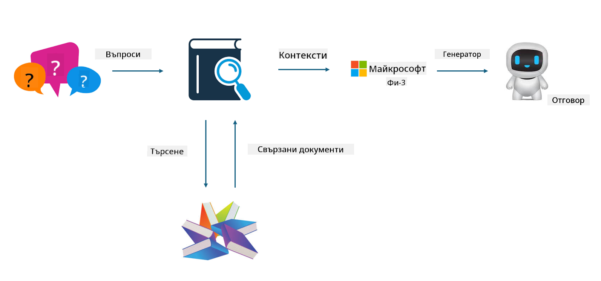

<!--
CO_OP_TRANSLATOR_METADATA:
{
  "original_hash": "e4e010400c2918557b36bb932a14004c",
  "translation_date": "2025-07-17T09:31:40+00:00",
  "source_file": "md/03.FineTuning/FineTuning_vs_RAG.md",
  "language_code": "bg"
}
-->
## Фино настройване срещу RAG

## Retrieval Augmented Generation

RAG е комбиниране на извличане на данни и генериране на текст. Структурираните и неструктурираните данни на предприятието се съхраняват във векторна база данни. При търсене на релевантно съдържание се намират подходящи обобщения и материали, които формират контекст, а след това се използва способността за допълване на текста на LLM/SLM за генериране на съдържание.

## Процес на RAG

## Фино настройване
Финото настройване се базира на подобряване на конкретен модел. Не е необходимо да се започва от алгоритъма на модела, но данните трябва да се натрупват постоянно. Ако искате по-точна терминология и езиково изразяване в индустриални приложения, финото настройване е по-добрият избор. Но ако данните ви се променят често, финото настройване може да се окаже сложно.

## Как да изберем
Ако отговорът ни изисква въвеждане на външни данни, RAG е най-добрият избор.

Ако трябва да се изведе стабилно и прецизно индустриално знание, финото настройване ще бъде добър избор. RAG дава приоритет на извличането на релевантно съдържание, но може да не улови винаги специализираните нюанси.

Финото настройване изисква висококачествен набор от данни, и ако става дума само за малък обхват от данни, ефектът няма да е значителен. RAG е по-гъвкав.  
Финото настройване е черна кутия, метафизика, и е трудно да се разбере вътрешният му механизъм. Но RAG улеснява намирането на източника на данните, което позволява ефективно коригиране на халюцинации или грешки в съдържанието и осигурява по-добра прозрачност.

**Отказ от отговорност**:  
Този документ е преведен с помощта на AI преводаческа услуга [Co-op Translator](https://github.com/Azure/co-op-translator). Въпреки че се стремим към точност, моля, имайте предвид, че автоматизираните преводи могат да съдържат грешки или неточности. Оригиналният документ на неговия първичен език трябва да се счита за авторитетен източник. За критична информация се препоръчва професионален човешки превод. Ние не носим отговорност за каквито и да е недоразумения или неправилни тълкувания, произтичащи от използването на този превод.