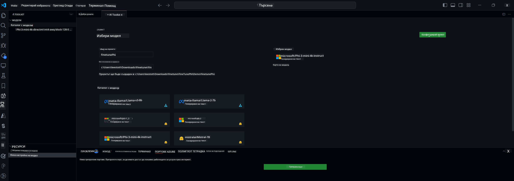

<!--
CO_OP_TRANSLATOR_METADATA:
{
  "original_hash": "c2bc0950f44919ac75a88c1a871680c2",
  "translation_date": "2025-07-17T09:21:36+00:00",
  "source_file": "md/03.FineTuning/Finetuning_VSCodeaitoolkit.md",
  "language_code": "bg"
}
-->
## Добре дошли в AI Toolkit за VS Code

[AI Toolkit за VS Code](https://github.com/microsoft/vscode-ai-toolkit/tree/main) обединява различни модели от Azure AI Studio Catalog и други каталози като Hugging Face. Този инструмент улеснява често срещаните задачи при разработката на AI приложения с генеративни AI инструменти и модели чрез:
- Започване с откриване на модели и playground.
- Фино настройване и извеждане на изводи с помощта на локални изчислителни ресурси.
- Отдалечено фино настройване и извеждане на изводи с помощта на Azure ресурси.

[Инсталирайте AI Toolkit за VSCode](https://marketplace.visualstudio.com/items?itemName=ms-windows-ai-studio.windows-ai-studio)




**[Private Preview]** Еднократно осигуряване на Azure Container Apps за изпълнение на фино настройване и извеждане на изводи в облака.

Сега нека започнем с разработката на вашето AI приложение:

- [Добре дошли в AI Toolkit за VS Code](../../../../md/03.FineTuning)
- [Локална разработка](../../../../md/03.FineTuning)
  - [Подготовка](../../../../md/03.FineTuning)
  - [Активиране на Conda](../../../../md/03.FineTuning)
  - [Само фино настройване на базов модел](../../../../md/03.FineTuning)
  - [Фино настройване и извеждане на изводи на модел](../../../../md/03.FineTuning)
  - [Фино настройване на модел](../../../../md/03.FineTuning)
  - [Microsoft Olive](../../../../md/03.FineTuning)
  - [Примери и ресурси за фино настройване](../../../../md/03.FineTuning)
- [**\[Private Preview\]** Отдалечена разработка](../../../../md/03.FineTuning)
  - [Изисквания](../../../../md/03.FineTuning)
  - [Настройване на проект за отдалечена разработка](../../../../md/03.FineTuning)
  - [Осигуряване на Azure ресурси](../../../../md/03.FineTuning)
  - [\[По избор\] Добавяне на Huggingface токен към секрета на Azure Container App](../../../../md/03.FineTuning)
  - [Стартиране на фино настройване](../../../../md/03.FineTuning)
  - [Осигуряване на inference endpoint](../../../../md/03.FineTuning)
  - [Деплой на inference endpoint](../../../../md/03.FineTuning)
  - [Разширено използване](../../../../md/03.FineTuning)

## Локална разработка
### Подготовка

1. Уверете се, че NVIDIA драйверът е инсталиран на хоста.
2. Стартирайте `huggingface-cli login`, ако използвате HF за работа с набори от данни.
3. Обяснения за настройките на `Olive`, които влияят на използването на паметта.

### Активиране на Conda
Тъй като използваме WSL среда и тя е споделена, трябва ръчно да активирате conda средата. След тази стъпка можете да стартирате фино настройване или извеждане на изводи.

```bash
conda activate [conda-env-name] 
```

### Само фино настройване на базов модел
За да изпробвате само базовия модел без фино настройване, можете да изпълните тази команда след активиране на conda.

```bash
cd inference

# Web browser interface allows to adjust a few parameters like max new token length, temperature and so on.
# User has to manually open the link (e.g. http://0.0.0.0:7860) in a browser after gradio initiates the connections.
python gradio_chat.py --baseonly
```

### Фино настройване и извеждане на изводи на модел

След като работната среда е отворена в dev контейнер, отворете терминал (по подразбиране пътят е коренът на проекта) и изпълнете командата по-долу, за да фино настроите LLM върху избрания набор от данни.

```bash
python finetuning/invoke_olive.py 
```

Контролни точки и крайният модел ще бъдат запазени в папката `models`.

След това стартирайте извеждане на изводи с фино настроения модел чрез чатове в `конзола`, `уеб браузър` или `prompt flow`.

```bash
cd inference

# Console interface.
python console_chat.py

# Web browser interface allows to adjust a few parameters like max new token length, temperature and so on.
# User has to manually open the link (e.g. http://127.0.0.1:7860) in a browser after gradio initiates the connections.
python gradio_chat.py
```

За да използвате `prompt flow` във VS Code, моля, вижте този [Quick Start](https://microsoft.github.io/promptflow/how-to-guides/quick-start.html).

### Фино настройване на модел

След това изтеглете следния модел в зависимост от наличието на GPU на вашето устройство.

За да стартирате локална сесия за фино настройване с QLoRA, изберете модел от нашия каталог, който искате да настроите.
| Платформа(и) | Наличен GPU | Име на модел | Размер (GB) |
|---------|---------|--------|--------|
| Windows | Да | Phi-3-mini-4k-**directml**-int4-awq-block-128-onnx | 2.13GB |
| Linux | Да | Phi-3-mini-4k-**cuda**-int4-onnx | 2.30GB |
| Windows<br>Linux | Не | Phi-3-mini-4k-**cpu**-int4-rtn-block-32-acc-level-4-onnx | 2.72GB |

**_Забележка_** Не е необходим Azure акаунт за изтегляне на моделите.

Моделът Phi3-mini (int4) е с размер около 2GB-3GB. В зависимост от скоростта на вашата мрежа, изтеглянето може да отнеме няколко минути.

Започнете с избор на име и местоположение на проекта.
След това изберете модел от каталога. Ще бъдете подканени да изтеглите шаблона на проекта. След това можете да кликнете върху "Configure Project", за да настроите различни параметри.

### Microsoft Olive

Използваме [Olive](https://microsoft.github.io/Olive/why-olive.html) за изпълнение на QLoRA фино настройване върху PyTorch модел от нашия каталог. Всички настройки са предварително зададени с подразбиращи се стойности, оптимизирани за локално изпълнение на финото настройване с оптимално използване на паметта, но могат да бъдат коригирани според вашия сценарий.

### Примери и ресурси за фино настройване

- [Ръководство за започване с фино настройване](https://learn.microsoft.com/windows/ai/toolkit/toolkit-fine-tune)
- [Фино настройване с HuggingFace Dataset](https://github.com/microsoft/vscode-ai-toolkit/blob/main/archive/walkthrough-hf-dataset.md)
- [Фино настройване с прост набор от данни](https://github.com/microsoft/vscode-ai-toolkit/blob/main/archive/walkthrough-simple-dataset.md)

## **[Private Preview]** Отдалечена разработка

### Изисквания

1. За да изпълнявате фино настройване на модел в отдалечената си Azure Container App среда, уверете се, че вашият абонамент разполага с достатъчно GPU капацитет. Подайте [заявка за поддръжка](https://azure.microsoft.com/support/create-ticket/), за да поискате необходимия капацитет за вашето приложение. [Вижте повече информация за GPU капацитет](https://learn.microsoft.com/azure/container-apps/workload-profiles-overview)
2. Ако използвате частен набор от данни в HuggingFace, уверете се, че имате [HuggingFace акаунт](https://huggingface.co/?WT.mc_id=aiml-137032-kinfeylo) и сте [генерирали токен за достъп](https://huggingface.co/docs/hub/security-tokens?WT.mc_id=aiml-137032-kinfeylo)
3. Активирайте функцията за отдалечено фино настройване и извеждане на изводи в AI Toolkit за VS Code
   1. Отворете настройките на VS Code чрез *File -> Preferences -> Settings*.
   2. Отидете в *Extensions* и изберете *AI Toolkit*.
   3. Изберете опцията *"Enable Remote Fine-tuning And Inference"*.
   4. Рестартирайте VS Code, за да влязат в сила промените.

- [Отдалечено фино настройване](https://github.com/microsoft/vscode-ai-toolkit/blob/main/archive/remote-finetuning.md)

### Настройване на проект за отдалечена разработка
1. Изпълнете командата от палитрата `AI Toolkit: Focus on Resource View`.
2. Отидете на *Model Fine-tuning*, за да достъпите каталога с модели. Задайте име на проекта и изберете местоположение на вашата машина. След това натиснете бутона *"Configure Project"*.
3. Конфигурация на проекта
    1. Избягвайте да активирате опцията *"Fine-tune locally"*.
    2. Ще се появят настройките на Olive с предварително зададени стойности. Моля, коригирайте и попълнете тези настройки според нуждите.
    3. Продължете с *Generate Project*. Тази стъпка използва WSL и включва създаване на нова Conda среда, като се подготвя за бъдещи актуализации с Dev Containers.
4. Кликнете на *"Relaunch Window In Workspace"*, за да отворите проекта за отдалечена разработка.

> **Забележка:** Проектът в момента работи или локално, или отдалечено в AI Toolkit за VS Code. Ако изберете *"Fine-tune locally"* при създаване на проекта, той ще работи само в WSL без възможности за отдалечена разработка. Ако не активирате *"Fine-tune locally"*, проектът ще бъде ограничен до отдалечената Azure Container App среда.

### Осигуряване на Azure ресурси
За да започнете, трябва да осигурите Azure ресурс за отдалечено фино настройване. Направете това, като изпълните командата `AI Toolkit: Provision Azure Container Apps job for fine-tuning` от палитрата с команди.

Следете напредъка на осигуряването чрез линка, показан в изходния канал.

### [По избор] Добавяне на Huggingface токен към секрета на Azure Container App
Ако използвате частен HuggingFace набор от данни, задайте HuggingFace токена си като променлива на средата, за да избегнете необходимостта от ръчно влизане в Hugging Face Hub.
Можете да направите това с командата `AI Toolkit: Add Azure Container Apps Job secret for fine-tuning`. С тази команда можете да зададете името на секрета като [`HF_TOKEN`](https://huggingface.co/docs/huggingface_hub/package_reference/environment_variables#hftoken) и да използвате вашия Hugging Face токен като стойност на секрета.

### Стартиране на фино настройване
За да стартирате отдалечената задача за фино настройване, изпълнете командата `AI Toolkit: Run fine-tuning`.

За да видите системните и конзолните логове, можете да посетите Azure портала чрез линка в изходния панел (повече стъпки в [View and Query Logs on Azure](https://aka.ms/ai-toolkit/remote-provision#view-and-query-logs-on-azure)). Или можете да видите конзолните логове директно в изходния панел на VSCode, като изпълните командата `AI Toolkit: Show the running fine-tuning job streaming logs`.
> **Забележка:** Задачата може да бъде в опашка поради недостатъчни ресурси. Ако логът не се показва, изпълнете командата `AI Toolkit: Show the running fine-tuning job streaming logs`, изчакайте малко и след това я изпълнете отново, за да се свържете с потока на логовете.

По време на този процес ще се използва QLoRA за фино настройване и ще се създадат LoRA адаптери за модела, които да се използват при извеждане на изводи.
Резултатите от финото настройване ще се съхраняват в Azure Files.

### Осигуряване на inference endpoint
След като адаптерите са обучени в отдалечената среда, използвайте проста Gradio апликация за взаимодействие с модела.
Подобно на процеса на фино настройване, трябва да настроите Azure ресурсите за отдалечено извеждане на изводи, като изпълните командата `AI Toolkit: Provision Azure Container Apps for inference` от палитрата с команди.

По подразбиране абонаментът и ресурсната група за извеждане на изводи трябва да съвпадат с тези, използвани за финото настройване. Извеждането ще използва същата Azure Container App среда и ще достъпва модела и адаптера, съхранени в Azure Files, които бяха генерирани по време на стъпката за фино настройване.

### Деплой на inference endpoint
Ако желаете да промените кода за извеждане на изводи или да презаредите модела за извеждане, изпълнете командата `AI Toolkit: Deploy for inference`. Това ще синхронизира последния ви код с Azure Container App и ще рестартира репликата.

След успешното деплойване можете да достъпите inference API, като кликнете върху бутона "*Go to Inference Endpoint*" в известието на VSCode. Или уеб API endpoint може да бъде намерен под `ACA_APP_ENDPOINT` в `./infra/inference.config.json` и в изходния панел. Вече сте готови да оцените модела чрез този endpoint.

### Разширено използване
За повече информация относно отдалечената разработка с AI Toolkit, вижте документацията за [Фино настройване на модели отдалечено](https://aka.ms/ai-toolkit/remote-provision) и [Извеждане на изводи с фино настроения модел](https://aka.ms/ai-toolkit/remote-inference).

**Отказ от отговорност**:  
Този документ е преведен с помощта на AI преводаческа услуга [Co-op Translator](https://github.com/Azure/co-op-translator). Въпреки че се стремим към точност, моля, имайте предвид, че автоматизираните преводи могат да съдържат грешки или неточности. Оригиналният документ на неговия роден език трябва да се счита за авторитетен източник. За критична информация се препоръчва професионален човешки превод. Ние не носим отговорност за каквито и да е недоразумения или неправилни тълкувания, произтичащи от използването на този превод.