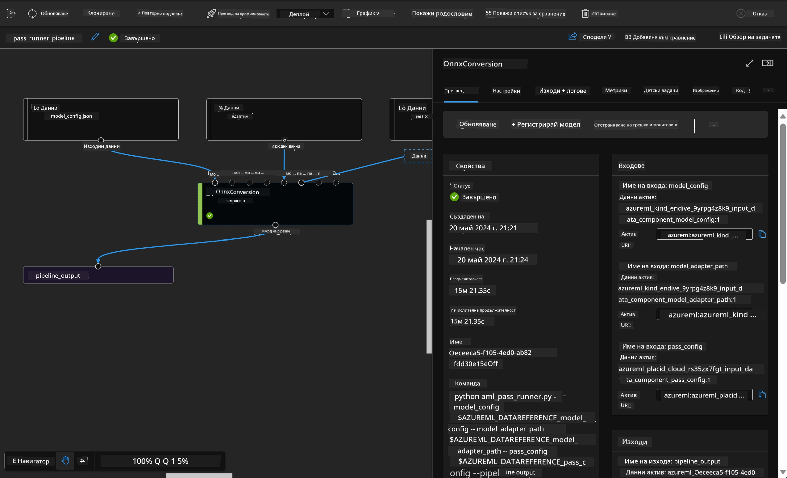

# **Въведение в Azure Machine Learning Service**

[Azure Machine Learning](https://ml.azure.com?WT.mc_id=aiml-138114-kinfeylo) е облачна услуга за ускоряване и управление на жизнения цикъл на проекти за машинно обучение (ML).

Професионалисти в областта на ML, анализатори на данни и инженери могат да я използват в ежедневната си работа, за да:

- Обучават и внедряват модели.
- Управляват операциите по машинно обучение (MLOps).
- Можете да създадете модел в Azure Machine Learning или да използвате модел, изграден на базата на отворени платформи като PyTorch, TensorFlow или scikit-learn.
- Инструментите за MLOps ви помагат да наблюдавате, преобучавате и внедрявате модели отново.

## За кого е предназначен Azure Machine Learning?

**Анализатори на данни и ML инженери**

Те могат да използват инструменти за ускоряване и автоматизиране на ежедневните си задачи.  
Azure ML предлага функции за справедливост, обяснимост, проследяване и одит.

**Разработчици на приложения**  
Могат безпроблемно да интегрират модели в приложения или услуги.

**Разработчици на платформи**

Разполагат с мощен набор от инструменти, подкрепени от стабилни Azure Resource Manager API-та.  
Тези инструменти позволяват изграждането на усъвършенствани ML инструменти.

**Корпорации**

Работейки в облака на Microsoft Azure, корпорациите се възползват от познатата сигурност и контрол на достъпа, базиран на роли.  
Могат да настроят проекти за контрол на достъпа до защитени данни и конкретни операции.

## Продуктивност за всеки в екипа  
Проектите за ML често изискват екип с разнообразни умения за изграждане и поддръжка.

Azure ML предоставя инструменти, които ви позволяват да:  
- Сътрудничите с екипа чрез споделени тетрадки, изчислителни ресурси, безсървърни изчисления, данни и среди.  
- Разработвате модели с акцент върху справедливост, обяснимост, проследяване и одит, за да отговаряте на изисквания за проследимост и съответствие.  
- Внедрявате ML модели бързо и лесно в мащаб, както и ги управлявате и контролирате ефективно с MLOps.  
- Изпълнявате ML задачи навсякъде с вградена политика за управление, сигурност и съответствие.

## Крос-платформени инструменти

Всеки в ML екипа може да използва предпочитаните от него инструменти за изпълнение на задачите.  
Независимо дали провеждате бързи експерименти, настройвате хиперпараметри, изграждате пайплайни или управлявате изводи, можете да използвате познати интерфейси като:  
- Azure Machine Learning Studio  
- Python SDK (v2)  
- Azure CLI (v2)  
- Azure Resource Manager REST APIs

Докато усъвършенствате модели и си сътрудничите през целия цикъл на разработка, можете да споделяте и намирате активи, ресурси и метрики в интерфейса на Azure Machine Learning studio.

## **LLM/SLM в Azure ML**

Azure ML добави множество функции, свързани с LLM/SLM, комбинирайки LLMOps и SLMOps за създаване на корпоративна платформа за генеративен изкуствен интелект.

### **Каталог на модели**

Корпоративните потребители могат да внедряват различни модели според различни бизнес сценарии чрез Model Catalog и да предоставят услуги като Model as Service за достъп на корпоративни разработчици или потребители.

Каталогът на модели в Azure Machine Learning studio е центърът за откриване и използване на широк набор от модели, които ви позволяват да изграждате генеративни AI приложения. Каталогът включва стотици модели от доставчици като Azure OpenAI service, Mistral, Meta, Cohere, Nvidia, Hugging Face, включително модели, обучени от Microsoft. Моделите от доставчици, различни от Microsoft, са Non-Microsoft Products, както е дефинирано в Product Terms на Microsoft, и подлежат на условията, предоставени с модела.

### **Job Pipeline**

Основата на ML пайплайна е разделянето на цялостната ML задача на многостъпков работен процес. Всяка стъпка е управляем компонент, който може да бъде разработван, оптимизиран, конфигуриран и автоматизиран поотделно. Стъпките са свързани чрез добре дефинирани интерфейси. Услугата за пайплайни на Azure Machine Learning автоматично оркестрира всички зависимости между стъпките.

При фина настройка на SLM / LLM можем да управляваме данните, обучението и процесите на генериране чрез Pipeline.

### **Prompt flow**

Ползи от използването на Azure Machine Learning prompt flow  
Azure Machine Learning prompt flow предлага редица предимства, които помагат на потребителите да преминат от идеята към експериментиране и накрая към готови за производство LLM-базирани приложения:

**Гъвкавост при prompt инженеринг**

Интерактивен опит при създаване: Azure Machine Learning prompt flow предоставя визуално представяне на структурата на потока, което позволява лесно разбиране и навигация в проектите. Освен това предлага опит, подобен на тетрадка, за ефективна разработка и отстраняване на грешки.  
Варианти за настройка на prompt: Потребителите могат да създават и сравняват множество варианти на prompt, улеснявайки итеративния процес на усъвършенстване.

Оценка: Вградени потоци за оценка позволяват на потребителите да преценят качеството и ефективността на своите prompt-и и потоци.

Обширни ресурси: Azure Machine Learning prompt flow включва библиотека с вградени инструменти, примери и шаблони, които служат като отправна точка за разработка, вдъхновявайки креативност и ускорявайки процеса.

**Готовност за корпоративна употреба на LLM-базирани приложения**

Сътрудничество: Azure Machine Learning prompt flow поддържа екипна работа, позволявайки на множество потребители да работят заедно по проекти за prompt инженеринг, да споделят знания и да поддържат контрол на версиите.

Всичко в едно платформа: Azure Machine Learning prompt flow опростява целия процес на prompt инженеринг – от разработка и оценка до внедряване и наблюдение. Потребителите могат лесно да внедряват своите потоци като Azure Machine Learning endpoints и да следят тяхната работа в реално време, осигурявайки оптимална работа и непрекъснато подобрение.

Решения за корпоративна готовност на Azure Machine Learning: Prompt flow използва стабилните решения на Azure Machine Learning за корпоративна готовност, предоставяйки сигурна, мащабируема и надеждна основа за разработка, експериментиране и внедряване на потоци.

С Azure Machine Learning prompt flow потребителите могат да разгърнат своята гъвкавост при prompt инженеринг, да си сътрудничат ефективно и да използват корпоративни решения за успешна разработка и внедряване на LLM-базирани приложения.

Комбинирайки изчислителната мощ, данните и различните компоненти на Azure ML, корпоративните разработчици лесно могат да изграждат свои собствени приложения с изкуствен интелект.

**Отказ от отговорност**:  
Този документ е преведен с помощта на AI преводаческа услуга [Co-op Translator](https://github.com/Azure/co-op-translator). Въпреки че се стремим към точност, моля, имайте предвид, че автоматизираните преводи могат да съдържат грешки или неточности. Оригиналният документ на неговия роден език трябва да се счита за авторитетен източник. За критична информация се препоръчва професионален човешки превод. Ние не носим отговорност за каквито и да е недоразумения или неправилни тълкувания, произтичащи от използването на този превод.