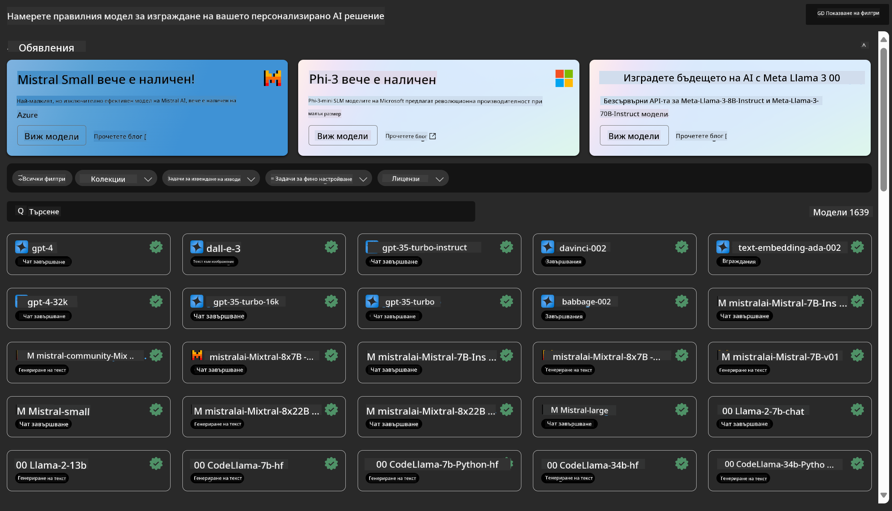
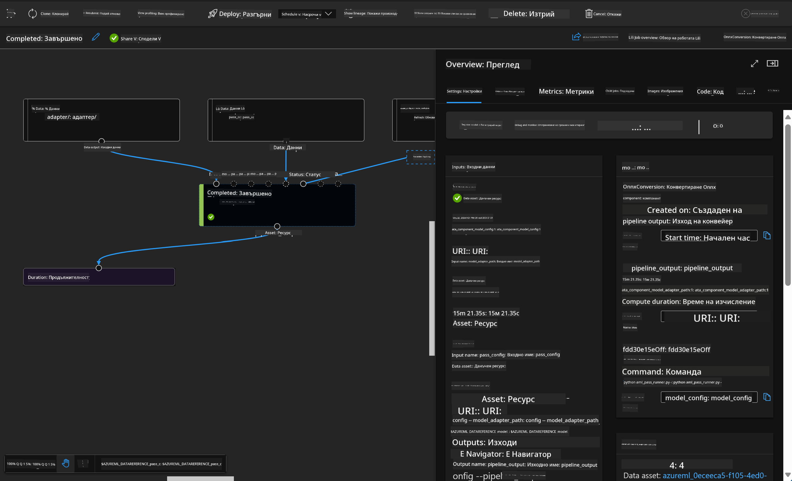

<!--
CO_OP_TRANSLATOR_METADATA:
{
  "original_hash": "7fe541373802e33568e94e13226d463c",
  "translation_date": "2025-05-09T22:24:06+00:00",
  "source_file": "md/03.FineTuning/Introduce_AzureML.md",
  "language_code": "bg"
}
-->
# **Представяне на Azure Machine Learning Service**

[Azure Machine Learning](https://ml.azure.com?WT.mc_id=aiml-138114-kinfeylo) е облачна услуга за ускоряване и управление на жизнения цикъл на проекти за машинно обучение (ML).

Професионалисти в областта на ML, анализатори на данни и инженери могат да я използват в ежедневната си работа, за да:

- Обучават и внедряват модели.
- Управляват операциите по машинно обучение (MLOps).
- Можете да създадете модел в Azure Machine Learning или да използвате модел, разработен на платформа с отворен код, като PyTorch, TensorFlow или scikit-learn.
- Инструментите за MLOps помагат да наблюдавате, преквалифицирате и внедрявате отново моделите.

## За кого е предназначен Azure Machine Learning?

**Анализатори на данни и ML инженери**

Те могат да използват инструменти за ускоряване и автоматизиране на ежедневните си задачи.
Azure ML предлага функции за справедливост, обяснимост, проследяване и одит.

**Разработчици на приложения:**

Могат безпроблемно да интегрират модели в приложения или услуги.

**Платформени разработчици**

Разполагат с мощен набор от инструменти, подкрепени от устойчиви Azure Resource Manager API-та.
Тези инструменти позволяват създаването на усъвършенствани ML инструменти.

**Корпорации**

Работейки в облака на Microsoft Azure, корпорациите се възползват от познатата сигурност и контрол на достъпа, базиран на роли.
Могат да настройват проекти за контрол на достъпа до защитени данни и специфични операции.

## Продуктивност за целия екип
Проектите за ML често изискват екип с разнообразни умения за изграждане и поддръжка.

Azure ML предоставя инструменти, които ви позволяват да:
- Сътрудничите с екипа чрез споделени тетрадки, изчислителни ресурси, безсървърни изчисления, данни и среди.
- Разработвате модели с функции за справедливост, обяснимост, проследяване и одит, за да изпълните изисквания за проследимост и съответствие.
- Внедрявате ML модели бързо и лесно в мащаб, и ги управлявате ефективно с MLOps.
- Изпълнявате ML задачи навсякъде с вградени функции за управление, сигурност и съответствие.

## Кръстосано съвместими платформени инструменти

Всеки в ML екипа може да използва предпочитаните от него инструменти, за да свърши работа.
Независимо дали провеждате бързи експерименти, настройвате хиперпараметри, изграждате пайплайни или управлявате изводи, можете да използвате познати интерфейси като:
- Azure Machine Learning Studio
- Python SDK (v2)
- Azure CLI (v2)
- Azure Resource Manager REST API-та

Докато усъвършенствате модели и си сътрудничите през целия цикъл на разработка, можете да споделяте и намирате активи, ресурси и метрики в интерфейса на Azure Machine Learning studio.

## **LLM/SLM в Azure ML**

Azure ML добави много функции, свързани с LLM/SLM, съчетавайки LLMOps и SLMOps за създаване на корпоративна платформа за генеративен изкуствен интелект.

### **Каталог на модели**

Корпоративните потребители могат да внедряват различни модели според различни бизнес сценарии чрез Каталога на модели и да предоставят услуги като Model as Service за корпоративни разработчици или потребители.

Каталогът на модели в Azure Machine Learning studio е центърът за откриване и използване на широка гама от модели, които ви позволяват да изграждате приложения с генеративен ИИ. Каталогът съдържа стотици модели от доставчици като Azure OpenAI service, Mistral, Meta, Cohere, Nvidia, Hugging Face, включително модели, обучени от Microsoft. Моделите от доставчици, различни от Microsoft, са Не-Майкрософт продукти, както е дефинирано в Условията за продуктите на Microsoft, и подлежат на условията, приложими за модела.

### **Пайплайн за задачи**

Основата на машинно обучителния пайплайн е разделянето на цялостната задача на многоетапен работен процес. Всеки етап е управляем компонент, който може да бъде разработван, оптимизиран, конфигуриран и автоматизиран поотделно. Етапите са свързани чрез добре дефинирани интерфейси. Услугата за пайплайни на Azure Machine Learning автоматично координира всички зависимости между етапите.

При финно настройване на SLM / LLM можем да управляваме данните, обучението и процесите на генериране чрез Pipeline.

### **Prompt flow**

Предимства от използването на Azure Machine Learning prompt flow  
Azure Machine Learning prompt flow предлага редица ползи, които помагат на потребителите да преминат от идея към експериментиране и накрая до приложения, базирани на LLM, готови за продукция:

**Гъвкавост при prompt инженеринг**

Интерактивно създаване: Azure Machine Learning prompt flow предоставя визуално представяне на структурата на потока, което позволява лесно разбиране и навигация в проектите. Освен това предлага среда, подобна на тетрадка, за ефективно разработване и отстраняване на грешки на потоците.  
Варианти за настройка на prompt: Потребителите могат да създават и сравняват множество варианти на prompt, улеснявайки итеративния процес на усъвършенстване.

Оценка: Вградени потоци за оценка позволяват на потребителите да преценяват качеството и ефективността на своите prompt-и и потоци.

Обширни ресурси: Azure Machine Learning prompt flow включва библиотека с вградени инструменти, примери и шаблони, които служат като отправна точка за разработка, вдъхновявайки креативност и ускорявайки процеса.

**Готовност за корпоративна употреба на приложения, базирани на LLM**

Сътрудничество: Azure Machine Learning prompt flow поддържа екипна работа, позволявайки на множество потребители да работят заедно по проекти за prompt инженеринг, да споделят знания и да поддържат контрол на версиите.

Всичко в една платформа: Azure Machine Learning prompt flow оптимизира целия процес на prompt инженеринг – от разработка и оценка до внедряване и наблюдение. Потребителите могат лесно да внедрят своите потоци като Azure Machine Learning крайни точки и да следят тяхната работа в реално време, осигурявайки оптимална работа и непрекъснато подобрение.

Решения за корпоративна готовност на Azure Machine Learning: Prompt flow използва здравите решения за корпоративна готовност на Azure Machine Learning, предоставяйки сигурна, мащабируема и надеждна основа за разработка, експериментиране и внедряване на потоци.

С Azure Machine Learning prompt flow потребителите могат да разгърнат своята гъвкавост при prompt инженеринг, да си сътрудничат ефективно и да използват корпоративни решения за успешна разработка и внедряване на приложения, базирани на LLM.

Комбинирайки изчислителната мощ, данните и различните компоненти на Azure ML, корпоративните разработчици могат лесно да изграждат свои собствени приложения за изкуствен интелект.

**Отказ от отговорност**:  
Този документ е преведен с помощта на AI преводаческа услуга [Co-op Translator](https://github.com/Azure/co-op-translator). Въпреки че се стремим към точност, моля, имайте предвид, че автоматизираните преводи могат да съдържат грешки или неточности. Оригиналният документ на неговия език трябва да се счита за авторитетен източник. За критична информация се препоръчва професионален човешки превод. Ние не носим отговорност за недоразумения или неправилни тълкувания, възникнали от използването на този превод.