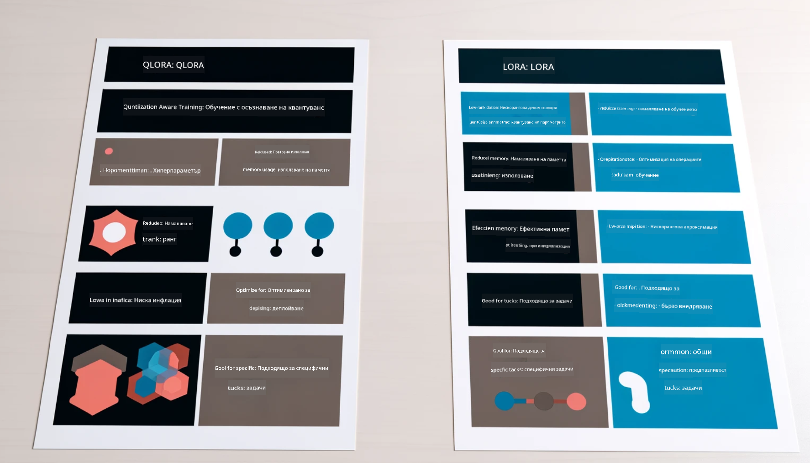

<!--
CO_OP_TRANSLATOR_METADATA:
{
  "original_hash": "743d7e9cb9c4e8ea642d77bee657a7fa",
  "translation_date": "2025-07-17T10:01:13+00:00",
  "source_file": "md/03.FineTuning/LetPhi3gotoIndustriy.md",
  "language_code": "bg"
}
-->
# **Нека Phi-3 стане експерт в индустрията**

За да внедрите модела Phi-3 в дадена индустрия, трябва да добавите бизнес данни от тази индустрия към модела Phi-3. Имаме два различни варианта – първият е RAG (Retrieval Augmented Generation), а вторият е Fine Tuning.

## **RAG срещу Fine-Tuning**

### **Retrieval Augmented Generation**

RAG е съчетание от извличане на данни и генериране на текст. Структурираните и неструктурираните данни на предприятието се съхраняват във векторна база данни. При търсене на релевантно съдържание се намират подходящи обобщения и материали, които формират контекст, а след това се използва способността за допълване на текст на LLM/SLM, за да се генерира съдържание.

### **Fine-tuning**

Fine-tuning представлява усъвършенстване на конкретен модел. Не е необходимо да се започва от алгоритъма на модела, но данните трябва да се натрупват постоянно. Ако искате по-прецизна терминология и езиково изразяване в индустриални приложения, fine-tuning е по-добрият избор. Но ако данните ви се променят често, fine-tuning може да се окаже сложен.

### **Как да изберем**

1. Ако отговорът изисква въвеждане на външни данни, RAG е най-добрият избор.

2. Ако трябва да се предостави стабилно и прецизно индустриално знание, fine-tuning ще е по-добрият вариант. RAG приоритизира извличането на релевантно съдържание, но може да не улови всички специализирани нюанси.

3. Fine-tuning изисква висококачествен набор от данни, а ако данните са в малък обхват, ефектът ще е минимален. RAG е по-гъвкав.

4. Fine-tuning е черна кутия, метафизика, и е трудно да се разбере вътрешният му механизъм. Но RAG улеснява намирането на източника на данните, което помага за ефективно коригиране на халюцинации или грешки в съдържанието и осигурява по-добра прозрачност.

### **Сценарии**

1. Вертикални индустрии, които изискват специфична професионална терминология и изрази, ***Fine-tuning*** е най-добрият избор.

2. QA системи, включващи синтез на различни знания, ***RAG*** е най-добрият избор.

3. Комбинацията от автоматизиран бизнес процес ***RAG + Fine-tuning*** е най-добрият избор.

## **Как да използваме RAG**

Векторната база данни е колекция от данни, съхранявани в математическа форма. Векторните бази данни улесняват машинното обучение да запомня предишни входни данни, което позволява използването на машинно обучение за поддръжка на случаи като търсене, препоръки и генериране на текст. Данните могат да се идентифицират въз основа на метрики за сходство, а не на точни съвпадения, което позволява на компютърните модели да разбират контекста на данните.

Векторната база данни е ключът за реализиране на RAG. Можем да конвертираме данните във векторно съхранение чрез векторни модели като text-embedding-3, jina-ai-embedding и други.

Научете повече за създаването на RAG приложение [https://github.com/microsoft/Phi-3CookBook](https://github.com/microsoft/Phi-3CookBook?WT.mc_id=aiml-138114-kinfeylo)

## **Как да използваме Fine-tuning**

Често използваните алгоритми във Fine-tuning са Lora и QLora. Как да изберем?
- [Научете повече с този примерен ноутбук](../../../../code/04.Finetuning/Phi_3_Inference_Finetuning.ipynb)
- [Пример на Python FineTuning скрипт](../../../../code/04.Finetuning/FineTrainingScript.py)

### **Lora и QLora**

LoRA (Low-Rank Adaptation) и QLoRA (Quantized Low-Rank Adaptation) са техники за фино настройване на големи езикови модели (LLMs) чрез Parameter Efficient Fine Tuning (PEFT). PEFT техниките са създадени, за да тренират моделите по-ефективно в сравнение с традиционните методи.  
LoRA е самостоятелна техника за фино настройване, която намалява използването на памет чрез прилагане на нискорангова апроксимация върху матрицата за обновяване на теглата. Тя предлага бързо обучение и запазва производителността близо до традиционните методи за фино настройване.

QLoRA е разширена версия на LoRA, която включва техники за квантуване, за да намали още повече използването на памет. QLoRA квантува прецизността на параметрите на теглата в предварително обучен LLM до 4-битова прецизност, което е по-ефективно по отношение на паметта в сравнение с LoRA. Въпреки това, обучението с QLoRA е около 30% по-бавно от това с LoRA заради допълнителните стъпки на квантуване и деквантуване.

QLoRA използва LoRA като допълнение, за да коригира грешките, въведени по време на квантуването. QLoRA позволява фино настройване на огромни модели с милиарди параметри на сравнително малки и широко достъпни GPU-та. Например, QLoRA може да фино настрои модел с 70 милиарда параметри, който изисква 36 GPU-та, използвайки само 2...

**Отказ от отговорност**:  
Този документ е преведен с помощта на AI преводаческа услуга [Co-op Translator](https://github.com/Azure/co-op-translator). Въпреки че се стремим към точност, моля, имайте предвид, че автоматизираните преводи могат да съдържат грешки или неточности. Оригиналният документ на неговия роден език трябва да се счита за авторитетен източник. За критична информация се препоръчва професионален човешки превод. Ние не носим отговорност за каквито и да е недоразумения или неправилни тълкувания, произтичащи от използването на този превод.