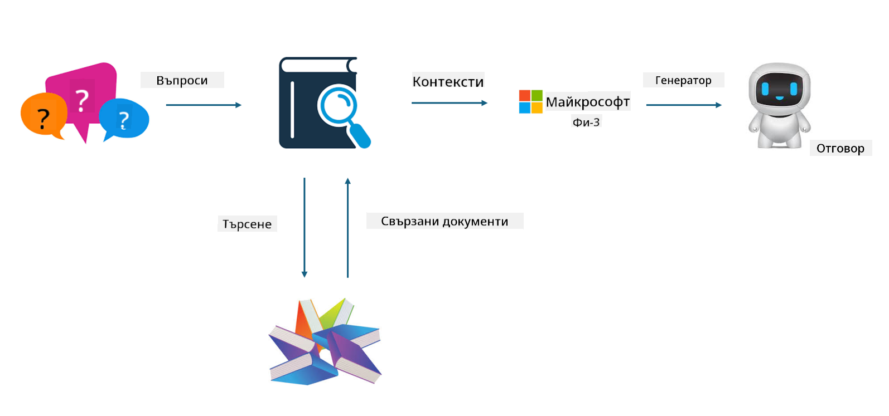

<!--
CO_OP_TRANSLATOR_METADATA:
{
  "original_hash": "743d7e9cb9c4e8ea642d77bee657a7fa",
  "translation_date": "2025-05-09T22:29:53+00:00",
  "source_file": "md/03.FineTuning/LetPhi3gotoIndustriy.md",
  "language_code": "bg"
}
-->
# **Нека Phi-3 стане експерт в индустрията**

За да внедрите модела Phi-3 в дадена индустрия, трябва да добавите бизнес данни от индустрията към модела Phi-3. Имаме два различни варианта – първият е RAG (Retrieval Augmented Generation), а вторият е Fine Tuning.

## **RAG срещу Fine-Tuning**

### **Retrieval Augmented Generation**

RAG е съчетание от извличане на данни и генериране на текст. Структурираните и неструктурираните данни на предприятието се съхраняват във векторна база данни. При търсене на релевантно съдържание се намират подходящи резюмета и материали, които оформят контекст, а след това се комбинира способността на LLM/SLM за допълване на текст, за да се генерира съдържание.

### **Fine-tuning**

Fine-tuning е базирано на подобряване на даден модел. Не е необходимо да се започва от алгоритъма на модела, но данните трябва да се натрупват постоянно. Ако искате по-прецизни термини и езикови изрази в индустриални приложения, fine-tuning е по-добрият избор. Но ако данните ви се променят често, fine-tuning може да стане сложен.

### **Как да изберем**

1. Ако отговорът ни изисква въвеждане на външни данни, RAG е най-добрият избор.

2. Ако трябва да изведете стабилни и точни индустриални знания, fine-tuning ще бъде добър избор. RAG приоритетно извлича релевантно съдържание, но не винаги улавя специализираните нюанси.

3. Fine-tuning изисква висококачествен набор от данни, и ако данните са само в малък обхват, това няма да направи голяма разлика. RAG е по-гъвкав.

4. Fine-tuning е черна кутия, метафизика, и е трудно да се разбере вътрешният механизъм. Но RAG улеснява намирането на източника на данните, което позволява ефективно коригиране на халюцинации или грешки в съдържанието и осигурява по-добра прозрачност.

### **Сценарии**

1. Вертикални индустрии, изискващи специфична професионална терминология и изрази, ***Fine-tuning*** ще бъде най-добрият избор.

2. QA система, включваща синтез на различни знания, ***RAG*** ще бъде най-добрият избор.

3. Комбинация от автоматизиран бизнес процес ***RAG + Fine-tuning*** е най-добрият избор.

## **Как да използваме RAG**

Векторната база данни е колекция от данни, съхранени в математическа форма. Векторните бази данни улесняват машинното обучение да запомня предишни входни данни, което позволява използването на машинно обучение за подпомагане на случаи като търсене, препоръки и генериране на текст. Данните могат да се идентифицират на базата на метрики за сходство, а не на точни съвпадения, което позволява на компютърните модели да разбират контекста на данните.

Векторната база данни е ключът за реализиране на RAG. Можем да преобразуваме данните във векторно съхранение чрез векторни модели като text-embedding-3, jina-ai-embedding и др.

Научете повече за създаване на RAG приложение [https://github.com/microsoft/Phi-3CookBook](https://github.com/microsoft/Phi-3CookBook?WT.mc_id=aiml-138114-kinfeylo) 

## **Как да използваме Fine-tuning**

Често използваните алгоритми във Fine-tuning са Lora и QLora. Как да изберем?
- [Научете повече с този примерен notebook](../../../../code/04.Finetuning/Phi_3_Inference_Finetuning.ipynb)
- [Пример на Python FineTuning скрипт](../../../../code/04.Finetuning/FineTrainingScript.py)

### **Lora и QLora**

LoRA (Low-Rank Adaptation) и QLoRA (Quantized Low-Rank Adaptation) са техники за фино настройване на големи езикови модели (LLMs) чрез Parameter Efficient Fine Tuning (PEFT). PEFT техниките са създадени, за да тренират моделите по-ефективно от традиционните методи.  
LoRA е самостоятелна техника за фино настройване, която намалява използването на памет, като прилага нискорангово приближение на матрицата за обновяване на тежестите. Това осигурява бързо обучение и запазва производителността близо до традиционните методи за фино настройване.

QLoRA е разширена версия на LoRA, която включва техники за квантуване с цел допълнително намаляване на използването на памет. QLoRA квантува прецизността на параметрите на тежестите в предварително обучените LLM до 4-битова прецизност, което е по-ефективно по отношение на паметта от LoRA. Въпреки това, обучението с QLoRA е около 30% по-бавно от това с LoRA заради допълнителните стъпки на квантуване и деквантуване.

QLoRA използва LoRA като помощно средство за коригиране на грешките, въведени при квантуването. QLoRA позволява фино настройване на огромни модели с милиарди параметри на сравнително малки и достъпни GPU-та. Например, QLoRA може да фино настрои модел с 70B параметъра, който обикновено изисква 36 GPU-та, използвайки само 2.

**Отказ от отговорност**:  
Този документ е преведен с помощта на AI преводаческа услуга [Co-op Translator](https://github.com/Azure/co-op-translator). Въпреки че се стремим към точност, моля, имайте предвид, че автоматизираните преводи могат да съдържат грешки или неточности. Оригиналният документ на неговия роден език трябва да се счита за авторитетен източник. За критична информация се препоръчва професионален човешки превод. Ние не носим отговорност за никакви недоразумения или неправилни тълкувания, произтичащи от използването на този превод.