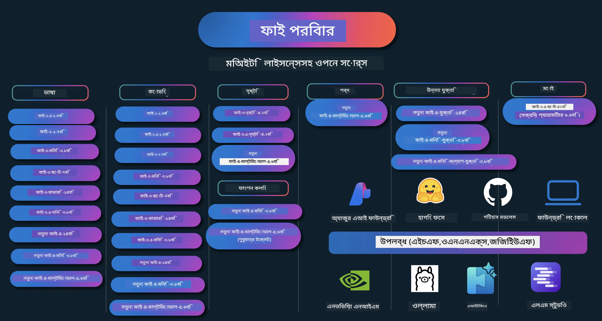

# Phi কুকবুক: Microsoft এর Phi মডেলগুলির সাথে হ্যান্ডস-অন উদাহরণসমূহ

[](https://codespaces.new/microsoft/phicookbook)
[](https://vscode.dev/redirect?url=vscode://ms-vscode-remote.remote-containers/cloneInVolume?url=https://github.com/microsoft/phicookbook)

[](https://GitHub.com/microsoft/phicookbook/graphs/contributors/?WT.mc_id=aiml-137032-kinfeylo)
[](https://GitHub.com/microsoft/phicookbook/issues/?WT.mc_id=aiml-137032-kinfeylo)
[](https://GitHub.com/microsoft/phicookbook/pulls/?WT.mc_id=aiml-137032-kinfeylo)
[](http://makeapullrequest.com?WT.mc_id=aiml-137032-kinfeylo)

[](https://GitHub.com/microsoft/phicookbook/watchers/?WT.mc_id=aiml-137032-kinfeylo)
[](https://GitHub.com/microsoft/phicookbook/network/?WT.mc_id=aiml-137032-kinfeylo)
[](https://GitHub.com/microsoft/phicookbook/stargazers/?WT.mc_id=aiml-137032-kinfeylo)

[](https://discord.com/invite/ByRwuEEgH4)

Phi হলো Microsoft দ্বারা উন্নত একটি মুক্তমূলের AI মডেল সিরিজ।

Phi বর্তমানে সবচেয়ে শক্তিশালী এবং খরচ-বিজ্ঞ ছোট ভাষার মডেল (SLM), যা বহুভাষিক, যুক্তি, লেখা/চ্যাট জেনারেশন, কোডিং, ছবি, অডিও এবং অন্যান্য পরিস্থিতিতে খুব ভালো বেঞ্চমার্ক প্রদর্শন করে।

আপনি Phi ক্লাউডে অথবা এজ ডিভাইসে মোতায়েন করতে পারেন এবং সীমিত কম্পিউটিং ক্ষমতা দিয়ে সহজেই জেনেরেটিভ AI অ্যাপ্লিকেশন তৈরি করতে পারেন।

এই রিসোর্সগুলি ব্যবহার শুরু করতে নিম্নলিখিত ধাপগুলো অনুসরণ করুন:
1. **রিপোজিটোরি ফর্ক করুন**: ক্লিক করুন [](https://GitHub.com/microsoft/phicookbook/network/?WT.mc_id=aiml-137032-kinfeylo)
2. **রিপোজিটোরি ক্লোন করুন**:   `git clone https://github.com/microsoft/PhiCookBook.git`
3. [**Microsoft AI Discord কমিউনিটিতে যোগ দিন এবং বিশেষজ্ঞ ও অন্যান্য ডেভেলপারদের সাথে মেলামেশা করুন**](https://discord.com/invite/ByRwuEEgH4?WT.mc_id=aiml-137032-kinfeylo)



### 🌐 বহুভাষিক সমর্থন

#### GitHub Action এর মাধ্যমে সমর্থিত (স্বয়ংক্রিয় ও সর্বদা আপ-টু-ডেট)

<!-- CO-OP TRANSLATOR LANGUAGES TABLE START -->
[আরবি](../ar/README.md) | [বাংলা](./README.md) | [বুলগেরীয়](../bg/README.md) | [বার্মিজ (মায়ানমার)](../my/README.md) | [চীনা (সরলীকৃত)](../zh-CN/README.md) | [চীনা (প্রথাগত, হংকং)](../zh-HK/README.md) | [চীনা (প্রথাগত, ম্যাকাও)](../zh-MO/README.md) | [চীনা (প্রথাগত, তাইওয়ান)](../zh-TW/README.md) | [ক্রোয়েশিয়ান](../hr/README.md) | [চেক](../cs/README.md) | [ডেনিশ](../da/README.md) | [ডাচ](../nl/README.md) | [এস্তোনীয়](../et/README.md) | [ফিনিশ](../fi/README.md) | [ফরাসি](../fr/README.md) | [জার্মান](../de/README.md) | [গ্রিক](../el/README.md) | [হিব্রু](../he/README.md) | [হিন্দি](../hi/README.md) | [হাঙ্গেরিয়ান](../hu/README.md) | [ইন্দোনেশীয়](../id/README.md) | [ইতালিয়ান](../it/README.md) | [জাপানি](../ja/README.md) | [কন্নড়](../kn/README.md) | [কোরিয়ান](../ko/README.md) | [লিথুয়েনিয়ান](../lt/README.md) | [মালয়](../ms/README.md) | [মালায়ালাম](../ml/README.md) | [মারাঠি](../mr/README.md) | [নেপালি](../ne/README.md) | [নাইজেরিয়ান পিজিন](../pcm/README.md) | [নরওয়েজীয়](../no/README.md) | [পারস্য (ফার্সি)](../fa/README.md) | [পোলিশ](../pl/README.md) | [পর্তুগিজ (ব্রাজিল)](../pt-BR/README.md) | [পর্তুগিজ (পর্তুগাল)](../pt-PT/README.md) | [পাঞ্জাবি (গুরুমুখী)](../pa/README.md) | [রুমানিয়ান](../ro/README.md) | [রাশিয়ান](../ru/README.md) | [সার্বিয়ান (সিরিলিক)](../sr/README.md) | [স্লোভাক](../sk/README.md) | [স্লোভেনিয়ান](../sl/README.md) | [স্প্যানিশ](../es/README.md) | [সোয়াহিলি](../sw/README.md) | [সুইডিশ](../sv/README.md) | [তাগালগ (ফিলিপিনো)](../tl/README.md) | [তামিল](../ta/README.md) | [তেলুগু](../te/README.md) | [থাই](../th/README.md) | [তুর্কিশ](../tr/README.md) | [ইউক্রেনিয়ান](../uk/README.md) | [উর্দু](../ur/README.md) | [ভিয়েতনামিজ](../vi/README.md)

> **লোকালিতে ক্লোন করতে চান?**
>
> এই রিপোজিটোরিতে ৫০+টি ভাষার অনুবাদ রয়েছে যা ডাউনলোডের আকার অনেক বাড়িয়ে দেয়। অনুবাদ ছাড়া ক্লোন করতে, sparse checkout ব্যবহার করুন:
>
> **Bash / macOS / Linux:**
> ```bash
> git clone --filter=blob:none --sparse https://github.com/microsoft/PhiCookBook.git
> cd PhiCookBook
> git sparse-checkout set --no-cone '/*' '!translations' '!translated_images'
> ```
>
> **CMD (Windows):**
> ```cmd
> git clone --filter=blob:none --sparse https://github.com/microsoft/PhiCookBook.git
> cd PhiCookBook
> git sparse-checkout set --no-cone "/*" "!translations" "!translated_images"
> ```
>
> এতে আপনি অনেক দ্রুত ডাউনলোড করে কোর্স সম্পন্ন করার সব কিছু পাবেন।
<!-- CO-OP TRANSLATOR LANGUAGES TABLE END -->

## বিষয়বস্তু তালিকা

- পরিচিতি
  - [Phi পরিবারের প্রতি স্বাগতম](./md/01.Introduction/01/01.PhiFamily.md)
  - [আপনার পরিবেশ সেটআপ করা](./md/01.Introduction/01/01.EnvironmentSetup.md)
  - [মূল প্রযুক্তিগুলো বোঝা](./md/01.Introduction/01/01.Understandingtech.md)
  - [Phi মডেলগুলোর জন্য AI সেফটি](./md/01.Introduction/01/01.AISafety.md)
  - [Phi হার্ডওয়্যার সমর্থন](./md/01.Introduction/01/01.Hardwaresupport.md)
  - [Phi মডেল এবং বিভিন্ন প্ল্যাটফর্মে প্রাপ্যতা](./md/01.Introduction/01/01.Edgeandcloud.md)
  - [Guidance-ai এবং Phi ব্যবহার](./md/01.Introduction/01/01.Guidance.md)
  - [GitHub মার্কেটপ্লেস মডেল](https://github.com/marketplace/models)
  - [Azure AI মডেল ক্যাটালগ](https://ai.azure.com)

- বিভিন্ন পরিবেশে Phi ইনফারেন্স
    -  [Hugging face](./md/01.Introduction/02/01.HF.md)
    -  [GitHub মডেল](./md/01.Introduction/02/02.GitHubModel.md)
    -  [Azure AI Foundry মডেল ক্যাটালগ](./md/01.Introduction/02/03.AzureAIFoundry.md)
    -  [Ollama](./md/01.Introduction/02/04.Ollama.md)
    -  [AI Toolkit VSCode (AITK)](./md/01.Introduction/02/05.AITK.md)
    -  [NVIDIA NIM](./md/01.Introduction/02/06.NVIDIA.md)
    -  [Foundry Local](./md/01.Introduction/02/07.FoundryLocal.md)

- Phi পরিবারের ইনফারেন্স
    - [iOS-এ Phi ইনফারেন্স](./md/01.Introduction/03/iOS_Inference.md)
    - [Android-এ Phi ইনফারেন্স](./md/01.Introduction/03/Android_Inference.md)
    - [Jetson-এ Phi ইনফারেন্স](./md/01.Introduction/03/Jetson_Inference.md)
    - [AI PC-তে Phi ইনফারেন্স](./md/01.Introduction/03/AIPC_Inference.md)
    - [Apple MLX Framework-সহ Phi ইনফারেন্স](./md/01.Introduction/03/MLX_Inference.md)
    - [লোকাল সার্ভারে Phi ইনফারেন্স](./md/01.Introduction/03/Local_Server_Inference.md)
    - [AI Toolkit ব্যবহার করে রিমোট সার্ভারে Phi ইনফারেন্স](./md/01.Introduction/03/Remote_Interence.md)
    - [Rust সহ Phi ইনফারেন্স](./md/01.Introduction/03/Rust_Inference.md)
    - [লোকালে Phi--Vision ইনফারেন্স](./md/01.Introduction/03/Vision_Inference.md)
    - [Kaito AKS, Azure Containers (অফিশিয়াল সমর্থন) সহ Phi ইনফারেন্স](./md/01.Introduction/03/Kaito_Inference.md)
-  [Phi পরিবারের কোয়ান্টিফিকেশন](./md/01.Introduction/04/QuantifyingPhi.md)
    - [llama.cpp ব্যবহার করে Phi-3.5 / 4 কোয়ান্টাইজিং](./md/01.Introduction/04/UsingLlamacppQuantifyingPhi.md)
    - [onnxruntime এর জন্য Generative AI এক্সটেনশন ব্যবহার করে Phi-3.5 / 4 কোয়ান্টাইজিং](./md/01.Introduction/04/UsingORTGenAIQuantifyingPhi.md)
    - [Intel OpenVINO ব্যবহার করে Phi-3.5 / 4 কোয়ান্টাইজিং](./md/01.Introduction/04/UsingIntelOpenVINOQuantifyingPhi.md)
    - [Apple MLX Framework ব্যবহার করে Phi-3.5 / 4 কোয়ান্টাইজিং](./md/01.Introduction/04/UsingAppleMLXQuantifyingPhi.md)

-  Phi মূল্যায়ন
    - [দায়িত্বশীল AI](./md/01.Introduction/05/ResponsibleAI.md)
    - [মূল্যায়নের জন্য Azure AI Foundry](./md/01.Introduction/05/AIFoundry.md)
    - [মূল্যায়নের জন্য Promptflow ব্যবহার](./md/01.Introduction/05/Promptflow.md)
 
- Azure AI Search সহ RAG
    - [Phi-4-mini এবং Phi-4-multimodal(RAG) Azure AI Search সহ কীভাবে ব্যবহার করবেন](https://github.com/microsoft/PhiCookBook/blob/main/code/06.E2E/E2E_Phi-4-RAG-Azure-AI-Search.ipynb)

- Phi অ্যাপ্লিকেশন ডেভেলপমেন্টের নমুনা
  - লেখা ও চ্যাট অ্যাপ্লিকেশন
    - Phi-4 নমুনাসমূহ 🆕
      - [📓] [Phi-4-mini ONNX মডেল সহ চ্যাট](./md/02.Application/01.TextAndChat/Phi4/ChatWithPhi4ONNX/README.md)
      - [Phi-4 লোকাল ONNX মডেল .NET সহ চ্যাট](../../md/04.HOL/dotnet/src/LabsPhi4-Chat-01OnnxRuntime)
      - [Phi-4 ONNX ব্যবহার করে সেম্যান্টিক কার্নেল সহ .NET কনসোল অ্যাপ চ্যাট](../../md/04.HOL/dotnet/src/LabsPhi4-Chat-02SK)
    - Phi-3 / 3.5 নমুনাসমূহ
      - [Phi3, ONNX Runtime Web এবং WebGPU ব্যবহার করে ব্রাউজারে লোকাল চ্যাটবট](https://github.com/microsoft/onnxruntime-inference-examples/tree/main/js/chat)
      - [OpenVino Chat](./md/02.Application/01.TextAndChat/Phi3/E2E_OpenVino_Chat.md)
      - [মাল্টি মডেল - ইন্টারেকটিভ Phi-3-মিনি এবং OpenAI Whisper](./md/02.Application/01.TextAndChat/Phi3/E2E_Phi-3-mini_with_whisper.md)
      - [MLFlow - একটি র‍্যাপার তৈরি এবং Phi-3 কে MLFlow এর সাথে ব্যবহার করা](./md//02.Application/01.TextAndChat/Phi3/E2E_Phi-3-MLflow.md)
      - [মডেল অপ্টিমাইজেশন - ONNX Runtime Web এর জন্য Phi-3-min মডেলকে Olive দিয়ে কীভাবে অপ্টিমাইজ করবেন](https://github.com/microsoft/Olive/tree/main/examples/phi3)
      - [Phi-3 mini-4k-instruct-onnx সহ WinUI3 অ্যাপ](https://github.com/microsoft/Phi3-Chat-WinUI3-Sample/)
      -[WinUI3 মাল্টি মডেল AI চালিত নোটস অ্যাপ স্যাম্পল](https://github.com/microsoft/ai-powered-notes-winui3-sample)
      - [Prompt flow এর সাথে কাস্টম Phi-3 মডেল ফাইন-টিউন এবং ইন্টিগ্রেট করা](./md/02.Application/01.TextAndChat/Phi3/E2E_Phi-3-FineTuning_PromptFlow_Integration.md)
      - [Azure AI Foundry তে Prompt flow এর সাথে কাস্টম Phi-3 মডেল ফাইন-টিউন এবং ইন্টিগ্রেট করা](./md/02.Application/01.TextAndChat/Phi3/E2E_Phi-3-FineTuning_PromptFlow_Integration_AIFoundry.md)
      - [Microsoft-এর দায়িত্বশীল AI নীতিমালার উপর ফোকাস করে Azure AI Foundry-তে ফাইন-টিউন করা Phi-3 / Phi-3.5 মডেল মূল্যায়ন](./md/02.Application/01.TextAndChat/Phi3/E2E_Phi-3-Evaluation_AIFoundry.md)
      - [📓] [Phi-3.5-মিনি-ইনস্ট্রাক্ট ভাষা পূর্বাভাস স্যাম্পল (চাইনিজ/ইংরেজি)](./md/02.Application/01.TextAndChat/Phi3/phi3-instruct-demo.ipynb)
      - [Phi-3.5-Instruct WebGPU RAG চ্যাটবট](./md/02.Application/01.TextAndChat/Phi3/WebGPUWithPhi35Readme.md)
      - [Phi-3.5-Instruct ONNX ব্যবহার করে উইন্ডোজ GPU এর মাধ্যমে Prompt flow সলিউশন তৈরি](./md/02.Application/01.TextAndChat/Phi3/UsingPromptFlowWithONNX.md)
      - [Microsoft Phi-3.5 tflite ব্যবহার করে অ্যান্ড্রয়েড অ্যাপ তৈরি](./md/02.Application/01.TextAndChat/Phi3/UsingPhi35TFLiteCreateAndroidApp.md)
      - [Microsoft.ML.OnnxRuntime ব্যবহার করে স্থানীয় ONNX Phi-3 মডেল ব্যবহার করে Q&A .NET উদাহরণ](../../md/04.HOL/dotnet/src/LabsPhi301)
      - [Semantic Kernel এবং Phi-3 সহ কনসোল চ্যাট .NET অ্যাপ](../../md/04.HOL/dotnet/src/LabsPhi302)

  - Azure AI ইনফারেন্স SDK কোড ভিত্তিক স্যাম্পল 
    - Phi-4 স্যাম্পল 🆕
      - [📓] [Phi-4-multimodal ব্যবহার করে প্রকল্প কোড তৈরি](./md/02.Application/02.Code/Phi4/GenProjectCode/README.md)
    - Phi-3 / 3.5 স্যাম্পল
      - [Microsoft Phi-3 ফ্যামিলি ব্যবহার করে নিজের Visual Studio Code GitHub Copilot Chat তৈরি করুন](./md/02.Application/02.Code/Phi3/VSCodeExt/README.md)
      - [GitHub মডেলের মাধ্যমে Phi-3.5 দিয়ে নিজের Visual Studio Code Chat Copilot Agent তৈরি করুন](/md/02.Application/02.Code/Phi3/CreateVSCodeChatAgentWithGitHubModels.md)

  - উন্নত রিজনিং স্যাম্পল
    - Phi-4 স্যাম্পল 🆕
      - [📓] [Phi-4-মিনি-রিজনিং অথবা Phi-4-রিজনিং স্যাম্পল](./md/02.Application/03.AdvancedReasoning/Phi4/AdvancedResoningPhi4mini/README.md)
      - [📓] [Microsoft Olive দিয়ে Phi-4-মিনি-রিজনিং ফাইন-টিউনিং](./md/02.Application/03.AdvancedReasoning/Phi4/AdvancedResoningPhi4mini/olive_ft_phi_4_reasoning_with_medicaldata.ipynb)
      - [📓] [Apple MLX দিয়ে Phi-4-মিনি-রিজনিং ফাইন-টিউনিং](./md/02.Application/03.AdvancedReasoning/Phi4/AdvancedResoningPhi4mini/mlx_ft_phi_4_reasoning_with_medicaldata.ipynb)
      - [📓] [GitHub মডেলের সঙ্গে Phi-4-মিনি-রিজনিং](./md/02.Application/02.Code/Phi4r/github_models_inference.ipynb)
      - [📓] [Azure AI Foundry মডেলের সঙ্গে Phi-4-মিনি-রিজনিং](./md/02.Application/02.Code/Phi4r/azure_models_inference.ipynb)
  - ডেমো
      - [Hugging Face Spaces-এ হোস্ট করা Phi-4-মিনি ডেমো](https://huggingface.co/spaces/microsoft/phi-4-mini?WT.mc_id=aiml-137032-kinfeylo)
      - [Hugginge Face Spaces-এ হোস্ট করা Phi-4-multimodal ডেমো](https://huggingface.co/spaces/microsoft/phi-4-multimodal?WT.mc_id=aiml-137032-kinfeylo)
  - ভিশন স্যাম্পল
    - Phi-4 স্যাম্পল 🆕
      - [📓] [ছবি পড়তে এবং কোড তৈরি করতে Phi-4-multimodal ব্যবহার করুন](./md/02.Application/04.Vision/Phi4/CreateFrontend/README.md) 
    - Phi-3 / 3.5 স্যাম্পল
      -  [📓][Phi-3-ভিশন-ছবি টেক্সট থেকে টেক্সট](./md/02.Application/04.Vision/Phi3/E2E_Phi-3-vision-image-text-to-text-online-endpoint.ipynb)
      - [Phi-3-ভিশন-ONNX](https://onnxruntime.ai/docs/genai/tutorials/phi3-v.html)
      - [📓][Phi-3-ভিশন CLIP এমবেডিং](./md/02.Application/04.Vision/Phi3/E2E_Phi-3-vision-image-text-to-text-online-endpoint.ipynb)
      - [ডেমো: Phi-3 রিসাইক্লিং](https://github.com/jennifermarsman/PhiRecycling/)
      - [Phi-3-ভিশন - ভিজ্যুয়াল ভাষার সহকারী - Phi3-ভিশন এবং OpenVINO সহ](https://docs.openvino.ai/nightly/notebooks/phi-3-vision-with-output.html)
      - [Phi-3 ভিশন Nvidia NIM](./md/02.Application/04.Vision/Phi3/E2E_Nvidia_NIM_Vision.md)
      - [Phi-3 ভিশন OpenVino](./md/02.Application/04.Vision/Phi3/E2E_OpenVino_Phi3Vision.md)
      - [📓][Phi-3.5 ভিশন মাল্টি-ফ্রেম অথবা মাল্টি-ইমেজ স্যাম্পল](./md/02.Application/04.Vision/Phi3/phi3-vision-demo.ipynb)
      - [Microsoft.ML.OnnxRuntime .NET ব্যবহার করে স্থানীয় ONNX মডেল ব্যবহৃত Phi-3 ভিশন](../../md/04.HOL/dotnet/src/LabsPhi303)
      - [মেনু ভিত্তিক Microsoft.ML.OnnxRuntime .NET ব্যবহার করে স্থানীয় ONNX মডেল Phi-3 ভিশন](../../md/04.HOL/dotnet/src/LabsPhi304)

  - গাণিতিক স্যাম্পল
    -  Phi-4-মিনি-ফ্ল্যাশ-রিজনিং-ইনস্ট্রাক্ট স্যাম্পল 🆕 [Phi-4-মিনি-ফ্ল্যাশ-রিজনিং-ইনস্ট্রাক্ট সহ গাণিতিক ডেমো](./md/02.Application/09.Math/MathDemo.ipynb)

  - অডিও স্যাম্পল
    - Phi-4 স্যাম্পল 🆕
      - [📓] [Phi-4-multimodal ব্যবহার করে অডিও ট্রান্সক্রিপ্ট বের করা](./md/02.Application/05.Audio/Phi4/Transciption/README.md)
      - [📓] [Phi-4-multimodal অডিও স্যাম্পল](./md/02.Application/05.Audio/Phi4/Siri/demo.ipynb)
      - [📓] [Phi-4-multimodal স্পিচ অনুবাদ স্যাম্পল](./md/02.Application/05.Audio/Phi4/Translate/demo.ipynb)
      - [.NET কনসোল অ্যাপ্লিকেশন ব্যবহার করে Phi-4-multimodal অডিও ফাইল বিশ্লেষণ এবং ট্রান্সক্রিপ্ট তৈরি](../../md/04.HOL/dotnet/src/LabsPhi4-MultiModal-02Audio)

  - MOE স্যাম্পল
    - Phi-3 / 3.5 স্যাম্পল
      - [📓] [Phi-3.5 মিক্সচার অফ এক্সপার্টস মডেল (MoEs) সোশ্যাল মিডিয়া স্যাম্পল](./md/02.Application/06.MoE/Phi3/phi3_moe_demo.ipynb)
      - [📓] [NVIDIA NIM Phi-3 MOE, Azure AI সার্চ, এবং LlamaIndex এর সাথে রিট্রিভাল-অগমেন্টেড জেনারেশন (RAG) পাইপলাইন তৈরি](./md/02.Application/06.MoE/Phi3/azure-ai-search-nvidia-rag.ipynb)
      - 
  - ফাংশন কলিং স্যাম্পল
    - Phi-4 স্যাম্পল 🆕
      -  [📓] [Phi-4-মিনি দিয়ে ফাংশন কলিং ব্যবহার](./md/02.Application/07.FunctionCalling/Phi4/FunctionCallingBasic/README.md)
      -  [📓] [Phi-4-মিনি দিয়ে মাল্টি-এজেন্ট তৈরি করতে ফাংশন কলিং ব্যবহার](./md/02.Application/07.FunctionCalling/Phi4/Multiagents/Phi_4_mini_multiagent.ipynb)
      -  [📓] [Ollama সহ ফাংশন কলিং ব্যবহার](./md/02.Application/07.FunctionCalling/Phi4/Ollama/ollama_functioncalling.ipynb)
      -  [📓] [ONNX সহ ফাংশন কলিং ব্যবহার](./md/02.Application/07.FunctionCalling/Phi4/ONNX/onnx_parallel_functioncalling.ipynb)
  - মাল্টিমোডাল মিক্সিং স্যাম্পল
    - Phi-4 স্যাম্পল 🆕
      -  [📓] [Phi-4-multimodal কে টেকনোলজি সাংবাদিক হিসাবে ব্যবহার](./md/02.Application/08.Multimodel/Phi4/TechJournalist/phi_4_mm_audio_text_publish_news.ipynb)
      - [.NET কনসোল অ্যাপ্লিকেশন ব্যবহার করে Phi-4-multimodal ছবি বিশ্লেষণ](../../md/04.HOL/dotnet/src/LabsPhi4-MultiModal-01Images)

- Phi ফাইন-টিউনিং স্যাম্পল
  - [ফাইন-টিউনিং পরিস্থিতি](./md/03.FineTuning/FineTuning_Scenarios.md)
  - [ফাইন-টিউনিং বনাম RAG](./md/03.FineTuning/FineTuning_vs_RAG.md)
  - [Phi-3 কে ইন্ডাস্ট্রি এক্সপার্ট করে তোলার জন্য ফাইন-টিউনিং](./md/03.FineTuning/LetPhi3gotoIndustriy.md)
  - [AI Toolkit for VS Code দিয়ে Phi-3 ফাইন-টিউনিং](./md/03.FineTuning/Finetuning_VSCodeaitoolkit.md)
  - [Azure Machine Learning Service দিয়ে Phi-3 ফাইন-টিউনিং](./md/03.FineTuning/Introduce_AzureML.md)
  - [Lora দিয়ে Phi-3 ফাইন-টিউনিং](./md/03.FineTuning/FineTuning_Lora.md)
  - [QLora দিয়ে Phi-3 ফাইন-টিউনিং](./md/03.FineTuning/FineTuning_Qlora.md)
  - [Azure AI Foundry দিয়ে Phi-3 ফাইন-টিউনিং](./md/03.FineTuning/FineTuning_AIFoundry.md)
  - [Azure ML CLI/SDK দিয়ে Phi-3 ফাইন-টিউনিং](./md/03.FineTuning/FineTuning_MLSDK.md)
  - [Microsoft Olive দিয়ে ফাইন-টিউনিং](./md/03.FineTuning/FineTuning_MicrosoftOlive.md)
  - [Microsoft Olive হ্যান্ডস-অন ল্যাবে ফাইন-টিউনিং](./md/03.FineTuning/olive-lab/readme.md)
  - [Weights and Bias দিয়ে Phi-3-ভিশন ফাইন-টিউনিং](./md/03.FineTuning/FineTuning_Phi-3-visionWandB.md)
  - [Apple MLX ফ্রেমওয়ার্ক দিয়ে Phi-3 ফাইন-টিউনিং](./md/03.FineTuning/FineTuning_MLX.md)
  - [Phi-3-ভিশন ফাইন-টিউনিং (সরকারি সাপোর্ট)](./md/03.FineTuning/FineTuning_Vision.md)
  - [Kaito AKS, Azure Containers (সরকারি সাপোর্ট) সহ Phi-3 ফাইন-টিউনিং](./md/03.FineTuning/FineTuning_Kaito.md)
  - [Phi-3 এবং 3.5 ভিশনের ফাইন-টিউনিং](https://github.com/2U1/Phi3-Vision-Finetune)

- হ্যান্ডস অন ল্যাব
  - [সর্বাধুনিক মডেল অনুসন্ধান: LLMs, SLMs, স্থানীয় ডেভেলপমেন্ট এবং আরও অনেক কিছু](https://github.com/microsoft/aitour-exploring-cutting-edge-models)
  - [NLP সম্ভাবনা উন্মোচন: Microsoft Olive দিয়ে ফাইন-টিউনিং](https://github.com/azure/Ignite_FineTuning_workshop)
- একাডেমিক গবেষণা পত্রিকা ও প্রকাশনা  
  - [Textbooks Are All You Need II: phi-1.5 টেকনিক্যাল রিপোর্ট](https://arxiv.org/abs/2309.05463)  
  - [Phi-3 টেকনিক্যাল রিপোর্ট: আপনার ফোনে স্থানীয়ভাবে অত্যন্ত সক্ষম ভাষা মডেল](https://arxiv.org/abs/2404.14219)  
  - [Phi-4 টেকনিক্যাল রিপোর্ট](https://arxiv.org/abs/2412.08905)  
  - [Phi-4-Mini টেকনিক্যাল রিপোর্ট: মিক্সচার-অফ-লোরা দ্বারা কমপ্যাক্ট কিন্তু শক্তিশালী মাল্টিমডাল ভাষা মডেল](https://arxiv.org/abs/2503.01743)  
  - [ইন-ভিকল ফাংশন-ক্যালিংয়ের জন্য ছোট ভাষা মডেল অপ্টিমাইজ করা](https://arxiv.org/abs/2501.02342)  
  - [(WhyPHI) মাল্টিপল-চয়েস প্রশ্নোত্তরের জন্য PHI-3 এর ফাইন-টিউনিং: পদ্ধতি, ফলাফল এবং চ্যালেঞ্জ](https://arxiv.org/abs/2501.01588)  
  - [Phi-4-রিজনিং টেকনিক্যাল রিপোর্ট](https://www.microsoft.com/en-us/research/wp-content/uploads/2025/04/phi_4_reasoning.pdf)  
  - [Phi-4-mni-রিজনিং টেকনিক্যাল রিপোর্ট](https://huggingface.co/microsoft/Phi-4-mini-reasoning/blob/main/Phi-4-Mini-Reasoning.pdf)  

## Phi মডেল ব্যবহারের উপায়  

### Azure AI Foundry-তে Phi  

আপনি শিখতে পারবেন কীভাবে Microsoft Phi ব্যবহার করবেন এবং কীভাবে আপনার বিভিন্ন হার্ডওয়্যার ডিভাইসে End-to-End সমাধান তৈরি করবেন। Phi নিজে ব্যবহার করার জন্য, শুরু করুন মডেলগুলোর সাথে খেলা করে এবং আপনার পরিস্থিতির জন্য Phi কাস্টমাইজ করে [Azure AI Foundry Azure AI Model Catalog](https://aka.ms/phi3-azure-ai) ব্যবহার করে। আপনি আরও জানতে পারেন [Azure AI Foundry শুরু করার জন্য](/md/02.QuickStart/AzureAIFoundry_QuickStart.md)।  

**প্লেঙ্গ্রাউন্ড**  
প্রতিটি মডেলের জন্য পরীক্ষার একটি নিবেদিত প্লেঙ্গ্রাউন্ড রয়েছে [Azure AI Playground](https://aka.ms/try-phi3)।  

### GitHub মডেল ব্যবহার করে Phi  

আপনি শিখতে পারবেন কীভাবে Microsoft Phi ব্যবহার করবেন এবং কীভাবে আপনার বিভিন্ন হার্ডওয়্যার ডিভাইসে End-to-End সমাধান তৈরি করবেন। Phi নিজে ব্যবহার করার জন্য, শুরু করুন মডেলের সাথে খেলায় করে এবং আপনার পরিস্থিতির জন্য Phi কাস্টমাইজ করে [GitHub Model Catalog](https://github.com/marketplace/models?WT.mc_id=aiml-137032-kinfeylo) ব্যবহার করে। আপনি আরও জানতে পারেন [GitHub Model Catalog দিয়ে শুরু করা](/md/02.QuickStart/GitHubModel_QuickStart.md)।  

**প্লেঙ্গ্রাউন্ড**  
প্রতিটি মডেলের জন্য একটি নিবেদিত [প্লেঙ্গ্রাউন্ড যেখানে মডেল পরীক্ষা করা যায়](/md/02.QuickStart/GitHubModel_QuickStart.md) আছে।  

### Hugging Face-এ Phi  

আপনি মডেলটি [Hugging Face](https://huggingface.co/microsoft)-এও খুঁজে পেতে পারেন।  

**প্লেঙ্গ্রাউন্ড**  
[Hugging Chat প্লেঙ্গ্রাউন্ড](https://huggingface.co/chat/models/microsoft/Phi-3-mini-4k-instruct)  

## 🎒 অন্যান্য কোর্স  

আমাদের দল অন্যান্য কোর্স তৈরি করে! যাচাই করুন:  

<!-- CO-OP TRANSLATOR OTHER COURSES START -->  
### LangChain  
[](https://aka.ms/langchain4j-for-beginners)  
[](https://aka.ms/langchainjs-for-beginners?WT.mc_id=m365-94501-dwahlin)  
[](https://github.com/microsoft/langchain-for-beginners?WT.mc_id=m365-94501-dwahlin)  
---  

### Azure / Edge / MCP / এজেন্টস  
[](https://github.com/microsoft/AZD-for-beginners?WT.mc_id=academic-105485-koreyst)  
[](https://github.com/microsoft/edgeai-for-beginners?WT.mc_id=academic-105485-koreyst)  
[](https://github.com/microsoft/mcp-for-beginners?WT.mc_id=academic-105485-koreyst)  
[](https://github.com/microsoft/ai-agents-for-beginners?WT.mc_id=academic-105485-koreyst)  

---  

### জেনারেটিভ AI সিরিজ  
[](https://github.com/microsoft/generative-ai-for-beginners?WT.mc_id=academic-105485-koreyst)  
[-9333EA?style=for-the-badge&labelColor=E5E7EB&color=9333EA)](https://github.com/microsoft/Generative-AI-for-beginners-dotnet?WT.mc_id=academic-105485-koreyst)  
[-C084FC?style=for-the-badge&labelColor=E5E7EB&color=C084FC)](https://github.com/microsoft/generative-ai-for-beginners-java?WT.mc_id=academic-105485-koreyst)  
[-E879F9?style=for-the-badge&labelColor=E5E7EB&color=E879F9)](https://github.com/microsoft/generative-ai-with-javascript?WT.mc_id=academic-105485-koreyst)  

---  

### কোর লার্নিং  
[](https://aka.ms/ml-beginners?WT.mc_id=academic-105485-koreyst)  
[](https://aka.ms/datascience-beginners?WT.mc_id=academic-105485-koreyst)  
[](https://aka.ms/ai-beginners?WT.mc_id=academic-105485-koreyst)  
[](https://github.com/microsoft/Security-101?WT.mc_id=academic-96948-sayoung)  
[](https://aka.ms/webdev-beginners?WT.mc_id=academic-105485-koreyst)  
[](https://aka.ms/iot-beginners?WT.mc_id=academic-105485-koreyst)  
[](https://github.com/microsoft/xr-development-for-beginners?WT.mc_id=academic-105485-koreyst)  

---  

### কপাইলট সিরিজ  
[](https://aka.ms/GitHubCopilotAI?WT.mc_id=academic-105485-koreyst)  
[](https://github.com/microsoft/mastering-github-copilot-for-dotnet-csharp-developers?WT.mc_id=academic-105485-koreyst)  
[](https://github.com/microsoft/CopilotAdventures?WT.mc_id=academic-105485-koreyst)  
<!-- CO-OP TRANSLATOR OTHER COURSES END -->  

## দায়িত্বশীল AI  

Microsoft আমাদের গ্রাহকদের সাহায্য করতে প্রতিশ্রুতিবদ্ধ যাতে তারা আমাদের AI পণ্যগুলো দায়িত্বশীলভাবে ব্যবহার করতে পারে, আমাদের শেখা শেয়ার করতে পারে এবং ট্রান্সপারেন্সি নোট এবং ইমপ্যাক্ট অ্যাসেসমেন্টের মতো সরঞ্জামগুলোর মাধ্যমে বিশ্বাস-ভিত্তিক অংশীদারিত্ব গড়ে তুলতে পারে। এই অনেকগুলি সম্পদ আপনি পেতে পারেন [https://aka.ms/RAI](https://aka.ms/RAI) এ।  
Microsoft-এর দায়িত্বশীল AI পদ্ধতি আমাদের ন্যায্যতা, নির্ভরযোগ্যতা এবং নিরাপত্তা, গোপনীয়তা ও নিরাপত্তা, অন্তর্ভুক্তি, স্বচ্ছতা, এবং দায়বদ্ধতা বিষয়ক AI নীতির ভিত্তিতে প্রতিষ্ঠিত।  

বড় পরিসরের প্রাকৃতিক ভাষা, ছবি, এবং ভাষণ মডেল - যেমন এই উদাহরণে ব্যবহৃত - সম্ভাব্য এমনভাবে কাজ করতে পারে যা ন্যায্য নয়, নির্ভরযোগ্য নয় বা আপত্তিকর হতে পারে, যার ফলে ক্ষতি হতে পারে। অনুগ্রহ করে [Azure OpenAI সার্ভিস ট্রান্সপারেন্সি নোট](https://learn.microsoft.com/legal/cognitive-services/openai/transparency-note?tabs=text) পরামর্শ করুন যাতে ঝুঁকি এবং সীমাবদ্ধতা সম্পর্কে অবগত হওয়া যায়।  

এই ঝুঁকিগুলো কমানোর প্রস্তাবিত পদ্ধতি হল আপনার স্থাপত্যে একটি নিরাপত্তা ব্যবস্থা অন্তর্ভুক্ত করা যা ক্ষতিকর আচরণ শনাক্ত এবং প্রতিরোধ করতে পারে। [Azure AI Content Safety](https://learn.microsoft.com/azure/ai-services/content-safety/overview) একটি স্বাধীন সুরক্ষা স্তর প্রদান করে, যা অ্যাপ্লিকেশন ও সেবাগুলিতে ব্যবহারকারী-উত্পাদিত এবং AI-উত্পাদিত ক্ষতিকর সামগ্রী শনাক্ত করতে সক্ষম। Azure AI Content Safety-তে টেক্সট এবং ইমেজ API অন্তর্ভুক্ত রয়েছে যা আপনাকে খতরাপূর্ণ সামগ্রী চিনহিত করতে সাহায্য করে। Azure AI Foundry-এর মধ্যে, Content Safety সার্ভিসটি বিভিন্ন ধরনের মাধ্যম জুড়ে ক্ষতিকর সামগ্রী শনাক্তের জন্য নমুনা কোড দেখতে, অনুসন্ধান করতে এবং চেষ্টা করার সুযোগ দেয়। নিম্নলিখিত [দ্রুত শুরুকারী ডকুমেন্টেশন](https://learn.microsoft.com/azure/ai-services/content-safety/quickstart-text?tabs=visual-studio%2Clinux&pivots=programming-language-rest) আপনাকে সার্ভিসে রিকোয়েস্ট করা শেখাবে।  
আরেকটি দিক যা বিবেচনা করতে হবে তা হল সার্বিক অ্যাপ্লিকেশন কর্মক্ষমতা। বহু-মোড এবং বহু-মডেলের অ্যাপ্লিকেশনগুলির ক্ষেত্রে, আমরা কর্মক্ষমতা বলতে বুঝি যে সিস্টেমটি আপনি এবং আপনার ব্যবহারকারীরা প্রত্যাশা করেন সে অনুযায়ী কাজ করে, যার মধ্যে ক্ষতিকর আউটপুট তৈরি না করা অন্তর্ভুক্ত। [পারফরম্যান্স এবং কোয়ালিটি ও ঝুঁকি এবং সুরক্ষা মূল্যায়ক](https://learn.microsoft.com/azure/ai-studio/concepts/evaluation-metrics-built-in) ব্যবহার করে আপনার সার্বিক অ্যাপ্লিকেশনের কর্মক্ষমতা মূল্যায়ন করা গুরুত্বপূর্ণ। আপনি [কাস্টম ইভালুয়েটর](https://learn.microsoft.com/azure/ai-studio/how-to/develop/evaluate-sdk#custom-evaluators) তৈরি ও মূল্যায়ন করার ক্ষমতাও রাখেন।

আপনি আপনার উন্নয়ন পরিবেশে [Azure AI Evaluation SDK](https://microsoft.github.io/promptflow/index.html) ব্যবহার করে আপনার AI অ্যাপ্লিকেশন মূল্যায়ন করতে পারেন। একটি টেস্ট ডেটাসেট বা একটি লক্ষ্য দেওয়া হলে, আপনার জেনারেটিভ AI অ্যাপ্লিকেশন জেনারেশনগুলি আপনার পছন্দের বিল্ট-ইন ইভালুয়েটর বা কাস্টম ইভালুয়েটর দিয়ে পরিমাণগতভাবে মাপা হয়। আপনার সিস্টেম মূল্যায়নের জন্য Azure AI Evaluation SDK দিয়ে শুরু করতে, আপনি [দ্রুত গাইড](https://learn.microsoft.com/azure/ai-studio/how-to/develop/flow-evaluate-sdk) অনুসরণ করতে পারেন। একবার আপনি একটি মূল্যায়ন চালিয়ে ফেললে, আপনি [Azure AI Foundry-তে ফলাফলগুলো ভিজ্যুয়ালাইজ করতে পারেন](https://learn.microsoft.com/azure/ai-studio/how-to/evaluate-flow-results)।

## ট্রেডমার্ক

এই প্রকল্পে প্রকল্প, পণ্য, বা পরিষেবার জন্য ট্রেডমার্ক বা লোগো থাকতে পারে। Microsoft ট্রেডমার্ক বা লোগোর অনুমোদিত ব্যবহার Microsoft-এর [ট্রেডমার্ক ও ব্র্যান্ড নির্দেশিকা](https://www.microsoft.com/legal/intellectualproperty/trademarks/usage/general) অনুযায়ী হওয়া আবশ্যক এবং তা মেনে চলতে হবে। এই প্রকল্পের সংশোধিত সংস্করণে Microsoft ট্রেডমার্ক বা লোগো ব্যবহারে বিভ্রান্তি সৃষ্টি বা Microsoft স্পনসরশিপ বোঝানো যাবে না। তৃতীয় পক্ষের ট্রেডমার্ক বা লোগোর ব্যবহার সেই তৃতীয় পক্ষের নীতিমালা অনুসরণ করবে।

## সাহায্য পান

আপনি যদি আটকে যান বা AI অ্যাপ তৈরি সম্পর্কে কোনো প্রশ্ন থাকে, তাহলে যোগ দিন:

[](https://aka.ms/foundry/discord)

আপনার যদি প্রোডাক্ট ফিডব্যাক বা বিল্ডিং এর সময় কোনো ত্রুটি থাকে, তাহলে দেখুন:

[](https://aka.ms/foundry/forum)

---

<!-- CO-OP TRANSLATOR DISCLAIMER START -->
**দায়বদ্ধতার সীমাবদ্ধতা**:  
এই নথিটি AI অনুবাদ সেবা [Co-op Translator](https://github.com/Azure/co-op-translator) ব্যবহার করে অনুবাদ করা হয়েছে। আমরা যথাসাধ্য সঠিকতার প্রচেষ্টা করি, তবে স্বয়ংক্রিয় অনুবাদে ত্রুটি বা অসঙ্গতি থাকতে পারে। মূল নথিটি তার স্বতন্ত্র ভাষায়ই প্রামাণিক উৎস হিসেবে বিবেচনা করতে হবে। গুরুত্বপূর্ণ তথ্যের জন্য পেশাদার মানব অনুবাদ গ্রহণ করার পরামর্শ দেওয়া হয়। এই অনুবাদ ব্যবহারে কোনো ভুল বোঝাবুঝি বা ভ্রান্ত ব্যাখ্যার জন্য আমরা দায়ী নই।
<!-- CO-OP TRANSLATOR DISCLAIMER END -->