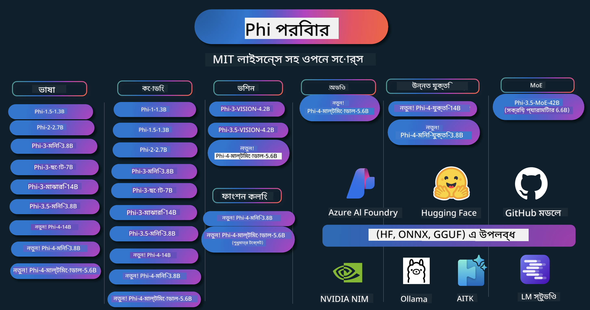

<!--
CO_OP_TRANSLATOR_METADATA:
{
  "original_hash": "1cab9282e04f2e1c388a38dca7763c16",
  "translation_date": "2025-05-09T03:46:01+00:00",
  "source_file": "README.md",
  "language_code": "bn"
}
-->
# Phi কুকবুক: Microsoft-এর Phi মডেল নিয়ে হাতে-কলমে উদাহরণসমূহ

Phi হলো Microsoft-এর তৈরি একটি ওপেন সোর্স AI মডেল সিরিজ।

Phi বর্তমানে সবচেয়ে শক্তিশালী এবং খরচে সাশ্রয়ী ছোট ভাষার মডেল (SLM), যা বহু ভাষা, যুক্তি, টেক্সট/চ্যাট জেনারেশন, কোডিং, ছবি, অডিও এবং অন্যান্য পরিস্থিতিতে খুব ভালো পারফরমেন্স দেখায়।

আপনি Phi ক্লাউডে বা এজ ডিভাইসে ডিপ্লয় করতে পারেন, এবং কম্পিউটিং শক্তি সীমিত থাকলেও সহজেই জেনারেটিভ AI অ্যাপ্লিকেশন তৈরি করতে পারবেন।

এই রিসোর্সগুলো ব্যবহার শুরু করার জন্য নিচের ধাপগুলো অনুসরণ করুন:
1. **রিপোজিটরি ফর্ক করুন**: ক্লিক করুন 
2. **রিপোজিটরি ক্লোন করুন**: `git clone https://github.com/microsoft/PhiCookBook.git`
3. [**Microsoft AI Discord কমিউনিটিতে যোগ দিন এবং বিশেষজ্ঞ ও অন্যান্য ডেভেলপারদের সাথে পরিচিত হন**](https://discord.com/invite/ByRwuEEgH4?WT.mc_id=aiml-137032-kinfeylo)

## 🌐 বহু-ভাষা সমর্থন

### GitHub Action-এর মাধ্যমে সমর্থিত (স্বয়ংক্রিয় ও সর্বদা হালনাগাদ)

[French](../fr/README.md) | [Spanish](../es/README.md) | [German](../de/README.md) | [Russian](../ru/README.md) | [Arabic](../ar/README.md) | [Persian (Farsi)](../fa/README.md) | [Urdu](../ur/README.md) | [Chinese (Simplified)](../zh/README.md) | [Chinese (Traditional, Macau)](../mo/README.md) | [Chinese (Traditional, Hong Kong)](../hk/README.md) | [Chinese (Traditional, Taiwan)](../tw/README.md) | [Japanese](../ja/README.md) | [Korean](../ko/README.md) | [Hindi](../hi/README.md)

### CLI-এর মাধ্যমে সমর্থিত
## বিষয়বস্তু সূচি

- পরিচিতি
- [Phi পরিবারে স্বাগতম](./md/01.Introduction/01/01.PhiFamily.md)
  - [আপনার পরিবেশ সেটআপ করা](./md/01.Introduction/01/01.EnvironmentSetup.md)
  - [মূল প্রযুক্তিগুলো বোঝা](./md/01.Introduction/01/01.Understandingtech.md)
  - [Phi মডেলগুলোর জন্য AI নিরাপত্তা](./md/01.Introduction/01/01.AISafety.md)
  - [Phi হার্ডওয়্যার সমর্থন](./md/01.Introduction/01/01.Hardwaresupport.md)
  - [Phi মডেল ও প্ল্যাটফর্ম জুড়ে উপলব্ধতা](./md/01.Introduction/01/01.Edgeandcloud.md)
  - [Guidance-ai এবং Phi ব্যবহার করা](./md/01.Introduction/01/01.Guidance.md)
  - [GitHub Marketplace Models](https://github.com/marketplace/models)
  - [Azure AI Model Catalog](https://ai.azure.com)

- বিভিন্ন পরিবেশে Phi ইনফারেন্স
    -  [Hugging face](./md/01.Introduction/02/01.HF.md)
    -  [GitHub Models](./md/01.Introduction/02/02.GitHubModel.md)
    -  [Azure AI Foundry Model Catalog](./md/01.Introduction/02/03.AzureAIFoundry.md)
    -  [Ollama](./md/01.Introduction/02/04.Ollama.md)
    -  [AI Toolkit VSCode (AITK)](./md/01.Introduction/02/05.AITK.md)
    -  [NVIDIA NIM](./md/01.Introduction/02/06.NVIDIA.md)

- Phi পরিবারে ইনফারেন্স
    - [iOS এ Phi ইনফারেন্স](./md/01.Introduction/03/iOS_Inference.md)
    - [Android এ Phi ইনফারেন্স](./md/01.Introduction/03/Android_Inference.md)
    - [Jetson এ Phi ইনফারেন্স](./md/01.Introduction/03/Jetson_Inference.md)
    - [AI PC তে Phi ইনফারেন্স](./md/01.Introduction/03/AIPC_Inference.md)
    - [Apple MLX Framework দিয়ে Phi ইনফারেন্স](./md/01.Introduction/03/MLX_Inference.md)
    - [লোকাল সার্ভারে Phi ইনফারেন্স](./md/01.Introduction/03/Local_Server_Inference.md)
    - [AI Toolkit ব্যবহার করে রিমোট সার্ভারে Phi ইনফারেন্স](./md/01.Introduction/03/Remote_Interence.md)
    - [Rust দিয়ে Phi ইনফারেন্স](./md/01.Introduction/03/Rust_Inference.md)
    - [লোকালে Phi--Vision ইনফারেন্স](./md/01.Introduction/03/Vision_Inference.md)
    - [Kaito AKS, Azure Containers (সরকারি সমর্থন) দিয়ে Phi ইনফারেন্স](./md/01.Introduction/03/Kaito_Inference.md)
-  [Phi পরিবার কোয়ান্টিফাই করা](./md/01.Introduction/04/QuantifyingPhi.md)
    - [llama.cpp ব্যবহার করে Phi-3.5 / 4 কোয়ান্টাইজ করা](./md/01.Introduction/04/UsingLlamacppQuantifyingPhi.md)
    - [onnxruntime এর জন্য Generative AI এক্সটেনশন ব্যবহার করে Phi-3.5 / 4 কোয়ান্টাইজ করা](./md/01.Introduction/04/UsingORTGenAIQuantifyingPhi.md)
    - [Intel OpenVINO ব্যবহার করে Phi-3.5 / 4 কোয়ান্টাইজ করা](./md/01.Introduction/04/UsingIntelOpenVINOQuantifyingPhi.md)
    - [Apple MLX Framework ব্যবহার করে Phi-3.5 / 4 কোয়ান্টাইজ করা](./md/01.Introduction/04/UsingAppleMLXQuantifyingPhi.md)

-  Phi মূল্যায়ন
- [Response AI](./md/01.Introduction/05/ResponsibleAI.md)
    - [Azure AI Foundry for Evaluation](./md/01.Introduction/05/AIFoundry.md)
    - [Using Promptflow for Evaluation](./md/01.Introduction/05/Promptflow.md)
 
- Azure AI Search সহ RAG
    - [Phi-4-mini এবং Phi-4-multimodal(RAG) কে Azure AI Search এর সাথে কীভাবে ব্যবহার করবেন](https://github.com/microsoft/PhiCookBook/blob/main/code/06.E2E/E2E_Phi-4-RAG-Azure-AI-Search.ipynb)

- Phi অ্যাপ্লিকেশন ডেভেলপমেন্ট নমুনা
  - টেক্সট ও চ্যাট অ্যাপ্লিকেশন
    - Phi-4 নমুনা 🆕
      - [📓] [Phi-4-mini ONNX মডেলের সাথে চ্যাট করুন](./md/02.Application/01.TextAndChat/Phi4/ChatWithPhi4ONNX/README.md)
      - [Phi-4 লোকাল ONNX মডেলের সাথে চ্যাট .NET](../../md/04.HOL/dotnet/src/LabsPhi4-Chat-01OnnxRuntime)
      - [Semantic Kernel ব্যবহার করে Phi-4 ONNX সহ .NET কনসোল অ্যাপে চ্যাট](../../md/04.HOL/dotnet/src/LabsPhi4-Chat-02SK)
    - Phi-3 / 3.5 নমুনা
      - [Phi3, ONNX Runtime Web এবং WebGPU ব্যবহার করে ব্রাউজারে লোকাল চ্যাটবট](https://github.com/microsoft/onnxruntime-inference-examples/tree/main/js/chat)
      - [OpenVino চ্যাট](./md/02.Application/01.TextAndChat/Phi3/E2E_OpenVino_Chat.md)
      - [মাল্টি মডেল - ইন্টারঅ্যাকটিভ Phi-3-mini এবং OpenAI Whisper](./md/02.Application/01.TextAndChat/Phi3/E2E_Phi-3-mini_with_whisper.md)
      - [MLFlow - র‍্যাপার তৈরি করা এবং Phi-3 কে MLFlow এর সাথে ব্যবহার](./md//02.Application/01.TextAndChat/Phi3/E2E_Phi-3-MLflow.md)
      - [মডেল অপ্টিমাইজেশন - Olive ব্যবহার করে Phi-3-mini মডেলকে ONNX Runtime Web এর জন্য কীভাবে অপ্টিমাইজ করবেন](https://github.com/microsoft/Olive/tree/main/examples/phi3)
      - [Phi-3 mini-4k-instruct-onnx সহ WinUI3 অ্যাপ](https://github.com/microsoft/Phi3-Chat-WinUI3-Sample/)
      -[WinUI3 মাল্টি মডেল AI পাওয়ার্ড নোটস অ্যাপ নমুনা](https://github.com/microsoft/ai-powered-notes-winui3-sample)
      - [Prompt flow এর মাধ্যমে কাস্টম Phi-3 মডেল ফাইন-টিউন এবং ইন্টিগ্রেশন](./md/02.Application/01.TextAndChat/Phi3/E2E_Phi-3-FineTuning_PromptFlow_Integration.md)
      - [Azure AI Foundry তে Prompt flow ব্যবহার করে কাস্টম Phi-3 মডেল ফাইন-টিউন এবং ইন্টিগ্রেশন](./md/02.Application/01.TextAndChat/Phi3/E2E_Phi-3-FineTuning_PromptFlow_Integration_AIFoundry.md)
      - [Microsoft এর Responsible AI নীতির উপর ফোকাস করে Azure AI Foundry তে ফাইন-টিউনকৃত Phi-3 / Phi-3.5 মডেল মূল্যায়ন](./md/02.Application/01.TextAndChat/Phi3/E2E_Phi-3-Evaluation_AIFoundry.md)
      - [📓] [Phi-3.5-mini-instruct ভাষা পূর্বাভাস নমুনা (চীনা/ইংরেজি)](../../md/02.Application/01.TextAndChat/Phi3/phi3-instruct-demo.ipynb)
      - [Phi-3.5-Instruct WebGPU RAG চ্যাটবট](./md/02.Application/01.TextAndChat/Phi3/WebGPUWithPhi35Readme.md)
      - [Windows GPU ব্যবহার করে Phi-3.5-Instruct ONNX সহ Prompt flow সমাধান তৈরি](./md/02.Application/01.TextAndChat/Phi3/UsingPromptFlowWithONNX.md)
      - [Microsoft Phi-3.5 tflite ব্যবহার করে Android অ্যাপ তৈরি](./md/02.Application/01.TextAndChat/Phi3/UsingPhi35TFLiteCreateAndroidApp.md)
      - [Microsoft.ML.OnnxRuntime ব্যবহার করে লোকাল ONNX Phi-3 মডেলের সাথে Q&A .NET উদাহরণ](../../md/04.HOL/dotnet/src/LabsPhi301)
      - [Semantic Kernel এবং Phi-3 সহ .NET কনসোল চ্যাট অ্যাপ](../../md/04.HOL/dotnet/src/LabsPhi302)

  - Azure AI Inference SDK কোড ভিত্তিক নমুনা 
    - Phi-4 নমুনা 🆕
      - [📓] [Phi-4-multimodal ব্যবহার করে প্রজেক্ট কোড তৈরি করুন](./md/02.Application/02.Code/Phi4/GenProjectCode/README.md)
    - Phi-3 / 3.5 নমুনা
      - [Microsoft Phi-3 ফ্যামিলি ব্যবহার করে আপনার নিজস্ব Visual Studio Code GitHub Copilot চ্যাট তৈরি করুন](./md/02.Application/02.Code/Phi3/VSCodeExt/README.md)
      - [GitHub মডেল ব্যবহার করে Phi-3.5 সহ Visual Studio Code Chat Copilot এজেন্ট তৈরি করুন](/md/02.Application/02.Code/Phi3/CreateVSCodeChatAgentWithGitHubModels.md)

  - উন্নত যুক্তি নমুনা
    - Phi-4 নমুনা 🆕
      - [📓] [Phi-4-mini-reasoning বা Phi-4-reasoning নমুনা](./md/02.Application/03.AdvancedReasoning/Phi4/AdvancedResoningPhi4mini/README.md)
      - [📓] [Microsoft Olive দিয়ে Phi-4-mini-reasoning ফাইন-টিউনিং](../../md/02.Application/03.AdvancedReasoning/Phi4/AdvancedResoningPhi4mini/olive_ft_phi_4_reasoning_with_medicaldata.ipynb)
      - [📓] [Apple MLX দিয়ে Phi-4-mini-reasoning ফাইন-টিউনিং](../../md/02.Application/03.AdvancedReasoning/Phi4/AdvancedResoningPhi4mini/mlx_ft_phi_4_reasoning_with_medicaldata.ipynb)
      - [📓] [GitHub মডেল সহ Phi-4-mini-reasoning](../../md/02.Application/02.Code/Phi4r/github_models_inference.ipynb)
- [📓] [Phi-4-mini reasoning with Azure AI Foundry Models](../../md/02.Application/02.Code/Phi4r/azure_models_inference.ipynb)
  - ডেমোসমূহ
      - [Hugging Face Spaces-এ হোস্ট করা Phi-4-mini ডেমোসমূহ](https://huggingface.co/spaces/microsoft/phi-4-mini?WT.mc_id=aiml-137032-kinfeylo)
      - [Hugging Face Spaces-এ হোস্ট করা Phi-4-multimodal ডেমোসমূহ](https://huggingface.co/spaces/microsoft/phi-4-multimodal?WT.mc_id=aiml-137032-kinfeylo)
  - ভিশন স্যাম্পলসমূহ
    - Phi-4 স্যাম্পলসমূহ 🆕
      - [📓] [ছবি পড়তে এবং কোড তৈরি করতে Phi-4-multimodal ব্যবহার করুন](./md/02.Application/04.Vision/Phi4/CreateFrontend/README.md) 
    - Phi-3 / 3.5 স্যাম্পলসমূহ
      -  [📓][Phi-3-vision-ছবির টেক্সট থেকে টেক্সটে](../../md/02.Application/04.Vision/Phi3/E2E_Phi-3-vision-image-text-to-text-online-endpoint.ipynb)
      - [Phi-3-vision-ONNX](https://onnxruntime.ai/docs/genai/tutorials/phi3-v.html)
      - [📓][Phi-3-vision CLIP এম্বেডিং](../../md/02.Application/04.Vision/Phi3/E2E_Phi-3-vision-image-text-to-text-online-endpoint.ipynb)
      - [ডেমো: Phi-3 রিসাইক্লিং](https://github.com/jennifermarsman/PhiRecycling/)
      - [Phi-3-vision - ভিজ্যুয়াল ভাষা সহকারী - Phi3-Vision এবং OpenVINO এর সাথে](https://docs.openvino.ai/nightly/notebooks/phi-3-vision-with-output.html)
      - [Phi-3 Vision Nvidia NIM](./md/02.Application/04.Vision/Phi3/E2E_Nvidia_NIM_Vision.md)
      - [Phi-3 Vision OpenVino](./md/02.Application/04.Vision/Phi3/E2E_OpenVino_Phi3Vision.md)
      - [📓][Phi-3.5 Vision মাল্টি-ফ্রেম বা মাল্টি-ইমেজ স্যাম্পল](../../md/02.Application/04.Vision/Phi3/phi3-vision-demo.ipynb)
      - [Phi-3 Vision লোকাল ONNX মডেল Microsoft.ML.OnnxRuntime .NET ব্যবহার করে](../../md/04.HOL/dotnet/src/LabsPhi303)
      - [মেনু ভিত্তিক Phi-3 Vision লোকাল ONNX মডেল Microsoft.ML.OnnxRuntime .NET ব্যবহার করে](../../md/04.HOL/dotnet/src/LabsPhi304)

  - অডিও স্যাম্পলসমূহ
    - Phi-4 স্যাম্পলসমূহ 🆕
      - [📓] [Phi-4-multimodal ব্যবহার করে অডিও ট্রান্সক্রিপ্ট বের করা](./md/02.Application/05.Audio/Phi4/Transciption/README.md)
      - [📓] [Phi-4-multimodal অডিও স্যাম্পল](../../md/02.Application/05.Audio/Phi4/Siri/demo.ipynb)
      - [📓] [Phi-4-multimodal স্পিচ ট্রান্সলেশন স্যাম্পল](../../md/02.Application/05.Audio/Phi4/Translate/demo.ipynb)
      - [.NET কনসোল অ্যাপ্লিকেশন যা Phi-4-multimodal অডিও ব্যবহার করে একটি অডিও ফাইল বিশ্লেষণ করে এবং ট্রান্সক্রিপ্ট তৈরি করে](../../md/04.HOL/dotnet/src/LabsPhi4-MultiModal-02Audio)

  - MOE স্যাম্পলসমূহ
    - Phi-3 / 3.5 স্যাম্পলসমূহ
      - [📓] [Phi-3.5 Mixture of Experts Models (MoEs) সোশ্যাল মিডিয়া স্যাম্পল](../../md/02.Application/06.MoE/Phi3/phi3_moe_demo.ipynb)
      - [📓] [NVIDIA NIM Phi-3 MOE, Azure AI Search, এবং LlamaIndex দিয়ে রিট্রিভাল-অগমেন্টেড জেনারেশন (RAG) পাইপলাইন তৈরি করা](../../md/02.Application/06.MoE/Phi3/azure-ai-search-nvidia-rag.ipynb)
  - ফাংশন কলিং স্যাম্পলসমূহ
    - Phi-4 স্যাম্পলসমূহ 🆕
      -  [📓] [Phi-4-mini দিয়ে ফাংশন কলিং ব্যবহার করা](./md/02.Application/07.FunctionCalling/Phi4/FunctionCallingBasic/README.md)
      -  [📓] [Phi-4-mini দিয়ে মাল্টি-এজেন্ট তৈরি করতে ফাংশন কলিং ব্যবহার করা](../../md/02.Application/07.FunctionCalling/Phi4/Multiagents/Phi_4_mini_multiagent.ipynb)
      -  [📓] [Ollama এর সাথে ফাংশন কলিং ব্যবহার করা](../../md/02.Application/07.FunctionCalling/Phi4/Ollama/ollama_functioncalling.ipynb)
  - মাল্টিমোডাল মিক্সিং স্যাম্পলসমূহ
    - Phi-4 স্যাম্পলসমূহ 🆕
      -  [📓] [টেকনোলজি সাংবাদিক হিসেবে Phi-4-multimodal ব্যবহার করা](../../md/02.Application/08.Multimodel/Phi4/TechJournalist/phi_4_mm_audio_text_publish_news.ipynb)
      - [.NET কনসোল অ্যাপ্লিকেশন যা Phi-4-multimodal ব্যবহার করে ছবি বিশ্লেষণ করে](../../md/04.HOL/dotnet/src/LabsPhi4-MultiModal-01Images)

- ফাইন-টিউনিং Phi স্যাম্পলসমূহ
  - [ফাইন-টিউনিং পরিস্থিতিসমূহ](./md/03.FineTuning/FineTuning_Scenarios.md)
  - [ফাইন-টিউনিং বনাম RAG](./md/03.FineTuning/FineTuning_vs_RAG.md)
  - [Phi-3 কে একটি শিল্প বিশেষজ্ঞ বানাতে ফাইন-টিউনিং](./md/03.FineTuning/LetPhi3gotoIndustriy.md)
  - [AI Toolkit for VS Code দিয়ে Phi-3 ফাইন-টিউনিং](./md/03.FineTuning/Finetuning_VSCodeaitoolkit.md)
  - [Azure Machine Learning Service দিয়ে Phi-3 ফাইন-টিউনিং](./md/03.FineTuning/Introduce_AzureML.md)
- [Lora দিয়ে Phi-3 ফাইন-টিউনিং](./md/03.FineTuning/FineTuning_Lora.md)
  - [QLora দিয়ে Phi-3 ফাইন-টিউনিং](./md/03.FineTuning/FineTuning_Qlora.md)
  - [Azure AI Foundry দিয়ে Phi-3 ফাইন-টিউনিং](./md/03.FineTuning/FineTuning_AIFoundry.md)
  - [Azure ML CLI/SDK দিয়ে Phi-3 ফাইন-টিউনিং](./md/03.FineTuning/FineTuning_MLSDK.md)
  - [Microsoft Olive দিয়ে ফাইন-টিউনিং](./md/03.FineTuning/FineTuning_MicrosoftOlive.md)
  - [Microsoft Olive Hands-On Lab দিয়ে ফাইন-টিউনিং](./md/03.FineTuning/olive-lab/readme.md)
  - [Weights and Bias দিয়ে Phi-3-vision ফাইন-টিউনিং](./md/03.FineTuning/FineTuning_Phi-3-visionWandB.md)
  - [Apple MLX Framework দিয়ে Phi-3 ফাইন-টিউনিং](./md/03.FineTuning/FineTuning_MLX.md)
  - [Phi-3-vision (সরকারি সমর্থন) ফাইন-টিউনিং](./md/03.FineTuning/FineTuning_Vision.md)
  - [Kaito AKS, Azure Containers দিয়ে Phi-3 ফাইন-টিউনিং (সরকারি সমর্থন)](./md/03.FineTuning/FineTuning_Kaito.md)
  - [Phi-3 এবং 3.5 Vision ফাইন-টিউনিং](https://github.com/2U1/Phi3-Vision-Finetune)

- Hands on Lab
  - [আধুনিক মডেল অন্বেষণ: LLMs, SLMs, লোকাল ডেভেলপমেন্ট এবং আরও অনেক কিছু](https://github.com/microsoft/aitour-exploring-cutting-edge-models)
  - [NLP এর সম্ভাবনা উন্মোচন: Microsoft Olive দিয়ে ফাইন-টিউনিং](https://github.com/azure/Ignite_FineTuning_workshop)

- একাডেমিক গবেষণা পত্র এবং প্রকাশনা
  - [Textbooks Are All You Need II: phi-1.5 টেকনিক্যাল রিপোর্ট](https://arxiv.org/abs/2309.05463)
  - [Phi-3 টেকনিক্যাল রিপোর্ট: আপনার ফোনে স্থানীয়ভাবে একটি উচ্চক্ষমতাসম্পন্ন ভাষা মডেল](https://arxiv.org/abs/2404.14219)
  - [Phi-4 টেকনিক্যাল রিপোর্ট](https://arxiv.org/abs/2412.08905)
  - [Phi-4-Mini টেকনিক্যাল রিপোর্ট: Mixture-of-LoRAs মাধ্যমে সংক্ষিপ্ত কিন্তু শক্তিশালী মাল্টিমোডাল ভাষা মডেল](https://arxiv.org/abs/2503.01743)
  - [গাড়ির ভিতরে ফাংশন-কলিংয়ের জন্য ছোট ভাষা মডেল অপ্টিমাইজেশন](https://arxiv.org/abs/2501.02342)
  - [(WhyPHI) একাধিক-চয়েস প্রশ্নোত্তর জন্য PHI-3 ফাইন-টিউনিং: পদ্ধতি, ফলাফল, এবং চ্যালেঞ্জসমূহ](https://arxiv.org/abs/2501.01588)
  - [Phi-4-রিজনিং টেকনিক্যাল রিপোর্ট](https://www.microsoft.com/en-us/research/wp-content/uploads/2025/04/phi_4_reasoning.pdf)
  - [Phi-4-মিনি-রিজনিং টেকনিক্যাল রিপোর্ট](https://huggingface.co/microsoft/Phi-4-mini-reasoning/blob/main/Phi-4-Mini-Reasoning.pdf)

## Phi মডেল ব্যবহার

### Azure AI Foundry তে Phi

আপনি শিখতে পারবেন কিভাবে Microsoft Phi ব্যবহার করতে হয় এবং বিভিন্ন হার্ডওয়্যার ডিভাইসে E2E সমাধান তৈরি করতে হয়। Phi নিজে ব্যবহার করে দেখতে, মডেলগুলো নিয়ে খেলতে শুরু করুন এবং আপনার পরিস্থিতির জন্য Phi কাস্টমাইজ করুন [Azure AI Foundry Azure AI Model Catalog](https://aka.ms/phi3-azure-ai) ব্যবহার করে। আপনি আরও জানতে পারেন [Azure AI Foundry শুরু করার নির্দেশিকা](/md/02.QuickStart/AzureAIFoundry_QuickStart.md) থেকে।

**Playground**  
প্রতিটি মডেলের জন্য একটি বিশেষ প্লেগ্রাউন্ড আছে মডেলটি পরীক্ষা করার জন্য [Azure AI Playground](https://aka.ms/try-phi3)।

### GitHub মডেলে Phi

আপনি শিখতে পারবেন কিভাবে Microsoft Phi ব্যবহার করতে হয় এবং বিভিন্ন হার্ডওয়্যার ডিভাইসে E2E সমাধান তৈরি করতে হয়। Phi নিজে ব্যবহার করে দেখতে, মডেল নিয়ে খেলতে শুরু করুন এবং আপনার পরিস্থিতির জন্য Phi কাস্টমাইজ করুন [GitHub Model Catalog](https://github.com/marketplace/models?WT.mc_id=aiml-137032-kinfeylo) ব্যবহার করে। আপনি আরও জানতে পারেন [GitHub Model Catalog শুরু করার নির্দেশিকা](/md/02.QuickStart/GitHubModel_QuickStart.md) থেকে।

**Playground**  
প্রতিটি মডেলের জন্য একটি বিশেষ [প্লেগ্রাউন্ড আছে মডেল পরীক্ষা করার জন্য](/md/02.QuickStart/GitHubModel_QuickStart.md)।

### Hugging Face এ Phi

আপনি মডেলটি [Hugging Face](https://huggingface.co/microsoft) থেকেও পেতে পারেন।

**Playground**  
[Hugging Chat প্লেগ্রাউন্ড](https://huggingface.co/chat/models/microsoft/Phi-3-mini-4k-instruct)

## দায়িত্বশীল AI

Microsoft প্রতিশ্রুতিবদ্ধ আমাদের গ্রাহকদের AI পণ্যগুলি দায়িত্বশীলভাবে ব্যবহার করতে সাহায্য করার জন্য, আমাদের শেখানো বিষয়গুলি শেয়ার করতে এবং Transparency Notes এবং Impact Assessments এর মতো টুলের মাধ্যমে বিশ্বাসভিত্তিক অংশীদারিত্ব গড়ে তুলতে। এই অনেক রিসোর্স [https://aka.ms/RAI](https://aka.ms/RAI) এ পাওয়া যায়।  
Microsoft এর দায়িত্বশীল AI দৃষ্টিভঙ্গি আমাদের AI নীতিমালা—ন্যায্যতা, নির্ভরযোগ্যতা ও নিরাপত্তা, গোপনীয়তা ও সুরক্ষা, অন্তর্ভুক্তিমূলকতা, স্বচ্ছতা এবং জবাবদিহিতার ওপর ভিত্তি করে গড়ে উঠেছে।
বড় পরিসরের প্রাকৃতিক ভাষা, ছবি, এবং স্পিচ মডেলগুলি - যেমন এই নমুনায় ব্যবহৃত মডেলগুলি - সম্ভাবনাময় এমনভাবে আচরণ করতে পারে যা অন্যায়, অবিশ্বাস্য, বা আপত্তিকর হতে পারে, যার ফলে ক্ষতি হতে পারে। অনুগ্রহ করে ঝুঁকি এবং সীমাবদ্ধতাগুলি সম্পর্কে অবহিত হতে [Azure OpenAI service Transparency note](https://learn.microsoft.com/legal/cognitive-services/openai/transparency-note?tabs=text) পরামর্শ করুন।

এই ঝুঁকিগুলি কমানোর জন্য সুপারিশকৃত পদ্ধতি হল আপনার আর্কিটেকচারে একটি সেফটি সিস্টেম অন্তর্ভুক্ত করা যা ক্ষতিকারক আচরণ সনাক্ত এবং প্রতিরোধ করতে পারে। [Azure AI Content Safety](https://learn.microsoft.com/azure/ai-services/content-safety/overview) একটি স্বাধীন সুরক্ষা স্তর প্রদান করে, যা অ্যাপ্লিকেশন এবং সার্ভিসে ব্যবহারকারী-উত্পন্ন এবং AI-উত্পন্ন ক্ষতিকারক সামগ্রী সনাক্ত করতে সক্ষম। Azure AI Content Safety-তে টেক্সট এবং ইমেজ API রয়েছে যা আপনাকে ক্ষতিকারক সামগ্রী সনাক্ত করতে সাহায্য করে। Azure AI Foundry-এর মধ্যে, Content Safety সার্ভিস আপনাকে বিভিন্ন ধরণের ক্ষতিকারক সামগ্রী সনাক্তকরণের জন্য নমুনা কোড দেখতে, অন্বেষণ করতে এবং চেষ্টা করতে দেয়। নিম্নলিখিত [quickstart documentation](https://learn.microsoft.com/azure/ai-services/content-safety/quickstart-text?tabs=visual-studio%2Clinux&pivots=programming-language-rest) আপনাকে সার্ভিসে অনুরোধ পাঠানোর প্রক্রিয়া নির্দেশ করে।

আরেকটি বিষয় যা বিবেচনা করতে হবে তা হল সামগ্রিক অ্যাপ্লিকেশন পারফরম্যান্স। মাল্টি-মোডাল এবং মাল্টি-মডেল অ্যাপ্লিকেশনগুলিতে, পারফরম্যান্স বলতে আমরা বুঝি যে সিস্টেমটি আপনি এবং আপনার ব্যবহারকারীরা প্রত্যাশা অনুযায়ী কাজ করে, যার মধ্যে ক্ষতিকারক আউটপুট তৈরি না করাও অন্তর্ভুক্ত। আপনার সামগ্রিক অ্যাপ্লিকেশনের পারফরম্যান্স মূল্যায়ন করা গুরুত্বপূর্ণ, যা আপনি [Performance and Quality and Risk and Safety evaluators](https://learn.microsoft.com/azure/ai-studio/concepts/evaluation-metrics-built-in) ব্যবহার করে করতে পারেন। এছাড়াও, আপনি [custom evaluators](https://learn.microsoft.com/azure/ai-studio/how-to/develop/evaluate-sdk#custom-evaluators) তৈরি এবং মূল্যায়ন করার ক্ষমতা রাখেন।

আপনি আপনার AI অ্যাপ্লিকেশনটি আপনার ডেভেলপমেন্ট পরিবেশে [Azure AI Evaluation SDK](https://microsoft.github.io/promptflow/index.html) ব্যবহার করে মূল্যায়ন করতে পারেন। একটি টেস্ট ডেটাসেট বা লক্ষ্য প্রদান করলে, আপনার জেনারেটিভ AI অ্যাপ্লিকেশনের আউটপুটগুলি বিল্ট-ইন ইভ্যালুয়েটর বা আপনার পছন্দের কাস্টম ইভ্যালুয়েটর দিয়ে পরিমাণগতভাবে মাপা হয়। আপনার সিস্টেম মূল্যায়নের জন্য azure ai evaluation sdk দিয়ে শুরু করতে, আপনি [quickstart guide](https://learn.microsoft.com/azure/ai-studio/how-to/develop/flow-evaluate-sdk) অনুসরণ করতে পারেন। একবার আপনি একটি ইভ্যালুয়েশন রান সম্পাদন করলে, আপনি [Azure AI Foundry-তে ফলাফলগুলি ভিজ্যুয়ালাইজ](https://learn.microsoft.com/azure/ai-studio/how-to/evaluate-flow-results) করতে পারেন।

## Trademarks

এই প্রকল্পে প্রকল্প, পণ্য, বা সার্ভিসের ট্রেডমার্ক বা লোগো থাকতে পারে। Microsoft ট্রেডমার্ক বা লোগোর অনুমোদিত ব্যবহার [Microsoft's Trademark & Brand Guidelines](https://www.microsoft.com/legal/intellectualproperty/trademarks/usage/general) অনুসরণ করতে হবে এবং এর অধীনে হতে হবে। Microsoft ট্রেডমার্ক বা লোগো এই প্রকল্পের পরিবর্তিত সংস্করণে ব্যবহারের ফলে বিভ্রান্তি সৃষ্টি করা বা Microsoft স্পন্সরশিপ বোঝানো যাবে না। তৃতীয় পক্ষের ট্রেডমার্ক বা লোগোর যেকোনো ব্যবহার ঐ তৃতীয় পক্ষের নীতিমালা অনুযায়ী হতে হবে।

**বিজ্ঞপ্তি**:  
এই ডকুমেন্টটি AI অনুবাদ সেবা [Co-op Translator](https://github.com/Azure/co-op-translator) ব্যবহার করে অনুবাদ করা হয়েছে। আমরা যথাসাধ্য সঠিকতা বজায় রাখার চেষ্টা করি, তবে দয়া করে মনে রাখবেন যে স্বয়ংক্রিয় অনুবাদে ভুল বা অসঙ্গতি থাকতে পারে। মূল ডকুমেন্টের নিজস্ব ভাষায় থাকা সংস্করণকেই কর্তৃত্বপূর্ণ উৎস হিসেবে বিবেচনা করা উচিত। গুরুত্বপূর্ণ তথ্যের জন্য পেশাদার মানব অনুবাদ গ্রহণ করার পরামর্শ দেওয়া হয়। এই অনুবাদ ব্যবহারের ফলে কোনো ভুল বোঝাবুঝি বা ভুল ব্যাখ্যার জন্য আমরা দায়ী নই।