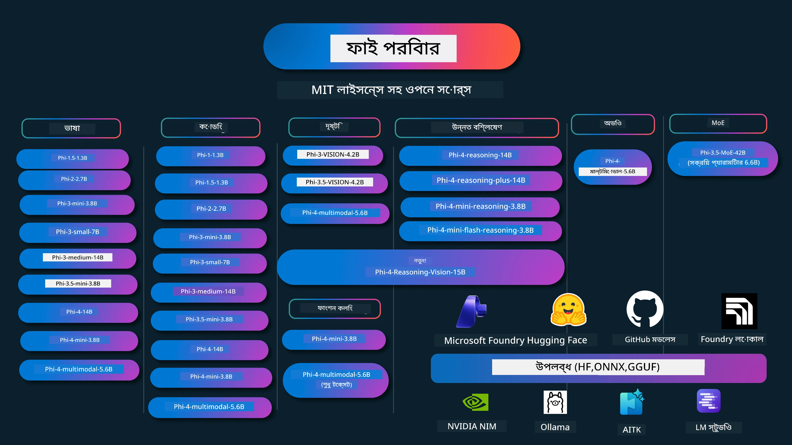

# Phi রাঁধুনির বই: মাইক্রোসফ্টের Phi মডেল সহ হ্যান্ডস-অন উদাহরণ

[](https://codespaces.new/microsoft/phicookbook)
[](https://vscode.dev/redirect?url=vscode://ms-vscode-remote.remote-containers/cloneInVolume?url=https://github.com/microsoft/phicookbook)

[](https://GitHub.com/microsoft/phicookbook/graphs/contributors/?WT.mc_id=aiml-137032-kinfeylo)
[](https://GitHub.com/microsoft/phicookbook/issues/?WT.mc_id=aiml-137032-kinfeylo)
[](https://GitHub.com/microsoft/phicookbook/pulls/?WT.mc_id=aiml-137032-kinfeylo)
[](http://makeapullrequest.com?WT.mc_id=aiml-137032-kinfeylo)

[](https://GitHub.com/microsoft/phicookbook/watchers/?WT.mc_id=aiml-137032-kinfeylo)
[](https://GitHub.com/microsoft/phicookbook/network/?WT.mc_id=aiml-137032-kinfeylo)
[](https://GitHub.com/microsoft/phicookbook/stargazers/?WT.mc_id=aiml-137032-kinfeylo)

[](https://discord.com/invite/ByRwuEEgH4)

Phi হল মাইক্রোসফ্ট দ্বারা ডেভেলপকৃত একটি খোলামেলা AI মডেলের সিরিজ।

Phi বর্তমানে সবচেয়ে শক্তিশালী এবং সাশ্রয়ী মূল্যের ছোট ভাষা মডেল (SLM), যা বহু-ভাষা, যুক্তি, টেক্সট/চ্যাট জেনারেশন, কোডিং, ছবি, অডিও এবং অন্যান্য পরিস্থিতিতে খুব ভাল বেঞ্চমার্ক অর্জন করেছে।

আপনি Phi ক্লাউডে বা এজ ডিভাইসে মোতায়েন করতে পারেন, এবং সীমিত কম্পিউটিং শক্তি দিয়ে সহজে জেনেরেটিভ AI অ্যাপ্লিকেশন তৈরি করতে পারবেন।

এই সম্পদ ব্যবহার শুরু করতে নিম্নলিখিত পদক্ষেপগুলি অনুসরণ করুন:
1. **রেপোজিটরি ফর্ক করুন**: ক্লিক করুন [](https://GitHub.com/microsoft/phicookbook/network/?WT.mc_id=aiml-137032-kinfeylo)
2. **রেপোজিটরি ক্লোন করুন**: `git clone https://github.com/microsoft/PhiCookBook.git`
3. [**Microsoft AI Discord কমিউনিটিতে যোগ দিন এবং বিশেষজ্ঞ ও সহ-ডেভেলপারদের সাথে সাক্ষাৎ করুন**](https://discord.com/invite/ByRwuEEgH4?WT.mc_id=aiml-137032-kinfeylo)



### 🌐 বহু-ভাষা সমর্থন

#### GitHub Action-এর মাধ্যমে সমর্থিত (স্বয়ংক্রিয় এবং সর্বদা আপ-টু-ডেট)

<!-- CO-OP TRANSLATOR LANGUAGES TABLE START -->
[আরবি](../ar/README.md) | [বাংলা](./README.md) | [বুলগেরিয়ান](../bg/README.md) | [বার্মিজ (মায়ানমার)](../my/README.md) | [চীনা (সরলীকৃত)](../zh-CN/README.md) | [চীনা (প্রচলিত, হংকং)](../zh-HK/README.md) | [চীনা (প্রচলিত, ম্যাকাও)](../zh-MO/README.md) | [চীনা (প্রচলিত, তাইওয়ান)](../zh-TW/README.md) | [ক্রোয়েশিয়ান](../hr/README.md) | [চেক](../cs/README.md) | [ড্যানিশ](../da/README.md) | [ডাচ](../nl/README.md) | [এস্টোনিয়ান](../et/README.md) | [ফিনিশ](../fi/README.md) | [ফরাসি](../fr/README.md) | [জার্মান](../de/README.md) | [গ্রিক](../el/README.md) | [হিব্রু](../he/README.md) | [হিন্দি](../hi/README.md) | [হাঙ্গেরিয়ান](../hu/README.md) | [ইন্দোনেশিয়ান](../id/README.md) | [ইতালিয়ান](../it/README.md) | [জাপানি](../ja/README.md) | [কন্নড়](../kn/README.md) | [খ্মের](../km/README.md) | [কোরিয়ান](../ko/README.md) | [লিথুয়ানিয়ান](../lt/README.md) | [মালয়](../ms/README.md) | [মালয়ালাম](../ml/README.md) | [মারাঠি](../mr/README.md) | [নেপালি](../ne/README.md) | [নাইজেরিয়ান পিডগিন](../pcm/README.md) | [নরওয়েজিয়ান](../no/README.md) | [ফার্সি (পারশিয়ান)](../fa/README.md) | [পোলিশ](../pl/README.md) | [পোর্তুগিজ (ব্রাজিল)](../pt-BR/README.md) | [পোর্তুগিজ (পর্তুগাল)](../pt-PT/README.md) | [পাঞ্জাবি (গুরমুক্খি)](../pa/README.md) | [রোমানিয়ান](../ro/README.md) | [রাশিয়ান](../ru/README.md) | [সার্বিয়ান (সিরিলিক)](../sr/README.md) | [স্লোভাক](../sk/README.md) | [স্লোভেনিয়ান](../sl/README.md) | [স্প্যানিশ](../es/README.md) | [সোয়াহিলি](../sw/README.md) | [সুইডিশ](../sv/README.md) | [তাগালগ (ফিলিপিনো)](../tl/README.md) | [তামিল](../ta/README.md) | [তেলুগু](../te/README.md) | [থাই](../th/README.md) | [তুর্কি](../tr/README.md) | [ইউক্রেনীয়ান](../uk/README.md) | [উর্দু](../ur/README.md) | [ভিয়েতনামী](../vi/README.md)

> **স্থানীয়ভাবে ক্লোন করতে পছন্দ করেন?**
>
> এই রেপোজিটরিতে ৫০+ ভাষার অনুবাদ রয়েছে যা ডাউনলোডের আকার অনেক বাড়িয়ে দেয়। অনুবাদ ছাড়া ক্লোন করতে স্পার্স চেকআউট ব্যবহার করুন:
>
> **Bash / macOS / Linux:**
> ```bash
> git clone --filter=blob:none --sparse https://github.com/microsoft/PhiCookBook.git
> cd PhiCookBook
> git sparse-checkout set --no-cone '/*' '!translations' '!translated_images'
> ```
>
> **CMD (Windows):**
> ```cmd
> git clone --filter=blob:none --sparse https://github.com/microsoft/PhiCookBook.git
> cd PhiCookBook
> git sparse-checkout set --no-cone "/*" "!translations" "!translated_images"
> ```
>
> এটি আপনাকে কোর্স সম্পন্ন করার জন্য প্রয়োজনীয় সবকিছু সরবরাহ করবে দ্রুত ডাউনলোড সহ।
<!-- CO-OP TRANSLATOR LANGUAGES TABLE END -->

## বিষয়বস্তু সূচি
- পরিচিতি - [ফাই পরিবারে স্বাগতম](./md/01.Introduction/01/01.PhiFamily.md) - [আপনার পরিবেশ সেটআপ করা](./md/01.Introduction/01/01.EnvironmentSetup.md) - [কী প্রযুক্তি বোঝা](./md/01.Introduction/01/01.Understandingtech.md) - [ফাই মডেলের জন্য AI নিরাপত্তা](./md/01.Introduction/01/01.AISafety.md) - [ফাই হার্ডওয়্যার সমর্থন](./md/01.Introduction/01/01.Hardwaresupport.md) - [ফাই মডেল এবং প্ল্যাটফর্ম জুড়ে উপলভ্যতা](./md/01.Introduction/01/01.Edgeandcloud.md) - [গাইডেন্স-ai এবং ফাই ব্যবহার করা](./md/01.Introduction/01/01.Guidance.md) - [GitHub মার্কেটপ্লেস মডেল](https://github.com/marketplace/models) - [Azure AI মডেল ক্যাটালগ](https://ai.azure.com) - বিভিন্ন পরিবেশে ফাই ইনফারেন্স - [হাগিং ফেস](./md/01.Introduction/02/01.HF.md) - [GitHub মডেল](./md/01.Introduction/02/02.GitHubModel.md) - [মাইক্রোসফট ফাউন্ড্রি মডেল ক্যাটালগ](./md/01.Introduction/02/03.AzureAIFoundry.md) - [ওলামা](./md/01.Introduction/02/04.Ollama.md) - [AI টুলকিট VSCode (AITK)](./md/01.Introduction/02/05.AITK.md) - [NVIDIA NIM](./md/01.Introduction/02/06.NVIDIA.md) - [ফাউন্ড্রি লোকাল](./md/01.Introduction/02/07.FoundryLocal.md) - ফাই পরিবার ইনফারেন্স - [iOS-এ ফাই ইনফারেন্স](./md/01.Introduction/03/iOS_Inference.md) - [অ্যান্ড্রয়েড-এ ফাই ইনফারেন্স](./md/01.Introduction/03/Android_Inference.md) - [জেটসনে ফাই ইনফারেন্স](./md/01.Introduction/03/Jetson_Inference.md) - [AI PC-তে ফাই ইনফারেন্স](./md/01.Introduction/03/AIPC_Inference.md) - [অ্যাপল MLX ফ্রেমওয়ার্ক দিয়ে ফাই ইনফারেন্স](./md/01.Introduction/03/MLX_Inference.md) - [লোকাল সার্ভারে ফাই ইনফারেন্স](./md/01.Introduction/03/Local_Server_Inference.md) - [AI টুলকিট ব্যবহার করে রিমোট সার্ভারে ফাই ইনফারেন্স](./md/01.Introduction/03/Remote_Interence.md) - [রাষ্টের সাথে ফাই ইনফারেন্স](./md/01.Introduction/03/Rust_Inference.md) - [লোকালে ফাই--দৃষ্টি ইনফারেন্স](./md/01.Introduction/03/Vision_Inference.md) - [কাইটো AKS, Azure কন্টেইনার সঙ্গে ফাই ইনফারেন্স (আধিকৃত সমর্থন)](./md/01.Introduction/03/Kaito_Inference.md) - ফাই পরিবারের কোয়ান্টিফিকেশন - [কোয়ান্টিফাইং ফাই পরিবার](./md/01.Introduction/04/QuantifyingPhi.md) - [llama.cpp দিয়ে ফাই-3.5 / 4 কোয়ান্টাইজেশন](./md/01.Introduction/04/UsingLlamacppQuantifyingPhi.md) - [onnxruntime এর জন্য জেনারেটিভ AI এক্সটেনশন ব্যবহার করে ফাই-3.5 / 4 কোয়ান্টাইজেশন](./md/01.Introduction/04/UsingORTGenAIQuantifyingPhi.md) - [Intel OpenVINO ব্যবহার করে ফাই-3.5 / 4 কোয়ান্টাইজেশন](./md/01.Introduction/04/UsingIntelOpenVINOQuantifyingPhi.md) - [অ্যাপল MLX ফ্রেমওয়ার্ক দিয়ে ফাই-3.5 / 4 কোয়ান্টাইজেশন](./md/01.Introduction/04/UsingAppleMLXQuantifyingPhi.md) - ফাই মূল্যায়ন - [দায়িত্বশীল AI](./md/01.Introduction/05/ResponsibleAI.md) - [মূল্যায়নের জন্য মাইক্রোসফট ফাউন্ড্রি](./md/01.Introduction/05/AIFoundry.md) - [মূল্যায়নের জন্য প্রম্পটফ্লো ব্যবহার](./md/01.Introduction/05/Promptflow.md) - Azure AI সার্চ সহ RAG - [Azure AI সার্চ সহ Phi-4-mini এবং Phi-4-multimodal (RAG) কিভাবে ব্যবহার করবেন](https://github.com/microsoft/PhiCookBook/blob/main/code/06.E2E/E2E_Phi-4-RAG-Azure-AI-Search.ipynb) - ফাই অ্যাপ্লিকেশন ডেভেলপমেন্ট নমুনা - টেক্সট ও চ্যাট অ্যাপ্লিকেশন - ফাই-4 নমুনা - [📓] [Phi-4-mini ONNX মডেলের সাথে চ্যাট](./md/02.Application/01.TextAndChat/Phi4/ChatWithPhi4ONNX/README.md) - [লোকাল ONNX মডেল .NET দিয়ে Phi-4 এর সাথে চ্যাট](../../md/04.HOL/dotnet/src/LabsPhi4-Chat-01OnnxRuntime) - [Semantic Kernel ব্যবহার করে Phi-4 ONNX দিয়ে .NET কনসোল অ্যাপ চ্যাট](../../md/04.HOL/dotnet/src/LabsPhi4-Chat-02SK) - ফাই-3 / 3.5 নমুনা - [Phi3, ONNX Runtime Web এবং WebGPU ব্যবহার করে ব্রাউজারে লোকাল চ্যাটবট](https://github.com/microsoft/onnxruntime-inference-examples/tree/main/js/chat) - [OpenVino চ্যাট](./md/02.Application/01.TextAndChat/Phi3/E2E_OpenVino_Chat.md) - [মাল্টি মডেল - ইন্টারেক্টিভ Phi-3-mini এবং OpenAI Whisper](./md/02.Application/01.TextAndChat/Phi3/E2E_Phi-3-mini_with_whisper.md) - [MLFlow - একটি র‍্যাপার তৈরি করা এবং Phi-3 MLFlow এর সাথে ব্যবহার করা](./md//02.Application/01.TextAndChat/Phi3/E2E_Phi-3-MLflow.md) - [মডেল অপটিমাইজেশন - Phi-3-mini মডেল ONNX Runtime Web এর জন্য Olive দিয়ে কীভাবে অপটিমাইজ করবেন](https://github.com/microsoft/Olive/tree/main/examples/phi3) - [Phi-3 mini-4k-instruct-onnx সহ WinUI3 অ্যাপ](https://github.com/microsoft/Phi3-Chat-WinUI3-Sample/) - [WinUI3 মাল্টি মডেল AI চালিত নোটস অ্যাপ নমুনা](https://github.com/microsoft/ai-powered-notes-winui3-sample) - [প্রম্পট ফ্লো সহ কাস্টম Phi-3 মডেল ফাইন-টিউন এবং ইন্টিগ্রেট করা](./md/02.Application/01.TextAndChat/Phi3/E2E_Phi-3-FineTuning_PromptFlow_Integration.md) - [মাইক্রোসফট ফাউন্ডরিতে প্রম্পট ফ্লো সহ কাস্টম Phi-3 মডেল ফাইন-টিউন এবং ইন্টিগ্রেশন](./md/02.Application/01.TextAndChat/Phi3/E2E_Phi-3-FineTuning_PromptFlow_Integration_AIFoundry.md) - [মাইক্রোসফটের দায়িত্বশীল AI নীতিগুলোর উপর কেন্দ্রীভূত থেকে কাস্টম ফাইন-টিউন Phi-3 / Phi-3.5 মডেল মূল্যায়ন মাইক্রোসফট ফাউন্ডরিতে](./md/02.Application/01.TextAndChat/Phi3/E2E_Phi-3-Evaluation_AIFoundry.md) - [📓] [Phi-3.5-mini-instruct ভাষা পূর্বাভাস নমুনা (চীনা/ইংরেজি)](./md/02.Application/01.TextAndChat/Phi3/phi3-instruct-demo.ipynb) - [Phi-3.5-Instruct WebGPU RAG চ্যাটবট](./md/02.Application/01.TextAndChat/Phi3/WebGPUWithPhi35Readme.md) - [Windows GPU ব্যবহার করে Phi-3.5-Instruct ONNX সহ প্রম্পট ফ্লো সলিউশন তৈরি](./md/02.Application/01.TextAndChat/Phi3/UsingPromptFlowWithONNX.md) - [মাইক্রোসফট Phi-3.5 tflite ব্যবহার করে অ্যান্ড্রয়েড অ্যাপ তৈরি](./md/02.Application/01.TextAndChat/Phi3/UsingPhi35TFLiteCreateAndroidApp.md) - [লোকাল ONNX Phi-3 মডেল ব্যবহার করে Microsoft.ML.OnnxRuntime দিয়ে প্রশ্নোত্তর .NET উদাহরণ](../../md/04.HOL/dotnet/src/LabsPhi301) - [Semantic Kernel এবং Phi-3 সহ .NET কনসোল চ্যাট অ্যাপ](../../md/04.HOL/dotnet/src/LabsPhi302) - Azure AI ইনফারেন্স SDK কোড ভিত্তিক নমুনা - ফাই-4 নমুনা - [📓] [Phi-4-multimodal ব্যবহার করে প্রকল্প কোড তৈরি করা](./md/02.Application/02.Code/Phi4/GenProjectCode/README.md) - ফাই-3 / 3.5 নমুনা - [Microsoft Phi-3 পরিবার দিয়ে আপনার নিজস্ব Visual Studio Code GitHub Copilot চ্যাট তৈরি করুন](./md/02.Application/02.Code/Phi3/VSCodeExt/README.md) - [GitHub মডেল দ্বারা Phi-3.5 দিয়ে আপনার নিজস্ব Visual Studio Code চ্যাট কপিলট এজেন্ট তৈরি করুন](/md/02.Application/02.Code/Phi3/CreateVSCodeChatAgentWithGitHubModels.md) - উন্নত যুক্তি নমুনা - ফাই-4 নমুনা - [📓] [Phi-4-mini-reasoning অথবা Phi-4-reasoning নমুনা](./md/02.Application/03.AdvancedReasoning/Phi4/AdvancedResoningPhi4mini/README.md) - [📓] [Microsoft Olive দিয়ে Phi-4-mini-reasoning এর ফাইন-টিউনিং](./md/02.Application/03.AdvancedReasoning/Phi4/AdvancedResoningPhi4mini/olive_ft_phi_4_reasoning_with_medicaldata.ipynb) - [📓] [অ্যাপল MLX দিয়ে Phi-4-mini-reasoning এর ফাইন-টিউনিং](./md/02.Application/03.AdvancedReasoning/Phi4/AdvancedResoningPhi4mini/mlx_ft_phi_4_reasoning_with_medicaldata.ipynb) - [📓] [GitHub মডেল দ্বারা Phi-4-mini-reasoning](./md/02.Application/02.Code/Phi4r/github_models_inference.ipynb) - [📓] [Microsoft Foundry মডেল দ্বারা Phi-4-mini-reasoning](./md/02.Application/02.Code/Phi4r/azure_models_inference.ipynb) -
ডেমো - [Phi-4-mini ডেমো যা Hugging Face Spaces-এ হোস্ট করা হয়েছে](https://huggingface.co/spaces/microsoft/phi-4-mini?WT.mc_id=aiml-137032-kinfeylo) - [Phi-4-multimodal ডেমো যা Hugging Face Spaces-এ হোস্ট করা হয়েছে](https://huggingface.co/spaces/microsoft/phi-4-multimodal?WT.mc_id=aiml-137032-kinfeylo) - ভিশন স্যাম্পল - Phi-4 স্যাম্পল - [📓] [ছবি পড়তে এবং কোড জেনারেট করতে Phi-4-multimodal ব্যবহার করুন](./md/02.Application/04.Vision/Phi4/CreateFrontend/README.md) - Phi-3 / 3.5 স্যাম্পল - [📓][Phi-3 ভিশন-ইমেজ টেক্সট থেকে টেক্সটে](./md/02.Application/04.Vision/Phi3/E2E_Phi-3-vision-image-text-to-text-online-endpoint.ipynb) - [Phi-3-vision-ONNX](https://onnxruntime.ai/docs/genai/tutorials/phi3-v.html) - [📓][Phi-3-vision CLIP এমবেডিং](./md/02.Application/04.Vision/Phi3/E2E_Phi-3-vision-image-text-to-text-online-endpoint.ipynb) - [ডেমো: Phi-3 রিসাইক্লিং](https://github.com/jennifermarsman/PhiRecycling/) - [Phi-3-vision - ভিজুয়াল ল্যাঙ্গুয়েজ অ্যাসিস্ট্যান্ট - Phi3-Vision এবং OpenVINO সহ](https://docs.openvino.ai/nightly/notebooks/phi-3-vision-with-output.html) - [Phi-3 ভিশন Nvidia NIM](./md/02.Application/04.Vision/Phi3/E2E_Nvidia_NIM_Vision.md) - [Phi-3 ভিশন OpenVino](./md/02.Application/04.Vision/Phi3/E2E_OpenVino_Phi3Vision.md) - [📓][Phi-3.5 ভিশন মাল্টি-ফ্রেম বা মাল্টি-ইমেজ স্যাম্পল](./md/02.Application/04.Vision/Phi3/phi3-vision-demo.ipynb) - [Phi-3 ভিশন লোকাল ONNX মডেল Microsoft.ML.OnnxRuntime .NET ব্যবহার করে](../../md/04.HOL/dotnet/src/LabsPhi303) - [মেনু ভিত্তিক Phi-3 ভিশন লোকাল ONNX মডেল Microsoft.ML.OnnxRuntime .NET ব্যবহার করে](../../md/04.HOL/dotnet/src/LabsPhi304) - রিজনারিং-ভিশন স্যাম্পল - Phi-4-Reasoning-Vision-15B - [📓] [Phi-4-Reasoning-Vision-15B ব্যবহার করে জয়ওয়াকিং শনাক্তকরণ](./md/02.Application/10.ReasoningVision/Phi_4_reasoning_vision_15b_Jaywalking.ipynb) - [📓] [Phi-4-Reasoning-Vision-15B ব্যবহার করে গণিত](./md/02.Application/10.ReasoningVision/Phi_4_reasoning_vision_15b_Math.ipynb) - [📓] [Phi-4-Reasoning-Vision-15B ব্যবহার করে UI শনাক্তকরণ](./md/02.Application/10.ReasoningVision/Phi_4_reasoning_vision_15b_ui.ipynb) - গণিত স্যাম্পল - Phi-4-Mini-Flash-Reasoning-Instruct স্যাম্পল [Phi-4-Mini-Flash-Reasoning-Instruct দিয়ে গণিত ডেমো](./md/02.Application/09.Math/MathDemo.ipynb) - অডিও স্যাম্পল - Phi-4 স্যাম্পল - [📓] [Phi-4-multimodal দিয়ে অডিও ট্রান্সক্রিপ্ট বের করা](./md/02.Application/05.Audio/Phi4/Transciption/README.md) - [📓] [Phi-4-multimodal অডিও স্যাম্পল](./md/02.Application/05.Audio/Phi4/Siri/demo.ipynb) - [📓] [Phi-4-multimodal স্পিচ ট্রান্সলেশন স্যাম্পল](./md/02.Application/05.Audio/Phi4/Translate/demo.ipynb) - [.NET কনসোল অ্যাপ্লিকেশন Phi-4-multimodal অডিও ব্যবহার করে অডিও ফাইল বিশ্লেষণ ও ট্রান্সক্রিপ্ট জেনারেট করতে](../../md/04.HOL/dotnet/src/LabsPhi4-MultiModal-02Audio) - MOE স্যাম্পল - Phi-3 / 3.5 স্যাম্পল - [📓] [Phi-3.5 মিক্সচার অফ এক্সপার্টস (MoEs) সোশ্যাল মিডিয়া স্যাম্পল](./md/02.Application/06.MoE/Phi3/phi3_moe_demo.ipynb) - [📓] [NVIDIA NIM Phi-3 MOE, Azure AI সার্চ এবং LlamaIndex দিয়ে রিট্রিভাল-অগমেন্টেড জেনারেশন (RAG) পাইপলাইন তৈরি](./md/02.Application/06.MoE/Phi3/azure-ai-search-nvidia-rag.ipynb) - - ফাংশন কলিং স্যাম্পল - Phi-4 স্যাম্পল 🆕 - [📓] [Phi-4-mini দিয়ে ফাংশন কলিং ব্যবহার](./md/02.Application/07.FunctionCalling/Phi4/FunctionCallingBasic/README.md) - [📓] [ফাংশন কলিং ব্যবহার করে Phi-4-mini এর সাথে মাল্টি-এজেন্ট তৈরি](./md/02.Application/07.FunctionCalling/Phi4/Multiagents/Phi_4_mini_multiagent.ipynb) - [📓] [Ollama দিয়ে ফাংশন কলিং ব্যবহার](./md/02.Application/07.FunctionCalling/Phi4/Ollama/ollama_functioncalling.ipynb) - [📓] [ONNX দিয়ে ফাংশন কলিং ব্যবহার](./md/02.Application/07.FunctionCalling/Phi4/ONNX/onnx_parallel_functioncalling.ipynb) - মাল্টিমডাল মিক্সিং স্যাম্পল - Phi-4 স্যাম্পল 🆕 - [📓] [একজন টেকনোলজি সাংবাদিক হিসেবে Phi-4-multimodal ব্যবহার](./md/02.Application/08.Multimodel/Phi4/TechJournalist/phi_4_mm_audio_text_publish_news.ipynb) - [.NET কনসোল অ্যাপ্লিকেশন Phi-4-multimodal ব্যবহার করে ছবি বিশ্লেষণ](../../md/04.HOL/dotnet/src/LabsPhi4-MultiModal-01Images) - ফাইন-টিউনিং Phi স্যাম্পল - [ফাইন-টিউনিং দৃশ্যপট](./md/03.FineTuning/FineTuning_Scenarios.md) - [ফাইন-টিউনিং বনাম RAG](./md/03.FineTuning/FineTuning_vs_RAG.md) - [Phi-3 কে শিল্প বিশেষজ্ঞ হিসাবে ফাইন-টিউনিং](./md/03.FineTuning/LetPhi3gotoIndustriy.md) - [AI Toolkit for VS Code দিয়ে Phi-3 ফাইন-টিউনিং](./md/03.FineTuning/Finetuning_VSCodeaitoolkit.md) - [Azure Machine Learning সার্ভিস দিয়ে Phi-3 ফাইন-টিউনিং](./md/03.FineTuning/Introduce_AzureML.md) - [Lora দিয়ে Phi-3 ফাইন-টিউনিং](./md/03.FineTuning/FineTuning_Lora.md) - [QLora দিয়ে Phi-3 ফাইন-টিউনিং](./md/03.FineTuning/FineTuning_Qlora.md) - [Microsoft Foundry দিয়ে Phi-3 ফাইন-টিউনিং](./md/03.FineTuning/FineTuning_AIFoundry.md) - [Azure ML CLI/SDK দিয়ে Phi-3 ফাইন-টিউনিং](./md/03.FineTuning/FineTuning_MLSDK.md) - [Microsoft Olive দিয়ে ফাইন-টিউনিং](./md/03.FineTuning/FineTuning_MicrosoftOlive.md) - [Microsoft Olive Hands-On Lab দিয়ে ফাইন-টিউনিং](./md/03.FineTuning/olive-lab/readme.md) - [Weights and Bias দিয়ে Phi-3-vision ফাইন-টিউনিং](./md/03.FineTuning/FineTuning_Phi-3-visionWandB.md) - [Apple MLX Framework দিয়ে Phi-3 ফাইন-টিউনিং](./md/03.FineTuning/FineTuning_MLX.md) - [Phi-3-vision ফাইন-টিউনিং (অফিসিয়াল সাপোর্ট)](./md/03.FineTuning/FineTuning_Vision.md) - [Kaito AKS, Azure Containers দিয়ে Phi-3 ফাইন-টিউনিং (অফিসিয়াল সাপোর্ট)](./md/03.FineTuning/FineTuning_Kaito.md) - [Phi-3 এবং 3.5 Vision ফাইন-টিউনিং](https://github.com/2U1/Phi3-Vision-Finetune) - হ্যান্ডস অন ল্যাব - [নতুন নতুন মডেল: LLMs, SLMs, লোকাল ডেভেলপমেন্ট ইত্যাদি অন্বেষণ](https://github.com/microsoft/aitour-exploring-cutting-edge-models) - [NLP ক্ষমতা উন্মোচিত: Microsoft Olive দিয়ে ফাইন-টিউনিং](https://github.com/azure/Ignite_FineTuning_workshop) - একাডেমিক রিসার্চ পেপার এবং প্রকাশনা - [Textbooks Are All You Need II: phi-1.5 টেকনিক্যাল রিপোর্ট](https://arxiv.org/abs/2309.05463) - [Phi-3 টেকনিক্যাল রিপোর্ট: ফোনে উচ্চ ক্ষমতাসম্পন্ন ভাষা মডেল](https://arxiv.org/abs/2404.14219) - [Phi-4 টেকনিক্যাল রিপোর্ট](https://arxiv.org/abs/2412.08905) - [Phi-4-Mini টেকনিক্যাল রিপোর্ট: Mixture-of-LoRAs দ্বারা কমপ্যাক্ট কিন্তু শক্তিশালী মাল্টিমডাল ভাষা মডেল](https://arxiv.org/abs/2503.01743) - [ইন-ভেহিকল ফাংশন-কলিং জন্য ছোট ভাষা মডেল অপ্টিমাইজেশন](https://arxiv.org/abs/2501.02342) - [(WhyPHI) বহুনির্বাচনি প্রশ্ন উত্তরের জন্য PHI-3 ফাইন-টিউনিং: পদ্ধতি, ফলাফল, এবং চ্যালেঞ্জ](https://arxiv.org/abs/2501.01588) - [Phi-4-r reasoning টেকনিক্যাল রিপোর্ট](https://www.microsoft.com/en-us/research/wp-content/uploads/2025/04/phi_4_reasoning.pdf)
- [Phi-4-মিনি-তর্কশক্তি প্রযুক্তিগত প্রতিবেদন](https://huggingface.co/microsoft/Phi-4-mini-reasoning/blob/main/Phi-4-Mini-Reasoning.pdf)
# Phi কুকবুক: Microsoft-এর Phi মডেলগুলোর সঙ্গে হাতে-কলমে উদাহরণসমূহ

[](https://codespaces.new/microsoft/phicookbook)
[](https://vscode.dev/redirect?url=vscode://ms-vscode-remote.remote-containers/cloneInVolume?url=https://github.com/microsoft/phicookbook)

[](https://GitHub.com/microsoft/phicookbook/graphs/contributors/?WT.mc_id=aiml-137032-kinfeylo)
[](https://GitHub.com/microsoft/phicookbook/issues/?WT.mc_id=aiml-137032-kinfeylo)
[](https://GitHub.com/microsoft/phicookbook/pulls/?WT.mc_id=aiml-137032-kinfeylo)
[](http://makeapullrequest.com?WT.mc_id=aiml-137032-kinfeylo)

[](https://GitHub.com/microsoft/phicookbook/watchers/?WT.mc_id=aiml-137032-kinfeylo)
[](https://GitHub.com/microsoft/phicookbook/network/?WT.mc_id=aiml-137032-kinfeylo)
[](https://GitHub.com/microsoft/phicookbook/stargazers/?WT.mc_id=aiml-137032-kinfeylo)

[](https://discord.com/invite/ByRwuEEgH4)

Phi হল Microsoft দ্বারা উন্নত একটি ওপেন সোর্স এআই মডেল সিরিজ।

Phi বর্তমানে সবচেয়ে শক্তিশালী এবং খরচ সাশ্রয়ী ছোট ভাষার মডেল (SLM), যা বহুভাষিক, যুক্তি, টেক্সট/চ্যাট জেনারেশন, কোডিং, ছবি, অডিও ও অন্যান্য পরিস্থিতিতে খুব ভালো বেঞ্চমার্ক দেখায়।

আপনি Phi ক্লাউড অথবা এজ ডিভাইসে ডিপ্লয় করতে পারেন, এবং সীমিত কম্পিউটিং শক্তি নিয়ে সহজেই জেনারেটিভ এআই অ্যাপ্লিকেশন তৈরি করতে পারেন।

এই রিসোর্সগুলো ব্যবহার শুরু করার জন্য নিচের ধাপগুলো অনুসরণ করুন:
1. **রেপোজিটরি ফর্ক করুন**: ক্লিক করুন [](https://GitHub.com/microsoft/phicookbook/network/?WT.mc_id=aiml-137032-kinfeylo)
2. **রেপোজিটরি ক্লোন করুন**:   `git clone https://github.com/microsoft/PhiCookBook.git`
3. [**Microsoft AI Discord কমিউনিটিতে যোগ দিন এবং বিশেষজ্ঞদের ও অন্যান্য ডেভেলপারদের সাথে পরিচিত হন**](https://discord.com/invite/ByRwuEEgH4?WT.mc_id=aiml-137032-kinfeylo)


### 🌐 বহুভাষিক সমর্থন

#### GitHub Action-এর মাধ্যমে সমর্থিত (স্বয়ংক্রিয় ও সর্বদা আপ-টু-ডেট)

<!-- CO-OP TRANSLATOR LANGUAGES TABLE START -->
[Arabic](../ar/README.md) | [Bengali](./README.md) | [Bulgarian](../bg/README.md) | [Burmese (Myanmar)](../my/README.md) | [Chinese (Simplified)](../zh-CN/README.md) | [Chinese (Traditional, Hong Kong)](../zh-HK/README.md) | [Chinese (Traditional, Macau)](../zh-MO/README.md) | [Chinese (Traditional, Taiwan)](../zh-TW/README.md) | [Croatian](../hr/README.md) | [Czech](../cs/README.md) | [Danish](../da/README.md) | [Dutch](../nl/README.md) | [Estonian](../et/README.md) | [Finnish](../fi/README.md) | [French](../fr/README.md) | [German](../de/README.md) | [Greek](../el/README.md) | [Hebrew](../he/README.md) | [Hindi](../hi/README.md) | [Hungarian](../hu/README.md) | [Indonesian](../id/README.md) | [Italian](../it/README.md) | [Japanese](../ja/README.md) | [Kannada](../kn/README.md) | [Khmer](../km/README.md) | [Korean](../ko/README.md) | [Lithuanian](../lt/README.md) | [Malay](../ms/README.md) | [Malayalam](../ml/README.md) | [Marathi](../mr/README.md) | [Nepali](../ne/README.md) | [Nigerian Pidgin](../pcm/README.md) | [Norwegian](../no/README.md) | [Persian (Farsi)](../fa/README.md) | [Polish](../pl/README.md) | [Portuguese (Brazil)](../pt-BR/README.md) | [Portuguese (Portugal)](../pt-PT/README.md) | [Punjabi (Gurmukhi)](../pa/README.md) | [Romanian](../ro/README.md) | [Russian](../ru/README.md) | [Serbian (Cyrillic)](../sr/README.md) | [Slovak](../sk/README.md) | [Slovenian](../sl/README.md) | [Spanish](../es/README.md) | [Swahili](../sw/README.md) | [Swedish](../sv/README.md) | [Tagalog (Filipino)](../tl/README.md) | [Tamil](../ta/README.md) | [Telugu](../te/README.md) | [Thai](../th/README.md) | [Turkish](../tr/README.md) | [Ukrainian](../uk/README.md) | [Urdu](../ur/README.md) | [Vietnamese](../vi/README.md)

> **স্থানীয়ভাবে ক্লোন করতে চান?**
>
> এই রেপোজিটরিতে ৫০+ ভাষার অনুবাদ রয়েছে যা ডাউনলোড সাইজ অনেক বৃদ্ধি করে। অনুবাদ ব্যতীত ক্লোন করতে স্পার্স চেকআউট ব্যবহার করুন:
>
> **Bash / macOS / Linux:**
> ```bash
> git clone --filter=blob:none --sparse https://github.com/microsoft/PhiCookBook.git
> cd PhiCookBook
> git sparse-checkout set --no-cone '/*' '!translations' '!translated_images'
> ```
>
> **CMD (Windows):**
> ```cmd
> git clone --filter=blob:none --sparse https://github.com/microsoft/PhiCookBook.git
> cd PhiCookBook
> git sparse-checkout set --no-cone "/*" "!translations" "!translated_images"
> ```
>
> এটি আপনাকে কোর্স সম্পন্ন করার জন্য সবকিছু অনেক দ্রুত ডাউনলোডের মাধ্যমে দেয়।
<!-- CO-OP TRANSLATOR LANGUAGES TABLE END -->

## বিষয়সূচি

## Phi মডেলগুলো ব্যবহার

### Microsoft Foundry-তে Phi

আপনি শিখতে পারবেন কিভাবে Microsoft Phi ব্যবহার করবেন এবং আপনার বিভিন্ন হার্ডওয়্যার ডিভাইসে E2E সলিউশন তৈরি করবেন। নিজে Phi ব্যবহার করার জন্য, প্রথমে মডেলগুলো নিয়ে খেলুন এবং আপনার পরিস্থিতি অনুযায়ী Phi কাস্টমাইজ করুন [Microsoft Foundry Azure AI Model Catalog](https://aka.ms/phi3-azure-ai) ব্যবহার করে। আরও জানতে পারেন [Microsoft Foundry](/md/02.QuickStart/AzureAIFoundry_QuickStart.md) সম্পর্কিত গাইডে।

**খেলার ক্ষেত্র (Playground)**
প্রতিটি মডেলের জন্য একটি ডেডিকেটেড খেলার ক্ষেত্র আছে যেখানে মডেল পরীক্ষা করা যায় [Azure AI Playground](https://aka.ms/try-phi3) ।

### GitHub মডেলে Phi

আপনি শিখতে পারবেন কিভাবে Microsoft Phi ব্যবহার করবেন এবং আপনার বিভিন্ন হার্ডওয়্যার ডিভাইসে E2E সমাধান তৈরি করবেন। নিজে Phi ব্যবহার করার জন্য, প্রথমে মডেল নিয়ে খেলুন এবং আপনার পরিস্থিতি অনুযায়ী Phi কাস্টমাইজ করুন [GitHub Model Catalog](https://github.com/marketplace/models?WT.mc_id=aiml-137032-kinfeylo) ব্যবহার করে। আরও জানতে পারেন [GitHub Model Catalog](/md/02.QuickStart/GitHubModel_QuickStart.md) সম্পর্কিত গাইডে।

**খেলার ক্ষেত্র (Playground)**
প্রতিটি মডেলের জন্য একটি ডেডিকেটেড [খেলার ক্ষেত্র যেখান থেকে মডেল পরীক্ষা করা যায়](/md/02.QuickStart/GitHubModel_QuickStart.md)।

### Hugging Face-এ Phi

আপনি মডেলটি [Hugging Face](https://huggingface.co/microsoft) -এও পেতে পারেন।

**খেলার ক্ষেত্র (Playground)**
[Hugging Chat playground](https://huggingface.co/chat/models/microsoft/Phi-3-mini-4k-instruct)

## 🎒 অন্যান্য কোর্সসমূহ

আমাদের টিম অন্যান্য কোর্সও তৈরি করে! দেখুন:

<!-- CO-OP TRANSLATOR OTHER COURSES START -->
### LangChain
[](https://aka.ms/langchain4j-for-beginners)
[](https://aka.ms/langchainjs-for-beginners?WT.mc_id=m365-94501-dwahlin)
[](https://github.com/microsoft/langchain-for-beginners?WT.mc_id=m365-94501-dwahlin)
---

### Azure / Edge / MCP / Agents
[](https://github.com/microsoft/AZD-for-beginners?WT.mc_id=academic-105485-koreyst)
[](https://github.com/microsoft/edgeai-for-beginners?WT.mc_id=academic-105485-koreyst)
[](https://github.com/microsoft/mcp-for-beginners?WT.mc_id=academic-105485-koreyst)
[](https://github.com/microsoft/ai-agents-for-beginners?WT.mc_id=academic-105485-koreyst)

---
 
### Generative AI সিরিজ
[](https://github.com/microsoft/generative-ai-for-beginners?WT.mc_id=academic-105485-koreyst)
[-9333EA?style=for-the-badge&labelColor=E5E7EB&color=9333EA)](https://github.com/microsoft/Generative-AI-for-beginners-dotnet?WT.mc_id=academic-105485-koreyst)
[-C084FC?style=for-the-badge&labelColor=E5E7EB&color=C084FC)](https://github.com/microsoft/generative-ai-for-beginners-java?WT.mc_id=academic-105485-koreyst)
[-E879F9?style=for-the-badge&labelColor=E5E7EB&color=E879F9)](https://github.com/microsoft/generative-ai-with-javascript?WT.mc_id=academic-105485-koreyst)

---

### প্রাথমিক শেখা
[](https://aka.ms/ml-beginners?WT.mc_id=academic-105485-koreyst)
[](https://aka.ms/datascience-beginners?WT.mc_id=academic-105485-koreyst)
[](https://aka.ms/ai-beginners?WT.mc_id=academic-105485-koreyst)
[](https://github.com/microsoft/Security-101?WT.mc_id=academic-96948-sayoung)
[](https://aka.ms/webdev-beginners?WT.mc_id=academic-105485-koreyst)
[](https://aka.ms/iot-beginners?WT.mc_id=academic-105485-koreyst)
[](https://github.com/microsoft/xr-development-for-beginners?WT.mc_id=academic-105485-koreyst)

---

### কোপাইলট সিরিজ
[](https://aka.ms/GitHubCopilotAI?WT.mc_id=academic-105485-koreyst)
[](https://github.com/microsoft/mastering-github-copilot-for-dotnet-csharp-developers?WT.mc_id=academic-105485-koreyst)
[](https://github.com/microsoft/CopilotAdventures?WT.mc_id=academic-105485-koreyst)
<!-- CO-OP TRANSLATOR OTHER COURSES END -->

## দায়িত্বশীল AI

মাইক্রোসফট আমাদের গ্রাহকদের AI পণ্যগুলি দায়িত্বের সাথে ব্যবহার করতে সাহায্য করার জন্য প্রতিশ্রুতিবদ্ধ, আমাদের শেখাগুলো শেয়ার করে, এবং Transparency Notes এবং Impact Assessments এর মতো সরঞ্জামগুলির মাধ্যমে বিশ্বাসভিত্তিক অংশীদারিত্ব গড়ে তোলে। এই অনেকগুলি উৎস [https://aka.ms/RAI](https://aka.ms/RAI) এ পাওয়া যায়।
মাইক্রোসফটের দায়িত্বশীল AI পন্থা আমাদের AI নীতিমালার উপর ভিত্তি করে যা ন্যায্যতা, বিশ্বাসযোগ্যতা এবং নিরাপত্তা, গোপনীয়তা এবং সুরক্ষা, অন্তর্ভুক্তি, স্বচ্ছতা এবং জবাবদিহিতার মধ্যে নিহিত।

বৃহৎ পরিসরের প্রাকৃতিক ভাষা, চিত্র এবং ভাষণ মডেল - যেমন যা এই নমুনায় ব্যবহৃত হয়েছে - সম্ভাব্যভাবে এমন আচরণ করতে পারে যা অন্যায়, অবিশ্বস্ত, বা আপত্তিকর হতে পারে, ফলস্বরূপ ক্ষতি হতে পারে। দয়া করে [Azure OpenAI সার্ভিস Transparency নোট](https://learn.microsoft.com/legal/cognitive-services/openai/transparency-note?tabs=text) পরামর্শ করুন যাতে ঝুঁকি এবং সীমাবদ্ধতা সম্পর্কে অবহিত হওয়া যায়।

এই ঝুঁকিগুলো কমাতে পরামর্শকৃত পন্থা হল আপনার আর্কিটেকচারে একটি নিরাপত্তা সিস্টেম অন্তর্ভুক্ত করা যা ক্ষতিকর আচরণ সনাক্ত এবং প্রতিরোধ করতে সক্ষম। [Azure AI Content Safety](https://learn.microsoft.com/azure/ai-services/content-safety/overview) একটি স্বাধীন সুরক্ষা স্তর প্রদান করে, যা অ্যাপ্লিকেশন এবং সেবাগুলিতে ক্ষতিকর ব্যবহারকারী-উত্পন্ন এবং AI-উত্পন্ন সামগ্রী শনাক্ত করতে সক্ষম। Azure AI Content Safety তে টেক্সট এবং চিত্র API রয়েছে যা আপনাকে ক্ষতিকর উপাদান সনাক্ত করতে দেয়। Microsoft Foundry এর আওতায়, Content Safety সার্ভিস আপনাকে বিভিন্ন মাধ্যম জুড়ে ক্ষতিকর সামগ্রী সনাক্তকরণের জন্য নমুনা কোড দেখতে, অন্বেষণ করতে এবং চেষ্টা করতে দেয়। নিম্নলিখিত [দ্রুত শুরু ডকুমেন্টেশন](https://learn.microsoft.com/azure/ai-services/content-safety/quickstart-text?tabs=visual-studio%2Clinux&pivots=programming-language-rest) আপনাকে সার্ভিসে রিকোয়েস্ট পাঠানোর পথ প্রদর্শন করে।

আরেকটি বিষয় বিবেচনা করতে হবে তা হল সামগ্রিক অ্যাপ্লিকেশন পারফরম্যান্স। বহু-মাধ্যমিক এবং বহু-মডেল অ্যাপ্লিকেশনগুলির ক্ষেত্রে, পারফরম্যান্স মানে হচ্ছে সিস্টেমটি যে আপনি এবং আপনার ব্যবহারকারীরা প্রত্যাশা করেন সেই অনুযায়ী কাজ করে, যার মধ্যে রয়েছে ক্ষতিকর আউটপুট না তৈরি করা। আপনার সামগ্রিক অ্যাপ্লিকেশনের পারফরম্যান্স মূল্যায়ন করা গুরুত্বপূর্ণ, এটি করতে [Performance and Quality and Risk and Safety evaluators](https://learn.microsoft.com/azure/ai-studio/concepts/evaluation-metrics-built-in) ব্যবহার করুন। আপনি [কাস্টম মূল্যায়নকারী](https://learn.microsoft.com/azure/ai-studio/how-to/develop/evaluate-sdk#custom-evaluators) তৈরি ও মূল্যায়ন করার ক্ষমতাও রাখেন।

আপনি আপনার AI অ্যাপ্লিকেশন আপনার উন্নয়ন পরিবেশে [Azure AI Evaluation SDK](https://microsoft.github.io/promptflow/index.html) ব্যবহার করে মূল্যায়ন করতে পারেন। একটি পরীক্ষার ডেটাসেট বা লক্ষ্য দেওয়া হলে, আপনার generative AI অ্যাপ্লিকেশন জেনারেশনগুলি অন্তর্নির্মিত বা আপনার পছন্দের কাস্টম মূল্যায়কদের মাধ্যমে পরিমাণগতভাবে পরিমাপ করা হয়। আপনার সিস্টেম মূল্যায়নের জন্য Azure AI Evaluation SDK এর সঙ্গে শুরু করতে, আপনি [দ্রুত শুরু গাইড](https://learn.microsoft.com/azure/ai-studio/how-to/develop/flow-evaluate-sdk) অনুসরণ করতে পারেন। একবার আপনি একটি মূল্যায়ন চালালে, আপনি ফলাফলগুলি [Microsoft Foundry তে দৃশ্যায়িত](https://learn.microsoft.com/azure/ai-studio/how-to/evaluate-flow-results) করতে পারেন।

## ট্রেডমার্ক

এই প্রকল্পটিতে প্রকল্প, পণ্য, বা পরিষেবার জন্য ট্রেডমার্ক বা লোগো থাকতে পারে। মাইক্রোসফট ট্রেডমার্ক বা লোগোর অনুমোদিত ব্যবহার মাইক্রোসফটের [ট্রেডমার্ক & ব্র্যান্ড নির্দেশিকা](https://www.microsoft.com/legal/intellectualproperty/trademarks/usage/general) অনুসরণ করতে হবে এবং তার অধীনে হবে।
এই প্রকল্পের সংশোধিত সংস্করণে মাইক্রোসফট ট্রেডমার্ক বা লোগোর ব্যবহার বিভ্রান্তি সৃষ্টি করা বা মাইক্রোসফট স্পনসরশিপ বোঝানো উচিত নয়। তৃতীয় পক্ষের ট্রেডমার্ক বা লোগোর যে কোনও ব্যবহার ঐ তৃতীয় পক্ষের নীতিমালা অনুসরণ করবে।

## সাহায্য নেওয়া

আপনি আটকে গেলে বা AI অ্যাপ তৈরি করার বিষয়ে কোনো প্রশ্ন থাকলে, যোগ দিন:

[](https://aka.ms/foundry/discord)

আপনার যদি পণ্য প্রতিক্রিয়া থাকে বা নির্মাণের সময় ত্রুটি হয়, তাহলে ভিজিট করুন:

[](https://aka.ms/foundry/forum)

---

<!-- CO-OP TRANSLATOR DISCLAIMER START -->
**অস্বীকার**:  
এই নথিটি AI অনুবাদ সেবা [Co-op Translator](https://github.com/Azure/co-op-translator) ব্যবহার করে অনূদিত হয়েছে। আমরা যথাসাধ্য সঠিকতার চেষ্টা করলেও, স্বয়ংক্রিয় অনুবাদে ভুল বা অমিল থাকতে পারে। মূল নথি তার নিজস্ব ভাষায় কর্তৃত্বপূর্ণ উৎস হিসেবে বিবেচনা করা উচিত। গুরুত্বপূর্ণ তথ্যের জন্য পেশাদার মানব অনুবাদের সুপারিশ করা হয়। এই অনুবাদের ব্যবহারে উদ্ভূত কোনো ভুল বোঝাবুঝি বা ভুল ব্যাখ্যার জন্য আমরা দায়ী নয়।
<!-- CO-OP TRANSLATOR DISCLAIMER END -->