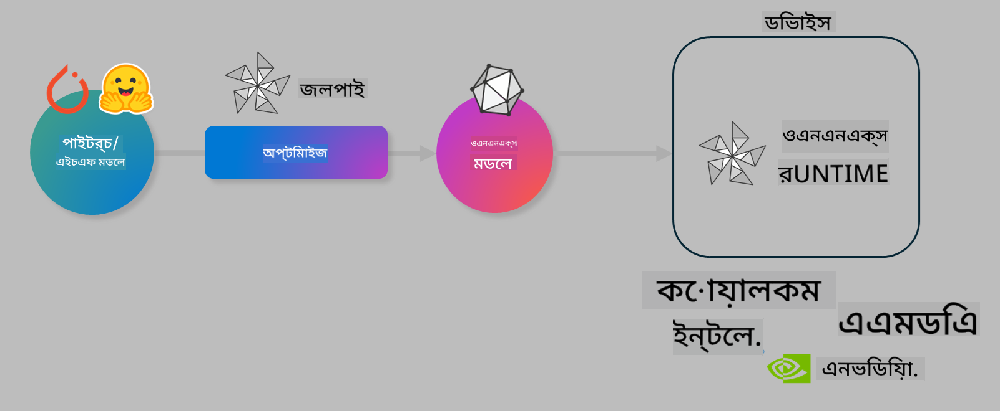

<!--
CO_OP_TRANSLATOR_METADATA:
{
  "original_hash": "6bbe47de3b974df7eea29dfeccf6032b",
  "translation_date": "2025-05-09T04:21:45+00:00",
  "source_file": "code/03.Finetuning/olive-lab/readme.md",
  "language_code": "bn"
}
-->
# Lab. ডিভাইস-ভিত্তিক ইনফারেন্সের জন্য AI মডেল অপ্টিমাইজ করুন

## পরিচিতি

> [!IMPORTANT]
> এই ল্যাবে একটি **Nvidia A10 বা A100 GPU** এবং সংশ্লিষ্ট ড্রাইভার ও CUDA টুলকিট (ভার্সন 12+) ইনস্টল থাকতে হবে।

> [!NOTE]
> এটি একটি **৩৫ মিনিটের** ল্যাব যা আপনাকে OLIVE ব্যবহার করে ডিভাইস-ভিত্তিক ইনফারেন্সের জন্য মডেল অপ্টিমাইজেশনের মূল ধারণাগুলো হাতে কলমে শেখাবে।

## শেখার উদ্দেশ্যসমূহ

এই ল্যাবের শেষে, আপনি OLIVE ব্যবহার করে পারবেন:

- AWQ কোয়ান্টাইজেশন পদ্ধতি ব্যবহার করে একটি AI মডেল কোয়ান্টাইজ করা।
- একটি নির্দিষ্ট কাজের জন্য AI মডেল ফাইন-টিউন করা।
- ONNX Runtime-এ দক্ষ ডিভাইস-ভিত্তিক ইনফারেন্সের জন্য LoRA অ্যাডাপ্টার (ফাইন-টিউন করা মডেল) তৈরি করা।

### Olive কি?

Olive (*O*NNX *live*) একটি মডেল অপ্টিমাইজেশন টুলকিট এবং CLI যা ONNX runtime +++https://onnxruntime.ai+++ এর জন্য গুণগতমান এবং কর্মক্ষমতা সহ মডেল শিপ করতে সাহায্য করে।



Olive-এর ইনপুট সাধারণত PyTorch বা Hugging Face মডেল এবং আউটপুট একটি অপ্টিমাইজড ONNX মডেল যা ডিভাইসে (ডিপ্লয়মেন্ট টার্গেট) চলবে, যেখানে ONNX runtime ইনস্টল থাকে। Olive মডেলকে ডিপ্লয়মেন্ট টার্গেটের AI অ্যাক্সেলেটর (NPU, GPU, CPU) অনুযায়ী অপ্টিমাইজ করে, যা Qualcomm, AMD, Nvidia বা Intel-এর মতো হার্ডওয়্যার ভেন্ডার দ্বারা সরবরাহিত।

Olive একটি *ওয়ার্কফ্লো* চালায়, যা একটির পর একটি মডেল অপ্টিমাইজেশন টাস্কের সিকোয়েন্স, যাদের *পাস* বলা হয় - উদাহরণস্বরূপ: মডেল কম্প্রেশন, গ্রাফ ক্যাপচার, কোয়ান্টাইজেশন, গ্রাফ অপ্টিমাইজেশন। প্রতিটি পাসের প্যারামিটার থাকে যা সেরা মেট্রিক্স (যেমন সঠিকতা ও লেটেন্সি) অর্জনের জন্য টিউন করা যায়, যেগুলো সংশ্লিষ্ট ইভ্যালুয়েটর দ্বারা মূল্যায়িত হয়। Olive একটি সার্চ স্ট্রাটেজি ব্যবহার করে যা প্রতিটি পাস বা পাসের সেটকে স্বয়ংক্রিয়ভাবে টিউন করে।

#### Olive-এর সুবিধাসমূহ

- গ্রাফ অপ্টিমাইজেশন, কম্প্রেশন এবং কোয়ান্টাইজেশনের বিভিন্ন পদ্ধতির সাথে ম্যানুয়াল ট্রায়াল-এন্ড-এরর পরীক্ষার হতাশা ও সময় কমায়। আপনার গুণগতমান ও কর্মক্ষমতার সীমা নির্ধারণ করুন, Olive সেরা মডেল নিজে খুঁজে পাবে।
- **৪০+ বিল্ট-ইন মডেল অপ্টিমাইজেশন কম্পোনেন্টস** কোয়ান্টাইজেশন, কম্প্রেশন, গ্রাফ অপ্টিমাইজেশন ও ফাইনটিউনিংয়ের আধুনিক পদ্ধতিসহ।
- সাধারণ মডেল অপ্টিমাইজেশন টাস্কের জন্য সহজ CLI, যেমন olive quantize, olive auto-opt, olive finetune।
- মডেল প্যাকেজিং ও ডিপ্লয়মেন্ট অন্তর্নির্মিত।
- **মাল্টি LoRA সার্ভিং** এর জন্য মডেল তৈরি সমর্থন।
- YAML/JSON ব্যবহার করে ওয়ার্কফ্লো তৈরি করে মডেল অপ্টিমাইজেশন ও ডিপ্লয়মেন্ট টাস্ক পরিচালনা।
- **Hugging Face** ও **Azure AI** ইন্টিগ্রেশন।
- খরচ সাশ্রয়ের জন্য বিল্ট-ইন **ক্যাশিং** মেকানিজম।

## ল্যাব নির্দেশাবলী

> [!NOTE]
> দয়া করে নিশ্চিত করুন আপনি আপনার Azure AI Hub ও Project প্রস্তুত করেছেন এবং Lab 1 অনুযায়ী আপনার A100 কম্পিউট সেটআপ করেছেন।

### ধাপ ০: আপনার Azure AI Compute-এ সংযোগ করুন

**VS Code** এর রিমোট ফিচার ব্যবহার করে Azure AI কম্পিউটে সংযোগ করবেন।

1. আপনার **VS Code** ডেস্কটপ অ্যাপ্লিকেশন খুলুন:
2. **Shift+Ctrl+P** চাপিয়ে **command palette** খুলুন।
3. সেখানে **AzureML - remote: Connect to compute instance in New Window** সার্চ করুন।
4. স্ক্রিনের নির্দেশ অনুসরণ করে Compute-এ সংযোগ করুন। এর মধ্যে আপনার Azure Subscription, Resource Group, Project এবং Lab 1-এ তৈরি Compute নাম নির্বাচন করা থাকবে।
5. সংযোগ সফল হলে, Visual Code এর **বামে নিচে** আপনার Azure ML Compute নোড দেখাবে `><Azure ML: Compute Name`

### ধাপ ১: এই রিপো ক্লোন করুন

VS Code-এ **Ctrl+J** চাপিয়ে নতুন টার্মিনাল খুলুন এবং এই রিপো ক্লোন করুন:

টার্মিনালে প্রম্পট দেখতে পাবেন

```
azureuser@computername:~/cloudfiles/code$ 
```
সোলিউশন ক্লোন করুন

```bash
cd ~/localfiles
git clone https://github.com/microsoft/phi-3cookbook.git
```

### ধাপ ২: VS Code-এ ফোল্ডার খুলুন

টার্মিনালে নিচের কমান্ড চালিয়ে সংশ্লিষ্ট ফোল্ডারটি নতুন উইন্ডোতে খুলুন:

```bash
code phi-3cookbook/code/04.Finetuning/Olive-lab
```

অথবা, **File** > **Open Folder** নির্বাচন করে ফোল্ডার খুলতে পারেন।

### ধাপ ৩: ডিপেন্ডেন্সি ইনস্টল করুন

VS Code-এ Azure AI Compute Instance-এ টার্মিনাল খুলুন (টিপ: **Ctrl+J**) এবং নিচের কমান্ডগুলো চালিয়ে ডিপেন্ডেন্সি ইনস্টল করুন:

```bash
conda create -n olive-ai python=3.11 -y
conda activate olive-ai
pip install -r requirements.txt
az extension remove -n azure-cli-ml
az extension add -n ml
```

> [!NOTE]
> সব ডিপেন্ডেন্সি ইনস্টল করতে প্রায় ৫ মিনিট সময় লাগবে।

এই ল্যাবে আপনি Azure AI মডেল ক্যাটালগ থেকে মডেল ডাউনলোড ও আপলোড করবেন। মডেল ক্যাটালগ অ্যাক্সেসের জন্য Azure-এ লগইন করুন:

```bash
az login
```

> [!NOTE]
> লগইন করার সময় আপনাকে সাবস্ক্রিপশন নির্বাচন করতে বলা হবে। নিশ্চিত করুন ল্যাবের জন্য দেওয়া সাবস্ক্রিপশনটি সেট করেছেন।

### ধাপ ৪: Olive কমান্ড চালান

VS Code-এ Azure AI Compute Instance-এ টার্মিনাল খুলুন (টিপ: **Ctrl+J**) এবং `olive-ai` কন্ডা এনভায়রনমেন্ট সক্রিয় করুন:

```bash
conda activate olive-ai
```

এরপর নিচের Olive কমান্ডগুলো চালান।

1. **ডেটা পরিদর্শন করুন:** এই উদাহরণে, আপনি Phi-3.5-Mini মডেল ফাইন-টিউন করবেন যাতে এটি ভ্রমণ সম্পর্কিত প্রশ্নের উত্তর দিতে পারবে। নিচের কোড ডেটাসেটের প্রথম কয়েকটি রেকর্ড দেখায়, যা JSON lines ফরম্যাটে:

    ```bash
    head data/data_sample_travel.jsonl
    ```
2. **মডেল কোয়ান্টাইজ করুন:** মডেল ট্রেনিংয়ের আগে নিচের কমান্ড দিয়ে Active Aware Quantization (AWQ) +++https://arxiv.org/abs/2306.00978+++ পদ্ধতি ব্যবহার করে কোয়ান্টাইজ করবেন। AWQ ইনফারেন্স চলাকালীন উৎপন্ন অ্যাক্টিভেশন বিবেচনা করে মডেলের ওজন কোয়ান্টাইজ করে। এর ফলে প্রচলিত ওজন কোয়ান্টাইজেশন পদ্ধতির তুলনায় মডেলের সঠিকতা ভালোভাবে সংরক্ষিত হয়।

    ```bash
    olive quantize \
       --model_name_or_path microsoft/Phi-3.5-mini-instruct \
       --trust_remote_code \
       --algorithm awq \
       --output_path models/phi/awq \
       --log_level 1
    ```

    AWQ কোয়ান্টাইজেশন সম্পন্ন হতে প্রায় **৮ মিনিট** লাগে, যা মডেলের সাইজ প্রায় ~৭.৫GB থেকে ~২.৫GB-এ নামিয়ে আনে।

    এই ল্যাবে আমরা দেখাচ্ছি কিভাবে Hugging Face থেকে মডেল ইনপুট নেওয়া যায় (যেমন: `microsoft/Phi-3.5-mini-instruct`). However, Olive also allows you to input models from the Azure AI catalog by updating the `model_name_or_path` argument to an Azure AI asset ID (for example:  `azureml://registries/azureml/models/Phi-3.5-mini-instruct/versions/4`). 

1. **Train the model:** Next, the `olive finetune` কমান্ড কোয়ান্টাইজড মডেল ফাইন-টিউন করে)। কোয়ান্টাইজেশনের পর ফাইন-টিউন করার পরিবর্তে আগে কোয়ান্টাইজ করা সঠিকতা উন্নত করে কারণ ফাইন-টিউন প্রক্রিয়া কোয়ান্টাইজেশন থেকে কিছু ক্ষতি পুনরুদ্ধার করে।

    ```bash
    olive finetune \
        --method lora \
        --model_name_or_path models/phi/awq \
        --data_files "data/data_sample_travel.jsonl" \
        --data_name "json" \
        --text_template "<|user|>\n{prompt}<|end|>\n<|assistant|>\n{response}<|end|>" \
        --max_steps 100 \
        --output_path ./models/phi/ft \
        --log_level 1
    ```

    ফাইন-টিউন সম্পন্ন হতে প্রায় **৬ মিনিট** লাগে (১০০ স্টেপের জন্য)।

3. **অপ্টিমাইজ করুন:** মডেল ট্রেনিং শেষ হলে Olive-এর `auto-opt` command, which will capture the ONNX graph and automatically perform a number of optimizations to improve the model performance for CPU by compressing the model and doing fusions. It should be noted, that you can also optimize for other devices such as NPU or GPU by just updating the `--device` and `--provider` আর্গুমেন্ট ব্যবহার করে মডেল অপ্টিমাইজ করুন - তবে এই ল্যাবের জন্য আমরা CPU ব্যবহার করব।

    ```bash
    olive auto-opt \
       --model_name_or_path models/phi/ft/model \
       --adapter_path models/phi/ft/adapter \
       --device cpu \
       --provider CPUExecutionProvider \
       --use_ort_genai \
       --output_path models/phi/onnx-ao \
       --log_level 1
    ```

    অপ্টিমাইজেশন সম্পন্ন হতে প্রায় **৫ মিনিট** লাগে।

### ধাপ ৫: মডেল ইনফারেন্স দ্রুত পরীক্ষা

মডেল ইনফারেন্স পরীক্ষা করার জন্য আপনার ফোল্ডারে **app.py** নামক একটি পাইথন ফাইল তৈরি করুন এবং নিচের কোড কপি-পেস্ট করুন:

```python
import onnxruntime_genai as og
import numpy as np

print("loading model and adapters...", end="", flush=True)
model = og.Model("models/phi/onnx-ao/model")
adapters = og.Adapters(model)
adapters.load("models/phi/onnx-ao/model/adapter_weights.onnx_adapter", "travel")
print("DONE!")

tokenizer = og.Tokenizer(model)
tokenizer_stream = tokenizer.create_stream()

params = og.GeneratorParams(model)
params.set_search_options(max_length=100, past_present_share_buffer=False)
user_input = "what is the best thing to see in chicago"
params.input_ids = tokenizer.encode(f"<|user|>\n{user_input}<|end|>\n<|assistant|>\n")

generator = og.Generator(model, params)

generator.set_active_adapter(adapters, "travel")

print(f"{user_input}")

while not generator.is_done():
    generator.compute_logits()
    generator.generate_next_token()

    new_token = generator.get_next_tokens()[0]
    print(tokenizer_stream.decode(new_token), end='', flush=True)

print("\n")
```

কোড চালানোর জন্য:

```bash
python app.py
```

### ধাপ ৬: মডেল Azure AI-তে আপলোড করুন

মডেল Azure AI মডেল রেপোজিটরিতে আপলোড করলে তা আপনার ডেভেলপমেন্ট টিমের অন্য সদস্যদের সাথে শেয়ারযোগ্য হয় এবং মডেলের ভার্সন কন্ট্রোলও সহজ হয়। মডেল আপলোড করতে নিচের কমান্ড চালান:

> [!NOTE]
> `{}` placeholders with the name of your resource group and Azure AI Project Name. 

To find your resource group `"resourceGroup"` এবং Azure AI Project নাম আপডেট করে নিচের কমান্ড চালান

```
az ml workspace show
```

অথবা +++ai.azure.com+++ এ গিয়ে **management center** > **project** > **overview** নির্বাচন করুন।

`{}` প্লেসহোল্ডারগুলো আপনার রিসোর্স গ্রুপ এবং Azure AI প্রজেক্ট নাম দিয়ে আপডেট করুন।

```bash
az ml model create \
    --name ft-for-travel \
    --version 1 \
    --path ./models/phi/onnx-ao \
    --resource-group {RESOURCE_GROUP_NAME} \
    --workspace-name {PROJECT_NAME}
```

আপনি আপনার আপলোড করা মডেল দেখতে এবং মডেল ডিপ্লয় করতে পারবেন https://ml.azure.com/model/list এ।

**অস্বীকৃতি**:  
এই নথিটি AI অনুবাদ সেবা [Co-op Translator](https://github.com/Azure/co-op-translator) ব্যবহার করে অনূদিত হয়েছে। আমরা সঠিকতার জন্য চেষ্টা করি, তবে অনুগ্রহ করে মনে রাখবেন যে স্বয়ংক্রিয় অনুবাদে ত্রুটি বা ভুল থাকতে পারে। মূল নথিটি তার নিজ ভাষায়ই কর্তৃত্বপূর্ণ উৎস হিসেবে বিবেচিত হওয়া উচিত। গুরুত্বপূর্ণ তথ্যের জন্য পেশাদার মানব অনুবাদ সুপারিশ করা হয়। এই অনুবাদের ব্যবহারে সৃষ্ট কোনো ভুল বোঝাবুঝি বা ভুল ব্যাখ্যার জন্য আমরা দায়ী নই।