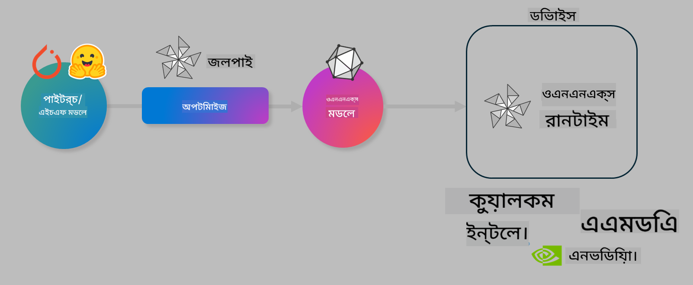

<!--
CO_OP_TRANSLATOR_METADATA:
{
  "original_hash": "6bbe47de3b974df7eea29dfeccf6032b",
  "translation_date": "2025-05-09T04:34:52+00:00",
  "source_file": "code/04.Finetuning/olive-lab/readme.md",
  "language_code": "bn"
}
-->
# Lab. ডিভাইস-ভিত্তিক ইনফারেন্সের জন্য AI মডেল অপ্টিমাইজ করুন

## পরিচিতি

> [!IMPORTANT]  
> এই ল্যাবে **Nvidia A10 বা A100 GPU** এবং সংশ্লিষ্ট ড্রাইভার ও CUDA টুলকিট (ভার্সন 12+) ইনস্টল থাকা আবশ্যক।

> [!NOTE]  
> এটি একটি **৩৫ মিনিটের** ল্যাব যা আপনাকে OLIVE ব্যবহার করে ডিভাইস-ভিত্তিক ইনফারেন্সের জন্য মডেল অপ্টিমাইজেশনের মূল ধারণাগুলো হাতে-কলমে শেখাবে।

## শেখার লক্ষ্যসমূহ

এই ল্যাব শেষে আপনি OLIVE ব্যবহার করে করতে পারবেন:

- AWQ কোয়ান্টাইজেশন পদ্ধতি ব্যবহার করে একটি AI মডেল কোয়ান্টাইজ করা।  
- একটি নির্দিষ্ট কাজের জন্য AI মডেল ফাইন-টিউন করা।  
- ONNX Runtime এ দক্ষ ডিভাইস-ভিত্তিক ইনফারেন্সের জন্য LoRA অ্যাডাপ্টার (ফাইন-টিউন করা মডেল) তৈরি করা।  

### Olive কী

Olive (*O*NNX *live*) হলো একটি মডেল অপ্টিমাইজেশন টুলকিট যার সাথে CLI থাকে, যা ONNX runtime +++https://onnxruntime.ai+++ এর জন্য গুণগত মান এবং কর্মক্ষমতা সহ মডেল সরবরাহ করতে সাহায্য করে।



Olive-তে ইনপুট সাধারণত একটি PyTorch বা Hugging Face মডেল এবং আউটপুট হলো একটি অপ্টিমাইজ করা ONNX মডেল যা ডিভাইসে (ডিপ্লয়মেন্ট টার্গেট) ONNX runtime চালিয়ে কার্যকর হয়। Olive মডেলটিকে ডিপ্লয়মেন্ট টার্গেটের AI অ্যাক্সিলারেটর (NPU, GPU, CPU) অনুযায়ী অপ্টিমাইজ করবে, যা Qualcomm, AMD, Nvidia বা Intel এর মত হার্ডওয়্যার বিক্রেতা প্রদান করে।

Olive একটি *workflow* চালায়, যা একটির পর একটি সাজানো মডেল অপ্টিমাইজেশন টাস্কের সিরিজ, যাদের বলা হয় *passes* — উদাহরণস্বরূপ: মডেল কমপ্রেশন, গ্রাফ ক্যাপচার, কোয়ান্টাইজেশন, গ্রাফ অপ্টিমাইজেশন। প্রতিটি পাসের কিছু প্যারামিটার থাকে যা সেরা মেট্রিকস যেমন সঠিকতা ও লেটেন্সি অর্জনের জন্য টিউন করা যায়, যা সংশ্লিষ্ট ইভ্যালুয়েটর দ্বারা মূল্যায়িত হয়। Olive একটি সার্চ স্ট্র্যাটেজি ব্যবহার করে যা প্রতিটি পাসকে একে একে বা পাসের সেট একসাথে অটো-টিউন করে।

#### Olive এর সুবিধাসমূহ

- গ্রাফ অপ্টিমাইজেশন, কমপ্রেশন ও কোয়ান্টাইজেশনের জন্য বিভিন্ন প্রযুক্তি নিয়ে ম্যানুয়াল ট্রায়াল-এন্ড-এরর পরীক্ষায় হতাশা ও সময় বাঁচান। আপনার গুণগত মান ও কর্মক্ষমতার সীমা নির্ধারণ করুন, Olive সেরা মডেল স্বয়ংক্রিয়ভাবে খুঁজে পাবে।  
- **৪০+ বিল্ট-ইন মডেল অপ্টিমাইজেশন কম্পোনেন্টস** যা কোয়ান্টাইজেশন, কমপ্রেশন, গ্রাফ অপ্টিমাইজেশন ও ফাইনটিউনিংয়ের আধুনিক প্রযুক্তি কভার করে।  
- সাধারণ মডেল অপ্টিমাইজেশন টাস্কের জন্য ব্যবহার সহজ CLI। যেমন: olive quantize, olive auto-opt, olive finetune।  
- মডেল প্যাকেজিং ও ডিপ্লয়মেন্ট অন্তর্নির্মিত।  
- **মাল্টি LoRA সার্ভিং** এর জন্য মডেল তৈরি সমর্থন।  
- YAML/JSON ব্যবহার করে ওয়ার্কফ্লো তৈরি করে মডেল অপ্টিমাইজেশন ও ডিপ্লয়মেন্ট টাস্ক সমন্বয় করা যায়।  
- **Hugging Face** ও **Azure AI** ইন্টিগ্রেশন।  
- বিল্ট-ইন **ক্যাশিং** মেকানিজম যা **খরচ বাঁচায়**।

## ল্যাব নির্দেশিকা  
> [!NOTE]  
> নিশ্চিত করুন যে আপনি Azure AI Hub ও প্রজেক্ট সেটআপ করেছেন এবং Lab 1 অনুযায়ী আপনার A100 কম্পিউট সেটআপ করেছেন।

### ধাপ ০: Azure AI Compute-এ সংযোগ করুন

**VS Code** এর রিমোট ফিচার ব্যবহার করে Azure AI Compute-এ সংযোগ করবেন।

1. আপনার **VS Code** ডেস্কটপ অ্যাপ্লিকেশন খুলুন।  
2. **Shift+Ctrl+P** দিয়ে **command palette** খুলুন।  
3. কমান্ড প্যালেটে **AzureML - remote: Connect to compute instance in New Window** সার্চ করুন।  
4. নির্দেশনা অনুসরণ করে Compute-এ সংযোগ করুন। এতে আপনার Azure Subscription, Resource Group, Project ও Compute নাম নির্বাচন করতে হবে যা Lab 1 এ সেটআপ করা হয়েছিল।  
5. সংযোগ সফল হলে Visual Code এর **বামে নিচে** আপনার Azure ML Compute নোড প্রদর্শিত হবে `><Azure ML: Compute Name`।

### ধাপ ১: এই রিপো ক্লোন করুন

VS Code এ নতুন টার্মিনাল খুলুন (**Ctrl+J**) এবং এই রিপো ক্লোন করুন:

টার্মিনালে প্রম্পট দেখতে পাবেন

```
azureuser@computername:~/cloudfiles/code$ 
```  
Clone the solution

```bash
cd ~/localfiles
git clone https://github.com/microsoft/phi-3cookbook.git
```

### ধাপ ২: VS Code এ ফোল্ডার খুলুন

টার্মিনালে নিচের কমান্ড চালিয়ে সংশ্লিষ্ট ফোল্ডারটি VS Code এ খুলুন, এটি নতুন উইন্ডো খুলবে:

```bash
code phi-3cookbook/code/04.Finetuning/Olive-lab
```

অথবা, **File** > **Open Folder** থেকে ফোল্ডারটি খুলতে পারেন।

### ধাপ ৩: নির্ভরশীলতা ইনস্টল করুন

VS Code এর Azure AI Compute Instance এ একটি টার্মিনাল উইন্ডো খুলুন (টিপ: **Ctrl+J**) এবং নিচের কমান্ডগুলো চালিয়ে নির্ভরশীলতাগুলো ইনস্টল করুন:

```bash
conda create -n olive-ai python=3.11 -y
conda activate olive-ai
pip install -r requirements.txt
az extension remove -n azure-cli-ml
az extension add -n ml
```

> [!NOTE]  
> সব নির্ভরশীলতা ইনস্টল হতে প্রায় ৫ মিনিট সময় লাগবে।

এই ল্যাবে আপনি Azure AI মডেল ক্যাটালগ থেকে মডেল ডাউনলোড ও আপলোড করবেন। ক্যাটালগে প্রবেশের জন্য Azure এ লগইন করতে হবে:

```bash
az login
```

> [!NOTE]  
> লগইন করার সময় আপনাকে সাবস্ক্রিপশন নির্বাচন করতে বলা হবে। নিশ্চিত করুন যে ল্যাবের জন্য প্রদত্ত সাবস্ক্রিপশনটি সেট করা আছে।

### ধাপ ৪: Olive কমান্ড চালান

VS Code এর Azure AI Compute Instance এ একটি টার্মিনাল খুলুন (টিপ: **Ctrl+J**) এবং নিশ্চিত করুন `olive-ai` কন্ডা এনভায়রনমেন্ট সক্রিয় আছে:

```bash
conda activate olive-ai
```

এরপর নিচের Olive কমান্ডগুলো চালান।

1. **ডেটা পরীক্ষা করুন:** এই উদাহরণে, আপনি Phi-3.5-Mini মডেলকে ট্রাভেল সম্পর্কিত প্রশ্নের উত্তর দেওয়ার জন্য ফাইন-টিউন করবেন। নিচের কোডটি JSON লাইন্স ফরম্যাটে ডেটাসেটের প্রথম কয়েকটি রেকর্ড দেখায়:

    ```bash
    head data/data_sample_travel.jsonl
    ```

2. **মডেল কোয়ান্টাইজ করুন:** মডেল ট্রেনিংয়ের আগে Active Aware Quantization (AWQ) পদ্ধতি ব্যবহার করে নিচের কমান্ড দিয়ে কোয়ান্টাইজ করুন +++https://arxiv.org/abs/2306.00978+++. AWQ মডেলের ওয়েটগুলো কোয়ান্টাইজ করে ইনফারেন্স চলাকালীন উৎপন্ন অ্যাক্টিভেশন বিবেচনা করে। এর ফলে প্রচলিত ওয়েট কোয়ান্টাইজেশন পদ্ধতির তুলনায় মডেল সঠিকতা ভালো থাকে।

    ```bash
    olive quantize \
       --model_name_or_path microsoft/Phi-3.5-mini-instruct \
       --trust_remote_code \
       --algorithm awq \
       --output_path models/phi/awq \
       --log_level 1
    ```

    AWQ কোয়ান্টাইজেশন সম্পন্ন হতে **প্রায় ৮ মিনিট** লাগে এবং এটি মডেলের সাইজ প্রায় ~৭.৫GB থেকে ~২.৫GB এ কমিয়ে দেয়।

    এই ল্যাবে আমরা দেখাচ্ছি কিভাবে Hugging Face থেকে মডেল ইনপুট করবেন (যেমন: `microsoft/Phi-3.5-mini-instruct`). However, Olive also allows you to input models from the Azure AI catalog by updating the `model_name_or_path` argument to an Azure AI asset ID (for example:  `azureml://registries/azureml/models/Phi-3.5-mini-instruct/versions/4`). 

1. **Train the model:** Next, the `olive finetune` কমান্ড কোয়ান্টাইজড মডেল ফাইন-টিউন করে)। কোয়ান্টাইজ করার আগে ফাইন-টিউন করলে সঠিকতা ভালো হয় কারণ ফাইন-টিউনিং কোয়ান্টাইজেশনের কিছু ক্ষতি পূরণ করে।

    ```bash
    olive finetune \
        --method lora \
        --model_name_or_path models/phi/awq \
        --data_files "data/data_sample_travel.jsonl" \
        --data_name "json" \
        --text_template "<|user|>\n{prompt}<|end|>\n<|assistant|>\n{response}<|end|>" \
        --max_steps 100 \
        --output_path ./models/phi/ft \
        --log_level 1
    ```

    ফাইন-টিউন (১০০ স্টেপ) সম্পন্ন হতে **প্রায় ৬ মিনিট** লাগে।

3. **অপ্টিমাইজ করুন:** মডেল ট্রেনিংয়ের পর, Olive এর `auto-opt` command, which will capture the ONNX graph and automatically perform a number of optimizations to improve the model performance for CPU by compressing the model and doing fusions. It should be noted, that you can also optimize for other devices such as NPU or GPU by just updating the `--device` and `--provider` আর্গুমেন্ট ব্যবহার করে মডেল অপ্টিমাইজ করুন — তবে এই ল্যাবের জন্য CPU ব্যবহার করা হবে।

    ```bash
    olive auto-opt \
       --model_name_or_path models/phi/ft/model \
       --adapter_path models/phi/ft/adapter \
       --device cpu \
       --provider CPUExecutionProvider \
       --use_ort_genai \
       --output_path models/phi/onnx-ao \
       --log_level 1
    ```

    অপ্টিমাইজেশন সম্পন্ন হতে **প্রায় ৫ মিনিট** লাগে।

### ধাপ ৫: মডেল ইনফারেন্স দ্রুত পরীক্ষা

মডেল ইনফারেন্স পরীক্ষা করার জন্য আপনার ফোল্ডারে **app.py** নামে একটি পাইথন ফাইল তৈরি করুন এবং নিচের কোড কপি-পেস্ট করুন:

```python
import onnxruntime_genai as og
import numpy as np

print("loading model and adapters...", end="", flush=True)
model = og.Model("models/phi/onnx-ao/model")
adapters = og.Adapters(model)
adapters.load("models/phi/onnx-ao/model/adapter_weights.onnx_adapter", "travel")
print("DONE!")

tokenizer = og.Tokenizer(model)
tokenizer_stream = tokenizer.create_stream()

params = og.GeneratorParams(model)
params.set_search_options(max_length=100, past_present_share_buffer=False)
user_input = "what is the best thing to see in chicago"
params.input_ids = tokenizer.encode(f"<|user|>\n{user_input}<|end|>\n<|assistant|>\n")

generator = og.Generator(model, params)

generator.set_active_adapter(adapters, "travel")

print(f"{user_input}")

while not generator.is_done():
    generator.compute_logits()
    generator.generate_next_token()

    new_token = generator.get_next_tokens()[0]
    print(tokenizer_stream.decode(new_token), end='', flush=True)

print("\n")
```

কোড চালানোর জন্য:

```bash
python app.py
```

### ধাপ ৬: মডেল Azure AI তে আপলোড করুন

মডেল Azure AI মডেল রিপোজিটরিতে আপলোড করলে এটি আপনার ডেভেলপমেন্ট টিমের অন্যান্য সদস্যদের সাথে শেয়ারযোগ্য হয় এবং মডেলের ভার্সন কন্ট্রোলও হয়। মডেল আপলোড করতে নিচের কমান্ড চালান:

> [!NOTE]  
> `{}` placeholders with the name of your resource group and Azure AI Project Name. 

To find your resource group `` এর মধ্যে আপনার Resource Group এবং Azure AI প্রজেক্ট নাম আপডেট করুন।

```
az ml workspace show
```

অথবা +++ai.azure.com+++ এ গিয়ে **management center** > **project** > **overview** সিলেক্ট করুন।

`{}` প্লেসহোল্ডারগুলো আপনার Resource Group ও Azure AI প্রজেক্ট নাম দিয়ে আপডেট করুন।

```bash
az ml model create \
    --name ft-for-travel \
    --version 1 \
    --path ./models/phi/onnx-ao \
    --resource-group {RESOURCE_GROUP_NAME} \
    --workspace-name {PROJECT_NAME}
```

আপলোড করা মডেল দেখতে এবং ডিপ্লয় করতে পারেন https://ml.azure.com/model/list এ।

**অস্বীকৃতি**:  
এই নথিটি AI অনুবাদ সেবা [Co-op Translator](https://github.com/Azure/co-op-translator) ব্যবহার করে অনূদিত হয়েছে। আমরা যথাসাধ্য সঠিকতার চেষ্টা করি, তবে স্বয়ংক্রিয় অনুবাদে ভুল বা অসঙ্গতি থাকতে পারে। মূল নথিটি তার স্থানীয় ভাষায়ই কর্তৃত্বপূর্ণ উৎস হিসেবে বিবেচিত হওয়া উচিত। গুরুত্বপূর্ণ তথ্যের জন্য পেশাদার মানব অনুবাদ সুপারিশ করা হয়। এই অনুবাদের ব্যবহারে কোনো ভুল বোঝাবুঝি বা ভুল ব্যাখ্যার জন্য আমরা দায়ী নই।