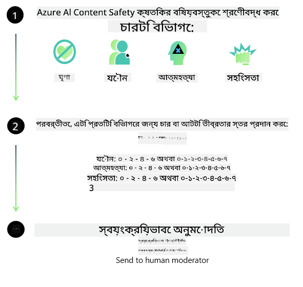
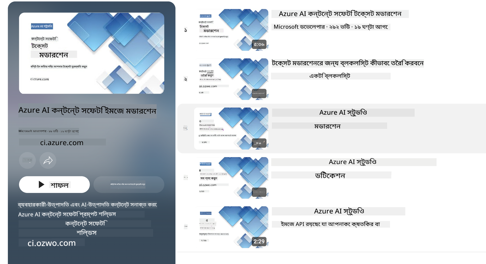

<!--
CO_OP_TRANSLATOR_METADATA:
{
  "original_hash": "c8273672cc57df2be675407a1383aaf0",
  "translation_date": "2025-07-16T17:45:18+00:00",
  "source_file": "md/01.Introduction/01/01.AISafety.md",
  "language_code": "bn"
}
-->
# Phi মডেলগুলোর জন্য AI নিরাপত্তা  
Phi পরিবারের মডেলগুলো [Microsoft Responsible AI Standard](https://query.prod.cms.rt.microsoft.com/cms/api/am/binary/RE5cmFl) অনুযায়ী তৈরি করা হয়েছে, যা একটি কোম্পানি-ব্যাপী নির্দেশিকা এবং নিম্নলিখিত ছয়টি মূলনীতির উপর ভিত্তি করে গঠিত: জবাবদিহিতা, স্বচ্ছতা, ন্যায়পরায়ণতা, নির্ভরযোগ্যতা ও নিরাপত্তা, গোপনীয়তা ও সুরক্ষা, এবং অন্তর্ভুক্তি, যা [Microsoft-এর Responsible AI নীতিমালা](https://www.microsoft.com/ai/responsible-ai) গঠন করে।  

পূর্ববর্তী Phi মডেলগুলোর মতো, একটি বহুমুখী নিরাপত্তা মূল্যায়ন এবং প্রশিক্ষণ পরবর্তী নিরাপত্তা পদ্ধতি গ্রহণ করা হয়েছে, যেখানে এই রিলিজের বহুভাষিক সক্ষমতাগুলো বিবেচনায় অতিরিক্ত ব্যবস্থা নেওয়া হয়েছে। আমাদের নিরাপত্তা প্রশিক্ষণ ও মূল্যায়নের পদ্ধতি, যার মধ্যে রয়েছে একাধিক ভাষায় এবং ঝুঁকি বিভাগে পরীক্ষা, তা [Phi Safety Post-Training Paper](https://arxiv.org/abs/2407.13833)-এ বিস্তারিত বর্ণনা করা হয়েছে। Phi মডেলগুলো এই পদ্ধতির সুবিধা পায়, তবে ডেভেলপারদের উচিত তাদের নির্দিষ্ট ব্যবহারের ক্ষেত্র এবং সাংস্কৃতিক ও ভাষাগত প্রেক্ষাপট অনুযায়ী ঝুঁকি নিরূপণ, পরিমাপ এবং হ্রাস করার জন্য দায়িত্বশীল AI সেরা অনুশীলনগুলো অনুসরণ করা।  

## সেরা অনুশীলনসমূহ  

অন্যান্য মডেলগুলোর মতো, Phi পরিবারের মডেলগুলোও এমন আচরণ করতে পারে যা অন্যায়, অবিশ্বাস্য বা আপত্তিকর হতে পারে।  

SLM এবং LLM এর কিছু সীমাবদ্ধ আচরণ যা আপনাকে জানা উচিত, তা হলো:  

- **পরিষেবার গুণগত মান:** Phi মডেলগুলো মূলত ইংরেজি টেক্সটের উপর প্রশিক্ষিত। ইংরেজি ছাড়া অন্যান্য ভাষাগুলোতে পারফরম্যান্স কম হতে পারে। প্রশিক্ষণ ডেটাতে কম প্রতিনিধিত্ব থাকা ইংরেজি ভাষার ভ্যারাইটি গুলো স্ট্যান্ডার্ড আমেরিকান ইংরেজির তুলনায় খারাপ পারফরম্যান্স দিতে পারে।  
- **ক্ষতির প্রতিনিধিত্ব ও স্টেরিওটাইপের পুনরাবৃত্তি:** এই মডেলগুলো কিছু গোষ্ঠীর অতিরিক্ত বা কম প্রতিনিধিত্ব করতে পারে, কিছু গোষ্ঠীর প্রতিনিধিত্ব মুছে দিতে পারে, অথবা অবমাননাকর বা নেতিবাচক স্টেরিওটাইপকে জোরদার করতে পারে। নিরাপত্তা প্রশিক্ষণ পরেও এই সীমাবদ্ধতাগুলো থাকতে পারে কারণ বিভিন্ন গোষ্ঠীর প্রতিনিধিত্বের মাত্রা ভিন্ন হতে পারে অথবা নেতিবাচক স্টেরিওটাইপের উদাহরণগুলো প্রশিক্ষণ ডেটাতে বেশি থাকতে পারে, যা বাস্তব বিশ্বের ধরণ ও সামাজিক পক্ষপাত প্রতিফলিত করে।  
- **অপ্রাসঙ্গিক বা আপত্তিকর বিষয়বস্তু:** এই মডেলগুলো অন্যান্য ধরনের অপ্রাসঙ্গিক বা আপত্তিকর বিষয়বস্তু তৈরি করতে পারে, যা সংবেদনশীল প্রেক্ষাপটে ব্যবহারের জন্য অতিরিক্ত ব্যবস্থাপনা ছাড়া উপযুক্ত নাও হতে পারে।  
- **তথ্যের নির্ভরযোগ্যতা:** ভাষা মডেলগুলো অর্থহীন বিষয়বস্তু তৈরি করতে পারে বা এমন তথ্য গঠন করতে পারে যা শোনার জন্য যুক্তিসঙ্গত মনে হতে পারে, কিন্তু তা ভুল বা পুরানো হতে পারে।  
- **কোডের সীমিত পরিধি:** Phi-3 এর অধিকাংশ প্রশিক্ষণ ডেটা পাইথন ভিত্তিক এবং সাধারণ প্যাকেজ যেমন "typing, math, random, collections, datetime, itertools" ব্যবহার করে। যদি মডেল অন্য প্যাকেজ বা অন্য ভাষার স্ক্রিপ্ট তৈরি করে, তবে ব্যবহারকারীদের সব API ব্যবহারের ম্যানুয়াল যাচাই করার পরামর্শ দেওয়া হয়।  

ডেভেলপারদের উচিত দায়িত্বশীল AI সেরা অনুশীলন অনুসরণ করা এবং নিশ্চিত করা যে নির্দিষ্ট ব্যবহারের ক্ষেত্র প্রযোজ্য আইন ও বিধিমালা (যেমন গোপনীয়তা, বাণিজ্য ইত্যাদি) মেনে চলে।  

## দায়িত্বশীল AI বিবেচনা  

অন্যান্য ভাষা মডেলগুলোর মতো, Phi সিরিজের মডেলগুলোও এমন আচরণ করতে পারে যা অন্যায়, অবিশ্বাস্য বা আপত্তিকর হতে পারে। কিছু সীমাবদ্ধ আচরণ যা জানা জরুরি, তা হলো:  

**পরিষেবার গুণগত মান:** Phi মডেলগুলো মূলত ইংরেজি টেক্সটের উপর প্রশিক্ষিত। ইংরেজি ছাড়া অন্যান্য ভাষাগুলোতে পারফরম্যান্স কম হতে পারে। প্রশিক্ষণ ডেটাতে কম প্রতিনিধিত্ব থাকা ইংরেজি ভাষার ভ্যারাইটি গুলো স্ট্যান্ডার্ড আমেরিকান ইংরেজির তুলনায় খারাপ পারফরম্যান্স দিতে পারে।  

**ক্ষতির প্রতিনিধিত্ব ও স্টেরিওটাইপের পুনরাবৃত্তি:** এই মডেলগুলো কিছু গোষ্ঠীর অতিরিক্ত বা কম প্রতিনিধিত্ব করতে পারে, কিছু গোষ্ঠীর প্রতিনিধিত্ব মুছে দিতে পারে, অথবা অবমাননাকর বা নেতিবাচক স্টেরিওটাইপকে জোরদার করতে পারে। নিরাপত্তা প্রশিক্ষণ পরেও এই সীমাবদ্ধতাগুলো থাকতে পারে কারণ বিভিন্ন গোষ্ঠীর প্রতিনিধিত্বের মাত্রা ভিন্ন হতে পারে অথবা নেতিবাচক স্টেরিওটাইপের উদাহরণগুলো প্রশিক্ষণ ডেটাতে বেশি থাকতে পারে, যা বাস্তব বিশ্বের ধরণ ও সামাজিক পক্ষপাত প্রতিফলিত করে।  

**অপ্রাসঙ্গিক বা আপত্তিকর বিষয়বস্তু:** এই মডেলগুলো অন্যান্য ধরনের অপ্রাসঙ্গিক বা আপত্তিকর বিষয়বস্তু তৈরি করতে পারে, যা সংবেদনশীল প্রেক্ষাপটে ব্যবহারের জন্য অতিরিক্ত ব্যবস্থাপনা ছাড়া উপযুক্ত নাও হতে পারে।  
তথ্যের নির্ভরযোগ্যতা: ভাষা মডেলগুলো অর্থহীন বিষয়বস্তু তৈরি করতে পারে বা এমন তথ্য গঠন করতে পারে যা শোনার জন্য যুক্তিসঙ্গত মনে হতে পারে, কিন্তু তা ভুল বা পুরানো হতে পারে।  

**কোডের সীমিত পরিধি:** Phi-3 এর অধিকাংশ প্রশিক্ষণ ডেটা পাইথন ভিত্তিক এবং সাধারণ প্যাকেজ যেমন "typing, math, random, collections, datetime, itertools" ব্যবহার করে। যদি মডেল অন্য প্যাকেজ বা অন্য ভাষার স্ক্রিপ্ট তৈরি করে, তবে ব্যবহারকারীদের সব API ব্যবহারের ম্যানুয়াল যাচাই করার পরামর্শ দেওয়া হয়।  

ডেভেলপারদের উচিত দায়িত্বশীল AI সেরা অনুশীলন অনুসরণ করা এবং নিশ্চিত করা যে নির্দিষ্ট ব্যবহারের ক্ষেত্র প্রযোজ্য আইন ও বিধিমালা (যেমন গোপনীয়তা, বাণিজ্য ইত্যাদি) মেনে চলে। বিবেচনার গুরুত্বপূর্ণ ক্ষেত্রগুলো হলো:  

**বণ্টন:** মডেলগুলো এমন পরিস্থিতির জন্য উপযুক্ত নাও হতে পারে যেখানে আইনগত অবস্থা বা সম্পদ ও জীবনের সুযোগের বণ্টনে (যেমন: বাসস্থান, কর্মসংস্থান, ক্রেডিট ইত্যাদি) গুরুত্বপূর্ণ প্রভাব পড়তে পারে, যদি না অতিরিক্ত মূল্যায়ন ও পক্ষপাত দূরীকরণ পদ্ধতি গ্রহণ করা হয়।  

**উচ্চ ঝুঁকিপূর্ণ পরিস্থিতি:** ডেভেলপারদের উচিত মডেল ব্যবহারের উপযুক্ততা মূল্যায়ন করা যেখানে অন্যায়, অবিশ্বাস্য বা আপত্তিকর আউটপুট অত্যন্ত ব্যয়বহুল বা ক্ষতিকর হতে পারে। এর মধ্যে রয়েছে সংবেদনশীল বা বিশেষজ্ঞ ক্ষেত্র যেমন আইনগত বা স্বাস্থ্য পরামর্শ যেখানে নির্ভুলতা ও নির্ভরযোগ্যতা অত্যন্ত গুরুত্বপূর্ণ। প্রয়োগের প্রেক্ষাপটে অতিরিক্ত সুরক্ষা ব্যবস্থা গ্রহণ করা উচিত।  

**ভুল তথ্য:** মডেলগুলো ভুল তথ্য তৈরি করতে পারে। ডেভেলপারদের উচিত স্বচ্ছতার সেরা অনুশীলন অনুসরণ করা এবং ব্যবহারকারীদের জানানো যে তারা একটি AI সিস্টেমের সাথে যোগাযোগ করছে। প্রয়োগ পর্যায়ে, ডেভেলপাররা প্রতিক্রিয়া ভিত্তিক ব্যবস্থা ও পাইপলাইন তৈরি করতে পারেন যা নির্দিষ্ট ব্যবহারের প্রেক্ষাপটে তথ্যের ভিত্তিতে উত্তর প্রদান করে, যাকে Retrieval Augmented Generation (RAG) বলা হয়।  

**ক্ষতিকর বিষয়বস্তু তৈরি:** ডেভেলপারদের উচিত আউটপুটের প্রেক্ষাপট মূল্যায়ন করা এবং তাদের ব্যবহারের জন্য প্রযোজ্য নিরাপত্তা শ্রেণীবিন্যাসকারী বা কাস্টম সমাধান ব্যবহার করা।  

**দুর্ব্যবহার:** প্রতারণা, স্প্যাম বা ম্যালওয়্যার উৎপাদনের মতো অন্যান্য ধরনের দুর্ব্যবহারও সম্ভব, এবং ডেভেলপারদের উচিত নিশ্চিত করা যে তাদের অ্যাপ্লিকেশন প্রযোজ্য আইন ও বিধিমালা লঙ্ঘন করে না।  

### ফাইনটিউনিং এবং AI বিষয়বস্তু নিরাপত্তা  

মডেল ফাইনটিউন করার পর, আমরা অত্যন্ত পরামর্শ দিই [Azure AI Content Safety](https://learn.microsoft.com/azure/ai-services/content-safety/overview) ব্যবস্থাগুলো ব্যবহার করার জন্য, যা মডেল দ্বারা তৈরি বিষয়বস্তু পর্যবেক্ষণ করে, সম্ভাব্য ঝুঁকি, হুমকি এবং গুণগত সমস্যাগুলো সনাক্ত ও ব্লক করে।  

  

[Azure AI Content Safety](https://learn.microsoft.com/azure/ai-services/content-safety/overview) টেক্সট এবং ইমেজ উভয় ধরনের বিষয়বস্তু সমর্থন করে। এটি ক্লাউড, ডিসকানেক্টেড কন্টেইনার এবং এজ/এম্বেডেড ডিভাইসে স্থাপন করা যায়।  

## Azure AI Content Safety এর সংক্ষিপ্ত বিবরণ  

Azure AI Content Safety একটি সার্বজনীন সমাধান নয়; এটি ব্যবসার নির্দিষ্ট নীতিমালার সাথে সামঞ্জস্য রেখে কাস্টমাইজ করা যায়। এছাড়াও, এর বহুভাষিক মডেলগুলো একসাথে একাধিক ভাষা বুঝতে সক্ষম।  

  

- **Azure AI Content Safety**  
- **Microsoft Developer**  
- **৫টি ভিডিও**  

Azure AI Content Safety সার্ভিস অ্যাপ্লিকেশন ও সেবাগুলিতে ক্ষতিকর ব্যবহারকারী-উৎপন্ন এবং AI-উৎপন্ন বিষয়বস্তু সনাক্ত করে। এতে টেক্সট এবং ইমেজ API রয়েছে যা ক্ষতিকর বা অপ্রাসঙ্গিক বিষয়বস্তু সনাক্ত করতে সাহায্য করে।  

[AI Content Safety Playlist](https://www.youtube.com/playlist?list=PLlrxD0HtieHjaQ9bJjyp1T7FeCbmVcPkQ)

**অস্বীকৃতি**:  
এই নথিটি AI অনুবাদ সেবা [Co-op Translator](https://github.com/Azure/co-op-translator) ব্যবহার করে অনূদিত হয়েছে। আমরা যথাসাধ্য সঠিকতার চেষ্টা করি, তবে স্বয়ংক্রিয় অনুবাদে ত্রুটি বা অসঙ্গতি থাকতে পারে। মূল নথিটি তার নিজস্ব ভাষায়ই কর্তৃত্বপূর্ণ উৎস হিসেবে বিবেচিত হওয়া উচিত। গুরুত্বপূর্ণ তথ্যের জন্য পেশাদার মানব অনুবাদ গ্রহণ করার পরামর্শ দেওয়া হয়। এই অনুবাদের ব্যবহারে সৃষ্ট কোনো ভুল বোঝাবুঝি বা ভুল ব্যাখ্যার জন্য আমরা দায়ী নই।