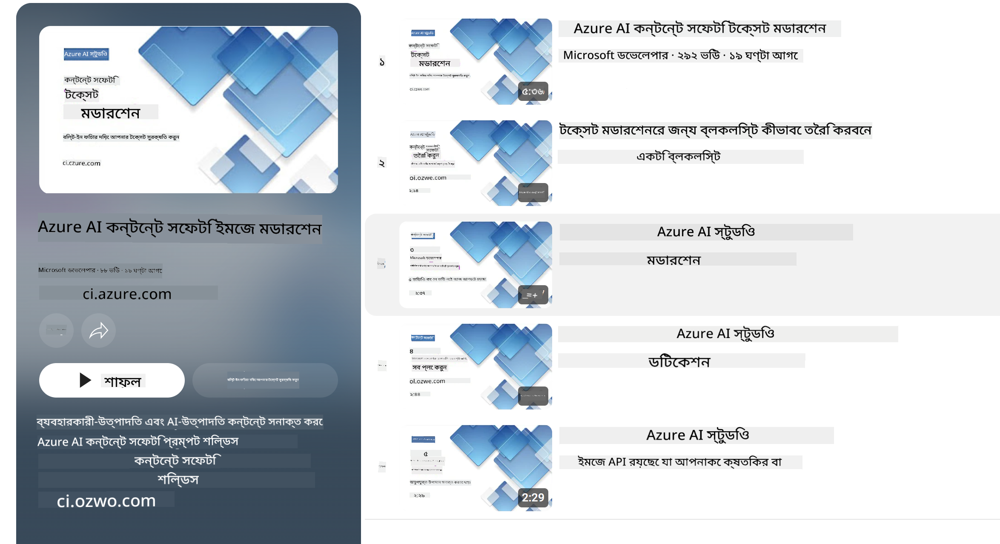

<!--
CO_OP_TRANSLATOR_METADATA:
{
  "original_hash": "839ccc4b3886ef10cfd4e64977f5792d",
  "translation_date": "2026-01-05T16:40:15+00:00",
  "source_file": "md/01.Introduction/01/01.AISafety.md",
  "language_code": "bn"
}
-->
# Phi মডেলের জন্য AI নিরাপত্তা
Phi মডেলের পরিবার বিকশিত হয়েছে [Microsoft Responsible AI Standard](https://www.microsoft.com/ai/principles-and-approach#responsible-ai-standard) এর সম্মতিতে, যা কোম্পানি-মাত্রার একটি সেট দাবি যা নিম্নলিখিত ছয়টি নীতির ওপর ভিত্তি করে: জবাবদিহিতা, স্বচ্ছতা, ন্যায্যতা, নির্ভরযোগ্যতা ও নিরাপত্তা, গোপনীয়তা ও সুরক্ষা, এবং অন্তর্ভুক্তি যা গঠন করে [Microsoft-এর Responsible AI নীতিমালা](https://www.microsoft.com/ai/responsible-ai)।

পূর্ববর্তী Phi মডেলগুলোর মত, একটি বহু-মুখী নিরাপত্তা মূল্যায়ন এবং নিরাপত্তা পোস্ট-ট্রেনিং পদ্ধতি গ্রহণ করা হয়েছে, এই রিলিজের বহু-ভাষিক ক্ষমতাগুলি বিবেচনায় অতিরিক্ত ব্যবস্থা গ্রহণ সহ। আমাদের নিরাপত্তা প্রশিক্ষণ এবং মূল্যায়নের পদ্ধতি, যেখানে একাধিক ভাষা এবং ঝুঁকি শ্রেণীর পরীক্ষা অন্তর্ভুক্ত, তা [Phi Safety Post-Training Paper](https://arxiv.org/abs/2407.13833) এ উল্লেখ রয়েছে। Phi মডেলগুলো এই পদ্ধতির সুবিধা পাচ্ছে, তবে ডেভেলপারদের উচিত তাদের নির্দিষ্ট ব্যবহারের ক্ষেত্রে এবং সাংস্কৃতিক ও ভাষাগত প্রেক্ষাপটে সম্পর্কিত ঝুঁকিগুলো নির_mapping, পরিমাপ, এবং হ্রাস করার জন্য দায়িত্বশীল AI সেরা চর্চাগুলো গ্রহণ করা।

## সেরা চর্চা

অন্যান্য মডেলের মত, Phi মডেলগুলোর পরিবারেও এমন আচরণ থাকতে পারে যা অন্যায়, অবিশ্বস্ত, বা আপত্তিকর হতে পারে।

SLM এবং LLM এর কিছু সীমাবদ্ধ আচরণের ব্যাপারে জানা দরকার:

- **সেবার গুণমান:** Phi মডেলগুলো প্রধানত ইংরেজি টেক্সটের ওপর প্রশিক্ষিত। ইংরেজি ছাড়া অন্যান্য ভাষাগুলোর কার্যক্ষমতা কম হতে পারে। প্রশিক্ষণ ডেটাতে কম প্রতিনিধিত্ব থাকা ইংরেজি ভাষার ভ্যারাইটি গুলো স্ট্যান্ডার্ড আমেরিকান ইংরেজির তুলনায় খারাপ পারফরমেন্স দিতে পারে।
- **ক্ষতি ও স্টেরিওটাইপ প্রতিফলন:** এই মডেলগুলো কিছু গোষ্ঠীর প্রতিনিধিত্ব অতিরিক্ত বা কম করতে পারে, কিছু গোষ্ঠীর প্রতিনিধিত্ব মুছে ফেলতে পারে, অথবা অবমাননাকর বা নেতিবাচক স্টেরিওটাইপকে পুনর্ব্যক্ত করে থাকতে পারে। নিরাপত্তা পোস্ট-ট্রেনিং সত্ত্বেও, এই সীমাবদ্ধতাগুলো থাকতে পারে কারণ বিভিন্ন গোষ্ঠীর প্রতিনিধিত্বের স্তর পার্থক্য বা বাস্তব বিশ্ব ধাঁচ ও সামাজিক পক্ষপাতের প্রতিফলন হিসেবে নেতিবাচক স্টেরিওটাইপের উদাহরণ প্রচলিত থাকতে পারে।
- **অপ্রাসঙ্গিক বা আপত্তিকর বিষয়বস্তু:** এই মডেলগুলো অন্য ধরনের অপ্রাসঙ্গিক বা আপত্তিকর বিষয়বস্তু তৈরি করতে পারে, যা সংবেদনশীল প্রেক্ষাপটে অতিরিক্ত ব্যবস্থাপনা ছাড়া ব্যবহার অনুচিত করে তুলতে পারে।
- **তথ্যের নির্ভরযোগ্যতা:** ভাষা মডেলগুলো অর্থহীন বিষয়বস্তু তৈরি করতে পারে বা এমন তথ্য সাজিয়ে দিতে পারে যা যুক্তিসংগত শোনাতে পারে কিন্তু ভুল বা পুরনো হতে পারে।
- **কোডের সীমিত সুযোগ:** Phi-3 প্রশিক্ষণ ডেটার প্রধান অংশ পাইথনে ভিত্তিক এবং "typing, math, random, collections, datetime, itertools" মতো সাধারণ প্যাকেজ ব্যবহার করে। যদি মডেল পাইথন স্ক্রিপ্ট তৈরি করে যা অন্য প্যাকেজ বা অন্য ভাষার স্ক্রিপ্ট ব্যবহার করে, তাহলে ব্যবহারকারীদের দৃঢ়ভাবে পরামর্শ দেওয়া হয় সব API ব্যবহার ম্যানুয়ালি যাচাই করার জন্য।

ডেভেলপারদের উচিত দায়িত্বশীল AI সেরা চর্চাগুলো গ্রহণ করা এবং নিশ্চিত করা যে নির্দিষ্ট ব্যবহারের ক্ষেত্র সম্পর্কিত আইন ও বিধিমালা (যেমন গোপনীয়তা, বাণিজ্য ইত্যাদি) মেনে চলছে।

## দায়িত্বশীল AI বিবেচনা

অন্য ভাষা মডেলগুলোর মত, Phi সিরিজের মডেলও সম্ভাব্য এমন আচরণ করতে পারে যা অন্যায়, অবিশ্বস্ত, বা আপত্তিকর। কিছু সীমাবদ্ধ আচরণের ব্যাপারে জানা দরকার:

**সেবার গুণমান:** Phi মডেলগুলো প্রধানত ইংরেজি টেক্সটের ওপর প্রশিক্ষিত। ইংরেজি ছাড়া অন্যান্য ভাষায় কর্মক্ষমতা খারাপ হতে পারে। প্রশিক্ষণ ডেটাতে কম প্রতিনিধিত্ব থাকা ইংরেজি ভাষার ভ্যারাইটি গুলো স্ট্যান্ডার্ড আমেরিকান ইংরেজির তুলনায় কর্মক্ষমতা কম দিতে পারে।

**ক্ষতি ও স্টেরিওটাইপ প্রতিফলন:** মডেলগুলো কিছু গোষ্ঠীর অতিরিক্ত বা কম প্রতিনিধিত্ব করতে পারে, কিছু গোষ্ঠীর প্রতিনিধিত্ব মুছে ফেলতে পারে, অথবা অবমাননাকর বা নেতিবাচক স্টেরিওটাইপকে পুনর্ব্যক্ত করতে পারে। নিরাপত্তা পোস্ট-ট্রেনিং সত্ত্বেও, এই সীমাবদ্ধতাগুলো থাকতে পারে, কারণ বিভিন্ন গোষ্ঠীর প্রতিনিধিত্বের পার্থক্য বা নেতিবাচক স্টেরিওটাইপের উদাহরণ বাস্তব বিশ্ব ধাঁচ এবং সামাজিক পক্ষপাত প্রতিফলিত হয়ে থাকতে পারে।

**অপ্রাসঙ্গিক বা আপত্তিকর বিষয়বস্তু:** মডেলগুলো অন্যান্য ধরনের অপ্রাসঙ্গিক বা আপত্তিকর বিষয়বস্তু তৈরি করতে পারে, যা সংবেদনশীল প্রেক্ষাপটে অতিরিক্ত ব্যবস্থাপনা ছাড়া ব্যবহার অনুচিত করে তুলতে পারে। তথ্যের নির্ভরযোগ্যতা: ভাষা মডেলগুলো অর্থহীন বিষয়বস্তু তৈরি করতে পারে বা এমন তথ্য সাজিয়ে দিতে পারে যা যুক্তিসংগত শোনাতে পারে কিন্তু ভুল বা পুরনো হতে পারে।

**কোডের সীমিত সুযোগ:** Phi-3 প্রশিক্ষণ ডেটার বেশিরভাগ অংশ পাইথনে ভিত্তিক এবং "typing, math, random, collections, datetime, itertools" এর মতো সাধারণ প্যাকেজ ব্যবহার করে। যদি মডেল পাইথন স্ক্রিপ্ট তৈরি করে যা অন্য প্যাকেজ বা অন্য ভাষার স্ক্রিপ্ট ব্যবহার করে, তাহলে ব্যবহারকারীদের দৃঢ়ভাবে সব API ব্যবহারের ম্যানুয়াল যাচাই করার সুপারিশ করা হয়।

ডেভেলপারদের উচিত দায়িত্বশীল AI সেরা চর্চাগুলো গ্রহণ করা এবং নিশ্চিত করা যে নির্দিষ্ট ব্যবহারের ক্ষেত্র সম্পর্কিত আইন ও বিধিমালা (যেমন গোপনীয়তা, বাণিজ্য ইত্যাদি) মেনে চলছে। বিবেচনার গুরুত্বপূর্ণ ক্ষেত্রগুলো হল:

**বণ্টন:** মডেলগুলো এমন পরিস্থিতির জন্য উপযুক্ত নাও হতে পারে যেগুলো আইনি অবস্থা বা সম্পদ, জীবন সুযোগ ইত্যাদির বণ্টনে প্রভাব ফেলতে পারে (যেমন: বাসস্থান, চাকরি, ক্রেডিট ইত্যাদি) অতিরিক্ত মূল্যায়ন এবং বায়াস নির্মূল প্রযুক্তি ছাড়া।

**উচ্চ-ঝুঁকিপূর্ণ পরিস্থিতি:** ডেভেলপারদের উচিত মূল্যায়ন করা যে মডেল ব্যবহার উপযুক্ত কিনা উচ্চ-ঝুঁকিপূর্ণ পরিস্থিতিতে যেখানে অন্যায়, অবিশ্বস্ত বা আপত্তিকর আউটপুট অত্যন্ত ব্যয়সাপেক্ষ বা ক্ষতিকর হতে পারে। এর মধ্যে সংবেদনশীল বা বিশেষজ্ঞ ক্ষেত্রের পরামর্শ অন্তর্ভুক্ত যেখানে নির্ভুলতা ও নির্ভরযোগ্যতা অপরিহার্য (যেমন: আইন বা স্বাস্থ্য পরামর্শ)। ডিপ্লয়মেন্ট প্রেক্ষাপট অনুসারে অ্যাপ্লিকেশন স্তরে অতিরিক্ত সুরক্ষা ব্যবস্থা প্রয়োগ করা উচিত।

**ত্রুটিপূর্ণ তথ্য:** মডেলগুলো ভুল তথ্য তৈরি করতে পারে। ডেভেলপারদের উচিত স্বচ্ছতার সর্বোত্তম চর্চাগুলো অনুসরণ করা এবং শেষ ব্যবহারকারীকে জানানো যে তারা একটি AI সিস্টেমের সঙ্গে যোগাযোগ করছে। অ্যাপ্লিকেশন স্তরে, ডেভেলপাররা ব্যবহার-কেস নির্দিষ্ট, প্রাসঙ্গিক তথ্যের ভিত্তিতে প্রতিক্রিয়া ভিত্তিক মেকানিজম ও পাইপলাইন তৈরি করতে পারে, যা Retrieval Augmented Generation (RAG) নামে পরিচিত।

**ক্ষতিকর বিষয়বস্তু উত্পাদন:** ডেভেলপারদের উচিত তাদের আউটপুট প্রেক্ষাপট অনুযায়ী মূল্যায়ন করা এবং তাদের ব্যবহারের জন্য উপযুক্ত সেফটি ক্লাসিফায়ার বা কাস্টম সমাধান ব্যবহার করা।

**অব্যবহার:** অন্য ধরনের অব্যবহার যেমন প্রতারণা, স্প্যাম, বা ম্যালওয়্যার উত্পাদন সম্ভব হতে পারে, এবং ডেভেলপারদের নিশ্চিত করতে হবে যে তাদের অ্যাপ্লিকেশন প্রযোজ্য আইন ও বিধিমালা লঙ্ঘন করছে না।

### ফাইনটিউনিং এবং AI বিষয়বস্তু নিরাপত্তা

মডেল ফাইনটিউন করার পর, আমরা অত্যন্ত পরামর্শ দিই [Azure AI Content Safety](https://learn.microsoft.com/azure/ai-services/content-safety/overview) ব্যবস্থাপনা ব্যবহারের জন্য, যা মডেল থেকে সৃষ্ট বিষয়বস্তু পর্যবেক্ষণ করে, সম্ভাব্য ঝুঁকি, হুমকি এবং গুণগত সমস্যাগুলো শনাক্ত এবং ব্লক করে।

[Azure AI Content Safety](https://learn.microsoft.com/azure/ai-services/content-safety/overview) টেক্সট ও ছবি উভয় বিষয়বস্তু সমর্থন করে। এটি ক্লাউডে, বিচ্ছিন্ন কন্টেইনারে, এবং এজ/এম্বেডেড ডিভাইসেও ডিপ্লয় করা যেতে পারে।

## Azure AI Content Safety এর ওভারভিউ

Azure AI Content Safety এক-আকার-সবার-জন্য সমাধান নয়; এটি ব্যবসার নির্দিষ্ট নীতিমালা অনুসারে কাস্টমাইজ করা যায়। তদুপরি, এর বহু-ভাষিক মডেলগুলো একযোগে একাধিক ভাষা বুঝতে সক্ষম।

- **Azure AI Content Safety**
- **Microsoft Developer**
- **5 ভিডিও**

Azure AI Content Safety সেবা অ্যাপ্লিকেশন ও সেবায় ক্ষতিকর ব্যবহারকারী-সৃষ্ট এবং AI-সৃষ্ট বিষয়বস্তু সনাক্ত করে। এতে টেক্সট ও ইমেজ API অন্তর্ভুক্ত রয়েছে যা ক্ষতিকর বা অপ্রাসঙ্গিক উপাদান সনাক্ত করতে সাহায্য করে।

[AI Content Safety Playlist](https://www.youtube.com/playlist?list=PLlrxD0HtieHjaQ9bJjyp1T7FeCbmVcPkQ)

---

<!-- CO-OP TRANSLATOR DISCLAIMER START -->
**অস্বীকৃতি**:
এই নথিটি AI অনুবাদ সেবা [Co-op Translator](https://github.com/Azure/co-op-translator) ব্যবহারের মাধ্যমে অনুবাদ করা হয়েছে। আমরা যথাসাধ্য সঠিকতার চেষ্টা করি, তবে অনুগ্রহ করে মনে রাখবেন যে স্বয়ংক্রিয় অনুবাদে ত্রুটি বা অসঙ্গতি থাকতে পারে। মৌলিক নথি তার নিজ ভাষায় সর্বোচ্চ কর্তৃত্বপূর্ণ উৎস হিসেবে বিবেচিত হওয়া উচিত। গুরুত্বপূর্ণ তথ্যের জন্য পেশাদার মানব অনুবাদ করার পরামর্শ দেওয়া হয়। এই অনুবাদের ব্যবহারে সৃষ্ট যে কোনো ভুল বোঝাবুঝি বা ব্যাখ্যার জন্য আমরা দায়বদ্ধ নই।
<!-- CO-OP TRANSLATOR DISCLAIMER END -->