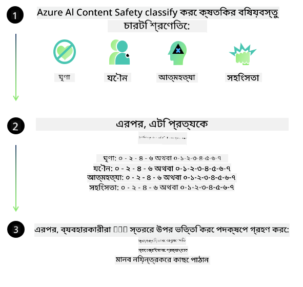
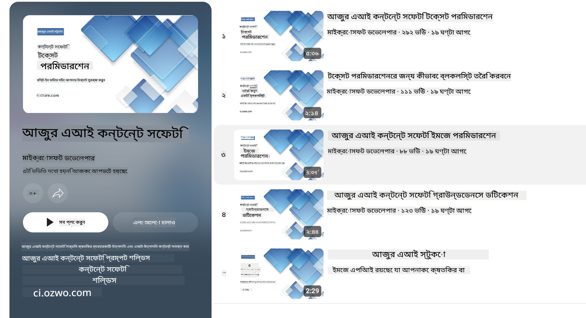

<!--
CO_OP_TRANSLATOR_METADATA:
{
  "original_hash": "c8273672cc57df2be675407a1383aaf0",
  "translation_date": "2025-05-09T05:46:58+00:00",
  "source_file": "md/01.Introduction/01/01.AISafety.md",
  "language_code": "bn"
}
-->
# Phi মডেলের AI সুরক্ষা  
Phi পরিবারের মডেলগুলি [Microsoft Responsible AI Standard](https://query.prod.cms.rt.microsoft.com/cms/api/am/binary/RE5cmFl) অনুসারে তৈরি করা হয়েছে, যা একটি কোম্পানি-ব্যাপী নির্দেশিকা, যা নিম্নলিখিত ছয়টি মূলনীতির ওপর ভিত্তি করে গঠিত: দায়িত্বশীলতা, স্বচ্ছতা, ন্যায়পরায়ণতা, নির্ভরযোগ্যতা এবং সুরক্ষা, গোপনীয়তা এবং সুরক্ষা, এবং অন্তর্ভুক্তিমূলকতা, যা [Microsoft-এর Responsible AI নীতিমালা](https://www.microsoft.com/ai/responsible-ai) গঠন করে।  

পূর্ববর্তী Phi মডেলগুলোর মতো, একটি বহুমুখী সুরক্ষা মূল্যায়ন এবং ট্রেনিং পরবর্তী সুরক্ষা পদ্ধতি গ্রহণ করা হয়েছে, এবং এই রিলিজের বহুভাষিক সক্ষমতাগুলো বিবেচনায় অতিরিক্ত ব্যবস্থা নেওয়া হয়েছে। আমাদের সুরক্ষা প্রশিক্ষণ এবং মূল্যায়নের পদ্ধতি, যার মধ্যে রয়েছে একাধিক ভাষায় এবং ঝুঁকি বিভাগের মধ্যে পরীক্ষা, তা [Phi Safety Post-Training Paper](https://arxiv.org/abs/2407.13833)-এ বিস্তারিতভাবে বর্ণিত। যদিও Phi মডেলগুলি এই পদ্ধতির সুবিধা পায়, বিকাশকারীদের উচিত তাদের নির্দিষ্ট ব্যবহারের ক্ষেত্র এবং সাংস্কৃতিক ও ভাষাগত প্রেক্ষাপটের সঙ্গে সম্পর্কিত ঝুঁকিগুলো সনাক্ত, পরিমাপ এবং হ্রাস করার জন্য দায়িত্বশীল AI সেরা অনুশীলনগুলি প্রয়োগ করা।  

## সেরা অনুশীলনসমূহ  

অন্যান্য মডেলগুলোর মতো, Phi পরিবারের মডেলগুলো এমন আচরণ করতে পারে যা অন্যায়, অবিশ্বাস্য বা আপত্তিকর হতে পারে।  

SLM এবং LLM এর কিছু সীমাবদ্ধ আচরণ যা আপনাকে জানতে হবে তা হলো:  

- **সেবার মান:** Phi মডেলগুলি প্রধানত ইংরেজি টেক্সটের ওপর প্রশিক্ষিত। ইংরেজি ছাড়া অন্যান্য ভাষাগুলোতে কর্মক্ষমতা খারাপ হতে পারে। প্রশিক্ষণ ডেটায় কম প্রতিনিধিত্ব পাওয়া ইংরেজি ভাষার ভ্যারিয়েন্টগুলো স্ট্যান্ডার্ড আমেরিকান ইংরেজির তুলনায় খারাপ ফলাফল দিতে পারে।  
- **ক্ষতির উপস্থাপনা ও стেরিওটাইপের পুনরাবৃত্তি:** এই মডেলগুলো কিছু গোষ্ঠীর প্রতিনিধিত্ব অতিরিক্ত বা কম করতে পারে, কিছু গোষ্ঠীর প্রতিনিধিত্ব মুছে ফেলতে পারে, অথবা অপমানজনক বা নেতিবাচক স্টেরিওটাইপকে শক্তিশালী করতে পারে। সুরক্ষা ট্রেনিং পরেও এই সীমাবদ্ধতাগুলো থাকতে পারে কারণ বিভিন্ন গোষ্ঠীর প্রতিনিধিত্বের মাত্রা বা নেতিবাচক স্টেরিওটাইপের উদাহরণগুলোর উপস্থিতি বাস্তব জগতের ধরণ এবং সামাজিক পক্ষপাত প্রতিফলিত করে।  
- **অশোভন বা আপত্তিকর বিষয়বস্তু:** এই মডেলগুলো অন্য ধরনের অশোভন বা আপত্তিকর বিষয়বস্তু তৈরি করতে পারে, যা সংবেদনশীল প্রসঙ্গে ব্যবহার করার আগে অতিরিক্ত ব্যবস্থাপনা ছাড়া অনুপযুক্ত হতে পারে।  
- **তথ্যের নির্ভরযোগ্যতা:** ভাষা মডেল nonsensical বিষয়বস্তু তৈরি করতে পারে অথবা এমন বিষয়বস্তু রচনা করতে পারে যা যুক্তিসঙ্গত শোনালেও ভুল বা পুরাতন হতে পারে।  
- **কোডের সীমিত পরিধি:** Phi-3 এর প্রশিক্ষণ ডেটার অধিকাংশ Python ভিত্তিক এবং এতে সাধারণ প্যাকেজ যেমন "typing, math, random, collections, datetime, itertools" ব্যবহৃত হয়েছে। মডেল যদি অন্য প্যাকেজ ব্যবহার করে Python স্ক্রিপ্ট তৈরি করে অথবা অন্য ভাষার স্ক্রিপ্ট তৈরি করে, তাহলে ব্যবহারকারীদের সব API ব্যবহারের ম্যানুয়াল যাচাই করার পরামর্শ দেওয়া হয়।  

বিকাশকারীদের উচিত দায়িত্বশীল AI সেরা অনুশীলন অনুসরণ করা এবং নিশ্চিত করা যে নির্দিষ্ট ব্যবহারের ক্ষেত্র প্রযোজ্য আইন ও নিয়মাবলীর (যেমন গোপনীয়তা, বাণিজ্য ইত্যাদি) সাথে সামঞ্জস্যপূর্ণ।  

## দায়িত্বশীল AI বিবেচনাসমূহ  

অন্যান্য ভাষা মডেলগুলোর মতো, Phi সিরিজের মডেলগুলো এমন আচরণ করতে পারে যা অন্যায়, অবিশ্বাস্য বা আপত্তিকর হতে পারে। কিছু সীমাবদ্ধ আচরণ যা জানা জরুরি তা হলো:  

**সেবার মান:** Phi মডেলগুলি প্রধানত ইংরেজি টেক্সটের ওপর প্রশিক্ষিত। ইংরেজি ছাড়া অন্যান্য ভাষাগুলোতে কর্মক্ষমতা খারাপ হতে পারে। প্রশিক্ষণ ডেটায় কম প্রতিনিধিত্ব পাওয়া ইংরেজি ভাষার ভ্যারিয়েন্টগুলো স্ট্যান্ডার্ড আমেরিকান ইংরেজির তুলনায় খারাপ ফলাফল দিতে পারে।  

**ক্ষতির উপস্থাপনা ও স্টেরিওটাইপের পুনরাবৃত্তি:** এই মডেলগুলো কিছু গোষ্ঠীর প্রতিনিধিত্ব অতিরিক্ত বা কম করতে পারে, কিছু গোষ্ঠীর প্রতিনিধিত্ব মুছে ফেলতে পারে, অথবা অপমানজনক বা নেতিবাচক স্টেরিওটাইপকে শক্তিশালী করতে পারে। সুরক্ষা ট্রেনিং পরেও এই সীমাবদ্ধতাগুলো থাকতে পারে কারণ বিভিন্ন গোষ্ঠীর প্রতিনিধিত্বের মাত্রা বা নেতিবাচক স্টেরিওটাইপের উদাহরণগুলোর উপস্থিতি বাস্তব জগতের ধরণ এবং সামাজিক পক্ষপাত প্রতিফলিত করে।  

**অশোভন বা আপত্তিকর বিষয়বস্তু:** এই মডেলগুলো অন্য ধরনের অশোভন বা আপত্তিকর বিষয়বস্তু তৈরি করতে পারে, যা সংবেদনশীল প্রসঙ্গে ব্যবহার করার আগে অতিরিক্ত ব্যবস্থাপনা ছাড়া অনুপযুক্ত হতে পারে।  
তথ্যের নির্ভরযোগ্যতা: ভাষা মডেল nonsensical বিষয়বস্তু তৈরি করতে পারে অথবা এমন বিষয়বস্তু রচনা করতে পারে যা যুক্তিসঙ্গত শোনালেও ভুল বা পুরাতন হতে পারে।  

**কোডের সীমিত পরিধি:** Phi-3 এর প্রশিক্ষণ ডেটার অধিকাংশ Python ভিত্তিক এবং এতে সাধারণ প্যাকেজ যেমন "typing, math, random, collections, datetime, itertools" ব্যবহৃত হয়েছে। মডেল যদি অন্য প্যাকেজ ব্যবহার করে Python স্ক্রিপ্ট তৈরি করে অথবা অন্য ভাষার স্ক্রিপ্ট তৈরি করে, তাহলে ব্যবহারকারীদের সব API ব্যবহারের ম্যানুয়াল যাচাই করার পরামর্শ দেওয়া হয়।  

বিকাশকারীদের উচিত দায়িত্বশীল AI সেরা অনুশীলন অনুসরণ করা এবং নিশ্চিত করা যে নির্দিষ্ট ব্যবহারের ক্ষেত্র প্রযোজ্য আইন ও নিয়মাবলীর (যেমন গোপনীয়তা, বাণিজ্য ইত্যাদি) সাথে সামঞ্জস্যপূর্ণ। বিবেচনার গুরুত্বপূর্ণ ক্ষেত্রসমূহ হলো:  

**বন্টন:** মডেলগুলো এমন পরিস্থিতিতে ব্যবহার উপযুক্ত নাও হতে পারে যেখানে আইনগত অবস্থা বা সম্পদ বা জীবন সুযোগের বন্টনে (যেমন: বাসস্থান, চাকরি, ক্রেডিট ইত্যাদি) গুরুত্বপূর্ণ প্রভাব পড়তে পারে, যদি অতিরিক্ত মূল্যায়ন এবং পক্ষপাত দূরীকরণ কৌশল না নেওয়া হয়।  

**উচ্চ ঝুঁকিপূর্ণ পরিস্থিতি:** বিকাশকারীদের উচিত মডেল ব্যবহারের উপযোগিতা মূল্যায়ন করা যেখানে অন্যায়, অবিশ্বাস্য বা আপত্তিকর আউটপুট অত্যন্ত ব্যয়বহুল বা ক্ষতিকর হতে পারে। এর মধ্যে রয়েছে সংবেদনশীল বা বিশেষজ্ঞ ক্ষেত্র যেমন আইনগত বা স্বাস্থ্য পরামর্শ যেখানে সঠিকতা এবং নির্ভরযোগ্যতা অপরিহার্য। ডেপ্লয়মেন্টের প্রেক্ষাপট অনুযায়ী অ্যাপ্লিকেশন স্তরে অতিরিক্ত সুরক্ষা ব্যবস্থা নেওয়া উচিত।  

**ভ্রান্ত তথ্য:** মডেলগুলো ভুল তথ্য তৈরি করতে পারে। বিকাশকারীদের উচিত স্বচ্ছতার সেরা অনুশীলন অনুসরণ করে শেষ ব্যবহারকারীদের জানানো যে তারা একটি AI সিস্টেমের সঙ্গে যোগাযোগ করছে। অ্যাপ্লিকেশন স্তরে, বিকাশকারীরা প্রতিক্রিয়া ভিত্তিক মেকানিজম এবং পাইপলাইন তৈরি করতে পারে যা ব্যবহার-ভিত্তিক, প্রসঙ্গভিত্তিক তথ্যের ওপর ভিত্তি করে আউটপুট তৈরি করে, যা Retrieval Augmented Generation (RAG) নামে পরিচিত।  

**ক্ষতিকর বিষয়বস্তু তৈরি:** বিকাশকারীদের উচিত আউটপুটের প্রসঙ্গ বিবেচনা করে মূল্যায়ন করা এবং উপলব্ধ সুরক্ষা শ্রেণীবিভাগকারী বা কাস্টম সমাধান ব্যবহার করা যা তাদের ব্যবহারের ক্ষেত্রে উপযুক্ত।  

**দুরব্যবহার:** প্রতারণা, স্প্যাম বা ম্যালওয়্যার উৎপাদনসহ অন্যান্য ধরনের দুরব্যবহার সম্ভব হতে পারে, এবং বিকাশকারীদের উচিত নিশ্চিত করা যে তাদের অ্যাপ্লিকেশন প্রযোজ্য আইন ও নিয়মাবলী লঙ্ঘন করছে না।  

### ফাইনটিউনিং এবং AI বিষয়বস্তু সুরক্ষা  

মডেল ফাইনটিউন করার পর, আমরা দৃঢ়ভাবে পরামর্শ দিই [Azure AI Content Safety](https://learn.microsoft.com/azure/ai-services/content-safety/overview) ব্যবস্থাগুলো ব্যবহার করে মডেল দ্বারা তৈরি বিষয়বস্তু পর্যবেক্ষণ করার, সম্ভাব্য ঝুঁকি, হুমকি এবং গুণগত সমস্যা সনাক্ত এবং ব্লক করার জন্য।  

  

[Azure AI Content Safety](https://learn.microsoft.com/azure/ai-services/content-safety/overview) টেক্সট এবং ইমেজ উভয় বিষয়বস্তু সমর্থন করে। এটি ক্লাউড, ডিসকানেক্টেড কন্টেইনার এবং এজ/এম্বেডেড ডিভাইসে ডেপ্লয় করা যায়।  

## Azure AI Content Safety এর সারসংক্ষেপ  

Azure AI Content Safety একটি সার্বজনীন সমাধান নয়; এটি ব্যবসায়ের নির্দিষ্ট নীতিমালার সঙ্গে সামঞ্জস্যপূর্ণ করার জন্য কাস্টমাইজ করা যায়। এছাড়াও, এর বহুভাষিক মডেলগুলো একসঙ্গে একাধিক ভাষা বুঝতে সক্ষম।  

  

- **Azure AI Content Safety**  
- **Microsoft Developer**  
- **5 ভিডিও**  

Azure AI Content Safety সার্ভিস অ্যাপ্লিকেশন এবং সার্ভিসে ক্ষতিকর ব্যবহারকারী-উত্পন্ন এবং AI-উত্পন্ন বিষয়বস্তু সনাক্ত করে। এতে টেক্সট এবং ইমেজ API রয়েছে যা ক্ষতিকর বা অশোভন উপাদান সনাক্ত করতে সাহায্য করে।  

[AI Content Safety Playlist](https://www.youtube.com/playlist?list=PLlrxD0HtieHjaQ9bJjyp1T7FeCbmVcPkQ)

**অস্বীকারোক্তি**:  
এই নথিটি AI অনুবাদ সেবা [Co-op Translator](https://github.com/Azure/co-op-translator) ব্যবহার করে অনূদিত হয়েছে। আমরা যথাসাধ্য সঠিকতার চেষ্টা করি, তবে অনুগ্রহ করে লক্ষ্য করুন যে স্বয়ংক্রিয় অনুবাদে ত্রুটি বা অসঙ্গতি থাকতে পারে। মূল নথিটি তার নিজস্ব ভাষায় কর্তৃত্বপূর্ণ উৎস হিসেবে বিবেচনা করা উচিত। গুরুত্বপূর্ণ তথ্যের জন্য পেশাদার মানব অনুবাদ সুপারিশ করা হয়। এই অনুবাদের ব্যবহারে সৃষ্ট কোনো ভুল বোঝাবুঝি বা ভুল ব্যাখ্যার জন্য আমরা দায়ী নই।