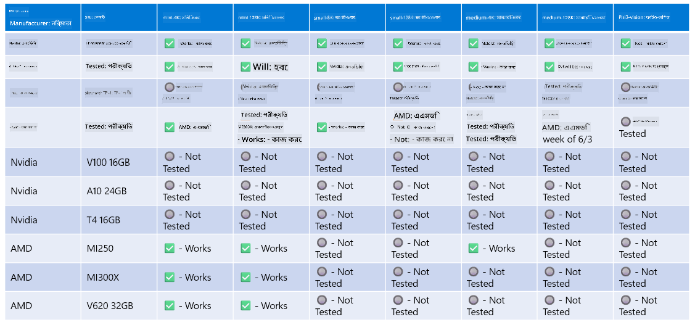

<!--
CO_OP_TRANSLATOR_METADATA:
{
  "original_hash": "8cdc17ce0f10535da30b53d23fe1a795",
  "translation_date": "2025-05-09T07:47:05+00:00",
  "source_file": "md/01.Introduction/01/01.Hardwaresupport.md",
  "language_code": "bn"
}
-->
# Phi হার্ডওয়্যার সাপোর্ট

Microsoft Phi ONNX Runtime-এর জন্য অপ্টিমাইজ করা হয়েছে এবং Windows DirectML সমর্থন করে। এটি বিভিন্ন ধরণের হার্ডওয়্যারের সাথে ভালোভাবে কাজ করে, যেমন GPU, CPU, এমনকি মোবাইল ডিভাইসেও।

## ডিভাইস হার্ডওয়্যার  
বিশেষভাবে, সমর্থিত হার্ডওয়্যারগুলির মধ্যে রয়েছে:

- GPU SKU: RTX 4090 (DirectML)
- GPU SKU: 1 A100 80GB (CUDA)
- CPU SKU: Standard F64s v2 (64 vCPUs, 128 GiB মেমরি)

## মোবাইল SKU

- Android - Samsung Galaxy S21
- Apple iPhone 14 বা তার উচ্চতর A16/A17 প্রসেসর

## Phi হার্ডওয়্যার স্পেসিফিকেশন

- ন্যূনতম কনফিগারেশন প্রয়োজন।
- Windows: DirectX 12-সক্ষম GPU এবং কমপক্ষে 4GB সম্মিলিত RAM

CUDA: Compute Capability >= 7.02 সহ NVIDIA GPU



## একাধিক GPU-তে onnxruntime চালানো

বর্তমানে পাওয়া Phi ONNX মডেলগুলো শুধুমাত্র ১টি GPU-এর জন্য। Phi মডেলের জন্য মাল্টি-GPU সাপোর্ট সম্ভব, তবে ২টি GPU-সহ ORT ব্যবহার করলে এটি ২টি আলাদা ort instance-এর তুলনায় বেশি throughput দেবে বলে গ্যারান্টি নেই। সর্বশেষ আপডেটের জন্য [ONNX Runtime](https://onnxruntime.ai/) দেখুন।

[Build 2024 the GenAI ONNX Team](https://youtu.be/WLW4SE8M9i8?si=EtG04UwDvcjunyfC) ঘোষণা করেছে যে তারা Phi মডেলের জন্য মাল্টি-GPU-এর পরিবর্তে মাল্টি-ইনস্ট্যান্স সক্ষম করেছে।

বর্তমানে এটি আপনাকে CUDA_VISIBLE_DEVICES পরিবেশ ভেরিয়েবল ব্যবহার করে একটি onnxruntime বা onnxruntime-genai ইনস্ট্যান্স চালানোর সুযোগ দেয়।

```Python
CUDA_VISIBLE_DEVICES=0 python infer.py
CUDA_VISIBLE_DEVICES=1 python infer.py
```

আরও জানার জন্য [Azure AI Foundry](https://ai.azure.com) দেখুন।

**অস্বীকৃতি**:  
এই নথিটি AI অনুবাদ সেবা [Co-op Translator](https://github.com/Azure/co-op-translator) ব্যবহার করে অনূদিত হয়েছে। আমরা যথাসাধ্য সঠিকতার চেষ্টা করি, তবে স্বয়ংক্রিয় অনুবাদে ভুল বা অসঙ্গতি থাকতে পারে। মূল নথিটি তার নিজস্ব ভাষায় প্রামাণিক উৎস হিসেবে বিবেচনা করা উচিত। গুরুত্বপূর্ণ তথ্যের জন্য পেশাদার মানব অনুবাদের পরামর্শ দেওয়া হয়। এই অনুবাদের ব্যবহার থেকে সৃষ্ট কোনও ভুল বোঝাবুঝি বা ভুল ব্যাখ্যার জন্য আমরা দায়বদ্ধ নই।