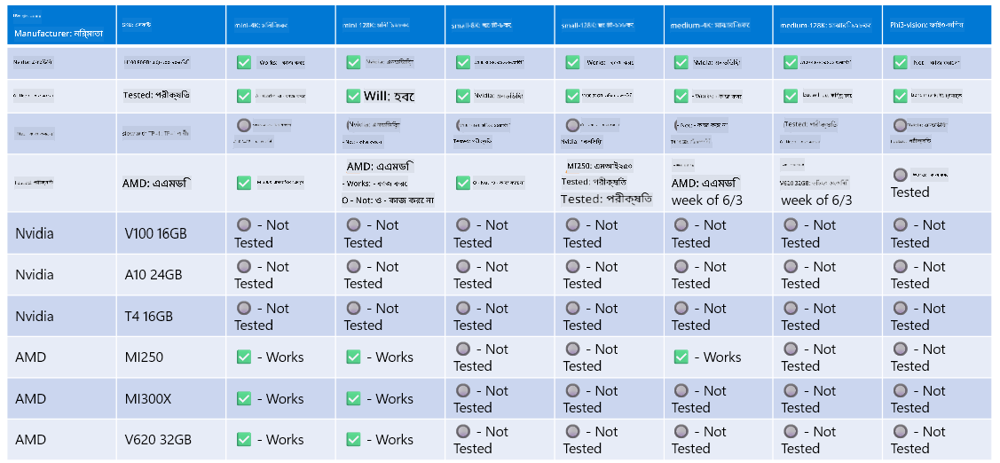

<!--
CO_OP_TRANSLATOR_METADATA:
{
  "original_hash": "8cdc17ce0f10535da30b53d23fe1a795",
  "translation_date": "2025-07-16T18:24:14+00:00",
  "source_file": "md/01.Introduction/01/01.Hardwaresupport.md",
  "language_code": "bn"
}
-->
# Phi হার্ডওয়্যার সাপোর্ট

Microsoft Phi ONNX Runtime-এর জন্য অপ্টিমাইজড এবং Windows DirectML সমর্থন করে। এটি বিভিন্ন ধরনের হার্ডওয়্যারে ভালো কাজ করে, যেমন GPU, CPU, এমনকি মোবাইল ডিভাইসেও।

## ডিভাইস হার্ডওয়্যার  
বিশেষভাবে, সমর্থিত হার্ডওয়্যারের মধ্যে রয়েছে:

- GPU SKU: RTX 4090 (DirectML)
- GPU SKU: 1 A100 80GB (CUDA)
- CPU SKU: Standard F64s v2 (64 vCPUs, 128 GiB মেমরি)

## মোবাইল SKU

- Android - Samsung Galaxy S21
- Apple iPhone 14 বা তার উপরের A16/A17 প্রসেসর

## Phi হার্ডওয়্যার স্পেসিফিকেশন

- ন্যূনতম কনফিগারেশন প্রয়োজন।
- Windows: DirectX 12-সক্ষম GPU এবং কমপক্ষে ৪GB সম্মিলিত RAM

CUDA: Compute Capability >= 7.02 সহ NVIDIA GPU



## একাধিক GPU-তে onnxruntime চালানো

বর্তমানে উপলব্ধ Phi ONNX মডেলগুলো শুধুমাত্র ১টি GPU-এর জন্য। Phi মডেলের জন্য মাল্টি-GPU সমর্থন সম্ভব, তবে ২টি GPU সহ ORT নিশ্চিত করে না যে এটি ২টি ORT ইনস্ট্যান্সের তুলনায় বেশি থ্রুপুট দেবে। সর্বশেষ আপডেটের জন্য [ONNX Runtime](https://onnxruntime.ai/) দেখুন।

[Build 2024 the GenAI ONNX Team](https://youtu.be/WLW4SE8M9i8?si=EtG04UwDvcjunyfC) ঘোষণা করেছে যে তারা Phi মডেলের জন্য মাল্টি-GPU এর পরিবর্তে মাল্টি-ইনস্ট্যান্স সক্ষম করেছে।

বর্তমানে এটি আপনাকে CUDA_VISIBLE_DEVICES পরিবেশ ভেরিয়েবল ব্যবহার করে একটি onnxruntime বা onnxruntime-genai ইনস্ট্যান্স চালানোর সুযোগ দেয়।

```Python
CUDA_VISIBLE_DEVICES=0 python infer.py
CUDA_VISIBLE_DEVICES=1 python infer.py
```

Phi সম্পর্কে আরও জানার জন্য [Azure AI Foundry](https://ai.azure.com) দেখুন।

**অস্বীকৃতি**:  
এই নথিটি AI অনুবাদ সেবা [Co-op Translator](https://github.com/Azure/co-op-translator) ব্যবহার করে অনূদিত হয়েছে। আমরা যথাসাধ্য সঠিকতার চেষ্টা করি, তবে স্বয়ংক্রিয় অনুবাদে ত্রুটি বা অসঙ্গতি থাকতে পারে। মূল নথিটি তার নিজস্ব ভাষায়ই কর্তৃত্বপূর্ণ উৎস হিসেবে বিবেচিত হওয়া উচিত। গুরুত্বপূর্ণ তথ্যের জন্য পেশাদার মানব অনুবাদ গ্রহণ করার পরামর্শ দেওয়া হয়। এই অনুবাদের ব্যবহারে সৃষ্ট কোনো ভুল বোঝাবুঝি বা ভুল ব্যাখ্যার জন্য আমরা দায়ী নই।