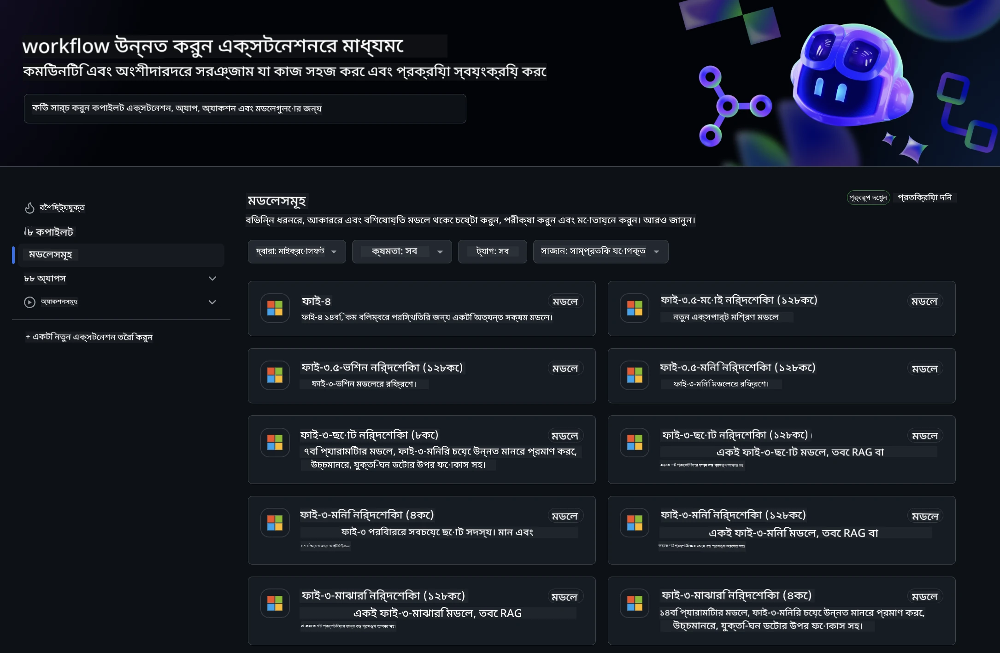
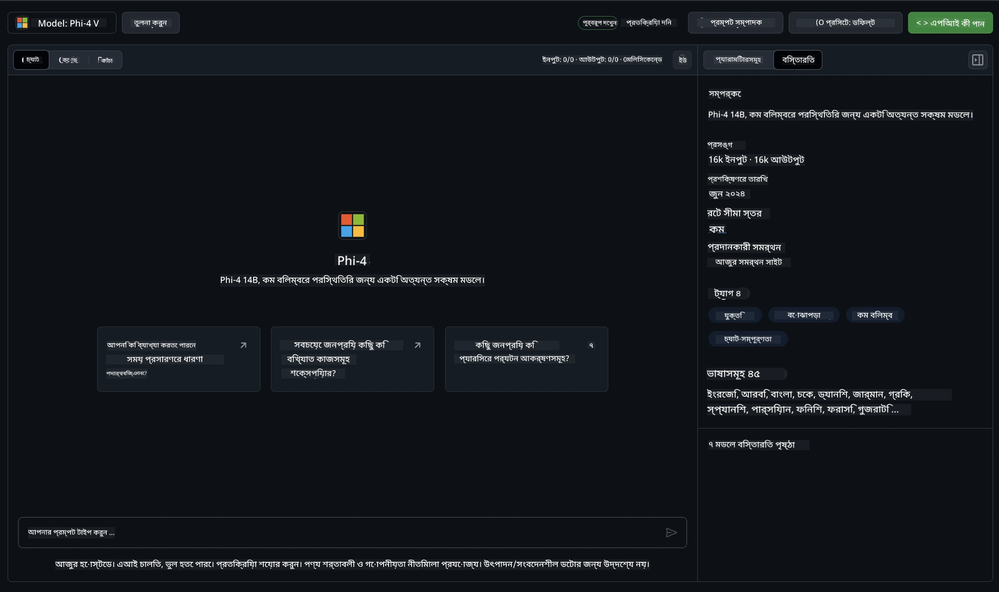
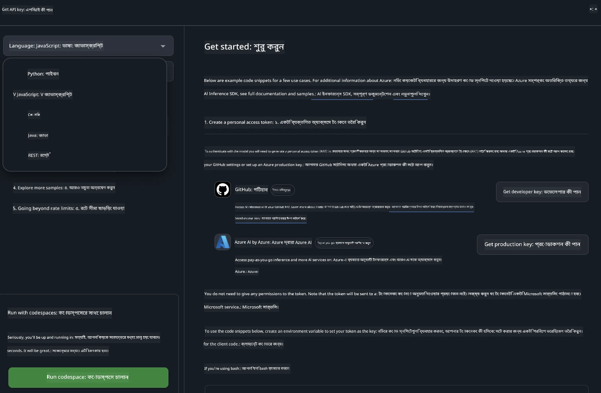
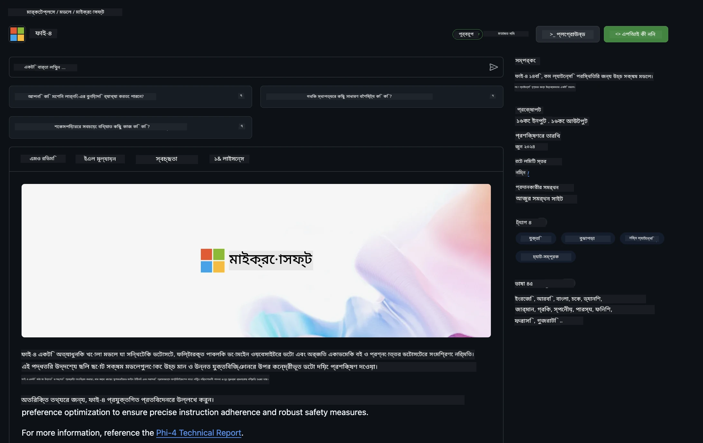

## GitHub মডেলগুলিতে Phi পরিবার

[GitHub Models](https://github.com/marketplace/models)-এ আপনাকে স্বাগতম! আমরা সবকিছু প্রস্তুত করে রেখেছি যাতে আপনি Azure AI-তে হোস্ট করা AI মডেলগুলি অন্বেষণ করতে পারেন।



GitHub Models-এ উপলব্ধ মডেলগুলোর সম্পর্কে আরও তথ্যের জন্য, দেখুন [GitHub Model Marketplace](https://github.com/marketplace/models)

## উপলব্ধ মডেলসমূহ

প্রতিটি মডেলের জন্য একটি নির্দিষ্ট প্লেগ্রাউন্ড এবং নমুনা কোড রয়েছে



### GitHub Model Catalog-এ Phi পরিবার

- [Phi-4](https://github.com/marketplace/models/azureml/Phi-4)

- [Phi-3.5-MoE instruct (128k)](https://github.com/marketplace/models/azureml/Phi-3-5-MoE-instruct)

- [Phi-3.5-vision instruct (128k)](https://github.com/marketplace/models/azureml/Phi-3-5-vision-instruct)

- [Phi-3.5-mini instruct (128k)](https://github.com/marketplace/models/azureml/Phi-3-5-mini-instruct)

- [Phi-3-Medium-128k-Instruct](https://github.com/marketplace/models/azureml/Phi-3-medium-128k-instruct)

- [Phi-3-medium-4k-instruct](https://github.com/marketplace/models/azureml/Phi-3-medium-4k-instruct)

- [Phi-3-mini-128k-instruct](https://github.com/marketplace/models/azureml/Phi-3-mini-128k-instruct)

- [Phi-3-mini-4k-instruct](https://github.com/marketplace/models/azureml/Phi-3-mini-4k-instruct)

- [Phi-3-small-128k-instruct](https://github.com/marketplace/models/azureml/Phi-3-small-128k-instruct)

- [Phi-3-small-8k-instruct](https://github.com/marketplace/models/azureml/Phi-3-small-8k-instruct)

## শুরু করা

কিছু মৌলিক উদাহরণ রয়েছে যা আপনি চালাতে প্রস্তুত। এগুলো আপনি samples ডিরেক্টরিতে পাবেন। যদি আপনি সরাসরি আপনার পছন্দের ভাষায় যেতে চান, তাহলে নিচের ভাষাগুলোর উদাহরণগুলো দেখতে পারেন:

- Python  
- JavaScript  
- C#  
- Java  
- cURL  

নমুনা এবং মডেল চালানোর জন্য একটি নির্দিষ্ট Codespaces Environment ও রয়েছে।



## নমুনা কোড

নিচে কয়েকটি ব্যবহারের জন্য উদাহরণ কোড স্নিপেট দেওয়া হয়েছে। Azure AI Inference SDK সম্পর্কে আরও তথ্যের জন্য, সম্পূর্ণ ডকুমেন্টেশন এবং নমুনাগুলো দেখুন।

## সেটআপ

1. একটি personal access token তৈরি করুন  
টোকেনের জন্য কোনো অনুমতি দেওয়ার প্রয়োজন নেই। মনে রাখবেন, টোকেনটি একটি Microsoft সার্ভিসে পাঠানো হবে।

নিচের কোড স্নিপেটগুলো ব্যবহার করার জন্য, একটি environment variable তৈরি করে আপনার টোকেনটি ক্লায়েন্ট কোডের জন্য কী হিসেবে সেট করুন।

যদি আপনি bash ব্যবহার করেন:  
```
export GITHUB_TOKEN="<your-github-token-goes-here>"
```  
যদি powershell-এ থাকেন:  

```
$Env:GITHUB_TOKEN="<your-github-token-goes-here>"
```  

Windows command prompt ব্যবহার করলে:  

```
set GITHUB_TOKEN=<your-github-token-goes-here>
```  

## Python নমুনা

### নির্ভরশীলতা ইনস্টল করুন  
pip ব্যবহার করে Azure AI Inference SDK ইনস্টল করুন (প্রয়োজন: Python >=3.8):  

```
pip install azure-ai-inference
```  
### একটি মৌলিক কোড নমুনা চালান

এই নমুনাটি chat completion API-তে একটি মৌলিক কল প্রদর্শন করে। এটি GitHub AI মডেল inference endpoint এবং আপনার GitHub টোকেন ব্যবহার করছে। কলটি synchronous।

```python
import os
from azure.ai.inference import ChatCompletionsClient
from azure.ai.inference.models import SystemMessage, UserMessage
from azure.core.credentials import AzureKeyCredential

endpoint = "https://models.inference.ai.azure.com"
model_name = "Phi-4"
token = os.environ["GITHUB_TOKEN"]

client = ChatCompletionsClient(
    endpoint=endpoint,
    credential=AzureKeyCredential(token),
)

response = client.complete(
    messages=[
        UserMessage(content="I have $20,000 in my savings account, where I receive a 4% profit per year and payments twice a year. Can you please tell me how long it will take for me to become a millionaire? Also, can you please explain the math step by step as if you were explaining it to an uneducated person?"),
    ],
    temperature=0.4,
    top_p=1.0,
    max_tokens=2048,
    model=model_name
)

print(response.choices[0].message.content)
```

### মাল্টি-টার্ন কথোপকথন চালান

এই নমুনাটি chat completion API-র মাধ্যমে মাল্টি-টার্ন কথোপকথন প্রদর্শন করে। যখন মডেলটি একটি চ্যাট অ্যাপ্লিকেশনের জন্য ব্যবহার করবেন, তখন আপনাকে কথোপকথনের ইতিহাস পরিচালনা করতে হবে এবং সর্বশেষ মেসেজগুলো মডেলে পাঠাতে হবে।

```
import os
from azure.ai.inference import ChatCompletionsClient
from azure.ai.inference.models import AssistantMessage, SystemMessage, UserMessage
from azure.core.credentials import AzureKeyCredential

token = os.environ["GITHUB_TOKEN"]
endpoint = "https://models.inference.ai.azure.com"
# Replace Model_Name
model_name = "Phi-4"

client = ChatCompletionsClient(
    endpoint=endpoint,
    credential=AzureKeyCredential(token),
)

messages = [
    SystemMessage(content="You are a helpful assistant."),
    UserMessage(content="What is the capital of France?"),
    AssistantMessage(content="The capital of France is Paris."),
    UserMessage(content="What about Spain?"),
]

response = client.complete(messages=messages, model=model_name)

print(response.choices[0].message.content)
```

### আউটপুট স্ট্রিম করুন

ভালো ব্যবহারকারীর অভিজ্ঞতার জন্য, আপনি মডেলের প্রতিক্রিয়া স্ট্রিম করতে চাইবেন যাতে প্রথম টোকেন দ্রুত প্রদর্শিত হয় এবং দীর্ঘ প্রতিক্রিয়ার জন্য অপেক্ষা এড়ানো যায়।

```
import os
from azure.ai.inference import ChatCompletionsClient
from azure.ai.inference.models import SystemMessage, UserMessage
from azure.core.credentials import AzureKeyCredential

token = os.environ["GITHUB_TOKEN"]
endpoint = "https://models.inference.ai.azure.com"
# Replace Model_Name
model_name = "Phi-4"

client = ChatCompletionsClient(
    endpoint=endpoint,
    credential=AzureKeyCredential(token),
)

response = client.complete(
    stream=True,
    messages=[
        SystemMessage(content="You are a helpful assistant."),
        UserMessage(content="Give me 5 good reasons why I should exercise every day."),
    ],
    model=model_name,
)

for update in response:
    if update.choices:
        print(update.choices[0].delta.content or "", end="")

client.close()
```

## GitHub মডেলগুলোর জন্য ফ্রি ব্যবহার এবং রেট সীমা



[প্লেগ্রাউন্ড এবং ফ্রি API ব্যবহারের রেট সীমা](https://docs.github.com/en/github-models/prototyping-with-ai-models#rate-limits) আপনাকে মডেলগুলো পরীক্ষা-নিরীক্ষা এবং AI অ্যাপ্লিকেশন প্রোটোটাইপ করার জন্য সাহায্য করে। এই সীমার বাইরে ব্যবহারের জন্য, এবং আপনার অ্যাপ্লিকেশনকে স্কেলে নিয়ে যেতে, আপনাকে Azure অ্যাকাউন্ট থেকে রিসোর্স প্রোভিশন করতে হবে এবং GitHub personal access token-এর পরিবর্তে সেখান থেকে authentication করতে হবে। আপনার কোডে অন্য কোনো পরিবর্তন করার দরকার নেই। Azure AI-তে ফ্রি টিয়ার সীমার বাইরে যাওয়ার জন্য এই লিঙ্কটি ব্যবহার করুন।

### প্রকাশনা

মডেলের সাথে কাজ করার সময় মনে রাখবেন, আপনি AI নিয়ে পরীক্ষা-নিরীক্ষা করছেন, তাই বিষয়বস্তুর ভুল হওয়ার সম্ভাবনা রয়েছে।

এই ফিচারটি বিভিন্ন সীমাবদ্ধতার আওতায় (যেমন প্রতি মিনিটে অনুরোধ, দিনে অনুরোধ, প্রতি অনুরোধ টোকেন সংখ্যা, এবং সমান্তরাল অনুরোধ) এবং এটি প্রোডাকশন ব্যবহারের জন্য ডিজাইন করা হয়নি।

GitHub Models Azure AI Content Safety ব্যবহার করে। এই ফিল্টারগুলো GitHub Models অভিজ্ঞতার অংশ হিসেবে বন্ধ করা যায় না। আপনি যদি পেইড সার্ভিসের মাধ্যমে মডেল ব্যবহার করার সিদ্ধান্ত নেন, তাহলে আপনার কনটেন্ট ফিল্টারগুলো আপনার প্রয়োজন অনুযায়ী কনফিগার করুন।

এই সার্ভিসটি GitHub-এর Pre-release Terms-এর আওতায় রয়েছে।

**অস্বীকৃতি**:  
এই নথিটি AI অনুবাদ সেবা [Co-op Translator](https://github.com/Azure/co-op-translator) ব্যবহার করে অনূদিত হয়েছে। আমরা যথাসাধ্য সঠিকতার চেষ্টা করি, তবে স্বয়ংক্রিয় অনুবাদে ত্রুটি বা অসঙ্গতি থাকতে পারে। মূল নথিটি তার নিজস্ব ভাষায়ই কর্তৃত্বপূর্ণ উৎস হিসেবে বিবেচিত হওয়া উচিত। গুরুত্বপূর্ণ তথ্যের জন্য পেশাদার মানব অনুবাদ গ্রহণ করার পরামর্শ দেওয়া হয়। এই অনুবাদের ব্যবহারে সৃষ্ট কোনো ভুল বোঝাবুঝি বা ভুল ব্যাখ্যার জন্য আমরা দায়ী নই।