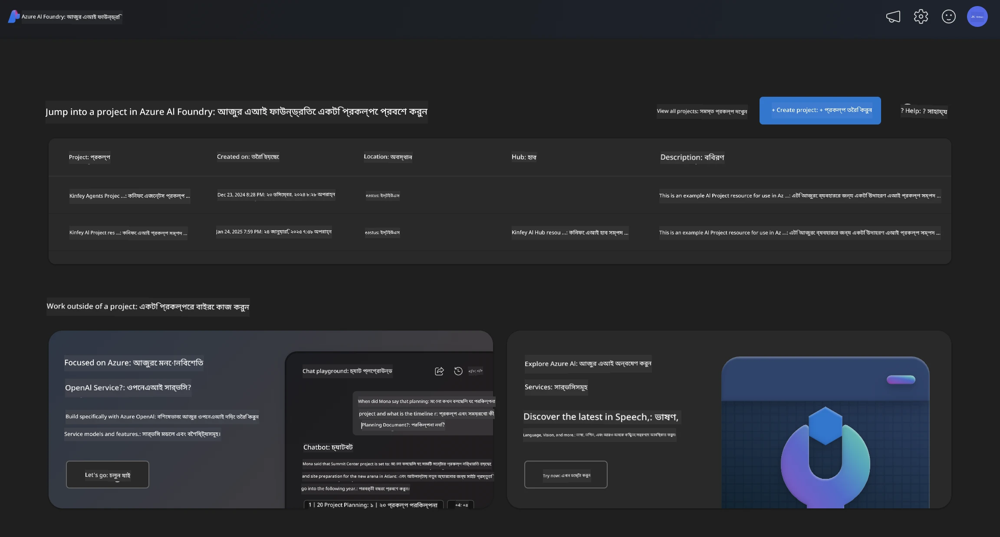
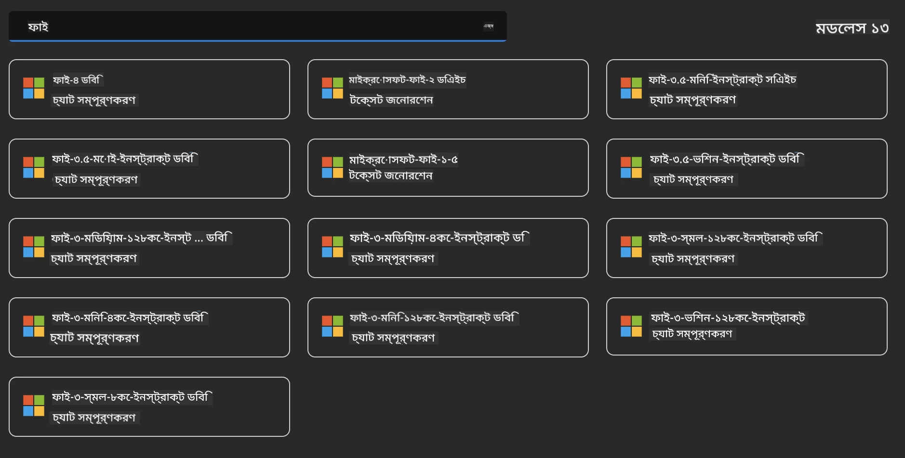
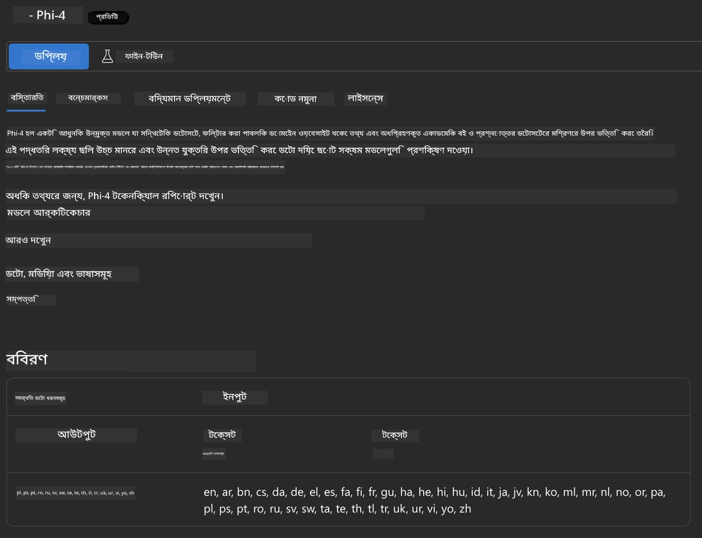
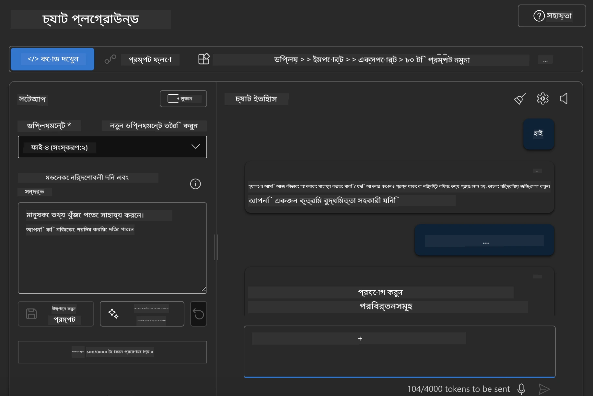

<!--
CO_OP_TRANSLATOR_METADATA:
{
  "original_hash": "3ae21dc5554e888defbe57946ee995ee",
  "translation_date": "2025-07-16T19:08:09+00:00",
  "source_file": "md/01.Introduction/02/03.AzureAIFoundry.md",
  "language_code": "bn"
}
-->
## Azure AI Foundry-তে Phi পরিবার

[Azure AI Foundry](https://ai.azure.com) একটি বিশ্বাসযোগ্য প্ল্যাটফর্ম যা ডেভেলপারদের নিরাপদ, সুরক্ষিত এবং দায়িত্বশীল উপায়ে AI দিয়ে উদ্ভাবন চালাতে এবং ভবিষ্যত গড়তে সক্ষম করে।

[Azure AI Foundry](https://ai.azure.com) ডেভেলপারদের জন্য ডিজাইন করা হয়েছে যাতে তারা:

- এন্টারপ্রাইজ-গ্রেড প্ল্যাটফর্মে জেনারেটিভ AI অ্যাপ্লিকেশন তৈরি করতে পারে।
- আধুনিক AI টুলস এবং ML মডেল ব্যবহার করে অনুসন্ধান, তৈরি, পরীক্ষা এবং ডিপ্লয় করতে পারে, যা দায়িত্বশীল AI অনুশীলনের উপর ভিত্তি করে।
- অ্যাপ্লিকেশন ডেভেলপমেন্টের পুরো জীবনচক্রে একটি দলের সাথে সহযোগিতা করতে পারে।

Azure AI Foundry-এর মাধ্যমে আপনি বিভিন্ন ধরনের মডেল, সার্ভিস এবং ক্ষমতা অন্বেষণ করতে পারেন এবং এমন AI অ্যাপ্লিকেশন তৈরি করতে পারেন যা আপনার লক্ষ্য পূরণে সর্বোত্তম। Azure AI Foundry প্ল্যাটফর্ম প্রুফ অফ কনসেপ্ট থেকে পূর্ণাঙ্গ প্রোডাকশন অ্যাপ্লিকেশনে রূপান্তর সহজে স্কেল করার সুবিধা দেয়। ধারাবাহিক মনিটরিং এবং পরিমার্জন দীর্ঘমেয়াদী সফলতা নিশ্চিত করে।



Azure AI Foundry-তে Azure AOAI Service ব্যবহার করার পাশাপাশি, আপনি Azure AI Foundry Model Catalog-তে তৃতীয় পক্ষের মডেলও ব্যবহার করতে পারেন। যদি আপনি Azure AI Foundry-কে আপনার AI সলিউশন প্ল্যাটফর্ম হিসেবে ব্যবহার করতে চান, তবে এটি একটি ভালো বিকল্প।

আমরা দ্রুত Azure AI Foundry-এর Model Catalog থেকে Phi Family Models ডিপ্লয় করতে পারি

[Microsoft Phi Models in Azure AI Foundry Models](https://ai.azure.com/explore/models/?selectedCollection=phi)



### **Azure AI Foundry-তে Phi-4 ডিপ্লয় করুন**



### **Azure AI Foundry Playground-এ Phi-4 পরীক্ষা করুন**



### **Azure AI Foundry Phi-4 কল করার জন্য Python কোড চালানো**

```python

import os  
import base64
from openai import AzureOpenAI  
from azure.identity import DefaultAzureCredential, get_bearer_token_provider  
        
endpoint = os.getenv("ENDPOINT_URL", "Your Azure AOAI Service Endpoint")  
deployment = os.getenv("DEPLOYMENT_NAME", "Phi-4")  
      
token_provider = get_bearer_token_provider(  
    DefaultAzureCredential(),  
    "https://cognitiveservices.azure.com/.default"  
)  
  
client = AzureOpenAI(  
    azure_endpoint=endpoint,  
    azure_ad_token_provider=token_provider,  
    api_version="2024-05-01-preview",  
)  
  

chat_prompt = [
    {
        "role": "system",
        "content": "You are an AI assistant that helps people find information."
    },
    {
        "role": "user",
        "content": "can you introduce yourself"
    }
] 
    
# Include speech result if speech is enabled  
messages = chat_prompt 

completion = client.chat.completions.create(  
    model=deployment,  
    messages=messages,
    max_tokens=800,  
    temperature=0.7,  
    top_p=0.95,  
    frequency_penalty=0,  
    presence_penalty=0,
    stop=None,  
    stream=False  
)  
  
print(completion.to_json())  

```

**অস্বীকৃতি**:  
এই নথিটি AI অনুবাদ সেবা [Co-op Translator](https://github.com/Azure/co-op-translator) ব্যবহার করে অনূদিত হয়েছে। আমরা যথাসাধ্য সঠিকতার চেষ্টা করি, তবে স্বয়ংক্রিয় অনুবাদে ত্রুটি বা অসঙ্গতি থাকতে পারে। মূল নথিটি তার নিজস্ব ভাষায়ই কর্তৃত্বপূর্ণ উৎস হিসেবে বিবেচিত হওয়া উচিত। গুরুত্বপূর্ণ তথ্যের জন্য পেশাদার মানব অনুবাদ গ্রহণ করার পরামর্শ দেওয়া হয়। এই অনুবাদের ব্যবহারে সৃষ্ট কোনো ভুল বোঝাবুঝি বা ভুল ব্যাখ্যার জন্য আমরা দায়ী নই।