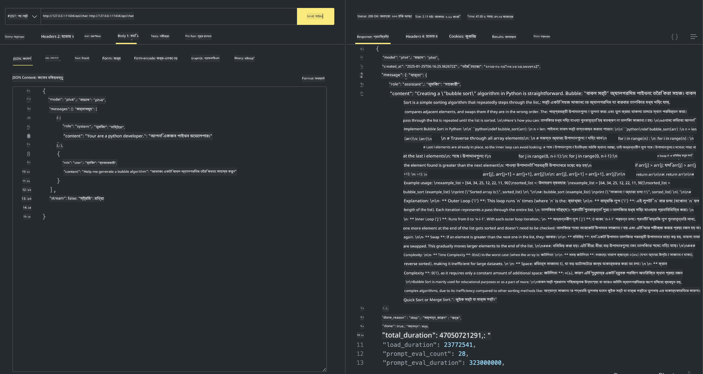

<!--
CO_OP_TRANSLATOR_METADATA:
{
  "original_hash": "2aa35f3c8b437fd5dc9995d53909d495",
  "translation_date": "2025-12-21T11:00:11+00:00",
  "source_file": "md/01.Introduction/02/04.Ollama.md",
  "language_code": "bn"
}
-->
## Phi Family in Ollama


[Ollama](https://ollama.com) আরও বেশি মানুষকে সরাসরি ওপেন সোর্স LLM বা SLM সহজ স্ক্রিপ্টের মাধ্যমে ডিপ্লয় করতে দেয়, এবং স্থানীয় Copilot অ্যাপ্লিকেশন сценারিওগুলিতে সাহায্য করার জন্য API গঠনও করতে পারে।

## **1. Installation**

Ollama Windows, macOS, এবং Linux-এ চলার সমর্থন করে। আপনি এই লিঙ্ক থেকে Ollama ইনস্টল করতে পারেন ([https://ollama.com/download](https://ollama.com/download)). সফলভাবে ইনস্টল করার পর, আপনি সরাসরি টার্মিনাল উইন্ডো থেকে Ollama স্ক্রিপ্ট ব্যবহার করে Phi-3 কল করতে পারেন। আপনি সমস্ত [উপলব্ধ লাইব্রেরি সমূহ Ollama-তে](https://ollama.com/library) দেখতে পারবেন। যদি আপনি এই রিপোজিটরি Codespace-এ খুলেন, এটি ইতিমধ্যেই Ollama ইনস্টল করা থাকবে।

```bash

ollama run phi4

```

> [!NOTE]
> মডেলটি প্রথমবার চালানোর সময় প্রথমে ডাউনলোড হবে। অবশ্যই, আপনি সরাসরি ইতিমধ্যেই ডাউনলোড করা Phi-4 মডেলটি নির্দিষ্ট করেও ব্যবহার করতে পারেন। উদাহরণ সরূপ আমরা WSL ব্যবহার করে কমান্ড চালানোর কথা দেখিয়েছি। মডেল সফলভাবে ডাউনলোড হওয়ার পরে, আপনি সরাসরি টার্মিনালে ইন্টারঅ্যাক্ট করতে পারবেন।


## **2. Call the phi-4 API from Ollama**

যদি আপনি Ollama দ্বারা জেনারেট করা Phi-4 API কল করতে চান, তাহলে Ollama সার্ভার শুরু করতে টার্মিনালে আপনি এই কমান্ডটি ব্যবহার করতে পারেন।

```bash

ollama serve

```

> [!NOTE]
> যদি আপনি MacOS বা Linux চালাচ্ছেন, দয়া করে লক্ষ্য করুন যে আপনি নিম্নলিখিত ত্রুটিটি সম্মুখীন হতে পারেন **"Error: listen tcp 127.0.0.1:11434: bind: address already in use"**। এই কমান্ড চালানোর সময় আপনি এই ত্রুটি পেতে পারেন। আপনি বা তো এই ত্রুটিকে উপেক্ষা করতে পারেন, কারণ এটি সাধারণত নির্দেশ করে যে সার্ভার ইতিমধ্যেই চালু আছে, অথবা আপনি Ollama বন্ধ করে পুনরায় চালু করতে পারেন:

**macOS**

```bash

brew services restart ollama

```

**Linux**

```bash

sudo systemctl stop ollama

```

Ollama দুটি API সমর্থন করে: generate এবং chat। আপনি আপনার প্রয়োজন অনুসারে Ollama দ্বারা প্রদান করা মডেল API কল করতে পারবেন, স্থানীয় সার্ভিসে যে চাহিদা পাঠানো হচ্ছে যা পোর্ট 11434-এ চলছে সেটার দিকে অনুরোধ পাঠিয়ে।

**Chat**

```bash

curl http://127.0.0.1:11434/api/chat -d '{
  "model": "phi3",
  "messages": [
    {
      "role": "system",
      "content": "Your are a python developer."
    },
    {
      "role": "user",
      "content": "Help me generate a bubble algorithm"
    }
  ],
  "stream": false
  
}'
```

This is the result in Postman



## Additional Resources

Ollama-তে উপলব্ধ মডেলগুলির তালিকা তাদের [তাদের লাইব্রেরি](https://ollama.com/library) এ চেক করুন।

Ollama সার্ভার থেকে আপনার মডেল টানতে এই কমান্ডটি ব্যবহার করুন

```bash
ollama pull phi4
```

মডেল চালাতে এই কমান্ডটি ব্যবহার করুন

```bash
ollama run phi4
```

***Note:*** আরও জানার জন্য এই লিঙ্কটি দেখুন [https://github.com/ollama/ollama/blob/main/docs/api.md](https://github.com/ollama/ollama/blob/main/docs/api.md)

## Calling Ollama from Python

আপনি উপরে ব্যবহৃত লোকাল সার্ভারের এন্ডপয়েন্টগুলিতে অনুরোধ করতে `requests` বা `urllib3` ব্যবহার করতে পারেন। তবে, Python-এ Ollama ব্যবহার করার একটি জনপ্রিয় উপায় হল [openai](https://pypi.org/project/openai/) SDK ব্যবহার করা, কারণ Ollama OpenAI-সামঞ্জস্যপূর্ণ সার্ভার এন্ডপয়েন্টও প্রদান করে।

Here is an example for phi3-mini:

```python
import openai

client = openai.OpenAI(
    base_url="http://localhost:11434/v1",
    api_key="nokeyneeded",
)

response = client.chat.completions.create(
    model="phi4",
    temperature=0.7,
    n=1,
    messages=[
        {"role": "system", "content": "You are a helpful assistant."},
        {"role": "user", "content": "Write a haiku about a hungry cat"},
    ],
)

print("Response:")
print(response.choices[0].message.content)
```

## Calling Ollama from JavaScript 

```javascript
// Phi-4 দিয়ে একটি ফাইল সারসংক্ষেপ করার উদাহরণ
script({
    model: "ollama:phi4",
    title: "Summarize with Phi-4",
    system: ["system"],
})

// সারসংক্ষেপ করার উদাহরণ
const file = def("FILE", env.files)
$`Summarize ${file} in a single paragraph.`
```

## Calling Ollama from C#

একটি নতুন C# Console অ্যাপ্লিকেশন তৈরি করুন এবং নিম্নলিখিত NuGet প্যাকেজ যুক্ত করুন:

```bash
dotnet add package Microsoft.SemanticKernel --version 1.34.0
```

তারপর `Program.cs` ফাইলে এই কোডটি প্রতিস্থাপন করুন

```csharp
using Microsoft.SemanticKernel;
using Microsoft.SemanticKernel.ChatCompletion;

// add chat completion service using the local ollama server endpoint
#pragma warning disable SKEXP0001, SKEXP0003, SKEXP0010, SKEXP0011, SKEXP0050, SKEXP0052
builder.AddOpenAIChatCompletion(
    modelId: "phi4",
    endpoint: new Uri("http://localhost:11434/"),
    apiKey: "non required");

// invoke a simple prompt to the chat service
string prompt = "Write a joke about kittens";
var response = await kernel.InvokePromptAsync(prompt);
Console.WriteLine(response.GetValue<string>());
```

অ্যাপটি চালাতে এই কমান্ডটি ব্যবহার করুন:

```bash
dotnet run
```

---

<!-- CO-OP TRANSLATOR DISCLAIMER START -->
দায়-অস্বীকৃতি:
এই নথিটি AI অনুবাদ সেবা [Co-op Translator](https://github.com/Azure/co-op-translator) ব্যবহার করে অনুবাদ করা হয়েছে। আমরা সঠিকতার জন্য যতটা সম্ভব চেষ্টা করি, তবে মনে রাখবেন যে স্বয়ংক্রিয় অনুবাদে ত্রুটি বা অসঙ্গতি থাকতে পারে। মূল নথিটি তার নিজ ভাষায়ই কর্তৃত্বসংবলিত উৎস হিসেবে গণ্য হওয়া উচিত। গুরুত্বপূর্ণ তথ্যের জন্য পেশাদার মানব অনুবাদ সুপারিশ করা হয়। এই অনুবাদের ব্যবহার থেকে সৃষ্ট কোনো ভুল বোঝাবুঝি বা ভুল ব্যাখ্যার জন্য আমরা দায়ী নই।
<!-- CO-OP TRANSLATOR DISCLAIMER END -->