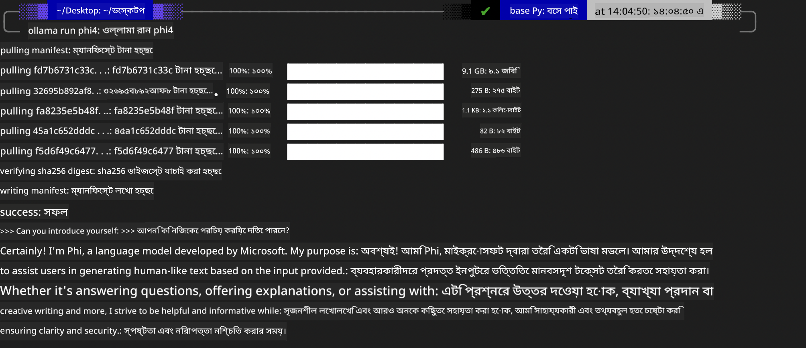
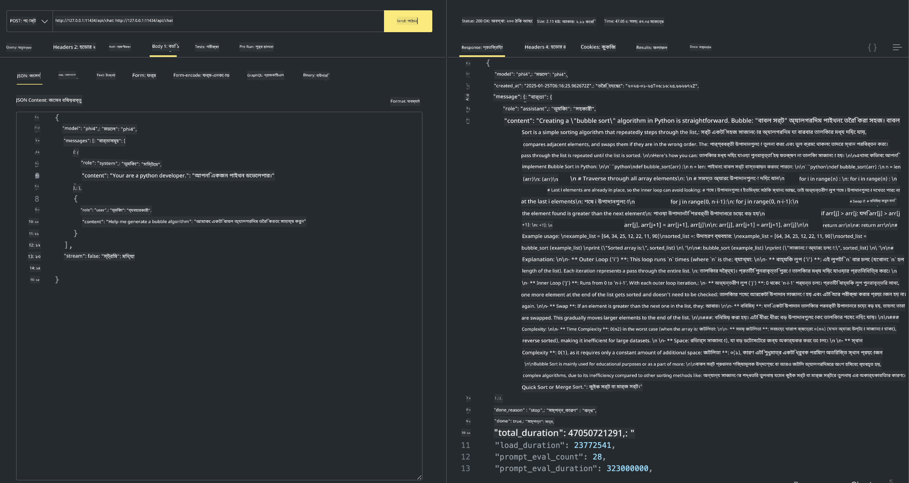

<!--
CO_OP_TRANSLATOR_METADATA:
{
  "original_hash": "0b38834693bb497f96bf53f0d941f9a1",
  "translation_date": "2025-07-16T19:14:30+00:00",
  "source_file": "md/01.Introduction/02/04.Ollama.md",
  "language_code": "bn"
}
-->
## Phi পরিবার Ollama-তে


[Ollama](https://ollama.com) আরও বেশি মানুষকে সরাসরি ওপেন সোর্স LLM বা SLM সহজ স্ক্রিপ্টের মাধ্যমে ডিপ্লয় করার সুযোগ দেয়, এবং স্থানীয় Copilot অ্যাপ্লিকেশন ব্যবহারের জন্য API তৈরি করতেও সাহায্য করে।

## **1. ইনস্টলেশন**

Ollama Windows, macOS, এবং Linux-এ চলার সমর্থন দেয়। আপনি এই লিঙ্ক থেকে Ollama ইনস্টল করতে পারেন ([https://ollama.com/download](https://ollama.com/download))। সফল ইনস্টলেশনের পর, আপনি সরাসরি টার্মিনাল উইন্ডো থেকে Ollama স্ক্রিপ্ট ব্যবহার করে Phi-3 কল করতে পারবেন। আপনি Ollama-তে উপলব্ধ সব [লাইব্রেরি দেখতে পারেন](https://ollama.com/library)। যদি আপনি এই রিপোজিটরিটি Codespace-এ খুলেন, তাহলে সেখানে ইতিমধ্যেই Ollama ইনস্টল করা থাকবে।

```bash

ollama run phi4

```

> [!NOTE]
> প্রথমবার রান করার সময় মডেলটি প্রথমে ডাউনলোড হবে। অবশ্যই, আপনি সরাসরি ডাউনলোড করা Phi-4 মডেলও নির্দিষ্ট করতে পারেন। আমরা WSL উদাহরণ হিসেবে কমান্ড চালানোর পদ্ধতি দেখাচ্ছি। মডেল সফলভাবে ডাউনলোড হওয়ার পর, আপনি সরাসরি টার্মিনালে ইন্টারঅ্যাক্ট করতে পারবেন।



## **2. Ollama থেকে phi-4 API কল করা**

যদি আপনি Ollama দ্বারা তৈরি Phi-4 API কল করতে চান, তাহলে টার্মিনালে নিচের কমান্ডটি ব্যবহার করে Ollama সার্ভার শুরু করতে পারেন।

```bash

ollama serve

```

> [!NOTE]
> MacOS বা Linux চালানোর সময়, আপনি নিম্নলিখিত ত্রুটির সম্মুখীন হতে পারেন **"Error: listen tcp 127.0.0.1:11434: bind: address already in use"**। এই ত্রুটি তখন দেখা দিতে পারে যখন কমান্ড চালানো হয়। আপনি এই ত্রুটিটি উপেক্ষা করতে পারেন, কারণ এটি সাধারণত নির্দেশ করে সার্ভার ইতিমধ্যেই চলছে, অথবা আপনি Ollama বন্ধ করে পুনরায় চালু করতে পারেন:

**macOS**

```bash

brew services restart ollama

```

**Linux**

```bash

sudo systemctl stop ollama

```

Ollama দুইটি API সমর্থন করে: generate এবং chat। আপনি আপনার প্রয়োজন অনুযায়ী Ollama দ্বারা প্রদত্ত মডেল API কল করতে পারেন, স্থানীয় সার্ভিসে পোর্ট 11434-এ রিকোয়েস্ট পাঠিয়ে।

**Chat**

```bash

curl http://127.0.0.1:11434/api/chat -d '{
  "model": "phi3",
  "messages": [
    {
      "role": "system",
      "content": "Your are a python developer."
    },
    {
      "role": "user",
      "content": "Help me generate a bubble algorithm"
    }
  ],
  "stream": false
  
}'

This is the result in Postman



## Additional Resources

Check the list of available models in Ollama in [their library](https://ollama.com/library).

Pull your model from the Ollama server using this command

```bash
ollama pull phi4
```

Run the model using this command

```bash
ollama run phi4
```

***Note:*** Visit this link [https://github.com/ollama/ollama/blob/main/docs/api.md](https://github.com/ollama/ollama/blob/main/docs/api.md) to learn more

## Calling Ollama from Python

You can use `requests` or `urllib3` to make requests to the local server endpoints used above. However, a popular way to use Ollama in Python is via the [openai](https://pypi.org/project/openai/) SDK, since Ollama provides OpenAI-compatible server endpoints as well.

Here is an example for phi3-mini:

```python
import openai

client = openai.OpenAI(
    base_url="http://localhost:11434/v1",
    api_key="nokeyneeded",
)

response = client.chat.completions.create(
    model="phi4",
    temperature=0.7,
    n=1,
    messages=[
        {"role": "system", "content": "You are a helpful assistant."},
        {"role": "user", "content": "Write a haiku about a hungry cat"},
    ],
)

print("Response:")
print(response.choices[0].message.content)
```

## Calling Ollama from JavaScript 

```javascript
// Phi-4 দিয়ে একটি ফাইল সারাংশ করার উদাহরণ
script({
    model: "ollama:phi4",
    title: "Phi-4 দিয়ে সারাংশ",
    system: ["system"],
})

// সারাংশ করার উদাহরণ
const file = def("FILE", env.files)
$`Summarize ${file} in a single paragraph.`
```

## Calling Ollama from C#

Create a new C# Console application and add the following NuGet package:

```bash
dotnet add package Microsoft.SemanticKernel --version 1.34.0
```

Then replace this code in the `Program.cs` file

```csharp
using Microsoft.SemanticKernel;
using Microsoft.SemanticKernel.ChatCompletion;

// স্থানীয় ollama সার্ভার এন্ডপয়েন্ট ব্যবহার করে চ্যাট কমপ্লিশন সার্ভিস যোগ করা
#pragma warning disable SKEXP0001, SKEXP0003, SKEXP0010, SKEXP0011, SKEXP0050, SKEXP0052
builder.AddOpenAIChatCompletion(
    modelId: "phi4",
    endpoint: new Uri("http://localhost:11434/"),
    apiKey: "non required");

// চ্যাট সার্ভিসে একটি সাধারণ প্রম্পট পাঠানো
string prompt = "Write a joke about kittens";
var response = await kernel.InvokePromptAsync(prompt);
Console.WriteLine(response.GetValue<string>());
```

Run the app with the command:

```bash
dotnet run

**অস্বীকৃতি**:  
এই নথিটি AI অনুবাদ সেবা [Co-op Translator](https://github.com/Azure/co-op-translator) ব্যবহার করে অনূদিত হয়েছে। আমরা যথাসাধ্য সঠিকতার চেষ্টা করি, তবে স্বয়ংক্রিয় অনুবাদে ত্রুটি বা অসঙ্গতি থাকতে পারে। মূল নথিটি তার নিজস্ব ভাষায়ই কর্তৃত্বপূর্ণ উৎস হিসেবে বিবেচিত হওয়া উচিত। গুরুত্বপূর্ণ তথ্যের জন্য পেশাদার মানব অনুবাদ গ্রহণ করার পরামর্শ দেওয়া হয়। এই অনুবাদের ব্যবহারে সৃষ্ট কোনো ভুল বোঝাবুঝি বা ভুল ব্যাখ্যার জন্য আমরা দায়ী নই।