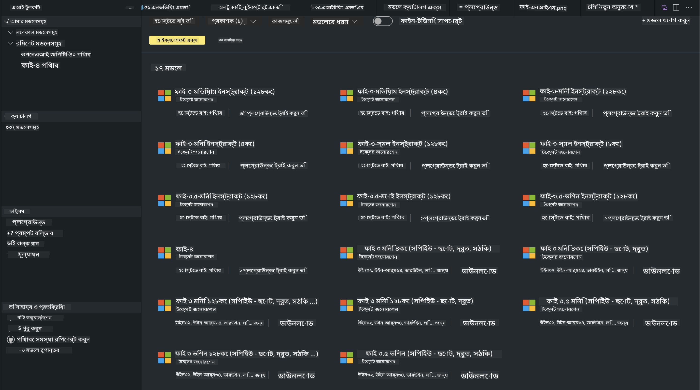
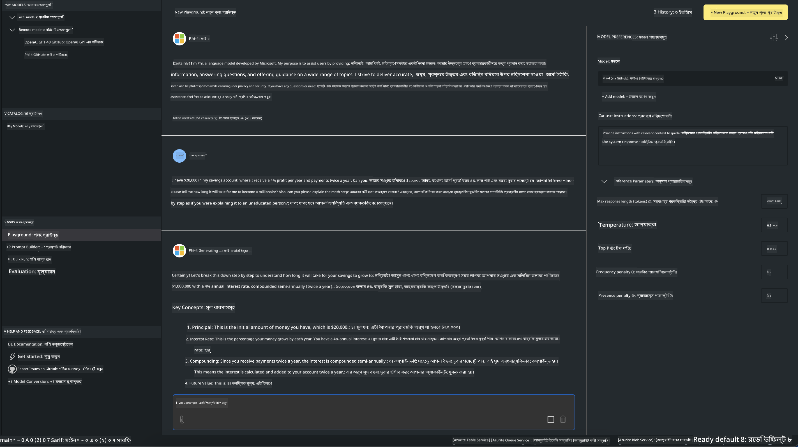

<!--
CO_OP_TRANSLATOR_METADATA:
{
  "original_hash": "4951d458c0b60c02cd1e751b40903877",
  "translation_date": "2025-05-09T09:26:41+00:00",
  "source_file": "md/01.Introduction/02/05.AITK.md",
  "language_code": "bn"
}
-->
# Phi Family in AITK

[AI Toolkit for VS Code](https://marketplace.visualstudio.com/items?itemName=ms-windows-ai-studio.windows-ai-studio) জেনারেটিভ AI অ্যাপ ডেভেলপমেন্টকে সহজ করে তোলে Azure AI Foundry Catalog এবং Hugging Face-এর মতো অন্যান্য ক্যাটালগ থেকে আধুনিক AI ডেভেলপমেন্ট টুলস ও মডেল একত্রিত করে। আপনি GitHub Models এবং Azure AI Foundry Model Catalogs দ্বারা চালিত AI মডেল ক্যাটালগ ব্রাউজ করতে পারবেন, সেগুলো লোকালি বা রিমোটে ডাউনলোড, ফাইন-টিউন, পরীক্ষা এবং আপনার অ্যাপে ব্যবহার করতে পারবেন।

AI Toolkit Preview লোকালি রান করবে। লোকাল ইনফারেন্স বা ফাইন-টিউন মডেল অনুযায়ী নির্ভর করে, আপনাকে NVIDIA CUDA GPU-এর মতো GPU থাকতে হতে পারে। আপনি সরাসরি GitHub Models AITK দিয়ে রান করতে পারবেন।

## Getting Started

[Windows subsystem for Linux কীভাবে ইনস্টল করবেন তা শিখুন](https://learn.microsoft.com/windows/wsl/install?WT.mc_id=aiml-137032-kinfeylo)

এবং [ডিফল্ট ডিস্ট্রিবিউশন পরিবর্তন করার পদ্ধতি](https://learn.microsoft.com/windows/wsl/install#change-the-default-linux-distribution-installed)।

[AI Toolkit GitHub রিপোজিটরি](https://github.com/microsoft/vscode-ai-toolkit/)

- Windows, Linux, macOS
  
- Windows এবং Linux উভয় প্ল্যাটফর্মে ফাইন-টিউনিং এর জন্য Nvidia GPU প্রয়োজন। এছাড়াও, **Windows**-এ subsystem for Linux থাকতে হবে Ubuntu ডিস্ট্রো 18.4 বা তার বেশি ভার্সন। [Windows subsystem for Linux ইনস্টল করার বিস্তারিত](https://learn.microsoft.com/windows/wsl/install) এবং [ডিফল্ট ডিস্ট্রিবিউশন পরিবর্তন](https://learn.microsoft.com/windows/wsl/install#change-the-default-linux-distribution-installed) শিখুন।

### AI Toolkit ইনস্টল করুন

AI Toolkit একটি [Visual Studio Code Extension](https://code.visualstudio.com/docs/setup/additional-components#_vs-code-extensions) হিসেবে আসে, তাই প্রথমে [VS Code](https://code.visualstudio.com/docs/setup/windows?WT.mc_id=aiml-137032-kinfeylo) ইনস্টল করতে হবে, তারপর [VS Marketplace](https://marketplace.visualstudio.com/items?itemName=ms-windows-ai-studio.windows-ai-studio) থেকে AI Toolkit ডাউনলোড করুন।
[AI Toolkit Visual Studio Marketplace-এ উপলব্ধ](https://marketplace.visualstudio.com/items?itemName=ms-windows-ai-studio.windows-ai-studio) এবং যেকোনো VS Code এক্সটেনশনের মতো ইনস্টল করা যাবে।

VS Code এক্সটেনশন ইনস্টল করা না জানা থাকলে, নিচের ধাপগুলো অনুসরণ করুন:

### Sign In

1. VS Code এর Activity Bar-এ **Extensions** সিলেক্ট করুন
1. Extensions Search বারে "AI Toolkit" টাইপ করুন
1. "AI Toolkit for Visual Studio code" সিলেক্ট করুন
1. **Install** বাটনে ক্লিক করুন

এখন, আপনি এক্সটেনশন ব্যবহার করতে প্রস্তুত!

GitHub-এ সাইন ইন করার জন্য আপনাকে অনুরোধ জানানো হবে, "Allow" ক্লিক করে এগিয়ে যান। আপনি GitHub সাইন ইন পেজে রিডাইরেক্ট হবেন।

সাইন ইন করুন এবং নির্দেশিত ধাপগুলো অনুসরণ করুন। সফলভাবে সম্পন্ন হলে আপনি VS Code-এ ফিরে আসবেন।

এক্সটেনশন ইনস্টল হয়ে গেলে Activity Bar-এ AI Toolkit আইকন দেখতে পাবেন।

চলুন উপলব্ধ অ্যাকশনগুলো এক্সপ্লোর করি!

### উপলব্ধ অ্যাকশন

AI Toolkit এর প্রাইমারি সাইডবারে নিম্নলিখিত বিভাগগুলো রয়েছে:

- **Models**
- **Resources**
- **Playground**  
- **Fine-tuning**
- **Evaluation**

Resources সেকশনে উপলব্ধ। শুরু করার জন্য **Model Catalog** সিলেক্ট করুন।

### ক্যাটালগ থেকে মডেল ডাউনলোড করুন

VS Code সাইডবার থেকে AI Toolkit চালু করার পর, নিম্নলিখিত অপশন থেকে বেছে নিতে পারবেন:



- **Model Catalog** থেকে সমর্থিত মডেল খুঁজে লোকালি ডাউনলোড করুন
- **Model Playground**-এ মডেল ইনফারেন্স পরীক্ষা করুন
- **Model Fine-tuning**-এ লোকালি বা রিমোটে মডেল ফাইন-টিউন করুন
- AI Toolkit কমান্ড প্যালেট থেকে ক্লাউডে ফাইন-টিউন করা মডেল ডিপ্লয় করুন
- মডেল মূল্যায়ন

> [!NOTE]
>
> **GPU Vs CPU**
>
> মডেল কার্ডগুলোতে মডেলের সাইজ, প্ল্যাটফর্ম এবং অ্যাক্সিলারেটর টাইপ (CPU, GPU) দেখানো হয়। **Windows ডিভাইসে যেখানে কমপক্ষে একটি GPU আছে**, সেক্ষেত্রে শুধুমাত্র Windows টার্গেট করা মডেল ভার্সন সিলেক্ট করলে পারফরম্যান্স উন্নত হবে।
>
> এটি নিশ্চিত করে যে আপনি DirectML অ্যাক্সিলারেটরের জন্য অপ্টিমাইজড মডেল পাচ্ছেন।
>
> মডেলের নামের ফরম্যাট হলো
>
> - `{model_name}-{accelerator}-{quantization}-{format}`।
>
> Windows ডিভাইসে GPU আছে কিনা দেখতে, **Task Manager** খুলুন এবং **Performance** ট্যাব সিলেক্ট করুন। যদি GPU থাকে, "GPU 0" বা "GPU 1" এর মতো নামগুলো তালিকাভুক্ত থাকবে।

### প্লেগ্রাউন্ডে মডেল রান করুন

সব প্যারামিটার সেট করার পর, **Generate Project** ক্লিক করুন।

মডেল ডাউনলোড হয়ে গেলে ক্যাটালগের মডেল কার্ডে **Load in Playground** সিলেক্ট করুন:

- মডেল ডাউনলোড শুরু হবে
- সব প্রয়োজনীয়তা ও ডিপেন্ডেন্সি ইনস্টল হবে
- VS Code ওয়ার্কস্পেস তৈরি হবে



### আপনার অ্যাপে REST API ব্যবহার করুন

AI Toolkit একটি লোকাল REST API ওয়েব সার্ভার নিয়ে আসে **পোর্ট 5272-এ** যা [OpenAI chat completions ফরম্যাট](https://platform.openai.com/docs/api-reference/chat/create) ব্যবহার করে।

এটি আপনাকে ক্লাউড AI মডেল সার্ভিসের উপর নির্ভর না করে লোকালি আপনার অ্যাপ পরীক্ষা করার সুযোগ দেয়। উদাহরণস্বরূপ, নিচের JSON ফাইলটি রিকোয়েস্টের বডি কনফিগার করার পদ্ধতি দেখায়:

```json
{
    "model": "Phi-4",
    "messages": [
        {
            "role": "user",
            "content": "what is the golden ratio?"
        }
    ],
    "temperature": 0.7,
    "top_p": 1,
    "top_k": 10,
    "max_tokens": 100,
    "stream": true
}
```

REST API পরীক্ষা করার জন্য (যেমন) [Postman](https://www.postman.com/) বা CURL (Client URL) ইউটিলিটি ব্যবহার করতে পারেন:

```bash
curl -vX POST http://127.0.0.1:5272/v1/chat/completions -H 'Content-Type: application/json' -d @body.json
```

### Python এর জন্য OpenAI ক্লায়েন্ট লাইব্রেরি ব্যবহার

```python
from openai import OpenAI

client = OpenAI(
    base_url="http://127.0.0.1:5272/v1/", 
    api_key="x" # required for the API but not used
)

chat_completion = client.chat.completions.create(
    messages=[
        {
            "role": "user",
            "content": "what is the golden ratio?",
        }
    ],
    model="Phi-4",
)

print(chat_completion.choices[0].message.content)
```

### .NET এর জন্য Azure OpenAI ক্লায়েন্ট লাইব্রেরি ব্যবহার

NuGet ব্যবহার করে আপনার প্রজেক্টে [Azure OpenAI ক্লায়েন্ট লাইব্রেরি](https://www.nuget.org/packages/Azure.AI.OpenAI/) যোগ করুন:

```bash
dotnet add {project_name} package Azure.AI.OpenAI --version 1.0.0-beta.17
```

**OverridePolicy.cs** নামে একটি C# ফাইল তৈরি করুন এবং নিচের কোড পেস্ট করুন:

```csharp
// OverridePolicy.cs
using Azure.Core.Pipeline;
using Azure.Core;

internal partial class OverrideRequestUriPolicy(Uri overrideUri)
    : HttpPipelineSynchronousPolicy
{
    private readonly Uri _overrideUri = overrideUri;

    public override void OnSendingRequest(HttpMessage message)
    {
        message.Request.Uri.Reset(_overrideUri);
    }
}
```

এরপর, আপনার **Program.cs** ফাইলে নিচের কোড পেস্ট করুন:

```csharp
// Program.cs
using Azure.AI.OpenAI;

Uri localhostUri = new("http://localhost:5272/v1/chat/completions");

OpenAIClientOptions clientOptions = new();
clientOptions.AddPolicy(
    new OverrideRequestUriPolicy(localhostUri),
    Azure.Core.HttpPipelinePosition.BeforeTransport);
OpenAIClient client = new(openAIApiKey: "unused", clientOptions);

ChatCompletionsOptions options = new()
{
    DeploymentName = "Phi-4",
    Messages =
    {
        new ChatRequestSystemMessage("You are a helpful assistant. Be brief and succinct."),
        new ChatRequestUserMessage("What is the golden ratio?"),
    }
};

StreamingResponse<StreamingChatCompletionsUpdate> streamingChatResponse
    = await client.GetChatCompletionsStreamingAsync(options);

await foreach (StreamingChatCompletionsUpdate chatChunk in streamingChatResponse)
{
    Console.Write(chatChunk.ContentUpdate);
}
```


## AI Toolkit দিয়ে ফাইন টিউনিং

- মডেল আবিষ্কার এবং প্লেগ্রাউন্ড দিয়ে শুরু করুন।
- লোকাল কম্পিউটিং রিসোর্স ব্যবহার করে মডেল ফাইন-টিউনিং এবং ইনফারেন্স।
- Azure রিসোর্স ব্যবহার করে রিমোট ফাইন-টিউনিং এবং ইনফারেন্স।

[AI Toolkit দিয়ে ফাইন টিউনিং](../../03.FineTuning/Finetuning_VSCodeaitoolkit.md)

## AI Toolkit Q&A রিসোর্স

সাধারণ সমস্যা ও সমাধানের জন্য আমাদের [Q&A পেজ](https://github.com/microsoft/vscode-ai-toolkit/blob/main/archive/QA.md) দেখুন।

**অস্বীকৃতি**:  
এই নথিটি AI অনুবাদ সেবা [Co-op Translator](https://github.com/Azure/co-op-translator) ব্যবহার করে অনূদিত হয়েছে। আমরা সঠিকতার জন্য চেষ্টা করি, তবে অনুগ্রহ করে জানুন যে স্বয়ংক্রিয় অনুবাদে ভুল বা অসঙ্গতি থাকতে পারে। মূল নথিটি তার স্বাভাবিক ভাষায়ই কর্তৃপক্ষপূর্ণ উৎস হিসেবে বিবেচিত হওয়া উচিত। গুরুত্বপূর্ণ তথ্যের জন্য পেশাদার মানব অনুবাদ সুপারিশ করা হয়। এই অনুবাদের ব্যবহার থেকে উদ্ভূত কোনো ভুল বোঝাবুঝি বা ভুল ব্যাখ্যার জন্য আমরা দায়বদ্ধ নই।