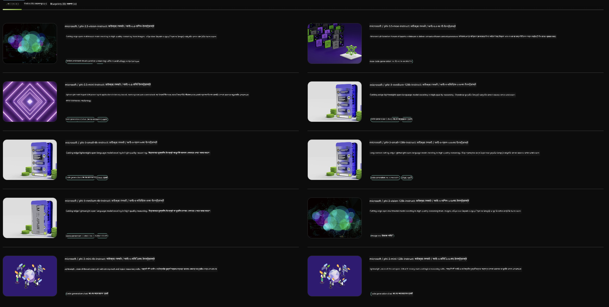

<!--
CO_OP_TRANSLATOR_METADATA:
{
  "original_hash": "7b08e277df2a9307f861ae54bc30c772",
  "translation_date": "2025-07-16T19:35:01+00:00",
  "source_file": "md/01.Introduction/02/06.NVIDIA.md",
  "language_code": "bn"
}
-->
## NVIDIA NIM-এ Phi পরিবার

NVIDIA NIM হলো এমন একটি সহজে ব্যবহারযোগ্য মাইক্রোসার্ভিসের সেট যা ক্লাউড, ডেটা সেন্টার এবং ওয়ার্কস্টেশনে জেনারেটিভ AI মডেল ডিপ্লয়মেন্ট দ্রুততর করার জন্য ডিজাইন করা হয়েছে। NIM গুলো মডেল পরিবারের ভিত্তিতে এবং প্রতিটি মডেল অনুযায়ী শ্রেণীবদ্ধ। উদাহরণস্বরূপ, বড় ভাষা মডেল (LLMs) এর জন্য NVIDIA NIM এন্টারপ্রাইজ অ্যাপ্লিকেশনগুলিতে অত্যাধুনিক LLM এর ক্ষমতা নিয়ে আসে, যা অনন্য প্রাকৃতিক ভাষা প্রক্রিয়াকরণ এবং বোঝার ক্ষমতা প্রদান করে।

NIM IT এবং DevOps টিমদের জন্য বড় ভাষা মডেল (LLMs) নিজেদের পরিচালিত পরিবেশে স্ব-হোস্ট করা সহজ করে তোলে, একই সাথে ডেভেলপারদের জন্য শিল্পমানের API প্রদান করে যা তাদের শক্তিশালী কো-পাইলট, চ্যাটবট এবং AI সহকারী তৈরি করতে সাহায্য করে যা তাদের ব্যবসাকে রূপান্তরিত করতে পারে। NVIDIA এর আধুনিক GPU ত্বরান্বিতকরণ এবং স্কেলেবল ডিপ্লয়মেন্ট ব্যবহার করে, NIM inference এর জন্য দ্রুততম পথ এবং অতুলনীয় পারফরম্যান্স প্রদান করে।

আপনি NVIDIA NIM ব্যবহার করে Phi পরিবার মডেল থেকে inference নিতে পারেন



### **নমুনা - NVIDIA NIM-এ Phi-3-Vision**

ধরুন আপনার কাছে একটি ছবি (`demo.png`) আছে এবং আপনি এমন একটি পাইথন কোড তৈরি করতে চান যা এই ছবিটি প্রক্রিয়াকরণ করে এবং একটি নতুন সংস্করণ সংরক্ষণ করে (`phi-3-vision.jpg`)।

উপরের কোডটি এই প্রক্রিয়াটি স্বয়ংক্রিয় করে:

1. পরিবেশ এবং প্রয়োজনীয় কনফিগারেশন সেট আপ করা।
2. এমন একটি প্রম্পট তৈরি করা যা মডেলকে প্রয়োজনীয় পাইথন কোড তৈরি করার নির্দেশ দেয়।
3. প্রম্পটটি মডেলে পাঠানো এবং তৈরি হওয়া কোড সংগ্রহ করা।
4. তৈরি হওয়া কোড বের করে চালানো।
5. মূল এবং প্রক্রিয়াজাত ছবিগুলো প্রদর্শন করা।

এই পদ্ধতি AI এর ক্ষমতা ব্যবহার করে ছবি প্রক্রিয়াকরণ কাজগুলো স্বয়ংক্রিয় করে, যা আপনার লক্ষ্য অর্জনকে সহজ এবং দ্রুততর করে তোলে।

[নমুনা কোড সলিউশন](../../../../../code/06.E2E/E2E_Nvidia_NIM_Phi3_Vision.ipynb)

চলুন ধাপে ধাপে পুরো কোডটি কী করে তা বিশ্লেষণ করি:

1. **প্রয়োজনীয় প্যাকেজ ইনস্টল করুন**:
    ```python
    !pip install langchain_nvidia_ai_endpoints -U
    ```
    এই কমান্ডটি `langchain_nvidia_ai_endpoints` প্যাকেজটি ইনস্টল করে, নিশ্চিত করে এটি সর্বশেষ সংস্করণ।

2. **প্রয়োজনীয় মডিউল ইমপোর্ট করুন**:
    ```python
    from langchain_nvidia_ai_endpoints import ChatNVIDIA
    import getpass
    import os
    import base64
    ```
    এই ইমপোর্টগুলো NVIDIA AI এন্ডপয়েন্টের সাথে ইন্টারঅ্যাকশন, পাসওয়ার্ড নিরাপদে হ্যান্ডেল করা, অপারেটিং সিস্টেমের সাথে কাজ করা এবং base64 ফরম্যাটে ডেটা এনকোড/ডিকোড করার জন্য প্রয়োজনীয় মডিউলগুলো নিয়ে আসে।

3. **API কী সেট আপ করুন**:
    ```python
    if not os.getenv("NVIDIA_API_KEY"):
        os.environ["NVIDIA_API_KEY"] = getpass.getpass("Enter your NVIDIA API key: ")
    ```
    এই কোডটি চেক করে `NVIDIA_API_KEY` পরিবেশ ভেরিয়েবল সেট করা আছে কিনা। না থাকলে, ব্যবহারকারীকে নিরাপদে তাদের API কী প্রবেশ করানোর জন্য অনুরোধ করে।

4. **মডেল এবং ছবি পাথ নির্ধারণ করুন**:
    ```python
    model = 'microsoft/phi-3-vision-128k-instruct'
    chat = ChatNVIDIA(model=model)
    img_path = './imgs/demo.png'
    ```
    এখানে ব্যবহৃত মডেল নির্ধারণ করা হয়, `ChatNVIDIA` এর একটি ইনস্ট্যান্স তৈরি করা হয় নির্দিষ্ট মডেল দিয়ে, এবং ছবির ফাইলের পাথ নির্ধারণ করা হয়।

5. **টেক্সট প্রম্পট তৈরি করুন**:
    ```python
    text = "Please create Python code for image, and use plt to save the new picture under imgs/ and name it phi-3-vision.jpg."
    ```
    এখানে একটি টেক্সট প্রম্পট সংজ্ঞায়িত করা হয়েছে যা মডেলকে ছবি প্রক্রিয়াকরণের জন্য পাইথন কোড তৈরি করার নির্দেশ দেয়।

6. **ছবিকে base64 এ এনকোড করুন**:
    ```python
    with open(img_path, "rb") as f:
        image_b64 = base64.b64encode(f.read()).decode()
    image = f''
    ```
    এই কোডটি ছবির ফাইলটি পড়ে, base64 এ এনকোড করে এবং এনকোড করা ডেটা দিয়ে একটি HTML ইমেজ ট্যাগ তৈরি করে।

7. **টেক্সট এবং ছবি একত্রিত করে প্রম্পট তৈরি করুন**:
    ```python
    prompt = f"{text} {image}"
    ```
    এখানে টেক্সট প্রম্পট এবং HTML ইমেজ ট্যাগ একত্রিত করে একটি স্ট্রিং তৈরি করা হয়েছে।

8. **ChatNVIDIA ব্যবহার করে কোড জেনারেট করুন**:
    ```python
    code = ""
    for chunk in chat.stream(prompt):
        print(chunk.content, end="")
        code += chunk.content
    ```
    এই কোডটি প্রম্পটটি `ChatNVIDIA` মডেলে পাঠায় এবং তৈরি হওয়া কোড অংশভাগে সংগ্রহ করে, প্রতিটি অংশ প্রিন্ট এবং `code` স্ট্রিংয়ে যোগ করে।

9. **জেনারেট হওয়া কন্টেন্ট থেকে পাইথন কোড বের করুন**:
    ```python
    begin = code.index('```python') + 9
    code = code[begin:]
    end = code.index('```')
    code = code[:end]
    ```
    এই অংশটি মার্কডাউন ফরম্যাটিং সরিয়ে প্রকৃত পাইথন কোড বের করে।

10. **তৈরি হওয়া কোড চালান**:
    ```python
    import subprocess
    result = subprocess.run(["python", "-c", code], capture_output=True)
    ```
    এই কোডটি সাবপ্রসেস হিসেবে পাইথন কোডটি চালায় এবং এর আউটপুট ক্যাপচার করে।

11. **ছবিগুলো প্রদর্শন করুন**:
    ```python
    from IPython.display import Image, display
    display(Image(filename='./imgs/phi-3-vision.jpg'))
    display(Image(filename='./imgs/demo.png'))
    ```
    এই লাইনগুলো `IPython.display` মডিউল ব্যবহার করে ছবিগুলো প্রদর্শন করে।

**অস্বীকৃতি**:  
এই নথিটি AI অনুবাদ সেবা [Co-op Translator](https://github.com/Azure/co-op-translator) ব্যবহার করে অনূদিত হয়েছে। আমরা যথাসাধ্য সঠিকতার চেষ্টা করি, তবে স্বয়ংক্রিয় অনুবাদে ত্রুটি বা অসঙ্গতি থাকতে পারে। মূল নথিটি তার নিজস্ব ভাষায়ই কর্তৃত্বপূর্ণ উৎস হিসেবে বিবেচিত হওয়া উচিত। গুরুত্বপূর্ণ তথ্যের জন্য পেশাদার মানব অনুবাদ গ্রহণ করার পরামর্শ দেওয়া হয়। এই অনুবাদের ব্যবহারে সৃষ্ট কোনো ভুল বোঝাবুঝি বা ভুল ব্যাখ্যার জন্য আমরা দায়ী নই।