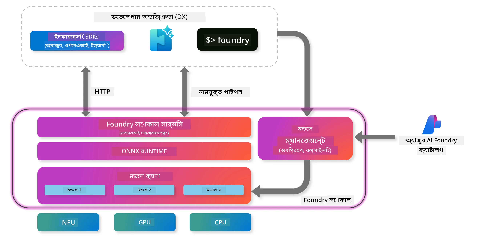
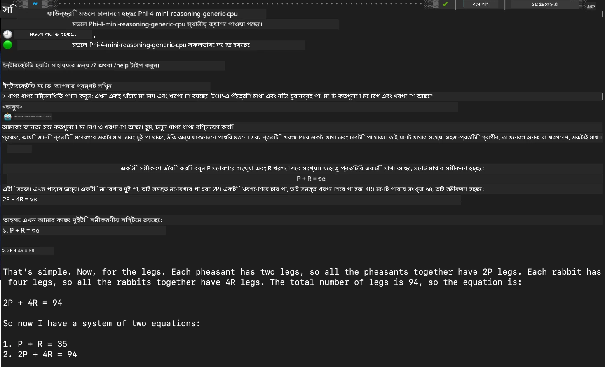

<!--
CO_OP_TRANSLATOR_METADATA:
{
  "original_hash": "52973a5680a65a810aa80b7036afd31f",
  "translation_date": "2025-07-16T19:44:36+00:00",
  "source_file": "md/01.Introduction/02/07.FoundryLocal.md",
  "language_code": "bn"
}
-->
## Foundry Local-এ Phi-Family মডেল দিয়ে শুরু করা

### Foundry Local পরিচিতি

Foundry Local একটি শক্তিশালী অন-ডিভাইস AI ইনফারেন্স সমাধান যা এন্টারপ্রাইজ-গ্রেড AI ক্ষমতাগুলো সরাসরি আপনার স্থানীয় হার্ডওয়্যারে নিয়ে আসে। এই টিউটোরিয়ালে আপনি Foundry Local-এর সাথে Phi-Family মডেল সেটআপ এবং ব্যবহারের ধাপগুলো শিখবেন, যা আপনাকে আপনার AI ওয়ার্কলোডের সম্পূর্ণ নিয়ন্ত্রণ দেয়, গোপনীয়তা বজায় রাখে এবং খরচ কমায়।

Foundry Local আপনার ডিভাইসে স্থানীয়ভাবে AI মডেল চালিয়ে পারফরম্যান্স, গোপনীয়তা, কাস্টমাইজেশন এবং খরচের সুবিধা প্রদান করে। এটি একটি সহজবোধ্য CLI, SDK, এবং REST API-এর মাধ্যমে আপনার বিদ্যমান ওয়ার্কফ্লো এবং অ্যাপ্লিকেশনের সাথে নির্বিঘ্নে সংযুক্ত হয়।



### কেন Foundry Local বেছে নেবেন?

Foundry Local-এর সুবিধাগুলো বোঝা আপনাকে আপনার AI ডিপ্লয়মেন্ট কৌশল সম্পর্কে সঠিক সিদ্ধান্ত নিতে সাহায্য করবে:

- **অন-ডিভাইস ইনফারেন্স:** আপনার নিজস্ব হার্ডওয়্যারে মডেলগুলো স্থানীয়ভাবে চালান, খরচ কমান এবং আপনার সব ডেটা আপনার ডিভাইসে রাখুন।

- **মডেল কাস্টমাইজেশন:** নির্দিষ্ট প্রয়োজন এবং ব্যবহারের জন্য প্রিসেট মডেল থেকে নির্বাচন করুন অথবা নিজের মডেল ব্যবহার করুন।

- **খরচ সাশ্রয়:** বিদ্যমান হার্ডওয়্যার ব্যবহার করে পুনরাবৃত্ত ক্লাউড সার্ভিস খরচ দূর করুন, AI-কে আরও সহজলভ্য করুন।

- **নিরবচ্ছিন্ন ইন্টিগ্রেশন:** SDK, API এন্ডপয়েন্ট, বা CLI-এর মাধ্যমে আপনার অ্যাপ্লিকেশনের সাথে সংযোগ করুন, এবং প্রয়োজনে Azure AI Foundry-তে সহজে স্কেল করুন।

> **Getting Started Note:** এই টিউটোরিয়ালটি Foundry Local CLI এবং SDK ইন্টারফেস ব্যবহার করার উপর কেন্দ্রীভূত। আপনি উভয় পদ্ধতি শিখবেন যাতে আপনার ব্যবহারের জন্য সেরা পদ্ধতি বেছে নিতে পারেন।

## অংশ ১: Foundry Local CLI সেটআপ

### ধাপ ১: ইনস্টলেশন

Foundry Local CLI আপনার স্থানীয়ভাবে AI মডেল পরিচালনা এবং চালানোর প্রবেশদ্বার। চলুন আপনার সিস্টেমে এটি ইনস্টল করা শুরু করি।

**সমর্থিত প্ল্যাটফর্ম:** Windows এবং macOS

বিস্তারিত ইনস্টলেশন নির্দেশনার জন্য, অনুগ্রহ করে [official Foundry Local documentation](https://github.com/microsoft/Foundry-Local/blob/main/README.md) দেখুন।

### ধাপ ২: উপলব্ধ মডেলগুলো অন্বেষণ

Foundry Local CLI ইনস্টল করার পর, আপনি আপনার ব্যবহারের জন্য কোন মডেলগুলো উপলব্ধ তা জানতে পারবেন। এই কমান্ডটি আপনাকে সব সমর্থিত মডেল দেখাবে:

```bash
foundry model list
```

### ধাপ ৩: Phi Family মডেলগুলো বোঝা

Phi Family বিভিন্ন ব্যবহারের ক্ষেত্র এবং হার্ডওয়্যার কনফিগারেশনের জন্য অপ্টিমাইজড মডেলের একটি সিরিজ। Foundry Local-এ উপলব্ধ Phi মডেলগুলো হলো:

**উপলব্ধ Phi মডেল:**

- **phi-3.5-mini** - মৌলিক কাজের জন্য কমপ্যাক্ট মডেল
- **phi-3-mini-128k** - দীর্ঘ কথোপকথনের জন্য এক্সটেন্ডেড কনটেক্সট ভার্সন
- **phi-3-mini-4k** - সাধারণ ব্যবহারের জন্য স্ট্যান্ডার্ড কনটেক্সট মডেল
- **phi-4** - উন্নত ক্ষমতার উন্নত মডেল
- **phi-4-mini** - Phi-4 এর হালকা ভার্সন
- **phi-4-mini-reasoning** - জটিল যুক্তি নির্ণয়ের জন্য বিশেষায়িত

> **হার্ডওয়্যার সামঞ্জস্যতা:** প্রতিটি মডেল আপনার সিস্টেমের ক্ষমতা অনুযায়ী বিভিন্ন হার্ডওয়্যার অ্যাক্সিলারেশন (CPU, GPU) এর জন্য কনফিগার করা যায়।

### ধাপ ৪: আপনার প্রথম Phi মডেল চালানো

চলুন একটি ব্যবহারিক উদাহরণ দিয়ে শুরু করি। আমরা `phi-4-mini-reasoning` মডেলটি চালাবো, যা ধাপে ধাপে জটিল সমস্যা সমাধানে দক্ষ।

**মডেল চালানোর কমান্ড:**

```bash
foundry model run Phi-4-mini-reasoning-generic-cpu
```

> **প্রথমবারের সেটআপ:** প্রথমবার মডেল চালানোর সময়, Foundry Local এটি স্বয়ংক্রিয়ভাবে আপনার স্থানীয় ডিভাইসে ডাউনলোড করবে। ডাউনলোডের সময় আপনার নেটওয়ার্ক স্পিডের উপর নির্ভর করে পরিবর্তিত হতে পারে, তাই প্রথম সেটআপের সময় ধৈর্য ধরুন।

### ধাপ ৫: বাস্তব সমস্যার মাধ্যমে মডেল পরীক্ষা

এখন চলুন একটি ক্লাসিক লজিক সমস্যার মাধ্যমে আমাদের মডেলটি পরীক্ষা করি এবং দেখি এটি ধাপে ধাপে যুক্তি নির্ণয় কিভাবে করে:

**উদাহরণ সমস্যা:**

```txt
Please calculate the following step by step: Now there are pheasants and rabbits in the same cage, there are thirty-five heads on top and ninety-four legs on the bottom, how many pheasants and rabbits are there?
```

**প্রত্যাশিত আচরণ:** মডেলটি এই সমস্যাটিকে যুক্তিসঙ্গত ধাপে ভেঙে ফেলবে, যেখানে pheasants-এর ২টি পা এবং rabbits-এর ৪টি পা আছে, সেই তথ্য ব্যবহার করে সমীকরণ সমাধান করবে।

**ফলাফল:**



## অংশ ২: Foundry Local SDK দিয়ে অ্যাপ্লিকেশন তৈরি

### কেন SDK ব্যবহার করবেন?

CLI দ্রুত পরীক্ষা এবং ইন্টারঅ্যাকশনের জন্য উপযুক্ত হলেও, SDK Foundry Local-কে প্রোগ্রাম্যাটিকভাবে আপনার অ্যাপ্লিকেশনে সংযুক্ত করার সুযোগ দেয়। এর মাধ্যমে আপনি করতে পারবেন:

- কাস্টম AI-চালিত অ্যাপ্লিকেশন তৈরি
- স্বয়ংক্রিয় ওয়ার্কফ্লো নির্মাণ
- বিদ্যমান সিস্টেমে AI ক্ষমতা সংযুক্তকরণ
- চ্যাটবট এবং ইন্টারেক্টিভ টুলস ডেভেলপমেন্ট

### সমর্থিত প্রোগ্রামিং ভাষাসমূহ

Foundry Local বিভিন্ন প্রোগ্রামিং ভাষার জন্য SDK সাপোর্ট দেয়, যা আপনার ডেভেলপমেন্ট পছন্দ অনুযায়ী মানানসই:

**📦 উপলব্ধ SDK:**

- **C# (.NET):** [SDK Documentation & Examples](https://github.com/microsoft/Foundry-Local/tree/main/sdk/cs)
- **Python:** [SDK Documentation & Examples](https://github.com/microsoft/Foundry-Local/tree/main/sdk/python)
- **JavaScript:** [SDK Documentation & Examples](https://github.com/microsoft/Foundry-Local/tree/main/sdk/js)
- **Rust:** [SDK Documentation & Examples](https://github.com/microsoft/Foundry-Local/tree/main/sdk/rust)

### পরবর্তী ধাপ

1. আপনার ডেভেলপমেন্ট পরিবেশ অনুযায়ী পছন্দসই SDK নির্বাচন করুন
2. SDK-ভিত্তিক বিস্তারিত বাস্তবায়ন নির্দেশিকা অনুসরণ করুন
3. জটিল অ্যাপ্লিকেশন তৈরির আগে সহজ উদাহরণ দিয়ে শুরু করুন
4. প্রতিটি SDK রিপোজিটরিতে দেওয়া নমুনা কোড অন্বেষণ করুন

## উপসংহার

এখন আপনি শিখেছেন কিভাবে:
- ✅ Foundry Local CLI ইনস্টল এবং সেটআপ করবেন
- ✅ Phi Family মডেল আবিষ্কার এবং চালাবেন
- ✅ বাস্তব সমস্যার মাধ্যমে মডেল পরীক্ষা করবেন
- ✅ অ্যাপ্লিকেশন ডেভেলপমেন্টের জন্য SDK অপশন বুঝবেন

Foundry Local আপনার স্থানীয় পরিবেশে AI ক্ষমতা নিয়ে আসার জন্য একটি শক্তিশালী ভিত্তি প্রদান করে, যা পারফরম্যান্স, গোপনীয়তা এবং খরচ নিয়ন্ত্রণের সুযোগ দেয়, এবং প্রয়োজনে ক্লাউড সলিউশনে স্কেল করার নমনীয়তাও বজায় রাখে।

**অস্বীকৃতি**:  
এই নথিটি AI অনুবাদ সেবা [Co-op Translator](https://github.com/Azure/co-op-translator) ব্যবহার করে অনূদিত হয়েছে। আমরা যথাসাধ্য সঠিকতার চেষ্টা করি, তবে স্বয়ংক্রিয় অনুবাদে ত্রুটি বা অসঙ্গতি থাকতে পারে। মূল নথিটি তার নিজস্ব ভাষায়ই কর্তৃত্বপূর্ণ উৎস হিসেবে বিবেচিত হওয়া উচিত। গুরুত্বপূর্ণ তথ্যের জন্য পেশাদার মানব অনুবাদ গ্রহণ করার পরামর্শ দেওয়া হয়। এই অনুবাদের ব্যবহারে সৃষ্ট কোনো ভুল বোঝাবুঝি বা ভুল ব্যাখ্যার জন্য আমরা দায়ী নই।