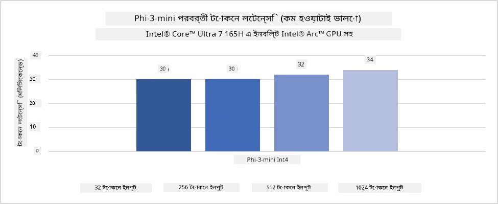
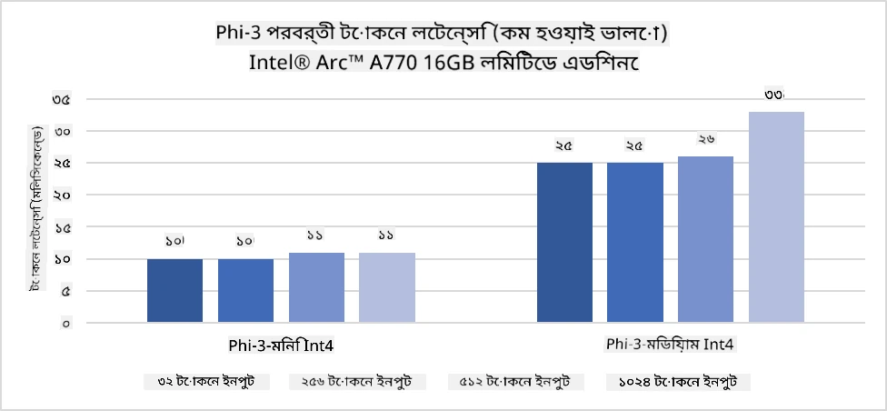
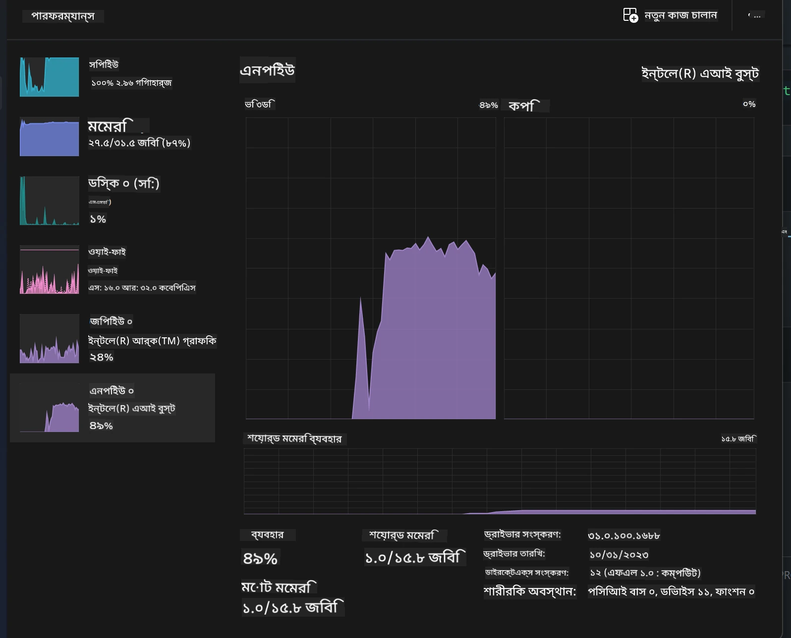
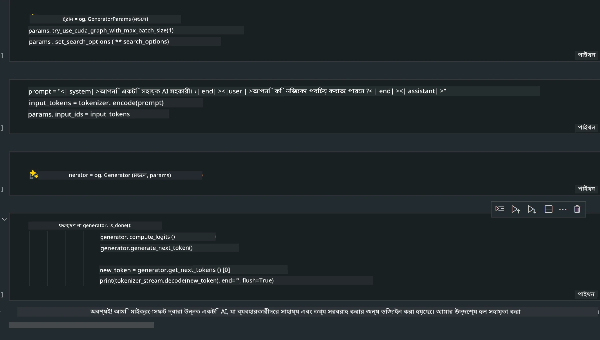
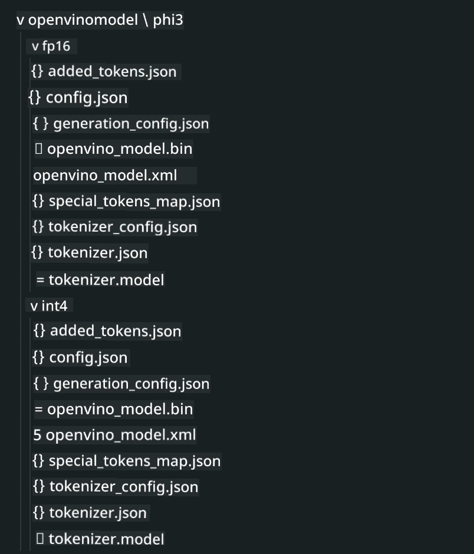
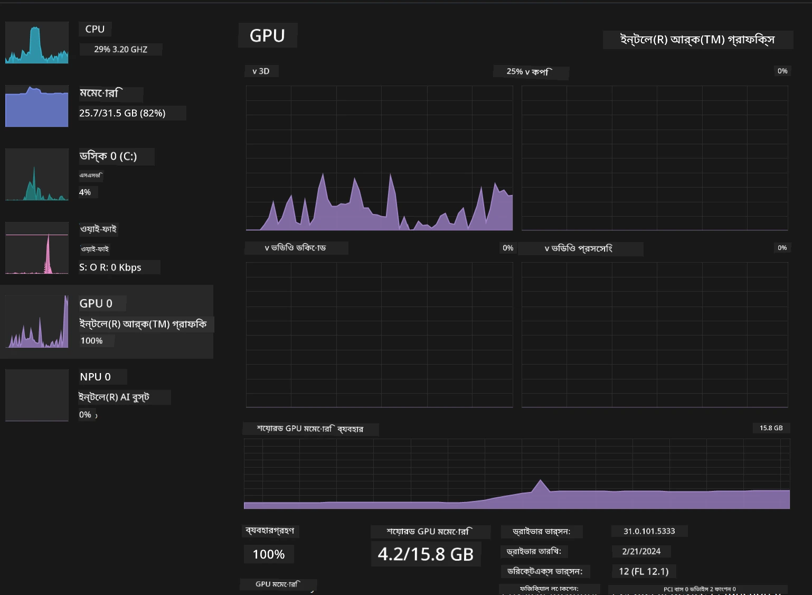

# **AI PC-তে Phi-3 ইনফারেন্স**

জেনারেটিভ AI-এর উন্নতি এবং এজ ডিভাইসের হার্ডওয়্যার ক্ষমতার উন্নতির সাথে, ক্রমবর্ধমান সংখ্যক জেনারেটিভ AI মডেল এখন ব্যবহারকারীদের Bring Your Own Device (BYOD) ডিভাইসে ইন্টিগ্রেট করা সম্ভব হচ্ছে। AI PC-গুলি এই মডেলগুলোর মধ্যে অন্যতম। ২০২৪ সাল থেকে, Intel, AMD, এবং Qualcomm PC নির্মাতাদের সাথে সহযোগিতা করে AI PC বাজারে এনেছে, যা হার্ডওয়্যার পরিবর্তনের মাধ্যমে লোকালাইজড জেনারেটিভ AI মডেল ডিপ্লয়মেন্ট সহজ করে। এই আলোচনায়, আমরা Intel AI PC-র উপর ফোকাস করব এবং Intel AI PC-তে Phi-3 কীভাবে ডিপ্লয় করবেন তা দেখব।

### NPU কী

NPU (Neural Processing Unit) হলো একটি বিশেষায়িত প্রসেসর বা প্রসেসিং ইউনিট যা বড় SoC-এর অংশ এবং বিশেষভাবে নিউরাল নেটওয়ার্ক অপারেশন এবং AI টাস্ক দ্রুততর করার জন্য ডিজাইন করা হয়েছে। সাধারণ CPU এবং GPU থেকে আলাদা, NPU-গুলি ডেটা-চালিত প্যারালাল কম্পিউটিংয়ের জন্য অপ্টিমাইজড, যা ভিডিও, ছবি মত বিশাল মাল্টিমিডিয়া ডেটা এবং নিউরাল নেটওয়ার্কের ডেটা প্রক্রিয়াকরণে অত্যন্ত দক্ষ। এগুলো AI-সম্পর্কিত কাজ যেমন স্পিচ রিকগনিশন, ভিডিও কলের ব্যাকগ্রাউন্ড ব্লারিং, এবং অবজেক্ট ডিটেকশনসহ ছবি বা ভিডিও এডিটিংয়ে বিশেষ পারদর্শী।

## NPU বনাম GPU

অনেক AI এবং মেশিন লার্নিং ওয়ার্কলোড GPU-তে চলে, তবে GPU এবং NPU-এর মধ্যে একটি গুরুত্বপূর্ণ পার্থক্য আছে।  
GPU-গুলি প্যারালাল কম্পিউটিংয়ের জন্য পরিচিত, কিন্তু সব GPU গ্রাফিক্স প্রক্রিয়াকরণের বাইরে সমান দক্ষ নয়। অন্যদিকে, NPU-গুলি নিউরাল নেটওয়ার্ক অপারেশনের জটিল গণনাগুলোর জন্য বিশেষভাবে তৈরি, যা AI টাস্কে অত্যন্ত কার্যকর।

সারাংশে, NPU হলো গণিতের বিশেষজ্ঞ যারা AI গণনাকে দ্রুততর করে এবং AI PC-এর উদীয়মান যুগে গুরুত্বপূর্ণ ভূমিকা পালন করে!

***এই উদাহরণটি Intel-এর সর্বশেষ Intel Core Ultra Processor-এর উপর ভিত্তি করে তৈরি।***

## **১. Phi-3 মডেল চালাতে NPU ব্যবহার করুন**

Intel® NPU ডিভাইস হলো একটি AI ইনফারেন্স অ্যাক্সিলারেটর যা Intel ক্লায়েন্ট CPU-র সাথে ইন্টিগ্রেটেড, Intel® Core™ Ultra প্রজন্মের CPU থেকে শুরু করে (যা পূর্বে Meteor Lake নামে পরিচিত ছিল)। এটি কৃত্রিম নিউরাল নেটওয়ার্ক টাস্কের জন্য শক্তি-দক্ষ এক্সিকিউশন সক্ষম করে।





**Intel NPU Acceleration Library**

Intel NPU Acceleration Library [https://github.com/intel/intel-npu-acceleration-library](https://github.com/intel/intel-npu-acceleration-library) হলো একটি পাইথন লাইব্রেরি যা Intel Neural Processing Unit (NPU)-এর শক্তি ব্যবহার করে আপনার অ্যাপ্লিকেশনগুলোর কার্যকারিতা বাড়ায় এবং সামঞ্জস্যপূর্ণ হার্ডওয়্যারে উচ্চগতির গণনা সম্পাদন করে।

Intel® Core™ Ultra প্রসেসর দ্বারা চালিত AI PC-তে Phi-3-mini এর উদাহরণ।


pip দিয়ে পাইথন লাইব্রেরি ইনস্টল করুন

```bash

   pip install intel-npu-acceleration-library

```

***Note*** প্রকল্পটি এখনও উন্নয়নের অধীনে, তবে রেফারেন্স মডেলটি ইতিমধ্যেই খুবই সম্পূর্ণ।

### **Intel NPU Acceleration Library দিয়ে Phi-3 চালানো**

Intel NPU অ্যাক্সিলারেশন ব্যবহার করে, এই লাইব্রেরি ঐতিহ্যবাহী এনকোডিং প্রক্রিয়াকে প্রভাবিত করে না। আপনাকে শুধু এই লাইব্রেরি ব্যবহার করে মূল Phi-3 মডেলকে কোয়ান্টাইজ করতে হবে, যেমন FP16, INT8, INT4 ইত্যাদি।

```python
from transformers import AutoTokenizer, pipeline,TextStreamer
from intel_npu_acceleration_library import NPUModelForCausalLM, int4
from intel_npu_acceleration_library.compiler import CompilerConfig
import warnings

model_id = "microsoft/Phi-3-mini-4k-instruct"

compiler_conf = CompilerConfig(dtype=int4)
model = NPUModelForCausalLM.from_pretrained(
    model_id, use_cache=True, config=compiler_conf, attn_implementation="sdpa"
).eval()

tokenizer = AutoTokenizer.from_pretrained(model_id)

text_streamer = TextStreamer(tokenizer, skip_prompt=True)
```

কোয়ান্টাইজেশন সফল হলে, NPU কল করে Phi-3 মডেল চালানোর জন্য এক্সিকিউশন চালিয়ে যান।

```python
generation_args = {
   "max_new_tokens": 1024,
   "return_full_text": False,
   "temperature": 0.3,
   "do_sample": False,
   "streamer": text_streamer,
}

pipe = pipeline(
   "text-generation",
   model=model,
   tokenizer=tokenizer,
)

query = "<|system|>You are a helpful AI assistant.<|end|><|user|>Can you introduce yourself?<|end|><|assistant|>"

with warnings.catch_warnings():
    warnings.simplefilter("ignore")
    pipe(query, **generation_args)
```

কোড চালানোর সময়, Task Manager থেকে NPU-এর রানিং স্ট্যাটাস দেখা যায়।



***Samples*** : [AIPC_NPU_DEMO.ipynb](../../../../../code/03.Inference/AIPC/AIPC_NPU_DEMO.ipynb)

## **২. Phi-3 মডেল চালাতে DirectML + ONNX Runtime ব্যবহার করুন**

### **DirectML কী**

[DirectML](https://github.com/microsoft/DirectML) হলো একটি উচ্চ-পারফরম্যান্স, হার্ডওয়্যার-অ্যাক্সিলারেটেড DirectX 12 লাইব্রেরি মেশিন লার্নিংয়ের জন্য। DirectML সাধারণ মেশিন লার্নিং টাস্কের জন্য GPU অ্যাক্সিলারেশন প্রদান করে বিভিন্ন হার্ডওয়্যার এবং ড্রাইভার সমর্থিত, যেমন AMD, Intel, NVIDIA, এবং Qualcomm-এর সব DirectX 12 সক্ষম GPU।

স্বতন্ত্রভাবে ব্যবহৃত হলে, DirectML API হলো একটি নিম্নস্তরের DirectX 12 লাইব্রেরি এবং উচ্চ-পারফরম্যান্স, কম-লেটেন্সি অ্যাপ্লিকেশন যেমন ফ্রেমওয়ার্ক, গেমস, এবং অন্যান্য রিয়েল-টাইম অ্যাপ্লিকেশনের জন্য উপযুক্ত। DirectML-এর Direct3D 12-এর সাথে নির্বিঘ্ন ইন্টারঅপারেবিলিটি, কম ওভারহেড এবং হার্ডওয়্যার জুড়ে সামঞ্জস্য এটিকে মেশিন লার্নিং অ্যাক্সিলারেশনের জন্য আদর্শ করে তোলে, যেখানে উচ্চ পারফরম্যান্স এবং হার্ডওয়্যার জুড়ে ফলাফলের নির্ভরযোগ্যতা গুরুত্বপূর্ণ।

***Note*** : সর্বশেষ DirectML ইতিমধ্যেই NPU সমর্থন করে (https://devblogs.microsoft.com/directx/introducing-neural-processor-unit-npu-support-in-directml-developer-preview/)

### DirectML এবং CUDA-এর ক্ষমতা ও পারফরম্যান্সের তুলনা:

**DirectML** হলো Microsoft-এর তৈরি একটি মেশিন লার্নিং লাইব্রেরি। এটি Windows ডিভাইস যেমন ডেস্কটপ, ল্যাপটপ, এবং এজ ডিভাইসে মেশিন লার্নিং ওয়ার্কলোড দ্রুততর করার জন্য ডিজাইন করা হয়েছে।  
- DX12-ভিত্তিক: DirectML DirectX 12 (DX12) এর উপর নির্মিত, যা NVIDIA এবং AMD সহ বিভিন্ন GPU-তে বিস্তৃত হার্ডওয়্যার সমর্থন দেয়।  
- বিস্তৃত সমর্থন: DX12 ব্যবহার করার কারণে, DirectML যেকোনো DX12 সমর্থিত GPU-র সাথে কাজ করতে পারে, এমনকি ইন্টিগ্রেটেড GPU-র সাথেও।  
- ইমেজ প্রসেসিং: DirectML নিউরাল নেটওয়ার্ক ব্যবহার করে ছবি এবং অন্যান্য ডেটা প্রক্রিয়াকরণ করে, যা ইমেজ রিকগনিশন, অবজেক্ট ডিটেকশন ইত্যাদির জন্য উপযুক্ত।  
- সহজ সেটআপ: DirectML সেটআপ করা সহজ এবং GPU নির্মাতাদের নির্দিষ্ট SDK বা লাইব্রেরি প্রয়োজন হয় না।  
- পারফরম্যান্স: কিছু ক্ষেত্রে, DirectML CUDA থেকে দ্রুততর হতে পারে, বিশেষ করে নির্দিষ্ট ওয়ার্কলোডে।  
- সীমাবদ্ধতা: তবে, কিছু ক্ষেত্রে বিশেষ করে float16 বড় ব্যাচ সাইজে DirectML ধীর হতে পারে।

**CUDA** হলো NVIDIA-এর প্যারালাল কম্পিউটিং প্ল্যাটফর্ম এবং প্রোগ্রামিং মডেল। এটি ডেভেলপারদের NVIDIA GPU-এর শক্তি ব্যবহার করে সাধারণ উদ্দেশ্যের কম্পিউটিং, মেশিন লার্নিং এবং বৈজ্ঞানিক সিমুলেশন করার সুযোগ দেয়।  
- NVIDIA-নির্দিষ্ট: CUDA NVIDIA GPU-র সাথে ঘনিষ্ঠভাবে ইন্টিগ্রেটেড এবং বিশেষভাবে তাদের জন্য ডিজাইন করা।  
- অত্যন্ত অপ্টিমাইজড: GPU-অ্যাক্সিলারেটেড টাস্কের জন্য চমৎকার পারফরম্যান্স দেয়, বিশেষ করে NVIDIA GPU ব্যবহার করলে।  
- ব্যাপক ব্যবহৃত: অনেক মেশিন লার্নিং ফ্রেমওয়ার্ক এবং লাইব্রেরি (যেমন TensorFlow এবং PyTorch) CUDA সমর্থন করে।  
- কাস্টমাইজেশন: ডেভেলপাররা নির্দিষ্ট টাস্কের জন্য CUDA সেটিংস ফাইন-টিউন করতে পারে, যা সর্বোত্তম পারফরম্যান্স নিশ্চিত করে।  
- সীমাবদ্ধতা: তবে, CUDA-এর নির্ভরতা NVIDIA হার্ডওয়্যারের উপর থাকায় বিভিন্ন GPU-র সাথে বিস্তৃত সামঞ্জস্য সীমাবদ্ধ হতে পারে।

### DirectML এবং CUDA-এর মধ্যে পছন্দ

DirectML এবং CUDA-এর মধ্যে পছন্দ নির্ভর করে আপনার নির্দিষ্ট ব্যবহারের ক্ষেত্র, হার্ডওয়্যার উপলব্ধতা এবং পছন্দের উপর।  
যদি আপনি বিস্তৃত সামঞ্জস্য এবং সহজ সেটআপ চান, DirectML ভালো বিকল্প হতে পারে। তবে NVIDIA GPU থাকলে এবং অত্যন্ত অপ্টিমাইজড পারফরম্যান্স দরকার হলে CUDA শক্তিশালী বিকল্প। সংক্ষেপে, DirectML এবং CUDA উভয়েরই নিজস্ব শক্তি ও দুর্বলতা আছে, তাই আপনার প্রয়োজন এবং উপলব্ধ হার্ডওয়্যার বিবেচনা করে সিদ্ধান্ত নিন।

### **ONNX Runtime দিয়ে জেনারেটিভ AI**

AI যুগে, AI মডেলের পোর্টেবিলিটি খুবই গুরুত্বপূর্ণ। ONNX Runtime সহজেই প্রশিক্ষিত মডেলগুলোকে বিভিন্ন ডিভাইসে ডিপ্লয় করতে পারে। ডেভেলপারদের ইনফারেন্স ফ্রেমওয়ার্ক নিয়ে চিন্তা করতে হয় না এবং একটি একক API ব্যবহার করে মডেল ইনফারেন্স সম্পন্ন করতে পারে। জেনারেটিভ AI যুগে, ONNX Runtime কোড অপ্টিমাইজেশনও করেছে (https://onnxruntime.ai/docs/genai/)। অপ্টিমাইজড ONNX Runtime-এর মাধ্যমে কোয়ান্টাইজড জেনারেটিভ AI মডেল বিভিন্ন টার্মিনালে ইনফারেন্স করা যায়। ONNX Runtime দিয়ে জেনারেটিভ AI মডেল API-র মাধ্যমে Python, C#, C/C++ ব্যবহার করে ইনফারেন্স করা যায়। অবশ্যই, iPhone-এ ডিপ্লয়মেন্টের জন্য C++ এর জেনারেটিভ AI ONNX Runtime API ব্যবহার করা যেতে পারে।

[Sample Code](https://github.com/Azure-Samples/Phi-3MiniSamples/tree/main/onnx)

***ONNX Runtime লাইব্রেরি কম্পাইল করুন***

```bash

winget install --id=Kitware.CMake  -e

git clone https://github.com/microsoft/onnxruntime.git

cd .\onnxruntime\

./build.bat --build_shared_lib --skip_tests --parallel --use_dml --config Release

cd ../

git clone https://github.com/microsoft/onnxruntime-genai.git

cd .\onnxruntime-genai\

mkdir ort

cd ort

mkdir include

mkdir lib

copy ..\onnxruntime\include\onnxruntime\core\providers\dml\dml_provider_factory.h ort\include

copy ..\onnxruntime\include\onnxruntime\core\session\onnxruntime_c_api.h ort\include

copy ..\onnxruntime\build\Windows\Release\Release\*.dll ort\lib

copy ..\onnxruntime\build\Windows\Release\Release\onnxruntime.lib ort\lib

python build.py --use_dml


```

**লাইব্রেরি ইনস্টল করুন**

```bash

pip install .\onnxruntime_genai_directml-0.3.0.dev0-cp310-cp310-win_amd64.whl

```

এটি চালানোর ফলাফল



***Samples*** : [AIPC_DirectML_DEMO.ipynb](../../../../../code/03.Inference/AIPC/AIPC_DirectML_DEMO.ipynb)

## **৩. Phi-3 মডেল চালাতে Intel OpenVino ব্যবহার করুন**

### **OpenVINO কী**

[OpenVINO](https://github.com/openvinotoolkit/openvino) হলো একটি ওপেন-সোর্স টুলকিট যা ডিপ লার্নিং মডেল অপ্টিমাইজ এবং ডিপ্লয় করার জন্য ব্যবহৃত হয়। এটি TensorFlow, PyTorch এবং অন্যান্য জনপ্রিয় ফ্রেমওয়ার্ক থেকে ভিশন, অডিও, এবং ভাষা মডেলের জন্য উন্নত ডিপ লার্নিং পারফরম্যান্স প্রদান করে। OpenVINO দিয়ে শুরু করুন। OpenVINO CPU এবং GPU এর সাথে মিলিয়ে Phi-3 মডেল চালাতেও ব্যবহার করা যায়।

***Note***: বর্তমানে OpenVINO NPU সমর্থন করে না।

### **OpenVINO লাইব্রেরি ইনস্টল করুন**

```bash

 pip install git+https://github.com/huggingface/optimum-intel.git

 pip install git+https://github.com/openvinotoolkit/nncf.git

 pip install openvino-nightly

```

### **OpenVINO দিয়ে Phi-3 চালানো**

NPU-এর মতো, OpenVINO কোয়ান্টাইজড মডেল চালিয়ে জেনারেটিভ AI মডেল কল সম্পন্ন করে। প্রথমে Phi-3 মডেল কোয়ান্টাইজ করতে হবে এবং optimum-cli ব্যবহার করে কমান্ড লাইনে মডেল কোয়ান্টাইজেশন সম্পন্ন করতে হবে।

**INT4**

```bash

optimum-cli export openvino --model "microsoft/Phi-3-mini-4k-instruct" --task text-generation-with-past --weight-format int4 --group-size 128 --ratio 0.6  --sym  --trust-remote-code ./openvinomodel/phi3/int4

```

**FP16**

```bash

optimum-cli export openvino --model "microsoft/Phi-3-mini-4k-instruct" --task text-generation-with-past --weight-format fp16 --trust-remote-code ./openvinomodel/phi3/fp16

```

রূপান্তরিত ফরম্যাট, এরকম



মডেল পাথ (model_dir), সংশ্লিষ্ট কনফিগারেশন (ov_config = {"PERFORMANCE_HINT": "LATENCY", "NUM_STREAMS": "1", "CACHE_DIR": ""}), এবং হার্ডওয়্যার-অ্যাক্সিলারেটেড ডিভাইস (GPU.0) OVModelForCausalLM এর মাধ্যমে লোড করুন।

```python

ov_model = OVModelForCausalLM.from_pretrained(
     model_dir,
     device='GPU.0',
     ov_config=ov_config,
     config=AutoConfig.from_pretrained(model_dir, trust_remote_code=True),
     trust_remote_code=True,
)

```

কোড চালানোর সময়, Task Manager থেকে GPU-এর রানিং স্ট্যাটাস দেখা যায়।



***Samples*** : [AIPC_OpenVino_Demo.ipynb](../../../../../code/03.Inference/AIPC/AIPC_OpenVino_Demo.ipynb)

### ***Note*** : উপরের তিনটি পদ্ধতির প্রত্যেকটির নিজস্ব সুবিধা আছে, তবে AI PC ইনফারেন্সের জন্য NPU অ্যাক্সিলারেশন ব্যবহার করাই সবচেয়ে উপযুক্ত।

**অস্বীকৃতি**:  
এই নথিটি AI অনুবাদ সেবা [Co-op Translator](https://github.com/Azure/co-op-translator) ব্যবহার করে অনূদিত হয়েছে। আমরা যথাসাধ্য সঠিকতার চেষ্টা করি, তবে স্বয়ংক্রিয় অনুবাদে ত্রুটি বা অসঙ্গতি থাকতে পারে। মূল নথিটি তার নিজস্ব ভাষায়ই কর্তৃত্বপূর্ণ উৎস হিসেবে বিবেচিত হওয়া উচিত। গুরুত্বপূর্ণ তথ্যের জন্য পেশাদার মানব অনুবাদ গ্রহণ করার পরামর্শ দেওয়া হয়। এই অনুবাদের ব্যবহারে সৃষ্ট কোনো ভুল বোঝাবুঝি বা ভুল ব্যাখ্যার জন্য আমরা দায়ী নই।