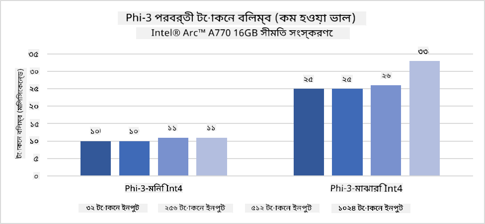
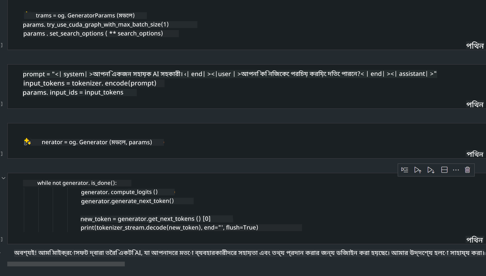
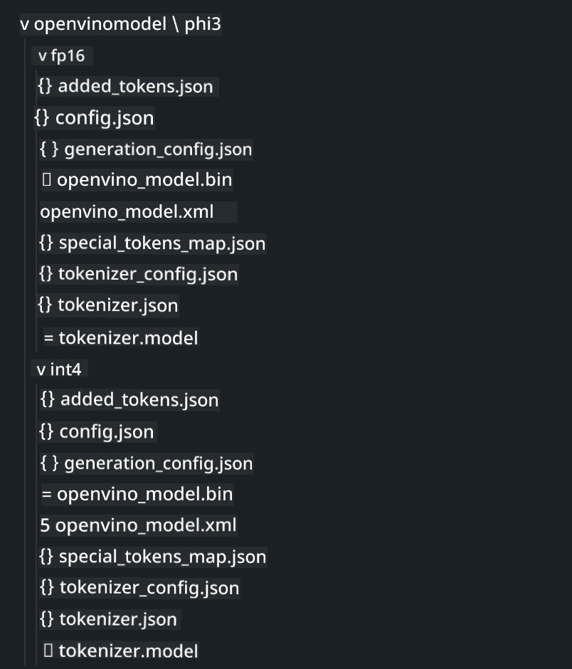

<!--
CO_OP_TRANSLATOR_METADATA:
{
  "original_hash": "e08ce816e23ad813244a09ca34ebb8ac",
  "translation_date": "2025-05-09T10:05:52+00:00",
  "source_file": "md/01.Introduction/03/AIPC_Inference.md",
  "language_code": "bn"
}
-->
# **AI PC-তে Phi-3 ইনফারেন্স**

জেনারেটিভ AI-এর উন্নতি এবং এজ ডিভাইসের হার্ডওয়্যার সক্ষমতার উন্নতির সাথে, ক্রমবর্ধমান সংখ্যক জেনারেটিভ AI মডেল এখন ব্যবহারকারীদের Bring Your Own Device (BYOD) ডিভাইসে ইন্টিগ্রেট করা যাচ্ছে। AI PC-গুলো এই মডেলগুলোর মধ্যে অন্যতম। ২০২৪ সাল থেকে, Intel, AMD, এবং Qualcomm PC নির্মাতাদের সঙ্গে মিলিত হয়ে AI PC উপস্থাপন করেছে, যা হার্ডওয়্যার পরিবর্তনের মাধ্যমে লোকালাইজড জেনারেটিভ AI মডেল ডিপ্লয়মেন্ট সহজ করে। এই আলোচনায়, আমরা Intel AI PC-র ওপর ফোকাস করব এবং Intel AI PC-তে Phi-3 কীভাবে ডিপ্লয় করবেন তা দেখব।

### NPU কী

NPU (Neural Processing Unit) হলো একটি বিশেষায়িত প্রসেসর বা প্রসেসিং ইউনিট, যা বড় SoC-এর অংশ হিসেবে ডিজাইন করা হয়েছে নিউরাল নেটওয়ার্ক অপারেশন এবং AI টাস্ক গুলোর গতি বাড়ানোর জন্য। সাধারণ CPU এবং GPU থেকে আলাদা, NPU গুলো ডেটা-চালিত প্যারালাল কম্পিউটিং-এর জন্য অপটিমাইজড, যা ভিডিও এবং ছবি মত বিশাল মাল্টিমিডিয়া ডেটা প্রসেসিং এবং নিউরাল নেটওয়ার্কের জন্য অত্যন্ত কার্যকর। তারা AI-সম্পর্কিত কাজ যেমন স্পিচ রিকগনিশন, ভিডিও কলের ব্যাকগ্রাউন্ড ব্লার, এবং অবজেক্ট ডিটেকশনসহ ফটো বা ভিডিও এডিটিং প্রক্রিয়াগুলো দক্ষতার সাথে পরিচালনা করে।

## NPU বনাম GPU

অনেক AI এবং মেশিন লার্নিং ওয়ার্কলোড GPU-তে চলে, কিন্তু GPU এবং NPU এর মধ্যে একটি গুরুত্বপূর্ণ পার্থক্য আছে।  
GPU গুলো তাদের প্যারালাল কম্পিউটিং ক্ষমতার জন্য পরিচিত, তবে সব GPU গ্রাফিক্স প্রসেসিং ছাড়াও সমান দক্ষ নয়। অপরদিকে, NPU গুলো নিউরাল নেটওয়ার্ক অপারেশনগুলোর জটিল গণনার জন্য বিশেষভাবে তৈরি, যা AI টাস্কের জন্য অত্যন্ত কার্যকর।

সংক্ষেপে, NPU হলো সেই গণিতবিদ যারা AI কম্পিউটেশনকে দ্রুততর করে এবং AI PC-এর উদীয়মান যুগে তারা একটি গুরুত্বপূর্ণ ভূমিকা পালন করে!

***এই উদাহরণটি Intel-এর সর্বশেষ Intel Core Ultra Processor-এর ওপর ভিত্তি করে***

## **১. Phi-3 মডেল চালানোর জন্য NPU ব্যবহার করুন**

Intel® NPU ডিভাইস হলো একটি AI ইনফারেন্স অ্যাক্সিলারেটর যা Intel ক্লায়েন্ট CPU-তে ইন্টিগ্রেটেড, Intel® Core™ Ultra CPU (যা আগে Meteor Lake নামে পরিচিত) থেকে শুরু করে। এটি আর্টিফিশিয়াল নিউরাল নেটওয়ার্ক টাস্কের এনার্জি-কার্যকর এক্সিকিউশন সক্ষম করে।




**Intel NPU Acceleration Library**

Intel NPU Acceleration Library [https://github.com/intel/intel-npu-acceleration-library](https://github.com/intel/intel-npu-acceleration-library) হলো একটি পাইথন লাইব্রেরি যা Intel Neural Processing Unit (NPU)-এর ক্ষমতা ব্যবহার করে আপনার অ্যাপ্লিকেশনগুলোকে দ্রুততর করার জন্য ডিজাইন করা হয়েছে।

Intel® Core™ Ultra প্রসেসর দ্বারা চালিত AI PC-তে Phi-3-mini এর উদাহরণ।


পাইথন লাইব্রেরি pip দিয়ে ইনস্টল করুন

```bash

   pip install intel-npu-acceleration-library

```

***Note*** প্রকল্পটি এখনও উন্নয়নের অধীনে, তবে রেফারেন্স মডেলটি ইতিমধ্যেই বেশ সম্পূর্ণ।

### **Intel NPU Acceleration Library দিয়ে Phi-3 চালানো**

Intel NPU অ্যাক্সিলারেশন ব্যবহার করে, এই লাইব্রেরি ঐতিহ্যবাহী এনকোডিং প্রক্রিয়াকে প্রভাবিত করে না। আপনাকে কেবল এই লাইব্রেরি ব্যবহার করে মূল Phi-3 মডেলকে কোয়ান্টাইজ করতে হবে, যেমন FP16, INT8, INT4 ইত্যাদি

```python
from transformers import AutoTokenizer, pipeline,TextStreamer
from intel_npu_acceleration_library import NPUModelForCausalLM, int4
from intel_npu_acceleration_library.compiler import CompilerConfig
import warnings

model_id = "microsoft/Phi-3-mini-4k-instruct"

compiler_conf = CompilerConfig(dtype=int4)
model = NPUModelForCausalLM.from_pretrained(
    model_id, use_cache=True, config=compiler_conf, attn_implementation="sdpa"
).eval()

tokenizer = AutoTokenizer.from_pretrained(model_id)

text_streamer = TextStreamer(tokenizer, skip_prompt=True)
```

কোয়ান্টাইজেশন সফল হলে, NPU কল করে Phi-3 মডেল চালানোর জন্য এক্সিকিউশন চালিয়ে যান।

```python
generation_args = {
   "max_new_tokens": 1024,
   "return_full_text": False,
   "temperature": 0.3,
   "do_sample": False,
   "streamer": text_streamer,
}

pipe = pipeline(
   "text-generation",
   model=model,
   tokenizer=tokenizer,
)

query = "<|system|>You are a helpful AI assistant.<|end|><|user|>Can you introduce yourself?<|end|><|assistant|>"

with warnings.catch_warnings():
    warnings.simplefilter("ignore")
    pipe(query, **generation_args)
```

কোড চালানোর সময়, Task Manager থেকে NPU-র রানিং স্ট্যাটাস দেখা যায়


***Samples*** : [AIPC_NPU_DEMO.ipynb](../../../../../code/03.Inference/AIPC/AIPC_NPU_DEMO.ipynb)

## **২. Phi-3 মডেল চালানোর জন্য DirectML + ONNX Runtime ব্যবহার করুন**

### **DirectML কী**

[DirectML](https://github.com/microsoft/DirectML) হলো একটি উচ্চ কর্মক্ষমতা সম্পন্ন, হার্ডওয়্যার-অ্যাক্সিলারেটেড DirectX 12 লাইব্রেরি মেশিন লার্নিংয়ের জন্য। DirectML সাধারণ মেশিন লার্নিং টাস্কগুলোর জন্য GPU অ্যাক্সিলারেশন প্রদান করে, যা AMD, Intel, NVIDIA, এবং Qualcomm-এর মত ভেন্ডারদের সব DirectX 12 সক্ষম GPU-তে কাজ করে।

স্বতন্ত্রভাবে ব্যবহৃত হলে, DirectML API হলো একটি নিম্নস্তরের DirectX 12 লাইব্রেরি, যা ফ্রেমওয়ার্ক, গেমস এবং অন্যান্য রিয়েল-টাইম অ্যাপ্লিকেশনের জন্য উপযুক্ত। DirectML-এর Direct3D 12-র সাথে সুষ্ঠু ইন্টারঅপারেবিলিটি, কম ওভারহেড এবং হার্ডওয়্যার জুড়ে সামঞ্জস্য এটিকে উচ্চ কর্মক্ষমতা এবং নির্ভরযোগ্য ফলাফলের জন্য আদর্শ করে তোলে।

***Note*** : সর্বশেষ DirectML ইতিমধ্যে NPU সাপোর্ট করে (https://devblogs.microsoft.com/directx/introducing-neural-processor-unit-npu-support-in-directml-developer-preview/)

### DirectML এবং CUDA এর ক্ষমতা ও কর্মক্ষমতার তুলনা:

**DirectML** হলো Microsoft-এর তৈরি একটি মেশিন লার্নিং লাইব্রেরি, যা উইন্ডোজ ডিভাইসে (ডেস্কটপ, ল্যাপটপ, এজ ডিভাইস) মেশিন লার্নিং ওয়ার্কলোড দ্রুত করার জন্য ডিজাইন করা হয়েছে।  
- DX12-ভিত্তিক: DirectML DirectX 12 (DX12) এর ওপর নির্মিত, যা NVIDIA এবং AMD সহ বিভিন্ন GPU-তে বিস্তৃত হার্ডওয়্যার সাপোর্ট দেয়।  
- বিস্তৃত সাপোর্ট: DX12 ব্যবহার করার কারণে DirectML যেকোনো DX12 সাপোর্টেড GPU-র সঙ্গে কাজ করতে পারে, এমনকি ইন্টিগ্রেটেড GPU-র সঙ্গেও।  
- ইমেজ প্রসেসিং: DirectML নিউরাল নেটওয়ার্ক ব্যবহার করে ছবি এবং অন্যান্য ডেটা প্রসেস করে, যা ইমেজ রিকগনিশন, অবজেক্ট ডিটেকশন ইত্যাদির জন্য উপযুক্ত।  
- সহজ সেটআপ: DirectML সেটআপ করা সহজ, এবং GPU নির্মাতাদের বিশেষ SDK বা লাইব্রেরি দরকার হয় না।  
- কর্মক্ষমতা: কিছু ক্ষেত্রে DirectML ভাল পারফর্ম করে এবং CUDA থেকে দ্রুত হতে পারে, বিশেষ করে নির্দিষ্ট ওয়ার্কলোডে।  
- সীমাবদ্ধতা: তবে, কিছু ক্ষেত্রে DirectML ধীর হতে পারে, বিশেষ করে float16 বড় ব্যাচ সাইজের জন্য।

**CUDA** হলো NVIDIA-এর প্যারালাল কম্পিউটিং প্ল্যাটফর্ম এবং প্রোগ্রামিং মডেল, যা ডেভেলপারদের NVIDIA GPU-এর শক্তি ব্যবহার করে সাধারণ উদ্দেশ্যের কম্পিউটিং, মেশিন লার্নিং, এবং বৈজ্ঞানিক সিমুলেশনের জন্য ডিজাইন করা হয়েছে।  
- NVIDIA-নির্দিষ্ট: CUDA NVIDIA GPU-এর সাথে ঘনিষ্ঠভাবে ইন্টিগ্রেটেড এবং শুধুমাত্র তাদের জন্য ডিজাইন।  
- অত্যন্ত অপ্টিমাইজড: GPU-অ্যাক্সিলারেটেড টাস্কের জন্য চমৎকার পারফরম্যান্স দেয়, বিশেষ করে NVIDIA GPU ব্যবহার করলে।  
- ব্যাপক ব্যবহৃত: অনেক মেশিন লার্নিং ফ্রেমওয়ার্ক এবং লাইব্রেরি (যেমন TensorFlow, PyTorch) CUDA সাপোর্ট করে।  
- কাস্টমাইজেশন: ডেভেলপাররা নির্দিষ্ট কাজের জন্য CUDA সেটিংস টিউন করতে পারে, যা সর্বোত্তম পারফরম্যান্স আনতে সাহায্য করে।  
- সীমাবদ্ধতা: তবে, CUDA শুধুমাত্র NVIDIA হার্ডওয়্যারের উপর নির্ভরশীল হওয়ায় বিভিন্ন GPU-র সঙ্গে সামঞ্জস্য সীমাবদ্ধ হতে পারে।

### DirectML এবং CUDA এর মধ্যে পছন্দ

DirectML এবং CUDA এর মধ্যে পছন্দ নির্ভর করে আপনার নির্দিষ্ট ব্যবহার, হার্ডওয়্যার উপলব্ধতা, এবং পছন্দের ওপর।  
যদি বিস্তৃত সামঞ্জস্য এবং সহজ সেটআপ চান, DirectML ভাল বিকল্প হতে পারে। কিন্তু NVIDIA GPU থাকলে এবং অত্যন্ত অপ্টিমাইজড পারফরম্যান্স দরকার হলে CUDA শক্তিশালী বিকল্প। সংক্ষেপে, উভয়েরই নিজস্ব শক্তি এবং দুর্বলতা আছে, তাই আপনার প্রয়োজন এবং উপলব্ধ হার্ডওয়্যার বিবেচনা করে সিদ্ধান্ত নিন।

### **ONNX Runtime দিয়ে জেনারেটিভ AI**

AI যুগে, AI মডেলের পোর্টেবিলিটি খুবই গুরুত্বপূর্ণ। ONNX Runtime সহজেই ট্রেইন্ড মডেলগুলো বিভিন্ন ডিভাইসে ডিপ্লয় করতে পারে। ডেভেলপারদের ইনফারেন্স ফ্রেমওয়ার্ক নিয়ে চিন্তা করতে হয় না, একটি ইউনিফাইড API ব্যবহার করে মডেল ইনফারেন্স সম্পন্ন করা যায়। জেনারেটিভ AI যুগে, ONNX Runtime কোড অপ্টিমাইজেশনও করেছে (https://onnxruntime.ai/docs/genai/)। অপ্টিমাইজড ONNX Runtime এর মাধ্যমে কোয়ান্টাইজড জেনারেটিভ AI মডেল বিভিন্ন টার্মিনালে ইনফারেন্স করা যায়। ONNX Runtime দিয়ে জেনারেটিভ AI মডেল API পাইথন, C#, C / C++ দিয়ে ব্যবহার করা যায়। অবশ্যই, iPhone-এ ডিপ্লয়মেন্টে C++ এর ONNX Runtime API ব্যবহার করে সুবিধা নেওয়া যায়।

[Sample Code](https://github.com/Azure-Samples/Phi-3MiniSamples/tree/main/onnx)

***ONNX Runtime লাইব্রেরি কম্পাইল করুন***

```bash

winget install --id=Kitware.CMake  -e

git clone https://github.com/microsoft/onnxruntime.git

cd .\onnxruntime\

./build.bat --build_shared_lib --skip_tests --parallel --use_dml --config Release

cd ../

git clone https://github.com/microsoft/onnxruntime-genai.git

cd .\onnxruntime-genai\

mkdir ort

cd ort

mkdir include

mkdir lib

copy ..\onnxruntime\include\onnxruntime\core\providers\dml\dml_provider_factory.h ort\include

copy ..\onnxruntime\include\onnxruntime\core\session\onnxruntime_c_api.h ort\include

copy ..\onnxruntime\build\Windows\Release\Release\*.dll ort\lib

copy ..\onnxruntime\build\Windows\Release\Release\onnxruntime.lib ort\lib

python build.py --use_dml


```

**লাইব্রেরি ইনস্টল করুন**

```bash

pip install .\onnxruntime_genai_directml-0.3.0.dev0-cp310-cp310-win_amd64.whl

```

এটি রানিং ফলাফল



***Samples*** : [AIPC_DirectML_DEMO.ipynb](../../../../../code/03.Inference/AIPC/AIPC_DirectML_DEMO.ipynb)

## **৩. Phi-3 মডেল চালানোর জন্য Intel OpenVino ব্যবহার করুন**

### **OpenVINO কী**

[OpenVINO](https://github.com/openvinotoolkit/openvino) হলো একটি ওপেন সোর্স টুলকিট যা ডিপ লার্নিং মডেল অপটিমাইজ এবং ডিপ্লয় করার জন্য ব্যবহৃত হয়। এটি TensorFlow, PyTorch এবং অন্যান্য জনপ্রিয় ফ্রেমওয়ার্ক থেকে ভিশন, অডিও, এবং ভাষার মডেলের জন্য উন্নত পারফরম্যান্স প্রদান করে। OpenVINO দিয়ে শুরু করুন। OpenVINO CPU এবং GPU উভয়ের সঙ্গে মিলিয়ে Phi-3 মডেল চালাতে পারে।

***Note***: বর্তমানে OpenVINO NPU সাপোর্ট করে না।

### **OpenVINO লাইব্রেরি ইনস্টল করুন**

```bash

 pip install git+https://github.com/huggingface/optimum-intel.git

 pip install git+https://github.com/openvinotoolkit/nncf.git

 pip install openvino-nightly

```

### **OpenVINO দিয়ে Phi-3 চালানো**

NPU-এর মত, OpenVINO কোয়ান্টাইজড মডেল চালিয়ে জেনারেটিভ AI মডেল কল সম্পন্ন করে। প্রথমে Phi-3 মডেল কোয়ান্টাইজ করতে হবে এবং optimum-cli ব্যবহার করে কমান্ড লাইনে মডেল কোয়ান্টাইজেশন শেষ করতে হবে।

**INT4**

```bash

optimum-cli export openvino --model "microsoft/Phi-3-mini-4k-instruct" --task text-generation-with-past --weight-format int4 --group-size 128 --ratio 0.6  --sym  --trust-remote-code ./openvinomodel/phi3/int4

```

**FP16**

```bash

optimum-cli export openvino --model "microsoft/Phi-3-mini-4k-instruct" --task text-generation-with-past --weight-format fp16 --trust-remote-code ./openvinomodel/phi3/fp16

```

পরিবর্তিত ফরম্যাট, যেমন



মডেল পাথ (model_dir), সংশ্লিষ্ট কনফিগারেশন (ov_config = {"PERFORMANCE_HINT": "LATENCY", "NUM_STREAMS": "1", "CACHE_DIR": ""}), এবং হার্ডওয়্যার-অ্যাক্সিলারেটেড ডিভাইস (GPU.0) OVModelForCausalLM এর মাধ্যমে লোড করুন

```python

ov_model = OVModelForCausalLM.from_pretrained(
     model_dir,
     device='GPU.0',
     ov_config=ov_config,
     config=AutoConfig.from_pretrained(model_dir, trust_remote_code=True),
     trust_remote_code=True,
)

```

কোড চালানোর সময়, Task Manager থেকে GPU-র রানিং স্ট্যাটাস দেখা যায়


***Samples*** : [AIPC_OpenVino_Demo.ipynb](../../../../../code/03.Inference/AIPC/AIPC_OpenVino_Demo.ipynb)

### ***Note*** : উপরের তিনটি পদ্ধতির প্রত্যেকটির নিজস্ব সুবিধা আছে, তবে AI PC ইনফারেন্সের জন্য NPU অ্যাক্সিলারেশন ব্যবহারের পরামর্শ দেওয়া হয়।

**অস্বীকৃতি**:  
এই নথিটি AI অনুবাদ সেবা [Co-op Translator](https://github.com/Azure/co-op-translator) ব্যবহার করে অনূদিত হয়েছে। আমরা সঠিকতার জন্য চেষ্টা করি, তবে স্বয়ংক্রিয় অনুবাদে ভুল বা অসঙ্গতি থাকতে পারে। মূল নথিটি তার নিজস্ব ভাষায়ই কর্তৃত্বপূর্ণ উৎস হিসেবে বিবেচনা করা উচিত। গুরুত্বপূর্ণ তথ্যের জন্য পেশাদার মানব অনুবাদের পরামর্শ দেওয়া হয়। এই অনুবাদের ব্যবহারে সৃষ্ট কোনো ভুল বোঝাবুঝি বা ভুল ব্যাখ্যার জন্য আমরা দায়ী নই।