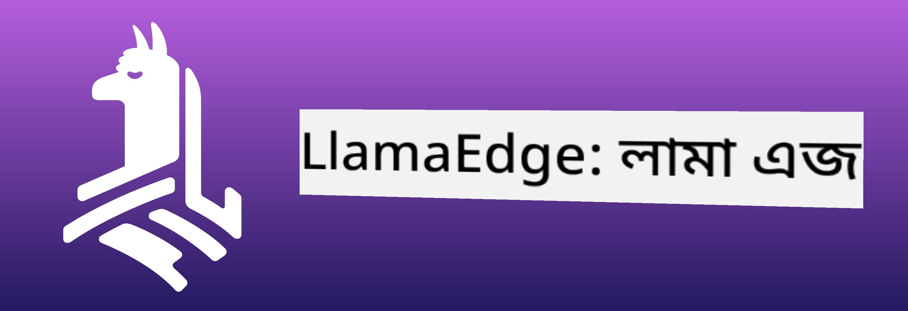
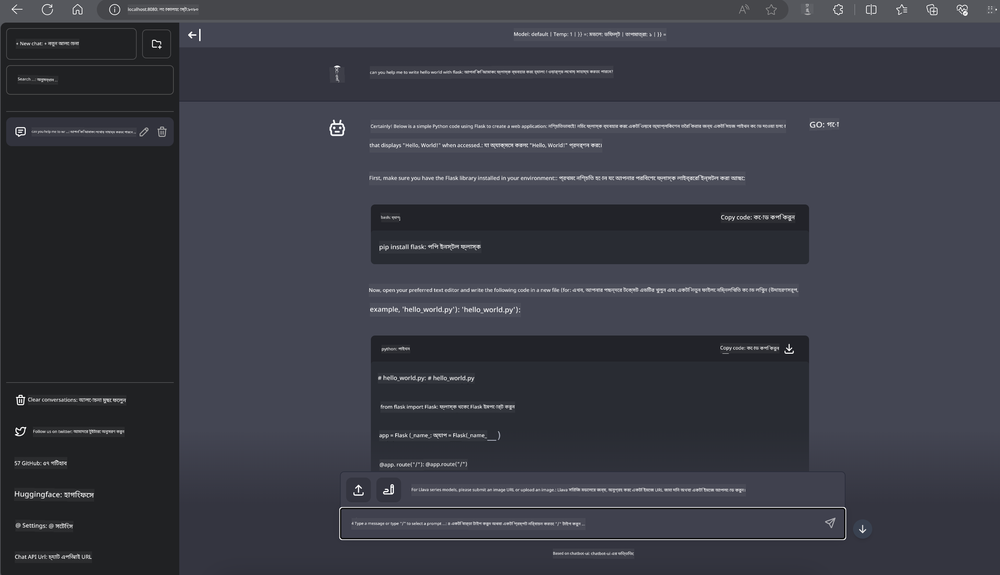

<!--
CO_OP_TRANSLATOR_METADATA:
{
  "original_hash": "be4101a30d98e95a71d42c276e8bcd37",
  "translation_date": "2025-05-09T11:32:17+00:00",
  "source_file": "md/01.Introduction/03/Jetson_Inference.md",
  "language_code": "bn"
}
-->
# **Nvidia Jetson-এ Inference Phi-3**

Nvidia Jetson হল Nvidia-এর একটি এমবেডেড কম্পিউটিং বোর্ড সিরিজ। Jetson TK1, TX1 এবং TX2 মডেলগুলোতে Nvidia-এর Tegra প্রসেসর (বা SoC) থাকে, যা ARM আর্কিটেকচারের সেন্ট্রাল প্রসেসিং ইউনিট (CPU) একত্রিত করে। Jetson একটি কম পাওয়ার সিস্টেম এবং মেশিন লার্নিং অ্যাপ্লিকেশন দ্রুততর করার জন্য ডিজাইন করা হয়েছে। Nvidia Jetson পেশাদার ডেভেলপাররা বিভিন্ন শিল্পে অগ্রণী AI পণ্য তৈরি করতে ব্যবহার করেন, এবং ছাত্র ও উৎসাহী ব্যক্তিরা হাতে-কলমে AI শেখা এবং অসাধারণ প্রকল্প তৈরির জন্য ব্যবহার করেন। SLM Jetson-এর মতো এজ ডিভাইসগুলোতে মোতায়েন করা হয়, যা শিল্পভিত্তিক জেনারেটিভ AI অ্যাপ্লিকেশন পরিস্থিতি আরও ভালোভাবে বাস্তবায়নে সক্ষম করে।

## NVIDIA Jetson-এ মোতায়েন:
স্বায়ত্তশাসিত রোবোটিক্স এবং এমবেডেড ডিভাইস নিয়ে কাজ করা ডেভেলপাররা Phi-3 Mini ব্যবহার করতে পারেন। Phi-3 এর অপেক্ষাকৃত ছোট আকার এটিকে এজ মোতায়েনের জন্য আদর্শ করে তোলে। প্রশিক্ষণের সময় প্যারামিটারগুলো অত্যন্ত যত্ন সহকারে টিউন করা হয়েছে, যার ফলে প্রতিক্রিয়াগুলোর উচ্চ সঠিকতা নিশ্চিত হয়।

### TensorRT-LLM অপ্টিমাইজেশন:
NVIDIA-এর [TensorRT-LLM লাইব্রেরি](https://github.com/NVIDIA/TensorRT-LLM?WT.mc_id=aiml-138114-kinfeylo) বড় ভাষা মডেলের ইনফারেন্স অপ্টিমাইজ করে। এটি Phi-3 Mini-এর দীর্ঘ কনটেক্সট উইন্ডোকে সমর্থন করে, যা থ্রুপুট এবং লেটেন্সি উভয়ই উন্নত করে। অপ্টিমাইজেশনের মধ্যে LongRoPE, FP8, এবং ইনফ্লাইট ব্যাচিং এর মত প্রযুক্তি অন্তর্ভুক্ত।

### উপলব্ধতা এবং মোতায়েন:
ডেভেলপাররা Phi-3 Mini 128K কনটেক্সট উইন্ডো সহ [NVIDIA-এর AI](https://www.nvidia.com/en-us/ai-data-science/generative-ai/) এ পরীক্ষা করতে পারেন। এটি NVIDIA NIM হিসাবে প্যাকেজ করা হয়েছে, যা একটি মাইক্রোসার্ভিস এবং স্ট্যান্ডার্ড API সহ যে কোনও স্থানে মোতায়েনযোগ্য। এছাড়াও, [GitHub-এ TensorRT-LLM বাস্তবায়নগুলি](https://github.com/NVIDIA/TensorRT-LLM) পাওয়া যায়।

## **১. প্রস্তুতি**

a. Jetson Orin NX / Jetson NX

b. JetPack 5.1.2+

c. Cuda 11.8

d. Python 3.8+

## **২. Jetson-এ Phi-3 চালানো**

আমরা [Ollama](https://ollama.com) অথবা [LlamaEdge](https://llamaedge.com) বেছে নিতে পারি।

আপনি যদি একই সময়ে ক্লাউড এবং এজ ডিভাইসে gguf ব্যবহার করতে চান, তাহলে LlamaEdge কে WasmEdge হিসেবে বোঝা যেতে পারে (WasmEdge একটি হালকা, উচ্চ কর্মক্ষমতা সম্পন্ন, স্কেলেবল WebAssembly রানটাইম যা ক্লাউড নেটিভ, এজ এবং বিকেন্দ্রীকৃত অ্যাপ্লিকেশনের জন্য উপযোগী। এটি সার্ভারলেস অ্যাপ্লিকেশন, এমবেডেড ফাংশন, মাইক্রোসার্ভিস, স্মার্ট কন্ট্র্যাক্ট এবং IoT ডিভাইসকে সমর্থন করে। আপনি LlamaEdge-এর মাধ্যমে gguf এর কোয়ান্টিটেটিভ মডেল এজ ডিভাইস এবং ক্লাউড উভয় জায়গায় মোতায়েন করতে পারেন।)



ব্যবহারের ধাপগুলো নিচে দেওয়া হলো:

1. সংশ্লিষ্ট লাইব্রেরি এবং ফাইলগুলি ইনস্টল ও ডাউনলোড করুন

```bash

curl -sSf https://raw.githubusercontent.com/WasmEdge/WasmEdge/master/utils/install.sh | bash -s -- --plugin wasi_nn-ggml

curl -LO https://github.com/LlamaEdge/LlamaEdge/releases/latest/download/llama-api-server.wasm

curl -LO https://github.com/LlamaEdge/chatbot-ui/releases/latest/download/chatbot-ui.tar.gz

tar xzf chatbot-ui.tar.gz

```

**Note**: llama-api-server.wasm এবং chatbot-ui একই ডিরেক্টরিতে থাকতে হবে

2. টার্মিনালে স্ক্রিপ্টগুলো চালান

```bash

wasmedge --dir .:. --nn-preload default:GGML:AUTO:{Your gguf path} llama-api-server.wasm -p phi-3-chat

```

এখানে চালানোর ফলাফল দেখানো হলো



***নমুনা কোড*** [Phi-3 mini WASM Notebook Sample](https://github.com/Azure-Samples/Phi-3MiniSamples/tree/main/wasm)

সংক্ষেপে, Phi-3 Mini ভাষা মডেলিংয়ে একটি বড় অগ্রগতি প্রতিনিধিত্ব করে, যা দক্ষতা, প্রসঙ্গ সচেতনতা এবং NVIDIA-এর অপ্টিমাইজেশন ক্ষমতা একত্রিত করে। আপনি রোবট তৈরি করুন বা এজ অ্যাপ্লিকেশন, Phi-3 Mini একটি শক্তিশালী টুল যা জানা জরুরি।

**অস্বীকৃতি**:  
এই নথিটি AI অনুবাদ সেবা [Co-op Translator](https://github.com/Azure/co-op-translator) ব্যবহার করে অনূদিত হয়েছে। আমরা যথাসাধ্য সঠিকতার চেষ্টা করি, তবে স্বয়ংক্রিয় অনুবাদে ত্রুটি বা অসঙ্গতি থাকতে পারে। মূল নথিটি তার নিজ ভাষায়ই সর্বোত্তম এবং নির্ভরযোগ্য উৎস হিসেবে বিবেচিত হওয়া উচিত। গুরুত্বপূর্ণ তথ্যের জন্য পেশাদার মানব অনুবাদ গ্রহণ করা উচিত। এই অনুবাদের ব্যবহারে সৃষ্ট কোনো ভুল বোঝাবুঝি বা ভুল ব্যাখ্যার জন্য আমরা দায়ী নই।