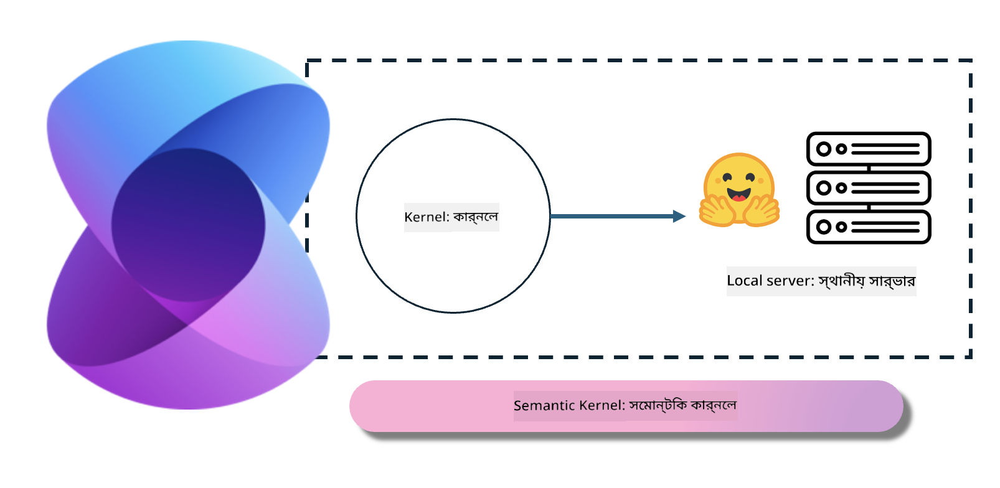
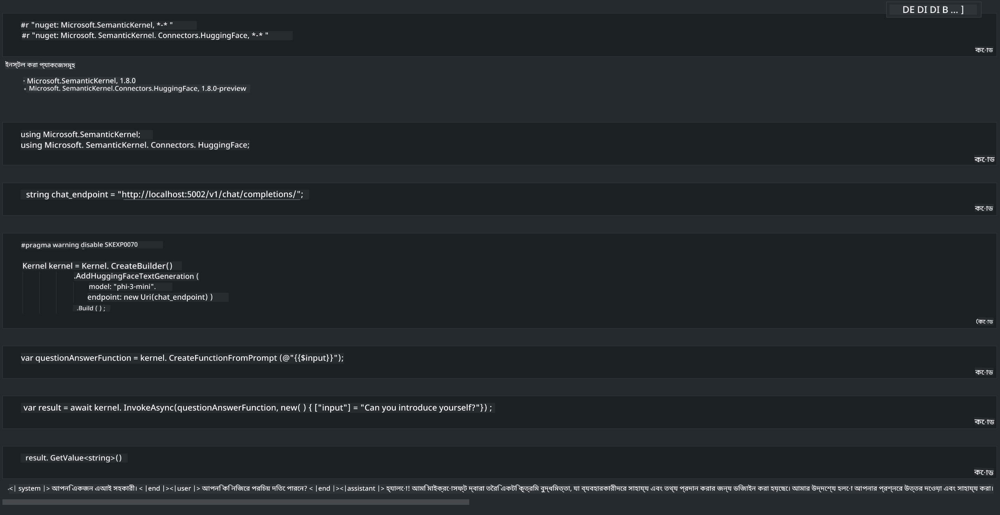

<!--
CO_OP_TRANSLATOR_METADATA:
{
  "original_hash": "bcf5dd7031db0031abdb9dd0c05ba118",
  "translation_date": "2025-05-09T12:01:46+00:00",
  "source_file": "md/01.Introduction/03/Local_Server_Inference.md",
  "language_code": "bn"
}
-->
# **লোকাল সার্ভারে Inference Phi-3**

আমরা Phi-3 লোকাল সার্ভারে ডিপ্লয় করতে পারি। ব্যবহারকারীরা [Ollama](https://ollama.com) বা [LM Studio](https://llamaedge.com) সলিউশন বেছে নিতে পারেন, অথবা তারা নিজস্ব কোড লিখতে পারেন। Phi-3-এর লোকাল সার্ভিসগুলো [Semantic Kernel](https://github.com/microsoft/semantic-kernel?WT.mc_id=aiml-138114-kinfeylo) বা [Langchain](https://www.langchain.com/) এর মাধ্যমে কানেক্ট করে Copilot অ্যাপ্লিকেশন তৈরি করা যায়।

## **Phi-3-mini অ্যাক্সেস করতে Semantic Kernel ব্যবহার করুন**

Copilot অ্যাপ্লিকেশনে, আমরা Semantic Kernel / LangChain ব্যবহার করে অ্যাপ্লিকেশন তৈরি করি। এই ধরনের অ্যাপ্লিকেশন ফ্রেমওয়ার্ক সাধারণত Azure OpenAI Service / OpenAI মডেলগুলোর সাথে সামঞ্জস্যপূর্ণ, এবং Hugging Face-এর ওপেন সোর্স মডেল এবং লোকাল মডেলগুলোকেও সাপোর্ট করে। যদি আমরা Phi-3-mini অ্যাক্সেস করতে Semantic Kernel ব্যবহার করতে চাই তাহলে কী করব? .NET উদাহরণ হিসেবে ধরে, আমরা এটি Semantic Kernel-এর Hugging Face Connector-এর সঙ্গে যুক্ত করতে পারি। ডিফল্ট হিসেবে, এটি Hugging Face-এর মডেল আইডির সঙ্গে মিলে যায় (প্রথমবার ব্যবহার করলে মডেলটি Hugging Face থেকে ডাউনলোড হবে, যা সময়সাপেক্ষ)। এছাড়াও আপনি নিজে নির্মিত লোকাল সার্ভিসের সঙ্গে কানেক্ট করতে পারেন। এই দুইটির মধ্যে আমরা শেষটিকে প্রাধান্য দিই কারণ এতে স্বনির্ভরতার মাত্রা বেশি, বিশেষ করে এন্টারপ্রাইজ অ্যাপ্লিকেশনে।

চিত্র থেকে দেখা যাচ্ছে Semantic Kernel-এর মাধ্যমে লোকাল সার্ভিসে সহজেই নিজের তৈরি Phi-3-mini মডেল সার্ভারে কানেক্ট করা যায়। নিচে রানিং ফলাফল দেওয়া হলো

***Sample Code*** https://github.com/kinfey/Phi3MiniSamples/tree/main/semantickernel

**অস্বীকারোক্তি**:  
এই নথিটি AI অনুবাদ সেবা [Co-op Translator](https://github.com/Azure/co-op-translator) ব্যবহার করে অনূদিত হয়েছে। আমরা যথাসাধ্য সঠিকতার চেষ্টা করি, তবে স্বয়ংক্রিয় অনুবাদে ত্রুটি বা অসঙ্গতি থাকতে পারে। মূল নথিটি তার নিজস্ব ভাষায়ই সর্বোচ্চ বিশ্বাসযোগ্য উৎস হিসেবে বিবেচনা করা উচিত। গুরুত্বপূর্ণ তথ্যের জন্য পেশাদার মানুষের অনুবাদ গ্রহণ করার পরামর্শ দেওয়া হয়। এই অনুবাদের ব্যবহার থেকে সৃষ্ট কোনো ভুল বোঝাবুঝি বা ভুল ব্যাখ্যার জন্য আমরা দায়ী নই।