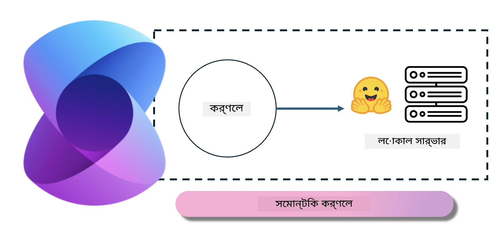
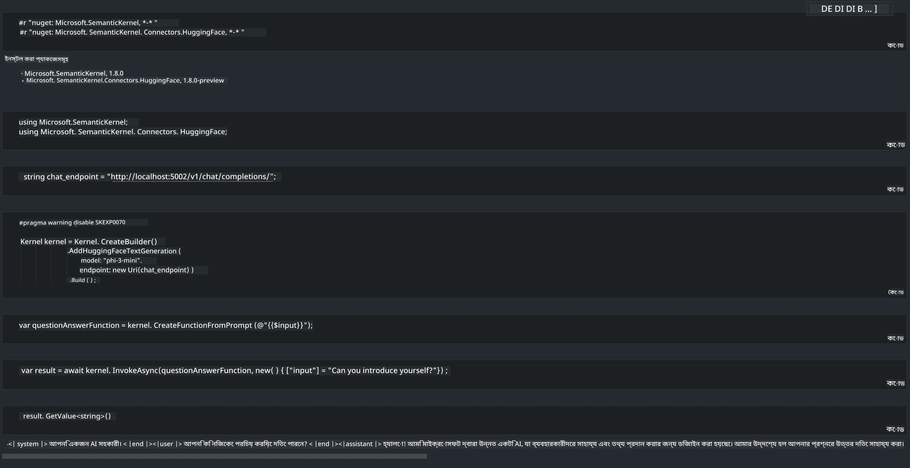

<!--
CO_OP_TRANSLATOR_METADATA:
{
  "original_hash": "bcf5dd7031db0031abdb9dd0c05ba118",
  "translation_date": "2025-07-16T20:56:18+00:00",
  "source_file": "md/01.Introduction/03/Local_Server_Inference.md",
  "language_code": "bn"
}
-->
# **লোকাল সার্ভারে Inference Phi-3**

আমরা Phi-3 লোকাল সার্ভারে ডিপ্লয় করতে পারি। ব্যবহারকারীরা [Ollama](https://ollama.com) বা [LM Studio](https://llamaedge.com) সলিউশন বেছে নিতে পারেন, অথবা তারা নিজেই কোড লিখতে পারেন। Phi-3 এর লোকাল সার্ভিসগুলোকে [Semantic Kernel](https://github.com/microsoft/semantic-kernel?WT.mc_id=aiml-138114-kinfeylo) বা [Langchain](https://www.langchain.com/) এর মাধ্যমে সংযুক্ত করে Copilot অ্যাপ্লিকেশন তৈরি করা যায়।

## **Phi-3-mini অ্যাক্সেস করার জন্য Semantic Kernel ব্যবহার করুন**

Copilot অ্যাপ্লিকেশনে, আমরা Semantic Kernel / LangChain এর মাধ্যমে অ্যাপ্লিকেশন তৈরি করি। এই ধরনের অ্যাপ্লিকেশন ফ্রেমওয়ার্ক সাধারণত Azure OpenAI Service / OpenAI মডেলগুলোর সাথে সামঞ্জস্যপূর্ণ, এবং Hugging Face এর ওপেন সোর্স মডেল এবং লোকাল মডেলগুলোকেও সাপোর্ট করতে পারে। যদি আমরা Semantic Kernel ব্যবহার করে Phi-3-mini অ্যাক্সেস করতে চাই, তাহলে কী করা উচিত? .NET উদাহরণ হিসেবে নিয়ে, আমরা এটিকে Semantic Kernel এর Hugging Face Connector এর সাথে মিলিয়ে ব্যবহার করতে পারি। ডিফল্ট হিসেবে, এটি Hugging Face এর মডেল আইডির সাথে মিলে যায় (প্রথমবার ব্যবহার করলে মডেলটি Hugging Face থেকে ডাউনলোড হবে, যা কিছুটা সময় নেয়)। এছাড়াও, আপনি নিজে তৈরি করা লোকাল সার্ভিসের সাথে সংযুক্ত হতে পারেন। এই দুইটির মধ্যে তুলনা করলে, আমরা পরেরটি ব্যবহার করার পরামর্শ দিই কারণ এতে স্বায়ত্তশাসনের মাত্রা বেশি থাকে, বিশেষ করে এন্টারপ্রাইজ অ্যাপ্লিকেশনগুলোর ক্ষেত্রে।

চিত্র থেকে দেখা যাচ্ছে, Semantic Kernel এর মাধ্যমে লোকাল সার্ভিস অ্যাক্সেস করে সহজেই নিজে তৈরি করা Phi-3-mini মডেল সার্ভারের সাথে সংযোগ করা যায়। নিচে রানিং ফলাফল দেওয়া হলো।

***Sample Code*** https://github.com/kinfey/Phi3MiniSamples/tree/main/semantickernel

**অস্বীকৃতি**:  
এই নথিটি AI অনুবাদ সেবা [Co-op Translator](https://github.com/Azure/co-op-translator) ব্যবহার করে অনূদিত হয়েছে। আমরা যথাসাধ্য সঠিকতার চেষ্টা করি, তবে স্বয়ংক্রিয় অনুবাদে ত্রুটি বা অসঙ্গতি থাকতে পারে। মূল নথিটি তার নিজস্ব ভাষায়ই কর্তৃত্বপূর্ণ উৎস হিসেবে বিবেচিত হওয়া উচিত। গুরুত্বপূর্ণ তথ্যের জন্য পেশাদার মানব অনুবাদ গ্রহণ করার পরামর্শ দেওয়া হয়। এই অনুবাদের ব্যবহারে সৃষ্ট কোনো ভুল বোঝাবুঝি বা ভুল ব্যাখ্যার জন্য আমরা দায়ী নই।