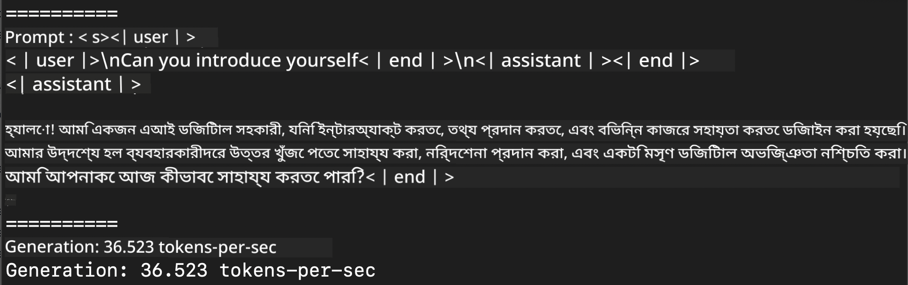
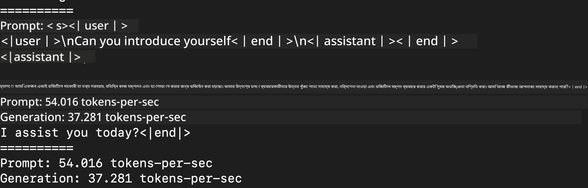
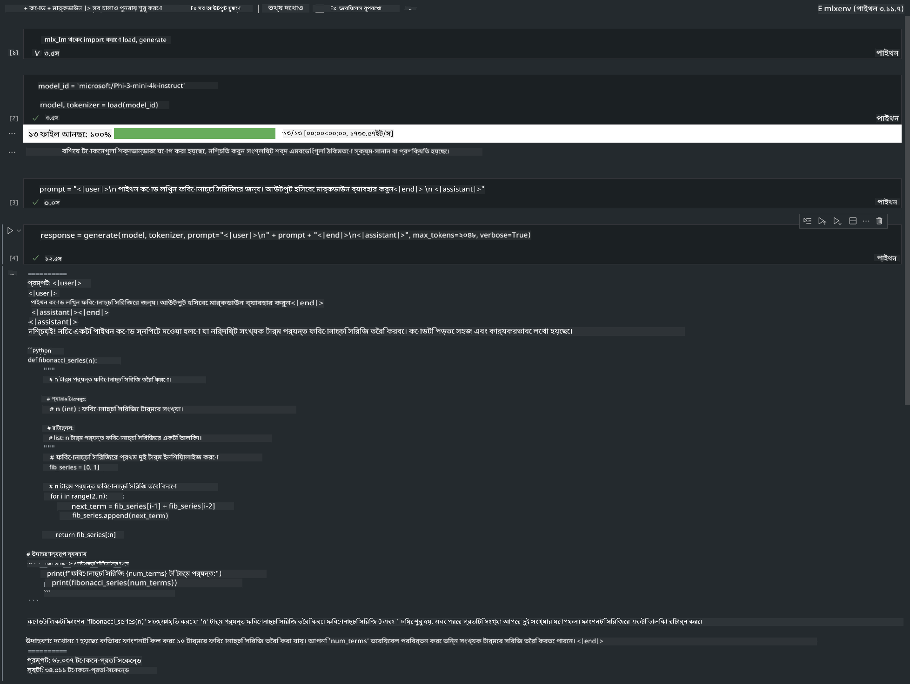

<!--
CO_OP_TRANSLATOR_METADATA:
{
  "original_hash": "dcb656f3d206fc4968e236deec5d4384",
  "translation_date": "2025-05-09T12:10:10+00:00",
  "source_file": "md/01.Introduction/03/MLX_Inference.md",
  "language_code": "bn"
}
-->
# **Inference Phi-3 with Apple MLX Framework**

## **MLX Framework কী**

MLX হলো Apple সিলিকনের জন্য একটি অ্যারে ফ্রেমওয়ার্ক, যা Apple মেশিন লার্নিং রিসার্চ থেকে এসেছে।

MLX মেশিন লার্নিং গবেষকদের জন্য মেশিন লার্নিং গবেষকদের দ্বারা ডিজাইন করা হয়েছে। ফ্রেমওয়ার্কটি ব্যবহারকারী বান্ধব হওয়ার পাশাপাশি মডেল ট্রেনিং এবং ডিপ্লয়মেন্টে কার্যকর। ফ্রেমওয়ার্কের ডিজাইন নিজেই ধারণাগতভাবে সহজ। আমরা গবেষকদের জন্য MLX সম্প্রসারণ এবং উন্নত করা সহজ করতে চাই, যাতে দ্রুত নতুন ধারণা অনুসন্ধান করা যায়।

Apple Silicon ডিভাইসগুলোতে MLX এর মাধ্যমে LLM গুলো দ্রুততর করা যায়, এবং মডেলগুলো স্থানীয়ভাবে খুব সহজে চালানো যায়।

## **MLX ব্যবহার করে Phi-3-mini inference করা**

### **১. আপনার MLX পরিবেশ সেটআপ করুন**

1. Python 3.11.x
2. MLX লাইব্রেরি ইনস্টল করুন


```bash

pip install mlx-lm

```

### **২. টার্মিনালে MLX দিয়ে Phi-3-mini চালানো**


```bash

python -m mlx_lm.generate --model microsoft/Phi-3-mini-4k-instruct --max-token 2048 --prompt  "<|user|>\nCan you introduce yourself<|end|>\n<|assistant|>"

```

ফলাফল (আমার পরিবেশ Apple M1 Max, 64GB) হলো



### **৩. টার্মিনালে MLX দিয়ে Phi-3-mini কোয়ান্টাইজেশন করা**


```bash

python -m mlx_lm.convert --hf-path microsoft/Phi-3-mini-4k-instruct

```

***Note：*** মডেল mlx_lm.convert দিয়ে কোয়ান্টাইজ করা যায়, এবং ডিফল্ট কোয়ান্টাইজেশন হলো INT4। এই উদাহরণে Phi-3-mini কে INT4 তে কোয়ান্টাইজ করা হয়েছে।

মডেল mlx_lm.convert দিয়ে কোয়ান্টাইজ করা যায়, এবং ডিফল্ট কোয়ান্টাইজেশন INT4। এই উদাহরণে Phi-3-mini কে INT4 তে কোয়ান্টাইজ করা হয়েছে। কোয়ান্টাইজ করার পর এটি ডিফল্ট ডিরেক্টরি ./mlx_model এ সংরক্ষিত হবে।

টার্মিনাল থেকে MLX দিয়ে কোয়ান্টাইজ করা মডেল পরীক্ষা করা যায়


```bash

python -m mlx_lm.generate --model ./mlx_model/ --max-token 2048 --prompt  "<|user|>\nCan you introduce yourself<|end|>\n<|assistant|>"

```

ফলাফল হলো




### **৪. Jupyter Notebook এ MLX দিয়ে Phi-3-mini চালানো**




***Note:*** এই স্যাম্পলটি পড়ুন [click this link](../../../../../code/03.Inference/MLX/MLX_DEMO.ipynb)


## **উৎসসমূহ**

1. Apple MLX Framework সম্পর্কে জানুন [https://ml-explore.github.io](https://ml-explore.github.io/mlx/build/html/index.html)

2. Apple MLX GitHub Repo [https://github.com/ml-explore](https://github.com/ml-explore)

**অস্বীকৃতি**:  
এই নথিটি AI অনুবাদ সেবা [Co-op Translator](https://github.com/Azure/co-op-translator) ব্যবহার করে অনূদিত হয়েছে। আমরা যথাসাধ্য সঠিকতার জন্য চেষ্টা করি, তবে স্বয়ংক্রিয় অনুবাদে ভুল বা অমিল থাকতে পারে। মূল নথিটি তার নিজস্ব ভাষায় প্রামাণিক উৎস হিসেবে বিবেচনা করা উচিত। গুরুত্বপূর্ণ তথ্যের জন্য পেশাদার মানব অনুবাদের পরামর্শ দেওয়া হয়। এই অনুবাদের ব্যবহার থেকে উদ্ভূত কোনো ভুল বোঝাবুঝি বা ভুল ব্যাখ্যার জন্য আমরা দায়ী নই।