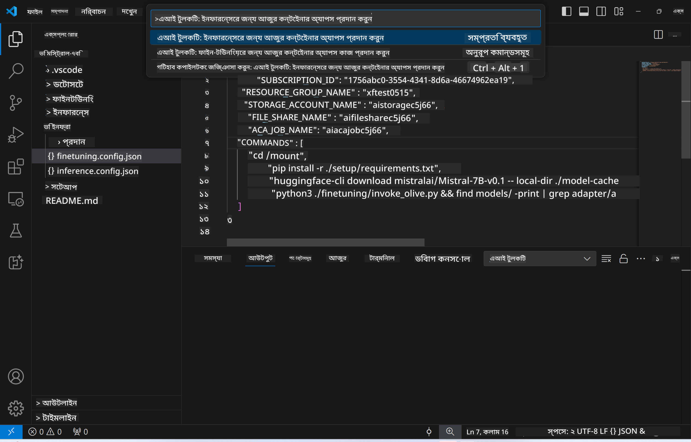
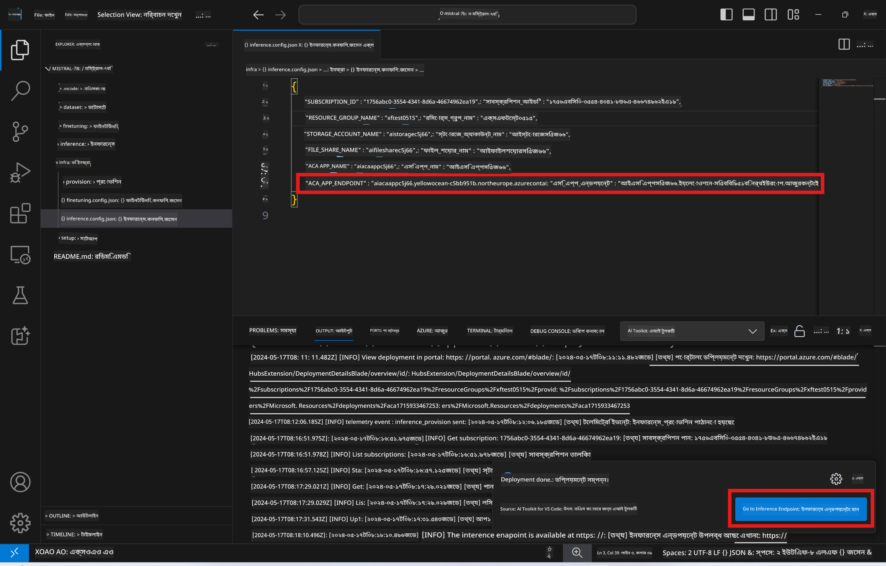

<!--
CO_OP_TRANSLATOR_METADATA:
{
  "original_hash": "a54cd3d65b6963e4e8ce21e143c3ab04",
  "translation_date": "2025-07-16T21:17:05+00:00",
  "source_file": "md/01.Introduction/03/Remote_Interence.md",
  "language_code": "bn"
}
-->
# ফাইন-টিউন করা মডেলের সাথে রিমোট ইনফারেন্স

অ্যাডাপ্টারগুলো রিমোট পরিবেশে প্রশিক্ষিত হওয়ার পর, মডেলের সাথে ইন্টারঅ্যাক্ট করার জন্য একটি সহজ Gradio অ্যাপ্লিকেশন ব্যবহার করুন।


### Azure রিসোর্স প্রোভিশন করা  
রিমোট ইনফারেন্সের জন্য Azure রিসোর্স সেটআপ করতে কমান্ড প্যালেট থেকে `AI Toolkit: Provision Azure Container Apps for inference` চালান। এই সেটআপের সময় আপনাকে আপনার Azure সাবস্ক্রিপশন এবং রিসোর্স গ্রুপ নির্বাচন করতে বলা হবে।  


ডিফল্টভাবে, ইনফারেন্সের জন্য সাবস্ক্রিপশন এবং রিসোর্স গ্রুপ ফাইন-টিউনিংয়ের জন্য ব্যবহৃত সেটির সাথে মিলে যাবে। ইনফারেন্স একই Azure Container App Environment ব্যবহার করবে এবং মডেল ও মডেল অ্যাডাপ্টার অ্যাক্সেস করবে যা Azure Files-এ সংরক্ষিত, যা ফাইন-টিউনিং ধাপে তৈরি হয়েছিল।

## AI Toolkit ব্যবহার

### ইনফারেন্সের জন্য ডিপ্লয়মেন্ট  
যদি আপনি ইনফারেন্স কোড সংশোধন করতে চান বা ইনফারেন্স মডেল পুনরায় লোড করতে চান, তাহলে `AI Toolkit: Deploy for inference` কমান্ডটি চালান। এটি আপনার সর্বশেষ কোড ACA-র সাথে সিঙ্ক্রোনাইজ করবে এবং রেপ্লিকা রিস্টার্ট করবে।


ডিপ্লয়মেন্ট সফলভাবে সম্পন্ন হওয়ার পর, মডেলটি এই এন্ডপয়েন্ট ব্যবহার করে মূল্যায়নের জন্য প্রস্তুত।

### ইনফারেন্স API-তে অ্যাক্সেস

VSCode নোটিফিকেশনে প্রদর্শিত "*Go to Inference Endpoint*" বোতামে ক্লিক করে আপনি ইনফারেন্স API-তে প্রবেশ করতে পারেন। বিকল্পভাবে, ওয়েব API এন্ডপয়েন্ট `ACA_APP_ENDPOINT`-এ পাওয়া যাবে `./infra/inference.config.json` ফাইলে এবং আউটপুট প্যানেলে।



> **Note:** ইনফারেন্স এন্ডপয়েন্ট সম্পূর্ণ কার্যকর হতে কয়েক মিনিট সময় নিতে পারে।

## টেমপ্লেটে অন্তর্ভুক্ত ইনফারেন্স কম্পোনেন্টসমূহ

| ফোল্ডার | বিষয়বস্তু |
| ------ |--------- |
| `infra` | রিমোট অপারেশনের জন্য প্রয়োজনীয় সব কনফিগারেশন ধারণ করে। |
| `infra/provision/inference.parameters.json` | বেসিক টেমপ্লেটের জন্য প্যারামিটার ধারণ করে, যা ইনফারেন্সের জন্য Azure রিসোর্স প্রোভিশনের কাজে লাগে। |
| `infra/provision/inference.bicep` | ইনফারেন্সের জন্য Azure রিসোর্স প্রোভিশনের টেমপ্লেট ধারণ করে। |
| `infra/inference.config.json` | `AI Toolkit: Provision Azure Container Apps for inference` কমান্ড দ্বারা তৈরি কনফিগারেশন ফাইল। এটি অন্যান্য রিমোট কমান্ড প্যালেটের ইনপুট হিসেবে ব্যবহৃত হয়। |

### Azure রিসোর্স প্রোভিশন কনফিগার করতে AI Toolkit ব্যবহার  
[AI Toolkit](https://marketplace.visualstudio.com/items?itemName=ms-windows-ai-studio.windows-ai-studio) কনফিগার করুন।

`Provision Azure Container Apps for inference` কমান্ড চালান।

কনফিগারেশন প্যারামিটারগুলো `./infra/provision/inference.parameters.json` ফাইলে পাওয়া যাবে। বিস্তারিত নিচে দেওয়া হলো:

| প্যারামিটার | বর্ণনা |
| --------- |------------ |
| `defaultCommands` | ওয়েব API শুরু করার জন্য কমান্ড। |
| `maximumInstanceCount` | GPU ইনস্ট্যান্সের সর্বোচ্চ ক্ষমতা নির্ধারণ করে। |
| `location` | Azure রিসোর্স প্রোভিশনের অবস্থান। ডিফল্ট মান নির্বাচিত রিসোর্স গ্রুপের অবস্থানের সাথে মিলে। |
| `storageAccountName`, `fileShareName`, `acaEnvironmentName`, `acaEnvironmentStorageName`, `acaAppName`, `acaLogAnalyticsName` | প্রোভিশনের জন্য Azure রিসোর্সের নামকরণের প্যারামিটার। ডিফল্টভাবে এগুলো ফাইন-টিউনিং রিসোর্সের নামের সাথে একই হবে। আপনি নতুন, ব্যবহার না করা নাম দিতে পারেন অথবা বিদ্যমান Azure রিসোর্সের নাম দিতে পারেন যদি আপনি সেগুলো ব্যবহার করতে চান। বিস্তারিত জানতে [Using existing Azure Resources](../../../../../md/01.Introduction/03) অংশ দেখুন। |

### বিদ্যমান Azure রিসোর্স ব্যবহার

ডিফল্টভাবে, ইনফারেন্স প্রোভিশন ফাইন-টিউনিংয়ের জন্য ব্যবহৃত একই Azure Container App Environment, Storage Account, Azure File Share, এবং Azure Log Analytics ব্যবহার করে। ইনফারেন্স API-এর জন্য আলাদা Azure Container App তৈরি করা হয়।

যদি আপনি ফাইন-টিউনিং ধাপে Azure রিসোর্স কাস্টমাইজ করে থাকেন বা ইনফারেন্সের জন্য আপনার নিজস্ব বিদ্যমান Azure রিসোর্স ব্যবহার করতে চান, তাহলে তাদের নাম `./infra/inference.parameters.json` ফাইলে উল্লেখ করুন। এরপর কমান্ড প্যালেট থেকে `AI Toolkit: Provision Azure Container Apps for inference` কমান্ড চালান। এটি নির্দিষ্ট রিসোর্সগুলো আপডেট করবে এবং যেগুলো অনুপস্থিত সেগুলো তৈরি করবে।

উদাহরণস্বরূপ, যদি আপনার বিদ্যমান Azure container environment থাকে, তাহলে আপনার `./infra/finetuning.parameters.json` এরকম দেখাবে:

```json
{
    "$schema": "https://schema.management.azure.com/schemas/2019-04-01/deploymentParameters.json#",
    "contentVersion": "1.0.0.0",
    "parameters": {
      ...
      "acaEnvironmentName": {
        "value": "<your-aca-env-name>"
      },
      "acaEnvironmentStorageName": {
        "value": null
      },
      ...
    }
  }
```

### ম্যানুয়াল প্রোভিশন  
যদি আপনি ম্যানুয়ালি Azure রিসোর্স কনফিগার করতে চান, তাহলে `./infra/provision` ফোল্ডারে থাকা বেসিক ফাইলগুলো ব্যবহার করতে পারেন। যদি আপনি AI Toolkit কমান্ড প্যালেট ব্যবহার না করে ইতিমধ্যে সব Azure রিসোর্স সেটআপ ও কনফিগার করে থাকেন, তাহলে শুধু `inference.config.json` ফাইলে রিসোর্সের নামগুলো লিখে দিন।

উদাহরণস্বরূপ:

```json
{
  "SUBSCRIPTION_ID": "<your-subscription-id>",
  "RESOURCE_GROUP_NAME": "<your-resource-group-name>",
  "STORAGE_ACCOUNT_NAME": "<your-storage-account-name>",
  "FILE_SHARE_NAME": "<your-file-share-name>",
  "ACA_APP_NAME": "<your-aca-name>",
  "ACA_APP_ENDPOINT": "<your-aca-endpoint>"
}
```

**অস্বীকৃতি**:  
এই নথিটি AI অনুবাদ সেবা [Co-op Translator](https://github.com/Azure/co-op-translator) ব্যবহার করে অনূদিত হয়েছে। আমরা যথাসাধ্য সঠিকতার চেষ্টা করি, তবে স্বয়ংক্রিয় অনুবাদে ত্রুটি বা অসঙ্গতি থাকতে পারে। মূল নথিটি তার নিজস্ব ভাষায়ই কর্তৃত্বপূর্ণ উৎস হিসেবে বিবেচিত হওয়া উচিত। গুরুত্বপূর্ণ তথ্যের জন্য পেশাদার মানব অনুবাদ গ্রহণ করার পরামর্শ দেওয়া হয়। এই অনুবাদের ব্যবহারে সৃষ্ট কোনো ভুল বোঝাবুঝি বা ভুল ব্যাখ্যার জন্য আমরা দায়ী নই।