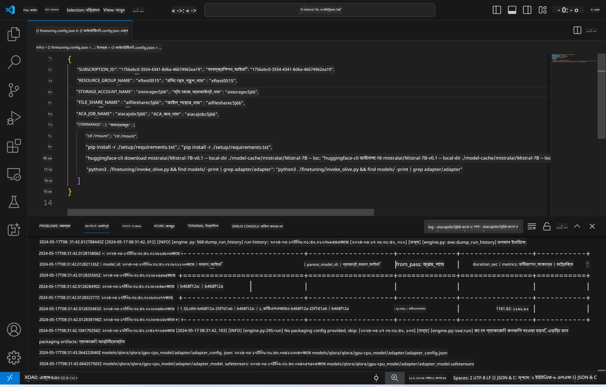
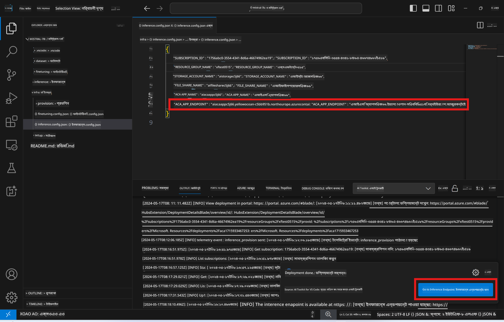

<!--
CO_OP_TRANSLATOR_METADATA:
{
  "original_hash": "a54cd3d65b6963e4e8ce21e143c3ab04",
  "translation_date": "2025-05-09T12:35:07+00:00",
  "source_file": "md/01.Introduction/03/Remote_Interence.md",
  "language_code": "bn"
}
-->
# ফাইন-টিউন করা মডেলের সাথে রিমোট ইনফারেন্সিং

অ্যাডাপ্টারগুলি রিমোট পরিবেশে প্রশিক্ষিত হওয়ার পরে, মডেলের সাথে ইন্টারঅ্যাক্ট করতে একটি সহজ Gradio অ্যাপ্লিকেশন ব্যবহার করুন।



### Azure রিসোর্স প্রোভিশন করা
রিমোট ইনফারেন্সের জন্য Azure রিসোর্স সেটআপ করতে আপনাকে কমান্ড প্যালেট থেকে `AI Toolkit: Provision Azure Container Apps for inference` চালাতে হবে। এই সেটআপের সময় আপনাকে আপনার Azure Subscription এবং resource group নির্বাচন করতে বলা হবে।  

   
ডিফল্টভাবে, ইনফারেন্সের জন্য সাবস্ক্রিপশন এবং রিসোর্স গ্রুপ ফাইন-টিউনিংয়ের জন্য ব্যবহৃত সেটির সাথে মেলে। ইনফারেন্স একই Azure Container App Environment ব্যবহার করবে এবং Azure Files-এ সংরক্ষিত মডেল এবং মডেল অ্যাডাপ্টার অ্যাক্সেস করবে, যা ফাইন-টিউনিং ধাপে তৈরি হয়েছিল। 

## AI Toolkit ব্যবহার

### ইনফারেন্সের জন্য ডিপ্লয়মেন্ট  
যদি আপনি ইনফারেন্স কোড সংশোধন করতে বা ইনফারেন্স মডেল পুনরায় লোড করতে চান, তাহলে `AI Toolkit: Deploy for inference` কমান্ড চালান। এটি আপনার সর্বশেষ কোড ACA-এর সাথে সিঙ্ক্রোনাইজ করবে এবং রেপ্লিকা পুনরায় চালু করবে।  


ডিপ্লয়মেন্ট সফল হওয়ার পরে, মডেলটি এখন এই এন্ডপয়েন্ট ব্যবহার করে মূল্যায়নের জন্য প্রস্তুত।

### ইনফারেন্স API অ্যাক্সেস করা

VSCode নোটিফিকেশনে প্রদর্শিত "*Go to Inference Endpoint*" বাটনে ক্লিক করে আপনি ইনফারেন্স API অ্যাক্সেস করতে পারেন। বিকল্পভাবে, ওয়েব API এন্ডপয়েন্ট `ACA_APP_ENDPOINT` এর অধীনে `./infra/inference.config.json` এবং আউটপুট প্যানেলে পাওয়া যাবে।



> **Note:** ইনফারেন্স এন্ডপয়েন্ট পুরোপুরি কার্যকর হতে কয়েক মিনিট সময় নিতে পারে।

## টেমপ্লেটে অন্তর্ভুক্ত ইনফারেন্স উপাদানসমূহ
 
| ফোল্ডার | বিষয়বস্তু |
| ------ |--------- |
| `infra` | রিমোট অপারেশনের জন্য প্রয়োজনীয় সমস্ত কনফিগারেশন ধারণ করে। |
| `infra/provision/inference.parameters.json` | ইনফারেন্সের জন্য Azure রিসোর্স প্রোভিশন করার বেসিক টেমপ্লেটের প্যারামিটারগুলি ধারণ করে। |
| `infra/provision/inference.bicep` | ইনফারেন্সের জন্য Azure রিসোর্স প্রোভিশন করার টেমপ্লেটসমূহ ধারণ করে। |
| `infra/inference.config.json` | `AI Toolkit: Provision Azure Container Apps for inference` কমান্ড দ্বারা তৈরি কনফিগারেশন ফাইল। এটি অন্যান্য রিমোট কমান্ড প্যালেটের ইনপুট হিসেবে ব্যবহৃত হয়। |

### AI Toolkit ব্যবহার করে Azure Resource Provision কনফিগার করা
[AI Toolkit](https://marketplace.visualstudio.com/items?itemName=ms-windows-ai-studio.windows-ai-studio) কনফিগার করুন।

ইনফারেন্সের জন্য Azure Container Apps প্রোভিশন করুন` command.

You can find configuration parameters in `./infra/provision/inference.parameters.json` file. Here are the details:
| Parameter | Description |
| --------- |------------ |
| `defaultCommands` | This is the commands to initiate a web API. |
| `maximumInstanceCount` | This parameter sets the maximum capacity of GPU instances. |
| `location` | This is the location where Azure resources are provisioned. The default value is the same as the chosen resource group's location. |
| `storageAccountName`, `fileShareName` `acaEnvironmentName`, `acaEnvironmentStorageName`, `acaAppName`,  `acaLogAnalyticsName` | These parameters are used to name the Azure resources for provision. By default, they will be same to the fine-tuning resource name. You can input a new, unused resource name to create your own custom-named resources, or you can input the name of an already existing Azure resource if you'd prefer to use that. For details, refer to the section [Using existing Azure Resources](../../../../../md/01.Introduction/03). |

### Using Existing Azure Resources

By default, the inference provision use the same Azure Container App Environment, Storage Account, Azure File Share, and Azure Log Analytics that were used for fine-tuning. A separate Azure Container App is created solely for the inference API. 

If you have customized the Azure resources during the fine-tuning step or want to use your own existing Azure resources for inference, specify their names in the `./infra/inference.parameters.json` ফাইল। তারপর, কমান্ড প্যালেট থেকে `AI Toolkit: Provision Azure Container Apps for inference` কমান্ড চালান। এটি নির্দিষ্ট রিসোর্স আপডেট করবে এবং অনুপস্থিত রিসোর্স তৈরি করবে।

উদাহরণস্বরূপ, যদি আপনার একটি বিদ্যমান Azure container environment থাকে, তাহলে আপনার `./infra/finetuning.parameters.json` এর মতো হওয়া উচিত:

```json
{
    "$schema": "https://schema.management.azure.com/schemas/2019-04-01/deploymentParameters.json#",
    "contentVersion": "1.0.0.0",
    "parameters": {
      ...
      "acaEnvironmentName": {
        "value": "<your-aca-env-name>"
      },
      "acaEnvironmentStorageName": {
        "value": null
      },
      ...
    }
  }
```

### ম্যানুয়াল প্রোভিশন  
যদি আপনি Azure রিসোর্সগুলি ম্যানুয়ালি কনফিগার করতে চান, তাহলে আপনি `./infra/provision` folders. If you have already set up and configured all the Azure resources without using the AI Toolkit command palette, you can simply enter the resource names in the `inference.config.json` ফাইলে দেওয়া বেসিক ফাইলগুলি ব্যবহার করতে পারেন।

উদাহরণস্বরূপ:

```json
{
  "SUBSCRIPTION_ID": "<your-subscription-id>",
  "RESOURCE_GROUP_NAME": "<your-resource-group-name>",
  "STORAGE_ACCOUNT_NAME": "<your-storage-account-name>",
  "FILE_SHARE_NAME": "<your-file-share-name>",
  "ACA_APP_NAME": "<your-aca-name>",
  "ACA_APP_ENDPOINT": "<your-aca-endpoint>"
}
```

**দায়বদ্ধতা বিবৃতি**:  
এই নথিটি AI অনুবাদ সেবা [Co-op Translator](https://github.com/Azure/co-op-translator) ব্যবহার করে অনূদিত হয়েছে। আমরা যথাসাধ্য সঠিকতার চেষ্টা করি, তবে স্বয়ংক্রিয় অনুবাদে ত্রুটি বা ভুল থাকার সম্ভাবনা রয়েছে। মূল নথিটি তার নিজস্ব ভাষায়ই কর্তৃত্বপূর্ণ উৎস হিসেবে বিবেচিত হওয়া উচিত। গুরুত্বপূর্ণ তথ্যের জন্য পেশাদার মানব অনুবাদের পরামর্শ দেওয়া হয়। এই অনুবাদের ব্যবহারে সৃষ্ট কোনো ভুল বোঝাবুঝি বা ভুল ব্যাখ্যার জন্য আমরা দায়ী নই।