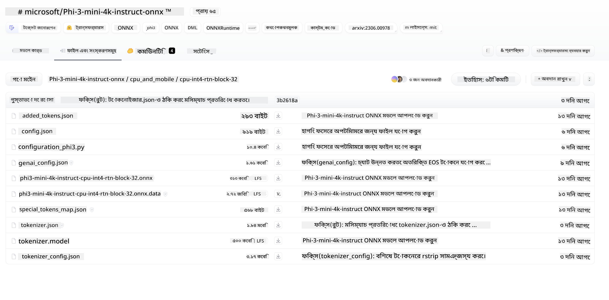
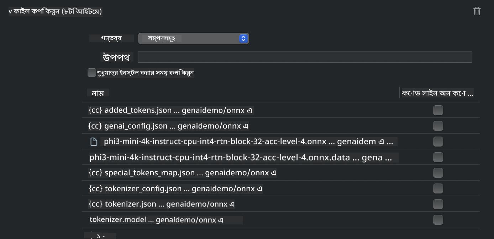
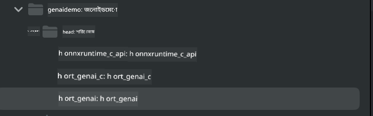
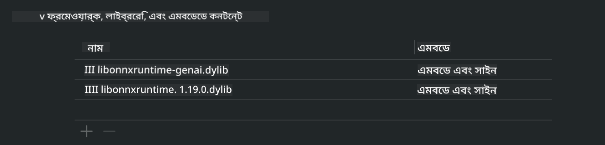
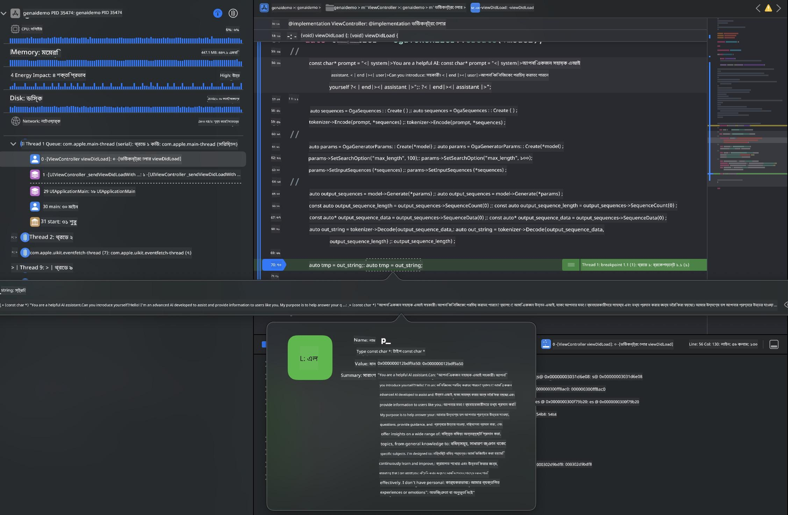

<!--
CO_OP_TRANSLATOR_METADATA:
{
  "original_hash": "82af197df38d25346a98f1f0e84d1698",
  "translation_date": "2025-07-16T20:19:48+00:00",
  "source_file": "md/01.Introduction/03/iOS_Inference.md",
  "language_code": "bn"
}
-->
# **iOS-এ Inference Phi-3**

Phi-3-mini হলো Microsoft-এর একটি নতুন মডেল সিরিজ যা এজ ডিভাইস এবং IoT ডিভাইসে Large Language Models (LLMs) ডিপ্লয়মেন্টের সুযোগ দেয়। Phi-3-mini iOS, Android, এবং Edge Device ডিপ্লয়মেন্টের জন্য উপলব্ধ, যা BYOD পরিবেশে generative AI ডিপ্লয়মেন্টকে সহজ করে তোলে। নিচের উদাহরণটি দেখায় কিভাবে iOS-এ Phi-3-mini ডিপ্লয় করবেন।

## **1. প্রস্তুতি**

- **a.** macOS 14+
- **b.** Xcode 15+
- **c.** iOS SDK 17.x (iPhone 14 A16 বা তার উপরে)
- **d.** Python 3.10+ ইনস্টল করুন (Conda ব্যবহার করার পরামর্শ দেওয়া হয়)
- **e.** Python লাইব্রেরি ইনস্টল করুন: `python-flatbuffers`
- **f.** CMake ইনস্টল করুন

### Semantic Kernel এবং Inference

Semantic Kernel একটি অ্যাপ্লিকেশন ফ্রেমওয়ার্ক যা Azure OpenAI Service, OpenAI মডেল এবং এমনকি লোকাল মডেলগুলোর সাথে সামঞ্জস্যপূর্ণ অ্যাপ তৈরি করতে দেয়। Semantic Kernel-এর মাধ্যমে লোকাল সার্ভিস অ্যাক্সেস করলে আপনার নিজস্ব Phi-3-mini মডেল সার্ভারের সাথে সহজে ইন্টিগ্রেশন করা যায়।

### Ollama বা LlamaEdge দিয়ে Quantized মডেল কল করা

অনেক ব্যবহারকারী মডেলগুলো লোকালি চালানোর জন্য quantized মডেল ব্যবহার করতে পছন্দ করেন। [Ollama](https://ollama.com) এবং [LlamaEdge](https://llamaedge.com) ব্যবহারকারীদের বিভিন্ন quantized মডেল কল করার সুযোগ দেয়:

#### **Ollama**

আপনি সরাসরি `ollama run phi3` চালাতে পারেন অথবা অফলাইন কনফিগার করতে পারেন। আপনার `gguf` ফাইলের পাথ সহ একটি Modelfile তৈরি করুন। Phi-3-mini quantized মডেল চালানোর নমুনা কোড:

```gguf
FROM {Add your gguf file path}
TEMPLATE \"\"\"<|user|> .Prompt<|end|> <|assistant|>\"\"\"
PARAMETER stop <|end|>
PARAMETER num_ctx 4096
```

#### **LlamaEdge**

যদি আপনি একই সাথে ক্লাউড এবং এজ ডিভাইসে `gguf` ব্যবহার করতে চান, তাহলে LlamaEdge একটি চমৎকার বিকল্প।

## **2. iOS-এর জন্য ONNX Runtime কম্পাইল করা**

```bash

git clone https://github.com/microsoft/onnxruntime.git

cd onnxruntime

./build.sh --build_shared_lib --ios --skip_tests --parallel --build_dir ./build_ios --ios --apple_sysroot iphoneos --osx_arch arm64 --apple_deploy_target 17.5 --cmake_generator Xcode --config Release

cd ../

```

### **নোটিশ**

- **a.** কম্পাইল করার আগে নিশ্চিত করুন যে Xcode সঠিকভাবে কনফিগার করা হয়েছে এবং টার্মিনালে এটিকে সক্রিয় ডেভেলপার ডিরেক্টরি হিসেবে সেট করা হয়েছে:

    ```bash
    sudo xcode-select -switch /Applications/Xcode.app/Contents/Developer
    ```

- **b.** ONNX Runtime বিভিন্ন প্ল্যাটফর্মের জন্য কম্পাইল করতে হয়। iOS-এর জন্য আপনি `arm64` বা `x86_64` কম্পাইল করতে পারেন।

- **c.** কম্পাইলেশনের জন্য সর্বশেষ iOS SDK ব্যবহার করার পরামর্শ দেওয়া হয়। তবে, পূর্বের SDK-র সাথে সামঞ্জস্যের জন্য পুরানো ভার্সনও ব্যবহার করতে পারেন।

## **3. iOS-এর জন্য ONNX Runtime দিয়ে Generative AI কম্পাইল করা**

> **Note:** যেহেতু ONNX Runtime দিয়ে Generative AI এখনো প্রিভিউ পর্যায়ে আছে, তাই সম্ভাব্য পরিবর্তনের কথা মাথায় রাখুন।

```bash

git clone https://github.com/microsoft/onnxruntime-genai
 
cd onnxruntime-genai
 
mkdir ort
 
cd ort
 
mkdir include
 
mkdir lib
 
cd ../
 
cp ../onnxruntime/include/onnxruntime/core/session/onnxruntime_c_api.h ort/include
 
cp ../onnxruntime/build_ios/Release/Release-iphoneos/libonnxruntime*.dylib* ort/lib
 
export OPENCV_SKIP_XCODEBUILD_FORCE_TRYCOMPILE_DEBUG=1
 
python3 build.py --parallel --build_dir ./build_ios --ios --ios_sysroot iphoneos --ios_arch arm64 --ios_deployment_target 17.5 --cmake_generator Xcode --cmake_extra_defines CMAKE_XCODE_ATTRIBUTE_CODE_SIGNING_ALLOWED=NO

```

## **4. Xcode-এ একটি App অ্যাপ্লিকেশন তৈরি করা**

আমি App ডেভেলপমেন্টের জন্য Objective-C বেছে নিয়েছি, কারণ ONNX Runtime C++ API দিয়ে Generative AI ব্যবহার করার ক্ষেত্রে Objective-C বেশি সামঞ্জস্যপূর্ণ। অবশ্যই, Swift ব্রিজিংয়ের মাধ্যমে সম্পর্কিত কলগুলোও সম্পন্ন করা যেতে পারে।


## **5. ONNX quantized INT4 মডেল App অ্যাপ্লিকেশন প্রজেক্টে কপি করা**

আমাদের ONNX ফরম্যাটের INT4 quantization মডেল ইমপোর্ট করতে হবে, যা প্রথমে ডাউনলোড করতে হবে।



ডাউনলোড করার পর, এটি Xcode প্রজেক্টের Resources ডিরেক্টরিতে যোগ করতে হবে।



## **6. ViewControllers-এ C++ API যোগ করা**

> **নোটিশ:**

- **a.** প্রজেক্টে সংশ্লিষ্ট C++ হেডার ফাইলগুলো যোগ করুন।

  

- **b.** Xcode-এ `onnxruntime-genai` ডায়নামিক লাইব্রেরি অন্তর্ভুক্ত করুন।

  

- **c.** টেস্ট করার জন্য C Samples কোড ব্যবহার করুন। আরও ফিচার যোগ করার জন্য ChatUI-এর মতো অতিরিক্ত ফিচারও যোগ করতে পারেন।

- **d.** যেহেতু আপনার প্রজেক্টে C++ ব্যবহার করতে হবে, তাই `ViewController.m` ফাইলের নাম পরিবর্তন করে `ViewController.mm` করুন যাতে Objective-C++ সাপোর্ট সক্রিয় হয়।

```objc

    NSString *llmPath = [[NSBundle mainBundle] resourcePath];
    char const *modelPath = llmPath.cString;

    auto model =  OgaModel::Create(modelPath);

    auto tokenizer = OgaTokenizer::Create(*model);

    const char* prompt = "<|system|>You are a helpful AI assistant.<|end|><|user|>Can you introduce yourself?<|end|><|assistant|>";

    auto sequences = OgaSequences::Create();
    tokenizer->Encode(prompt, *sequences);

    auto params = OgaGeneratorParams::Create(*model);
    params->SetSearchOption("max_length", 100);
    params->SetInputSequences(*sequences);

    auto output_sequences = model->Generate(*params);
    const auto output_sequence_length = output_sequences->SequenceCount(0);
    const auto* output_sequence_data = output_sequences->SequenceData(0);
    auto out_string = tokenizer->Decode(output_sequence_data, output_sequence_length);
    
    auto tmp = out_string;

```

## **7. অ্যাপ্লিকেশন চালানো**

সেটআপ সম্পন্ন হলে, Phi-3-mini মডেল ইনফারেন্সের ফলাফল দেখতে অ্যাপ্লিকেশন চালাতে পারেন।



আরও নমুনা কোড এবং বিস্তারিত নির্দেশনার জন্য, [Phi-3 Mini Samples repository](https://github.com/Azure-Samples/Phi-3MiniSamples/tree/main/ios) দেখুন।

**অস্বীকৃতি**:  
এই নথিটি AI অনুবাদ সেবা [Co-op Translator](https://github.com/Azure/co-op-translator) ব্যবহার করে অনূদিত হয়েছে। আমরা যথাসাধ্য সঠিকতার চেষ্টা করি, তবে স্বয়ংক্রিয় অনুবাদে ত্রুটি বা অসঙ্গতি থাকতে পারে। মূল নথিটি তার নিজস্ব ভাষায়ই কর্তৃত্বপূর্ণ উৎস হিসেবে বিবেচিত হওয়া উচিত। গুরুত্বপূর্ণ তথ্যের জন্য পেশাদার মানব অনুবাদ গ্রহণ করার পরামর্শ দেওয়া হয়। এই অনুবাদের ব্যবহারে সৃষ্ট কোনো ভুল বোঝাবুঝি বা ভুল ব্যাখ্যার জন্য আমরা দায়ী নই।