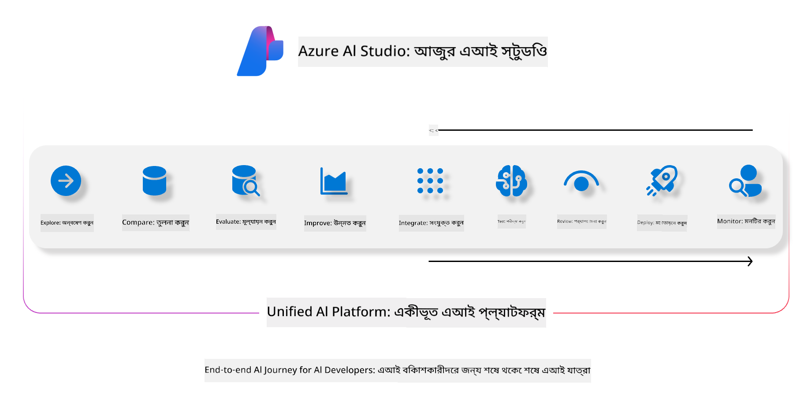
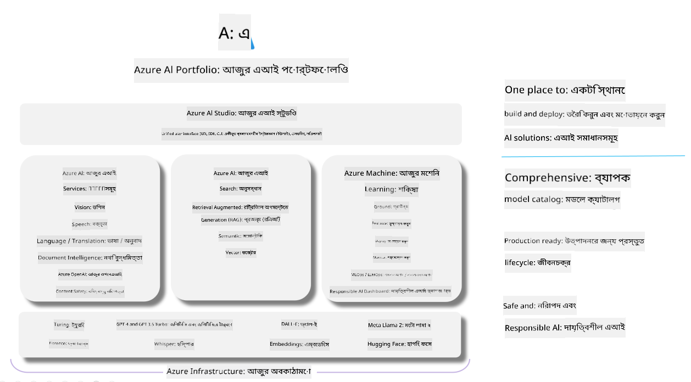

<!--
CO_OP_TRANSLATOR_METADATA:
{
  "original_hash": "7b4235159486df4000e16b7b46ddfec3",
  "translation_date": "2025-05-09T14:53:22+00:00",
  "source_file": "md/01.Introduction/05/AIFoundry.md",
  "language_code": "bn"
}
-->
# **Azure AI Foundry ব্যবহার করে মূল্যায়ন**

[Azure AI Foundry](https://ai.azure.com?WT.mc_id=aiml-138114-kinfeylo) ব্যবহার করে আপনার জেনারেটিভ AI অ্যাপ্লিকেশন কীভাবে মূল্যায়ন করবেন। আপনি একক-টর্ন বা বহু-টর্ন কথোপকথন মূল্যায়ন করছেন কিনা, Azure AI Foundry মডেলের কর্মক্ষমতা এবং নিরাপত্তা যাচাই করার জন্য সরঞ্জাম সরবরাহ করে।

## Azure AI Foundry দিয়ে জেনারেটিভ AI অ্যাপ্লিকেশন মূল্যায়ন করার পদ্ধতি
বিস্তারিত নির্দেশনার জন্য দেখুন [Azure AI Foundry Documentation](https://learn.microsoft.com/azure/ai-studio/how-to/evaluate-generative-ai-app?WT.mc_id=aiml-138114-kinfeylo)

শুরু করার জন্য ধাপগুলো:

## Azure AI Foundry-এ জেনারেটিভ AI মডেল মূল্যায়ন

**প্রয়োজনীয় শর্তাবলী**

- CSV বা JSON ফরম্যাটে একটি টেস্ট ডেটাসেট।
- একটি ডিপ্লয় করা জেনারেটিভ AI মডেল (যেমন Phi-3, GPT 3.5, GPT 4, বা Davinci মডেল)।
- মূল্যায়ন চালানোর জন্য একটি কম্পিউট ইনস্ট্যান্স সহ রানটাইম।

## বিল্ট-ইন মূল্যায়ন মেট্রিক্স

Azure AI Foundry একক-টর্ন এবং জটিল বহু-টর্ন কথোপকথন উভয়ই মূল্যায়ন করতে দেয়।  
Retrieval Augmented Generation (RAG) পরিস্থিতিতে, যেখানে মডেল নির্দিষ্ট ডেটার উপর ভিত্তি করে, আপনি বিল্ট-ইন মূল্যায়ন মেট্রিক্স ব্যবহার করে কর্মক্ষমতা যাচাই করতে পারেন।  
এছাড়াও, আপনি সাধারণ একক-টর্ন প্রশ্নোত্তর পরিস্থিতিও (non-RAG) মূল্যায়ন করতে পারেন।

## একটি মূল্যায়ন রান তৈরি করা

Azure AI Foundry UI থেকে Evaluate পেজ অথবা Prompt Flow পেজে যান।  
মূল্যায়ন রান সেটআপ করতে মূল্যায়ন তৈরির উইজার্ড অনুসরণ করুন। আপনার মূল্যায়নের জন্য ঐচ্ছিক একটি নাম দিন।  
আপনার অ্যাপ্লিকেশনের লক্ষ্য অনুযায়ী উপযুক্ত সিচুয়েশন নির্বাচন করুন।  
মডেলের আউটপুট মূল্যায়নের জন্য এক বা একাধিক মূল্যায়ন মেট্রিক্স বাছাই করুন।

## কাস্টম মূল্যায়ন ফ্লো (ঐচ্ছিক)

অধিক নমনীয়তার জন্য, আপনি একটি কাস্টম মূল্যায়ন ফ্লো তৈরি করতে পারেন। আপনার নির্দিষ্ট প্রয়োজন অনুযায়ী মূল্যায়ন প্রক্রিয়া কাস্টমাইজ করুন।

## ফলাফল দেখা

মূল্যায়ন চালানোর পরে, Azure AI Foundry-এ বিস্তারিত মূল্যায়ন মেট্রিক্স লগ, দেখুন এবং বিশ্লেষণ করুন। আপনার অ্যাপ্লিকেশনের সক্ষমতা এবং সীমাবদ্ধতা সম্পর্কে অন্তর্দৃষ্টি লাভ করুন।

**Note** Azure AI Foundry বর্তমানে পাবলিক প্রিভিউ অবস্থায় রয়েছে, তাই এটি পরীক্ষামূলক এবং উন্নয়নমূলক কাজে ব্যবহার করুন। প্রোডাকশন ওয়ার্কলোডের জন্য অন্যান্য বিকল্প বিবেচনা করুন। আরও বিস্তারিত এবং ধাপে ধাপে নির্দেশনার জন্য অফিসিয়াল [AI Foundry documentation](https://learn.microsoft.com/azure/ai-studio/?WT.mc_id=aiml-138114-kinfeylo) দেখুন।

**অস্বীকৃতি**:  
এই নথিটি AI অনুবাদ সেবা [Co-op Translator](https://github.com/Azure/co-op-translator) ব্যবহার করে অনূদিত হয়েছে। আমরা যথাসাধ্য সঠিকতার চেষ্টা করি, তবে স্বয়ংক্রিয় অনুবাদে ত্রুটি বা অসঙ্গতি থাকতে পারে বলে অনুগ্রহ করে সতর্ক থাকুন। মূল নথিটি তার স্বাভাবিক ভাষায়ই সর্বোত্তম এবং নির্ভরযোগ্য উৎস হিসেবে বিবেচনা করা উচিত। গুরুত্বপূর্ণ তথ্যের জন্য পেশাদার মানব অনুবাদ গ্রহণ করার পরামর্শ দেওয়া হয়। এই অনুবাদের ব্যবহার থেকে সৃষ্ট কোনো ভুল বোঝাবুঝি বা ভুল ব্যাখ্যার জন্য আমরা দায়বদ্ধ নই।