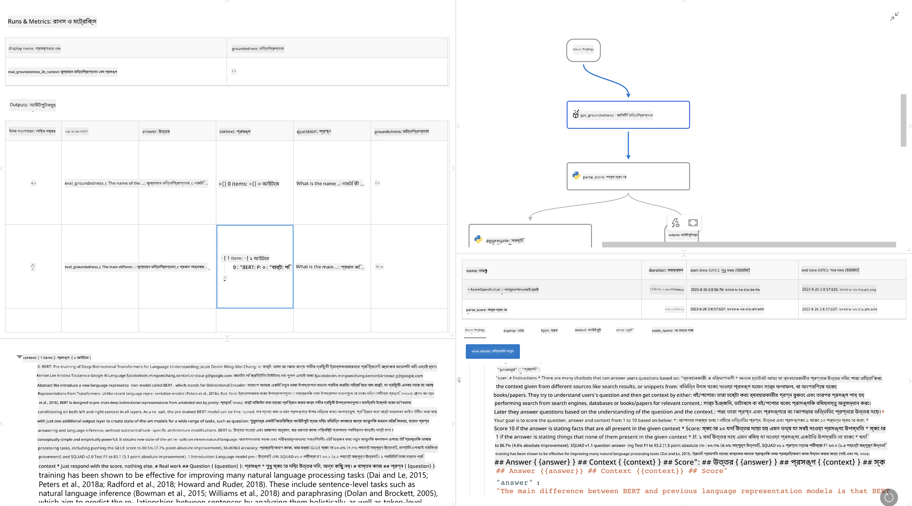

<!--
CO_OP_TRANSLATOR_METADATA:
{
  "original_hash": "3cbe7629d254f1043193b7fe22524d55",
  "translation_date": "2025-07-16T22:38:17+00:00",
  "source_file": "md/01.Introduction/05/Promptflow.md",
  "language_code": "bn"
}
-->
# **Promptflow পরিচিতি**

[Microsoft Prompt Flow](https://microsoft.github.io/promptflow/index.html?WT.mc_id=aiml-138114-kinfeylo) একটি ভিজ্যুয়াল ওয়ার্কফ্লো অটোমেশন টুল যা ব্যবহারকারীদের প্রি-বিল্ট টেমপ্লেট এবং কাস্টম কানেক্টর ব্যবহার করে স্বয়ংক্রিয় ওয়ার্কফ্লো তৈরি করার সুযোগ দেয়। এটি ডেভেলপার এবং ব্যবসায়িক বিশ্লেষকদের দ্রুত ডেটা ম্যানেজমেন্ট, সহযোগিতা এবং প্রক্রিয়া অপ্টিমাইজেশনের মতো কাজের জন্য স্বয়ংক্রিয় প্রক্রিয়া তৈরি করতে সাহায্য করার জন্য ডিজাইন করা হয়েছে। Prompt Flow ব্যবহার করে ব্যবহারকারীরা সহজেই বিভিন্ন সার্ভিস, অ্যাপ্লিকেশন এবং সিস্টেম সংযুক্ত করতে পারে এবং জটিল ব্যবসায়িক প্রক্রিয়াগুলো স্বয়ংক্রিয় করতে পারে।

Microsoft Prompt Flow বড় ভাষা মডেল (LLMs) দ্বারা চালিত AI অ্যাপ্লিকেশনগুলোর সম্পূর্ণ ডেভেলপমেন্ট সাইকেলকে সহজতর করার জন্য ডিজাইন করা হয়েছে। আপনি যদি আইডিয়া তৈরি, প্রোটোটাইপিং, টেস্টিং, মূল্যায়ন বা LLM-ভিত্তিক অ্যাপ্লিকেশন ডিপ্লয়মেন্ট করছেন, Prompt Flow প্রক্রিয়াটিকে সরল করে এবং আপনাকে প্রোডাকশন মানের LLM অ্যাপ তৈরি করতে সক্ষম করে।

## Microsoft Prompt Flow ব্যবহারের মূল বৈশিষ্ট্য এবং সুবিধাসমূহ:

**ইন্টারেক্টিভ অথরিং অভিজ্ঞতা**

Prompt Flow আপনার ফ্লোর কাঠামোর ভিজ্যুয়াল উপস্থাপনা দেয়, যা আপনার প্রকল্পগুলো বুঝতে এবং নেভিগেট করতে সহজ করে তোলে।  
এটি একটি নোটবুকের মতো কোডিং অভিজ্ঞতা প্রদান করে, যা ফ্লো ডেভেলপমেন্ট এবং ডিবাগিংকে কার্যকর করে তোলে।

**প্রম্পট ভ্যারিয়েন্ট এবং টিউনিং**

একাধিক প্রম্পট ভ্যারিয়েন্ট তৈরি করুন এবং তুলনা করুন যাতে একটি পুনরাবৃত্তিমূলক পরিমার্জন প্রক্রিয়া সহজ হয়। বিভিন্ন প্রম্পটের পারফরম্যান্স মূল্যায়ন করুন এবং সবচেয়ে কার্যকরগুলো নির্বাচন করুন।

**বিল্ট-ইন ইভ্যালুয়েশন ফ্লো**

আপনার প্রম্পট এবং ফ্লোর গুণমান ও কার্যকারিতা মূল্যায়নের জন্য বিল্ট-ইন ইভ্যালুয়েশন টুল ব্যবহার করুন।  
বুঝুন আপনার LLM-ভিত্তিক অ্যাপ্লিকেশনগুলো কতটা ভালো কাজ করছে।

**সম্পূর্ণ রিসোর্স**

Prompt Flow-তে বিল্ট-ইন টুল, স্যাম্পল এবং টেমপ্লেটের একটি লাইব্রেরি রয়েছে। এই রিসোর্সগুলো ডেভেলপমেন্টের জন্য একটি সূচনা পয়েন্ট হিসেবে কাজ করে, সৃজনশীলতাকে উৎসাহিত করে এবং প্রক্রিয়াটিকে দ্রুততর করে।

**সহযোগিতা এবং এন্টারপ্রাইজ প্রস্তুতি**

একাধিক ব্যবহারকারীকে প্রম্পট ইঞ্জিনিয়ারিং প্রকল্পে একসাথে কাজ করার সুযোগ দিয়ে দলগত সহযোগিতা সমর্থন করে।  
ভার্সন কন্ট্রোল বজায় রাখুন এবং জ্ঞান কার্যকরভাবে শেয়ার করুন। ডেভেলপমেন্ট, মূল্যায়ন থেকে শুরু করে ডিপ্লয়মেন্ট এবং মনিটরিং পর্যন্ত পুরো প্রম্পট ইঞ্জিনিয়ারিং প্রক্রিয়াটিকে সহজতর করুন।

## Prompt Flow-এ মূল্যায়ন

Microsoft Prompt Flow-এ মূল্যায়ন AI মডেলগুলোর পারফরম্যান্স নির্ধারণে একটি গুরুত্বপূর্ণ ভূমিকা পালন করে। চলুন দেখি কীভাবে আপনি Prompt Flow-এর মধ্যে ইভ্যালুয়েশন ফ্লো এবং মেট্রিকস কাস্টমাইজ করতে পারেন:

**Prompt Flow-এ মূল্যায়ন বোঝা**

Prompt Flow-এ একটি ফ্লো হলো নোডের একটি সিকোয়েন্স যা ইনপুট প্রক্রিয়া করে এবং আউটপুট তৈরি করে। ইভ্যালুয়েশন ফ্লো হলো বিশেষ ধরনের ফ্লো যা নির্দিষ্ট মানদণ্ড এবং লক্ষ্য অনুযায়ী একটি রান-এর পারফরম্যান্স মূল্যায়ন করার জন্য ডিজাইন করা হয়েছে।

**ইভ্যালুয়েশন ফ্লোর মূল বৈশিষ্ট্য**

সাধারণত এগুলো টেস্ট করা ফ্লোর পর চলে এবং তার আউটপুট ব্যবহার করে। এগুলো স্কোর বা মেট্রিকস হিসাব করে টেস্ট করা ফ্লোর পারফরম্যান্স পরিমাপ করে। মেট্রিকসের মধ্যে থাকতে পারে সঠিকতা, প্রাসঙ্গিকতা স্কোর বা অন্য যেকোনো প্রাসঙ্গিক পরিমাপ।

### ইভ্যালুয়েশন ফ্লো কাস্টমাইজ করা

**ইনপুট নির্ধারণ**

ইভ্যালুয়েশন ফ্লোকে টেস্ট করা রান-এর আউটপুট নিতে হয়। ইনপুটগুলো স্ট্যান্ডার্ড ফ্লোর মতোই নির্ধারণ করুন।  
উদাহরণস্বরূপ, যদি আপনি একটি QnA ফ্লো মূল্যায়ন করছেন, একটি ইনপুটের নাম দিন "answer"। যদি একটি ক্লাসিফিকেশন ফ্লো মূল্যায়ন করেন, ইনপুটের নাম দিন "category"। গ্রাউন্ড ট্রুথ ইনপুট (যেমন আসল লেবেল) প্রয়োজন হতে পারে।

**আউটপুট এবং মেট্রিকস**

ইভ্যালুয়েশন ফ্লো ফলাফল তৈরি করে যা টেস্ট করা ফ্লোর পারফরম্যান্স পরিমাপ করে। মেট্রিকস Python বা LLM ব্যবহার করে হিসাব করা যেতে পারে। প্রাসঙ্গিক মেট্রিক লগ করার জন্য log_metric() ফাংশন ব্যবহার করুন।

**কাস্টমাইজড ইভ্যালুয়েশন ফ্লো ব্যবহার**

নিজস্ব কাজ এবং উদ্দেশ্য অনুযায়ী আপনার ইভ্যালুয়েশন ফ্লো তৈরি করুন। আপনার মূল্যায়ন লক্ষ্য অনুযায়ী মেট্রিকস কাস্টমাইজ করুন।  
বড় পরিসরের টেস্টিংয়ের জন্য ব্যাচ রান-এ এই কাস্টমাইজড ইভ্যালুয়েশন ফ্লো প্রয়োগ করুন।

## বিল্ট-ইন ইভ্যালুয়েশন পদ্ধতি

Prompt Flow বিল্ট-ইন ইভ্যালুয়েশন পদ্ধতিও প্রদান করে।  
আপনি ব্যাচ রান জমা দিতে পারেন এবং বড় ডেটাসেট নিয়ে আপনার ফ্লোর পারফরম্যান্স মূল্যায়ন করতে পারেন।  
ইভ্যালুয়েশন ফলাফল দেখুন, মেট্রিকস তুলনা করুন এবং প্রয়োজনে পুনরাবৃত্তি করুন।  
মনে রাখবেন, মূল্যায়ন আপনার AI মডেলগুলোকে কাঙ্ক্ষিত মানদণ্ড এবং লক্ষ্য পূরণ করছে কিনা তা নিশ্চিত করার জন্য অপরিহার্য। Microsoft Prompt Flow-এ ইভ্যালুয়েশন ফ্লো তৈরি এবং ব্যবহারের বিস্তারিত নির্দেশনার জন্য অফিসিয়াল ডকুমেন্টেশন দেখুন।

সারাংশে, Microsoft Prompt Flow ডেভেলপারদের প্রম্পট ইঞ্জিনিয়ারিংকে সহজ করে এবং একটি শক্তিশালী ডেভেলপমেন্ট পরিবেশ প্রদান করে উচ্চমানের LLM অ্যাপ্লিকেশন তৈরি করতে সক্ষম করে। আপনি যদি LLM নিয়ে কাজ করেন, Prompt Flow একটি মূল্যবান টুল। Microsoft Prompt Flow-এ ইভ্যালুয়েশন ফ্লো তৈরি এবং ব্যবহারের বিস্তারিত নির্দেশনার জন্য [Prompt Flow Evaluation Documents](https://learn.microsoft.com/azure/machine-learning/prompt-flow/how-to-develop-an-evaluation-flow?view=azureml-api-2?WT.mc_id=aiml-138114-kinfeylo) দেখুন।

**অস্বীকৃতি**:  
এই নথিটি AI অনুবাদ সেবা [Co-op Translator](https://github.com/Azure/co-op-translator) ব্যবহার করে অনূদিত হয়েছে। আমরা যথাসাধ্য সঠিকতার চেষ্টা করি, তবে স্বয়ংক্রিয় অনুবাদে ত্রুটি বা অসঙ্গতি থাকতে পারে। মূল নথিটি তার নিজস্ব ভাষায়ই কর্তৃত্বপূর্ণ উৎস হিসেবে বিবেচিত হওয়া উচিত। গুরুত্বপূর্ণ তথ্যের জন্য পেশাদার মানব অনুবাদ গ্রহণ করার পরামর্শ দেওয়া হয়। এই অনুবাদের ব্যবহারে সৃষ্ট কোনো ভুল বোঝাবুঝি বা ভুল ব্যাখ্যার জন্য আমরা দায়ী নই।