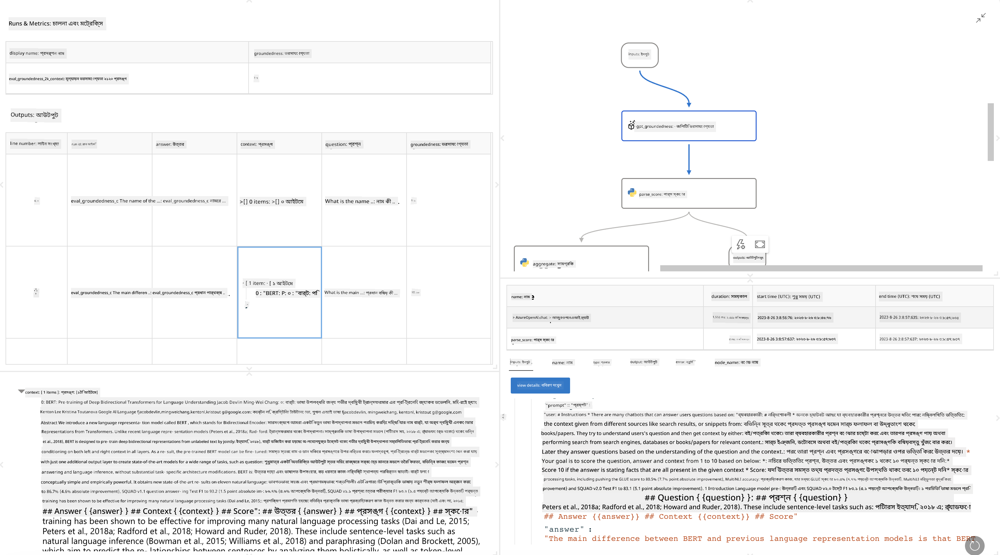

<!--
CO_OP_TRANSLATOR_METADATA:
{
  "original_hash": "3cbe7629d254f1043193b7fe22524d55",
  "translation_date": "2025-05-09T15:05:44+00:00",
  "source_file": "md/01.Introduction/05/Promptflow.md",
  "language_code": "bn"
}
-->
# **Promptflow পরিচিতি**

[Microsoft Prompt Flow](https://microsoft.github.io/promptflow/index.html?WT.mc_id=aiml-138114-kinfeylo) একটি ভিজ্যুয়াল ওয়ার্কফ্লো অটোমেশন টুল যা ব্যবহারকারীদের প্রি-বিল্ট টেমপ্লেট এবং কাস্টম কানেক্টর ব্যবহার করে স্বয়ংক্রিয় ওয়ার্কফ্লো তৈরি করার সুযোগ দেয়। এটি ডেভেলপার এবং বিজনেস অ্যানালিস্টদের দ্রুত ডেটা ম্যানেজমেন্ট, সহযোগিতা এবং প্রক্রিয়া অপ্টিমাইজেশনের মতো কাজের জন্য স্বয়ংক্রিয় প্রক্রিয়া তৈরি করার জন্য ডিজাইন করা হয়েছে। Prompt Flow এর মাধ্যমে ব্যবহারকারীরা সহজেই বিভিন্ন সার্ভিস, অ্যাপ্লিকেশন এবং সিস্টেম সংযুক্ত করতে পারেন এবং জটিল ব্যবসায়িক প্রক্রিয়া অটোমেট করতে পারেন।

Microsoft Prompt Flow বড় ভাষার মডেল (LLMs) দ্বারা চালিত AI অ্যাপ্লিকেশনগুলির পুরো ডেভেলপমেন্ট সাইকেলকে সহজতর করার জন্য ডিজাইন করা হয়েছে। আপনি যদি আইডিয়েশন, প্রোটোটাইপিং, টেস্টিং, মূল্যায়ন বা LLM-ভিত্তিক অ্যাপ্লিকেশন ডিপ্লয়মেন্টের কাজ করেন, Prompt Flow প্রক্রিয়াটিকে সরল করে এবং আপনাকে প্রোডাকশন মানের LLM অ্যাপ তৈরি করতে সক্ষম করে।

## Microsoft Prompt Flow ব্যবহারের প্রধান বৈশিষ্ট্য এবং সুবিধাসমূহ:

**ইন্টারেক্টিভ অথরিং অভিজ্ঞতা**

Prompt Flow আপনার ফ্লোর স্ট্রাকচারের ভিজ্যুয়াল উপস্থাপনা প্রদান করে, যা আপনার প্রজেক্টগুলো বুঝতে এবং নেভিগেট করতে সহজ করে তোলে।  
এটি একটি নোটবুক-স্টাইলে কোডিং অভিজ্ঞতা দেয় যা ফ্লো ডেভেলপমেন্ট এবং ডিবাগিংকে আরও কার্যকর করে।

**প্রম্পট ভ্যারিয়েন্ট এবং টিউনিং**

একাধিক প্রম্পট ভ্যারিয়েন্ট তৈরি এবং তুলনা করুন যাতে একটি পর্যায়ক্রমিক পরিমার্জন প্রক্রিয়া সহজ হয়। বিভিন্ন প্রম্পটের পারফরম্যান্স মূল্যায়ন করুন এবং সবচেয়ে কার্যকরগুলি নির্বাচন করুন।

**ইনবিল্ট ইভ্যালুয়েশন ফ্লো**

ইনবিল্ট ইভ্যালুয়েশন টুল ব্যবহার করে আপনার প্রম্পট এবং ফ্লোর গুণগত মান এবং কার্যকারিতা মূল্যায়ন করুন।  
আপনার LLM-ভিত্তিক অ্যাপ্লিকেশনগুলো কতটা ভালো কাজ করছে তা বুঝুন।

**সম্পূর্ণ রিসোর্স**

Prompt Flow একটি লাইব্রেরি সরবরাহ করে যেখানে ইনবিল্ট টুলস, স্যাম্পল এবং টেমপ্লেট অন্তর্ভুক্ত। এই রিসোর্সগুলো ডেভেলপমেন্টের জন্য একটি শুরু বিন্দু হিসেবে কাজ করে, সৃজনশীলতাকে উদ্দীপিত করে এবং প্রক্রিয়াকে দ্রুততর করে।

**সহযোগিতা এবং এন্টারপ্রাইজ প্রস্তুতি**

বহু ব্যবহারকারীকে প্রম্পট ইঞ্জিনিয়ারিং প্রজেক্টে একসাথে কাজ করার সুযোগ দেয়, যা টিম সহযোগিতাকে সমর্থন করে।  
ভার্সন কন্ট্রোল বজায় রাখুন এবং জ্ঞান শেয়ার করুন কার্যকরভাবে। ডেভেলপমেন্ট, মূল্যায়ন থেকে শুরু করে ডিপ্লয়মেন্ট এবং মনিটরিং পর্যন্ত পুরো প্রম্পট ইঞ্জিনিয়ারিং প্রক্রিয়াকে সুশৃঙ্খল করুন।

## Prompt Flow-এ মূল্যায়ন

Microsoft Prompt Flow-এ মূল্যায়ন AI মডেলগুলোর পারফরম্যান্স যাচাই করার একটি গুরুত্বপূর্ণ ভূমিকা পালন করে। চলুন দেখি কীভাবে আপনি Prompt Flow-এর মধ্যে মূল্যায়ন ফ্লো এবং মেট্রিকস কাস্টমাইজ করতে পারেন:

**Prompt Flow-এ মূল্যায়ন বোঝা**

Prompt Flow-এ একটি ফ্লো হল নোডগুলোর একটি ক্রম যা ইনপুট প্রক্রিয়া করে এবং আউটপুট তৈরি করে। মূল্যায়ন ফ্লো হলো বিশেষ ধরনের ফ্লো যা নির্দিষ্ট মানদণ্ড এবং লক্ষ্য অনুযায়ী একটি রান-এর পারফরম্যান্স যাচাই করার জন্য ডিজাইন করা হয়েছে।

**মূল বৈশিষ্ট্যসমূহ মূল্যায়ন ফ্লোর**

সাধারণত এগুলো পরীক্ষিত ফ্লো চলার পর চালানো হয়, তার আউটপুট ব্যবহার করে। এগুলো স্কোর বা মেট্রিকস হিসাব করে যা পরীক্ষিত ফ্লোর পারফরম্যান্স পরিমাপ করে। মেট্রিকসের মধ্যে থাকতে পারে যথার্থতা, প্রাসঙ্গিকতা স্কোর বা অন্যান্য প্রাসঙ্গিক পরিমাপ।

### মূল্যায়ন ফ্লো কাস্টমাইজেশন

**ইনপুট সংজ্ঞায়িতকরণ**

মূল্যায়ন ফ্লোগুলোকে পরীক্ষিত রান-এর আউটপুট নিতে হয়। ইনপুটগুলি স্ট্যান্ডার্ড ফ্লোর মতো সংজ্ঞায়িত করুন।  
উদাহরণস্বরূপ, আপনি যদি একটি QnA ফ্লো মূল্যায়ন করেন, তাহলে একটি ইনপুটের নাম দিন "answer"। যদি ক্লাসিফিকেশন ফ্লো মূল্যায়ন করেন, ইনপুটের নাম দিন "category"। গ্রাউন্ড ট্রুথ ইনপুট (যেমন আসল লেবেল) ও প্রয়োজন হতে পারে।

**আউটপুট এবং মেট্রিকস**

মূল্যায়ন ফ্লো পরীক্ষিত ফ্লোর পারফরম্যান্স পরিমাপের জন্য ফলাফল তৈরি করে। মেট্রিকস Python বা LLM ব্যবহার করে হিসাব করা যেতে পারে। প্রাসঙ্গিক মেট্রিক লগ করার জন্য log_metric() ফাংশন ব্যবহার করুন।

**কাস্টমাইজড মূল্যায়ন ফ্লো ব্যবহার**

আপনার নির্দিষ্ট কাজ এবং লক্ষ্য অনুযায়ী নিজস্ব মূল্যায়ন ফ্লো তৈরি করুন। আপনার মূল্যায়ন লক্ষ্য অনুযায়ী মেট্রিকস কাস্টমাইজ করুন।  
বড় পরিসরের টেস্টিংয়ের জন্য ব্যাচ রানগুলিতে এই কাস্টমাইজড মূল্যায়ন ফ্লো প্রয়োগ করুন।

## ইনবিল্ট মূল্যায়ন পদ্ধতি

Prompt Flow ইনবিল্ট মূল্যায়ন পদ্ধতিও প্রদান করে।  
আপনি ব্যাচ রান জমা দিতে পারেন এবং এই পদ্ধতিগুলো ব্যবহার করে দেখতে পারেন আপনার ফ্লো বড় ডেটাসেটের সাথে কত ভালো কাজ করছে।  
মূল্যায়ন ফলাফল দেখুন, মেট্রিকস তুলনা করুন এবং প্রয়োজনমতো পুনরাবৃত্তি করুন।  
মনে রাখবেন, মূল্যায়ন আপনার AI মডেলগুলোর কাঙ্ক্ষিত মানদণ্ড এবং লক্ষ্য পূরণের জন্য অপরিহার্য। Microsoft Prompt Flow-এ মূল্যায়ন ফ্লো তৈরি এবং ব্যবহারের বিস্তারিত নির্দেশনার জন্য অফিসিয়াল ডকুমেন্টেশন দেখুন।

সারসংক্ষেপে, Microsoft Prompt Flow ডেভেলপারদের প্রম্পট ইঞ্জিনিয়ারিংকে সরল করে এবং একটি শক্তিশালী ডেভেলপমেন্ট পরিবেশ প্রদান করে উচ্চমানের LLM অ্যাপ্লিকেশন তৈরি করার ক্ষমতা দেয়। আপনি যদি LLM নিয়ে কাজ করেন, Prompt Flow একটি মূল্যবান টুল। বিস্তারিত নির্দেশনার জন্য [Prompt Flow Evaluation Documents](https://learn.microsoft.com/azure/machine-learning/prompt-flow/how-to-develop-an-evaluation-flow?view=azureml-api-2?WT.mc_id=aiml-138114-kinfeylo) দেখুন।

**অস্বীকারোক্তি**:  
এই নথিটি AI অনুবাদ সেবা [Co-op Translator](https://github.com/Azure/co-op-translator) ব্যবহার করে অনূদিত হয়েছে। আমরা যথাসাধ্য সঠিকতার জন্য চেষ্টা করি, তবে দয়া করে জানুন যে স্বয়ংক্রিয় অনুবাদে ত্রুটি বা অসঙ্গতি থাকতে পারে। মূল নথিটি তার স্বদেশী ভাষায়ই কর্তৃত্বপূর্ণ উৎস হিসেবে বিবেচিত হওয়া উচিত। গুরুত্বপূর্ণ তথ্যের জন্য পেশাদার মানব অনুবাদ প্রয়োজনীয়। এই অনুবাদ ব্যবহারের ফলে কোনো ভুল বোঝাবুঝি বা ভুল ব্যাখ্যার জন্য আমরা দায়ী নই।