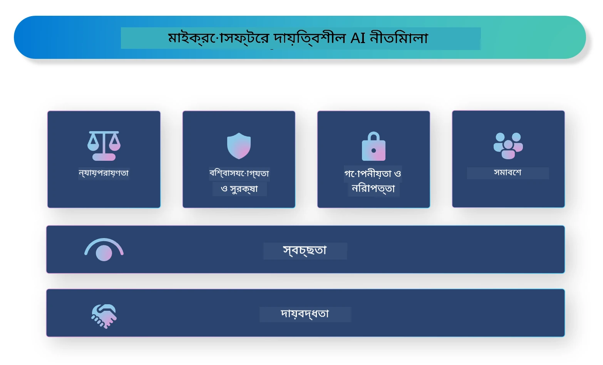

<!--
CO_OP_TRANSLATOR_METADATA:
{
  "original_hash": "805b96b20152936d8f4c587d90d6e06e",
  "translation_date": "2025-07-16T22:50:16+00:00",
  "source_file": "md/01.Introduction/05/ResponsibleAI.md",
  "language_code": "bn"
}
-->
# **দায়িত্বশীল AI পরিচিতি**

[Microsoft Responsible AI](https://www.microsoft.com/ai/responsible-ai?WT.mc_id=aiml-138114-kinfeylo) একটি উদ্যোগ যা ডেভেলপার এবং প্রতিষ্ঠানগুলোকে স্বচ্ছ, বিশ্বাসযোগ্য এবং দায়িত্বশীল AI সিস্টেম তৈরি করতে সাহায্য করার লক্ষ্যে কাজ করে। এই উদ্যোগটি নৈতিক নীতিমালা যেমন গোপনীয়তা, ন্যায়পরায়ণতা এবং স্বচ্ছতার সঙ্গে সামঞ্জস্যপূর্ণ দায়িত্বশীল AI সমাধান তৈরি করার জন্য নির্দেশিকা এবং সম্পদ প্রদান করে। আমরা দায়িত্বশীল AI সিস্টেম তৈরির সাথে সম্পর্কিত কিছু চ্যালেঞ্জ এবং সেরা অনুশীলনও আলোচনা করব।

## Microsoft Responsible AI এর ওভারভিউ

**নৈতিক নীতিমালা**

Microsoft Responsible AI গোপনীয়তা, ন্যায়পরায়ণতা, স্বচ্ছতা, দায়বদ্ধতা এবং নিরাপত্তার মতো নৈতিক নীতিমালার ওপর ভিত্তি করে পরিচালিত হয়। এই নীতিমালা নিশ্চিত করে যে AI সিস্টেমগুলো নৈতিক ও দায়িত্বশীল উপায়ে তৈরি হচ্ছে।

**স্বচ্ছ AI**

Microsoft Responsible AI AI সিস্টেমে স্বচ্ছতার গুরুত্বের ওপর জোর দেয়। এর মধ্যে রয়েছে AI মডেলগুলো কীভাবে কাজ করে তার স্পষ্ট ব্যাখ্যা প্রদান এবং ডেটা উৎস ও অ্যালগরিদমগুলোকে সর্বসাধারণের জন্য উন্মুক্ত রাখা।

**দায়বদ্ধ AI**

[Microsoft Responsible AI](https://www.microsoft.com/ai/responsible-ai?WT.mc_id=aiml-138114-kinfeylo) দায়বদ্ধ AI সিস্টেম তৈরির প্রচার করে, যা AI মডেলগুলো কীভাবে সিদ্ধান্ত নেয় তার অন্তর্দৃষ্টি প্রদান করতে পারে। এটি ব্যবহারকারীদের AI সিস্টেমের আউটপুট বুঝতে এবং বিশ্বাস করতে সাহায্য করে।

**অন্তর্ভুক্তিমূলকতা**

AI সিস্টেমগুলো এমনভাবে ডিজাইন করা উচিত যা সবার জন্য উপকারী হয়। Microsoft এমন অন্তর্ভুক্তিমূলক AI তৈরি করতে চায় যা বিভিন্ন দৃষ্টিভঙ্গি বিবেচনা করে এবং পক্ষপাত বা বৈষম্য এড়ায়।

**বিশ্বাসযোগ্যতা এবং নিরাপত্তা**

AI সিস্টেমের বিশ্বাসযোগ্যতা এবং নিরাপত্তা নিশ্চিত করা অত্যন্ত গুরুত্বপূর্ণ। Microsoft এমন মডেল তৈরি করতে মনোযোগ দেয় যা স্থিতিশীলভাবে কাজ করে এবং ক্ষতিকর ফলাফল এড়ায়।

**AI-তে ন্যায়পরায়ণতা**

Microsoft Responsible AI স্বীকার করে যে AI সিস্টেম পক্ষপাতমূলক ডেটা বা অ্যালগরিদমে প্রশিক্ষিত হলে পক্ষপাত বজায় রাখতে পারে। এই উদ্যোগ ন্যায়পরায়ণ AI সিস্টেম তৈরির জন্য নির্দেশিকা প্রদান করে যা জাতি, লিঙ্গ বা বয়সের ভিত্তিতে বৈষম্য করে না।

**গোপনীয়তা এবং নিরাপত্তা**

Microsoft Responsible AI AI সিস্টেমে ব্যবহারকারীর গোপনীয়তা এবং ডেটা নিরাপত্তা রক্ষার গুরুত্বের ওপর জোর দেয়। এর মধ্যে রয়েছে শক্তিশালী ডেটা এনক্রিপশন এবং প্রবেশাধিকার নিয়ন্ত্রণ প্রয়োগ, পাশাপাশি নিয়মিত AI সিস্টেমের দুর্বলতা নিরীক্ষণ।

**দায়বদ্ধতা এবং দায়িত্ব**

Microsoft Responsible AI AI উন্নয়ন এবং প্রয়োগে দায়বদ্ধতা এবং দায়িত্ব প্রচার করে। এর মধ্যে রয়েছে ডেভেলপার এবং প্রতিষ্ঠানগুলোকে AI সিস্টেমের সম্ভাব্য ঝুঁকির বিষয়ে সচেতন করা এবং সেই ঝুঁকি কমানোর পদক্ষেপ নেওয়া।

## দায়িত্বশীল AI সিস্টেম তৈরির সেরা অনুশীলনসমূহ

**বিভিন্ন ডেটাসেট ব্যবহার করে AI মডেল তৈরি করুন**

AI সিস্টেমে পক্ষপাত এড়াতে, বিভিন্ন দৃষ্টিভঙ্গি এবং অভিজ্ঞতা প্রতিনিধিত্বকারী ডেটাসেট ব্যবহার করা গুরুত্বপূর্ণ।

**ব্যাখ্যাযোগ্য AI প্রযুক্তি ব্যবহার করুন**

ব্যাখ্যাযোগ্য AI প্রযুক্তি ব্যবহারকারীদের সাহায্য করে বুঝতে যে AI মডেল কীভাবে সিদ্ধান্ত নেয়, যা সিস্টেমের প্রতি বিশ্বাস বাড়ায়।

**নিয়মিত AI সিস্টেমের দুর্বলতা নিরীক্ষণ করুন**

নিয়মিত AI সিস্টেমের নিরীক্ষণ সম্ভাব্য ঝুঁকি এবং দুর্বলতা চিহ্নিত করতে সাহায্য করে যা সমাধান করা প্রয়োজন।

**শক্তিশালী ডেটা এনক্রিপশন এবং প্রবেশাধিকার নিয়ন্ত্রণ প্রয়োগ করুন**

ডেটা এনক্রিপশন এবং প্রবেশাধিকার নিয়ন্ত্রণ AI সিস্টেমে ব্যবহারকারীর গোপনীয়তা এবং নিরাপত্তা রক্ষায় সহায়ক।

**AI উন্নয়নে নৈতিক নীতিমালা অনুসরণ করুন**

ন্যায়পরায়ণতা, স্বচ্ছতা এবং দায়বদ্ধতার মতো নৈতিক নীতিমালা অনুসরণ AI সিস্টেমে বিশ্বাস গড়ে তুলতে এবং সেগুলো দায়িত্বশীলভাবে তৈরি করতে সাহায্য করে।

## দায়িত্বশীল AI এর জন্য AI Foundry ব্যবহার

[Azure AI Foundry](https://ai.azure.com?WT.mc_id=aiml-138114-kinfeylo) একটি শক্তিশালী প্ল্যাটফর্ম যা ডেভেলপার এবং প্রতিষ্ঠানগুলোকে দ্রুত বুদ্ধিমান, আধুনিক, বাজার-উপযোগী এবং দায়িত্বশীল অ্যাপ্লিকেশন তৈরি করতে সক্ষম করে। Azure AI Foundry এর কিছু মূল বৈশিষ্ট্য এবং ক্ষমতা হলো:

**প্রি-বিল্ট এবং কাস্টমাইজযোগ্য API ও মডেল**

Azure AI Foundry বিভিন্ন AI কাজের জন্য প্রি-বিল্ট এবং কাস্টমাইজযোগ্য API ও মডেল প্রদান করে, যার মধ্যে রয়েছে জেনারেটিভ AI, কথোপকথনের জন্য প্রাকৃতিক ভাষা প্রক্রিয়াকরণ, অনুসন্ধান, মনিটরিং, অনুবাদ, ভাষণ, ভিশন এবং সিদ্ধান্ত গ্রহণ।

**Prompt Flow**

Azure AI Foundry এর Prompt Flow আপনাকে কথোপকথনভিত্তিক AI অভিজ্ঞতা তৈরি করতে দেয়। এটি কথোপকথনের প্রবাহ ডিজাইন এবং পরিচালনা সহজ করে, যা চ্যাটবট, ভার্চুয়াল সহকারী এবং অন্যান্য ইন্টারেক্টিভ অ্যাপ্লিকেশন তৈরিতে সহায়ক।

**Retrieval Augmented Generation (RAG)**

RAG একটি প্রযুক্তি যা রিট্রিভাল-ভিত্তিক এবং জেনারেটিভ-ভিত্তিক পদ্ধতি একত্রিত করে। এটি পূর্ববর্তী জ্ঞান (রিট্রিভাল) এবং সৃজনশীল উৎপাদন (জেনারেশন) উভয়কে কাজে লাগিয়ে উত্তরের গুণগত মান উন্নত করে।

**জেনারেটিভ AI এর মূল্যায়ন এবং মনিটরিং মেট্রিক্স**

Azure AI Foundry জেনারেটিভ AI মডেলগুলোর মূল্যায়ন এবং মনিটরিংয়ের জন্য সরঞ্জাম প্রদান করে। আপনি তাদের কর্মক্ষমতা, ন্যায়পরায়ণতা এবং অন্যান্য গুরুত্বপূর্ণ মেট্রিক্স মূল্যায়ন করতে পারেন যাতে দায়িত্বশীল প্রয়োগ নিশ্চিত হয়। এছাড়াও, আপনি যদি একটি ড্যাশবোর্ড তৈরি করে থাকেন, তাহলে Azure Machine Learning Studio এর নো-কোড UI ব্যবহার করে [Repsonsible AI Toolbox](https://responsibleaitoolbox.ai/?WT.mc_id=aiml-138114-kinfeylo) পাইথন লাইব্রেরির ভিত্তিতে একটি Responsible AI Dashboard এবং সংশ্লিষ্ট স্কোরকার্ড কাস্টমাইজ এবং তৈরি করতে পারেন। এই স্কোরকার্ড প্রযুক্তিগত এবং অপ্রযুক্তিগত উভয় স্টেকহোল্ডারের সঙ্গে ন্যায়পরায়ণতা, ফিচার গুরুত্ব এবং অন্যান্য দায়িত্বশীল প্রয়োগ সংক্রান্ত মূল তথ্য শেয়ার করতে সাহায্য করে।

দায়িত্বশীল AI এর জন্য AI Foundry ব্যবহার করতে নিম্নলিখিত সেরা অনুশীলনগুলো অনুসরণ করুন:

**আপনার AI সিস্টেমের সমস্যা এবং উদ্দেশ্য নির্ধারণ করুন**

উন্নয়ন প্রক্রিয়া শুরু করার আগে, স্পষ্টভাবে নির্ধারণ করা গুরুত্বপূর্ণ যে আপনার AI সিস্টেম কোন সমস্যা বা উদ্দেশ্য সমাধান করতে চায়। এটি আপনাকে কার্যকর মডেল তৈরির জন্য প্রয়োজনীয় ডেটা, অ্যালগরিদম এবং সম্পদ চিহ্নিত করতে সাহায্য করবে।

**প্রাসঙ্গিক ডেটা সংগ্রহ এবং প্রিপ্রসেস করুন**

AI সিস্টেম প্রশিক্ষণের জন্য ব্যবহৃত ডেটার গুণমান এবং পরিমাণ তার কর্মক্ষমতায় বড় প্রভাব ফেলে। তাই প্রাসঙ্গিক ডেটা সংগ্রহ, পরিষ্কারকরণ, প্রিপ্রসেসিং এবং নিশ্চিত করা গুরুত্বপূর্ণ যে ডেটা আপনার লক্ষ্য জনসংখ্যা বা সমস্যার প্রতিনিধিত্ব করে।

**উপযুক্ত মূল্যায়ন পদ্ধতি নির্বাচন করুন**

বিভিন্ন মূল্যায়ন অ্যালগরিদম উপলব্ধ। আপনার ডেটা এবং সমস্যার ভিত্তিতে সবচেয়ে উপযুক্ত অ্যালগরিদম নির্বাচন করা জরুরি।

**মডেল মূল্যায়ন এবং ব্যাখ্যা করুন**

একবার AI মডেল তৈরি হলে, উপযুক্ত মেট্রিক্স ব্যবহার করে এর কর্মক্ষমতা মূল্যায়ন করা এবং ফলাফল স্বচ্ছভাবে ব্যাখ্যা করা গুরুত্বপূর্ণ। এটি মডেলের পক্ষপাত বা সীমাবদ্ধতা চিহ্নিত করতে এবং প্রয়োজনে উন্নতি করতে সাহায্য করবে।

**স্বচ্ছতা এবং ব্যাখ্যাযোগ্যতা নিশ্চিত করুন**

AI সিস্টেমগুলো স্বচ্ছ এবং ব্যাখ্যাযোগ্য হওয়া উচিত যাতে ব্যবহারকারীরা বুঝতে পারে সেগুলো কীভাবে কাজ করে এবং কীভাবে সিদ্ধান্ত নেয়। এটি বিশেষভাবে গুরুত্বপূর্ণ এমন অ্যাপ্লিকেশনগুলোর জন্য যেগুলো মানুষের জীবনে বড় প্রভাব ফেলে, যেমন স্বাস্থ্যসেবা, অর্থনীতি এবং আইন।

**মডেল মনিটরিং এবং আপডেট করুন**

AI সিস্টেমগুলোকে সময়ের সাথে সঠিক এবং কার্যকর রাখতে নিয়মিত মনিটরিং এবং আপডেট করা উচিত। এর জন্য মডেলের নিয়মিত রক্ষণাবেক্ষণ, পরীক্ষা এবং পুনঃপ্রশিক্ষণ প্রয়োজন।

সারসংক্ষেপে, Microsoft Responsible AI একটি উদ্যোগ যা ডেভেলপার এবং প্রতিষ্ঠানগুলোকে স্বচ্ছ, বিশ্বাসযোগ্য এবং দায়িত্বশীল AI সিস্টেম তৈরি করতে সাহায্য করে। মনে রাখবেন, দায়িত্বশীল AI বাস্তবায়ন অত্যন্ত গুরুত্বপূর্ণ, এবং Azure AI Foundry প্রতিষ্ঠানগুলোর জন্য এটি ব্যবহারিক করে তোলে। নৈতিক নীতিমালা এবং সেরা অনুশীলন অনুসরণ করে আমরা নিশ্চিত করতে পারি যে AI সিস্টেমগুলো দায়িত্বশীলভাবে তৈরি ও প্রয়োগ করা হচ্ছে যা সমাজের জন্য উপকারী।

**অস্বীকৃতি**:  
এই নথিটি AI অনুবাদ সেবা [Co-op Translator](https://github.com/Azure/co-op-translator) ব্যবহার করে অনূদিত হয়েছে। আমরা যথাসাধ্য সঠিকতার চেষ্টা করি, তবে স্বয়ংক্রিয় অনুবাদে ত্রুটি বা অসঙ্গতি থাকতে পারে। মূল নথিটি তার নিজস্ব ভাষায়ই কর্তৃত্বপূর্ণ উৎস হিসেবে বিবেচনা করা উচিত। গুরুত্বপূর্ণ তথ্যের জন্য পেশাদার মানব অনুবাদ গ্রহণ করার পরামর্শ দেওয়া হয়। এই অনুবাদের ব্যবহারে সৃষ্ট কোনো ভুল বোঝাবুঝি বা ভুল ব্যাখ্যার জন্য আমরা দায়ী নই।