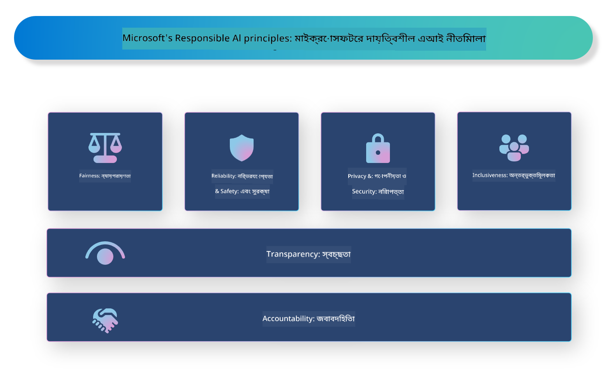

<!--
CO_OP_TRANSLATOR_METADATA:
{
  "original_hash": "805b96b20152936d8f4c587d90d6e06e",
  "translation_date": "2025-05-09T15:25:00+00:00",
  "source_file": "md/01.Introduction/05/ResponsibleAI.md",
  "language_code": "bn"
}
-->
# **দায়িত্বশীল AI পরিচিতি**

[Microsoft Responsible AI](https://www.microsoft.com/ai/responsible-ai?WT.mc_id=aiml-138114-kinfeylo) একটি উদ্যোগ যা ডেভেলপার এবং প্রতিষ্ঠানগুলোকে এমন AI সিস্টেম তৈরি করতে সহায়তা করে যা স্বচ্ছ, বিশ্বাসযোগ্য এবং দায়বদ্ধ। এই উদ্যোগটি নৈতিক নীতিমালা যেমন গোপনীয়তা, ন্যায্যতা, এবং স্বচ্ছতার সাথে সামঞ্জস্যপূর্ণ দায়িত্বশীল AI সমাধান বিকাশের জন্য নির্দেশিকা এবং সম্পদ সরবরাহ করে। আমরা দায়িত্বশীল AI সিস্টেম তৈরির সাথে সম্পর্কিত কিছু চ্যালেঞ্জ এবং সেরা অনুশীলনও আলোচনা করব।

## Microsoft Responsible AI এর সারাংশ

**নৈতিক নীতিমালা**

Microsoft Responsible AI গোপনীয়তা, ন্যায্যতা, স্বচ্ছতা, দায়বদ্ধতা এবং নিরাপত্তার মতো নৈতিক নীতিমালার ওপর ভিত্তি করে পরিচালিত হয়। এই নীতিমালা নিশ্চিত করে যে AI সিস্টেমগুলো নৈতিক ও দায়িত্বশীলভাবে তৈরি হচ্ছে।

**স্বচ্ছ AI**

Microsoft Responsible AI AI সিস্টেমে স্বচ্ছতার গুরুত্বকে তুলে ধরে। এর মধ্যে AI মডেল কীভাবে কাজ করে তার পরিষ্কার ব্যাখ্যা দেওয়া এবং ডেটা উৎস ও অ্যালগোরিদমগুলো প্রকাশ্য করা অন্তর্ভুক্ত।

**দায়বদ্ধ AI**

[Microsoft Responsible AI](https://www.microsoft.com/ai/responsible-ai?WT.mc_id=aiml-138114-kinfeylo) দায়বদ্ধ AI সিস্টেম বিকাশে উৎসাহ দেয়, যা AI মডেল কীভাবে সিদ্ধান্ত নেয় তার অন্তর্দৃষ্টি প্রদান করতে পারে। এটি ব্যবহারকারীদের AI সিস্টেমের আউটপুট বোঝা এবং বিশ্বাস করার সুযোগ দেয়।

**অন্তর্ভুক্তিমূলকতা**

AI সিস্টেমগুলো এমনভাবে ডিজাইন করা উচিত যা সবাইকে উপকৃত করে। Microsoft অন্তর্ভুক্তিমূলক AI তৈরি করতে চায় যা বিভিন্ন দৃষ্টিভঙ্গি বিবেচনা করে এবং পক্ষপাত বা বৈষম্য এড়ায়।

**বিশ্বাসযোগ্যতা এবং নিরাপত্তা**

AI সিস্টেমের বিশ্বাসযোগ্যতা এবং নিরাপত্তা নিশ্চিত করা অত্যন্ত গুরুত্বপূর্ণ। Microsoft এমন মডেল তৈরি করতে মনোযোগ দেয় যা স্থিতিশীলভাবে কাজ করে এবং ক্ষতিকর ফলাফল এড়ায়।

**AI-তে ন্যায্যতা**

Microsoft Responsible AI স্বীকার করে যে AI সিস্টেম পক্ষপাতমূলক ডেটা বা অ্যালগোরিদমের উপর প্রশিক্ষিত হলে পক্ষপাত চালিয়ে যেতে পারে। এই উদ্যোগ ন্যায্য AI সিস্টেম তৈরির নির্দেশিকা দেয় যা জাতি, লিঙ্গ বা বয়সের ভিত্তিতে বৈষম্য করে না।

**গোপনীয়তা এবং নিরাপত্তা**

Microsoft Responsible AI ব্যবহারকারীর গোপনীয়তা এবং ডেটা নিরাপত্তা রক্ষার গুরুত্বকে গুরুত্ব দেয়। এর মধ্যে শক্তিশালী ডেটা এনক্রিপশন এবং প্রবেশাধিকার নিয়ন্ত্রণ প্রয়োগ এবং নিয়মিত AI সিস্টেমের দুর্বলতা নিরীক্ষণ অন্তর্ভুক্ত।

**দায়বদ্ধতা এবং দায়িত্ব**

Microsoft Responsible AI AI উন্নয়ন ও প্রয়োগে দায়বদ্ধতা এবং দায়িত্বের প্রচার করে। এর মধ্যে ডেভেলপার এবং প্রতিষ্ঠানগুলোকে AI সিস্টেমের সম্ভাব্য ঝুঁকির বিষয়ে সচেতন করা এবং সেই ঝুঁকি কমানোর পদক্ষেপ গ্রহণ করা অন্তর্ভুক্ত।

## দায়িত্বশীল AI সিস্টেম তৈরির সেরা অনুশীলন

**বিভিন্ন ডেটাসেট ব্যবহার করে AI মডেল তৈরি করুন**

AI সিস্টেমে পক্ষপাত এড়াতে, বিভিন্ন দৃষ্টিভঙ্গি এবং অভিজ্ঞতা প্রতিফলিত করে এমন ডেটাসেট ব্যবহার করা গুরুত্বপূর্ণ।

**ব্যাখ্যাযোগ্য AI কৌশল ব্যবহার করুন**

ব্যাখ্যাযোগ্য AI কৌশল ব্যবহারকারীদের সাহায্য করে বুঝতে যে AI মডেল কীভাবে সিদ্ধান্ত নেয়, যা সিস্টেমের প্রতি বিশ্বাস বাড়ায়।

**নিয়মিত AI সিস্টেমের দুর্বলতা নিরীক্ষণ করুন**

AI সিস্টেমের নিয়মিত নিরীক্ষণ সম্ভাব্য ঝুঁকি ও দুর্বলতা চিহ্নিত করতে সাহায্য করে যা সমাধান প্রয়োজন।

**শক্তিশালী ডেটা এনক্রিপশন এবং প্রবেশাধিকার নিয়ন্ত্রণ প্রয়োগ করুন**

ডেটা এনক্রিপশন এবং প্রবেশাধিকার নিয়ন্ত্রণ AI সিস্টেমে ব্যবহারকারীর গোপনীয়তা ও নিরাপত্তা রক্ষায় সহায়ক।

**AI উন্নয়নে নৈতিক নীতিমালা অনুসরণ করুন**

ন্যায্যতা, স্বচ্ছতা এবং দায়বদ্ধতার মতো নৈতিক নীতিমালা অনুসরণ AI সিস্টেমে বিশ্বাস গড়ে তোলে এবং নিশ্চিত করে যে সেগুলো দায়িত্বশীলভাবে তৈরি হচ্ছে।

## দায়িত্বশীল AI এর জন্য AI Foundry ব্যবহার

[Azure AI Foundry](https://ai.azure.com?WT.mc_id=aiml-138114-kinfeylo) একটি শক্তিশালী প্ল্যাটফর্ম যা ডেভেলপার এবং প্রতিষ্ঠানগুলোকে দ্রুত বুদ্ধিমান, আধুনিক, বাজারে প্রস্তুত এবং দায়িত্বশীল অ্যাপ্লিকেশন তৈরি করতে সক্ষম করে। Azure AI Foundry এর কিছু মূল বৈশিষ্ট্য ও ক্ষমতা:

**প্রি-বিল্ট এবং কাস্টমাইজযোগ্য API ও মডেল**

Azure AI Foundry বিভিন্ন AI কাজের জন্য প্রস্তুত এবং কাস্টমাইজযোগ্য API ও মডেল সরবরাহ করে, যার মধ্যে রয়েছে জেনারেটিভ AI, কথোপকথনের জন্য প্রাকৃতিক ভাষা প্রক্রিয়াকরণ, অনুসন্ধান, পর্যবেক্ষণ, অনুবাদ, বক্তৃতা, ভিশন এবং সিদ্ধান্ত গ্রহণ।

**Prompt Flow**

Azure AI Foundry তে Prompt Flow আপনাকে কথোপকথনভিত্তিক AI অভিজ্ঞতা তৈরি করতে দেয়। এটি কথোপকথনের প্রবাহ ডিজাইন ও পরিচালনা সহজ করে, যা চ্যাটবট, ভার্চুয়াল অ্যাসিস্ট্যান্ট এবং অন্যান্য ইন্টারেক্টিভ অ্যাপ্লিকেশন তৈরি করতে সহায়ক।

**Retrieval Augmented Generation (RAG)**

RAG হলো একটি কৌশল যা রিট্রিভাল-ভিত্তিক এবং জেনারেটিভ পদ্ধতির সমন্বয় ঘটায়। এটি পূর্বের জ্ঞানের (রিট্রিভাল) এবং সৃজনশীল সৃষ্টির (জেনারেশন) মাধ্যমে উৎপন্ন উত্তরের গুণগত মান উন্নত করে।

**জেনারেটিভ AI এর মূল্যায়ন এবং পর্যবেক্ষণ মেট্রিক্স**

Azure AI Foundry জেনারেটিভ AI মডেলের পারফরম্যান্স, ন্যায্যতা এবং অন্যান্য গুরুত্বপূর্ণ মেট্রিক্স মূল্যায়ন ও পর্যবেক্ষণের জন্য সরঞ্জাম প্রদান করে। এছাড়াও, আপনি যদি একটি ড্যাশবোর্ড তৈরি করে থাকেন, তাহলে Azure Machine Learning Studio এর নো-কোড UI ব্যবহার করে [Repsonsible AI Toolbox](https://responsibleaitoolbox.ai/?WT.mc_id=aiml-138114-kinfeylo) পাইথন লাইব্রেরির ভিত্তিতে একটি Responsible AI Dashboard এবং সংশ্লিষ্ট স্কোরকার্ড কাস্টমাইজ ও তৈরি করতে পারেন। এই স্কোরকার্ড প্রযুক্তিগত এবং অপ্রযুক্তিগত উভয় স্টেকহোল্ডারের সঙ্গে ন্যায্যতা, ফিচার গুরুত্ব এবং অন্যান্য দায়িত্বশীল প্রয়োগ বিষয়ক গুরুত্বপূর্ণ তথ্য ভাগ করতে সাহায্য করে।

দায়িত্বশীল AI এর জন্য AI Foundry ব্যবহার করার সেরা অনুশীলন:

**আপনার AI সিস্টেমের সমস্যা এবং উদ্দেশ্য নির্ধারণ করুন**

উন্নয়ন প্রক্রিয়া শুরু করার আগে, স্পষ্টভাবে সমস্যা বা উদ্দেশ্য নির্ধারণ করা জরুরি যা আপনার AI সিস্টেম সমাধান করতে চায়। এটি ডেটা, অ্যালগোরিদম এবং সম্পদ চিহ্নিত করতে সাহায্য করবে যা একটি কার্যকর মডেল তৈরি করতে প্রয়োজন।

**প্রাসঙ্গিক ডেটা সংগ্রহ এবং প্রিপ্রসেস করুন**

AI সিস্টেম প্রশিক্ষণের জন্য ব্যবহৃত ডেটার গুণমান এবং পরিমাণ এর কর্মক্ষমতায় উল্লেখযোগ্য প্রভাব ফেলে। তাই প্রাসঙ্গিক ডেটা সংগ্রহ, পরিষ্কারকরণ, প্রিপ্রসেসিং এবং নিশ্চিত করা উচিত যে এটি আপনি সমাধান করতে চাচ্ছেন এমন জনসংখ্যা বা সমস্যার প্রতিনিধিত্ব করে।

**উপযুক্ত মূল্যায়ন পদ্ধতি নির্বাচন করুন**

বিভিন্ন মূল্যায়ন অ্যালগোরিদম পাওয়া যায়। আপনার ডেটা এবং সমস্যার ওপর ভিত্তি করে সবচেয়ে উপযুক্ত অ্যালগোরিদম নির্বাচন করা গুরুত্বপূর্ণ।

**মডেল মূল্যায়ন এবং ব্যাখ্যা করুন**

একবার AI মডেল তৈরি হয়ে গেলে, সঠিক মেট্রিক ব্যবহার করে এর পারফরম্যান্স মূল্যায়ন করা এবং ফলাফল স্বচ্ছভাবে ব্যাখ্যা করা জরুরি। এটি মডেলের পক্ষপাত বা সীমাবদ্ধতা চিহ্নিত করতে এবং প্রয়োজনে উন্নতি করতে সাহায্য করবে।

**স্বচ্ছতা এবং ব্যাখ্যাযোগ্যতা নিশ্চিত করুন**

AI সিস্টেমগুলো স্বচ্ছ এবং ব্যাখ্যাযোগ্য হওয়া উচিত যাতে ব্যবহারকারীরা বুঝতে পারেন সেগুলো কীভাবে কাজ করে এবং সিদ্ধান্ত কীভাবে নেওয়া হয়। এটি বিশেষ করে স্বাস্থ্যসেবা, অর্থনীতি এবং আইনি সিস্টেমের মতো মানুষের জীবনে গুরুত্বপূর্ণ প্রভাব ফেলা অ্যাপ্লিকেশনগুলোর জন্য গুরুত্বপূর্ণ।

**মডেল পর্যবেক্ষণ এবং আপডেট করুন**

AI সিস্টেমগুলোকে ধারাবাহিকভাবে পর্যবেক্ষণ এবং আপডেট করতে হবে যাতে সেগুলো সময়ের সাথে সঠিক এবং কার্যকর থাকে। এর জন্য নিয়মিত রক্ষণাবেক্ষণ, পরীক্ষা এবং পুনঃপ্রশিক্ষণ প্রয়োজন।

সারসংক্ষেপে, Microsoft Responsible AI একটি উদ্যোগ যা ডেভেলপার এবং প্রতিষ্ঠানগুলোকে স্বচ্ছ, বিশ্বাসযোগ্য এবং দায়বদ্ধ AI সিস্টেম তৈরি করতে সাহায্য করে। মনে রাখবেন, দায়িত্বশীল AI প্রয়োগ অত্যন্ত গুরুত্বপূর্ণ এবং Azure AI Foundry এটিকে বাস্তবায়নযোগ্য করে তোলে। নৈতিক নীতিমালা এবং সেরা অনুশীলন অনুসরণ করে, আমরা নিশ্চিত করতে পারি যে AI সিস্টেমগুলো দায়িত্বশীলভাবে তৈরি ও প্রয়োগ করা হচ্ছে যা সমাজের সর্বাঙ্গীন উন্নতিতে অবদান রাখে।

**অস্বীকারোক্তি**:  
এই নথিটি AI অনুবাদ সেবা [Co-op Translator](https://github.com/Azure/co-op-translator) ব্যবহার করে অনূদিত হয়েছে। আমরা যথাসাধ্য সঠিকতার জন্য চেষ্টা করি, তবে অনুগ্রহ করে মনে রাখবেন যে স্বয়ংক্রিয় অনুবাদে ভুল বা অসঙ্গতি থাকতে পারে। মূল নথিটি তার নিজস্ব ভাষায়ই কর্তৃত্বপূর্ণ উৎস হিসেবে বিবেচিত হবে। গুরুত্বপূর্ণ তথ্যের জন্য পেশাদার মানব অনুবাদ গ্রহণ করার পরামর্শ দেওয়া হয়। এই অনুবাদের ব্যবহারে সৃষ্ট যেকোনো ভুল বোঝাবুঝি বা ভুল ব্যাখ্যার জন্য আমরা দায়ী নই।